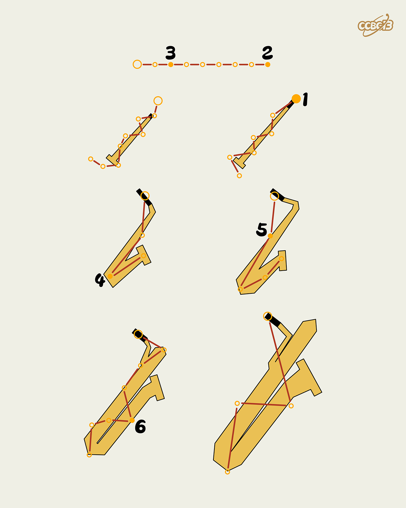

# ⭐

## 题面

## 答案

`SEXTET`

## 解析

_官方存档未填写解析。_

## 提示

### 1. 我毫无头绪

图中是各种类型的萨克斯管

## 本地附件

- [98650af788144d8285798bae63e63b2a.webp](../../../assets/archive.cipherpuzzles.com/ccbc13/images/asteroid/98650af788144d8285798bae63e63b2a.webp)

来源：[https://archive.cipherpuzzles.com/ccbc13/problems/asteroid/175.yaml](https://archive.cipherpuzzles.com/ccbc13/problems/asteroid/175.yaml)
