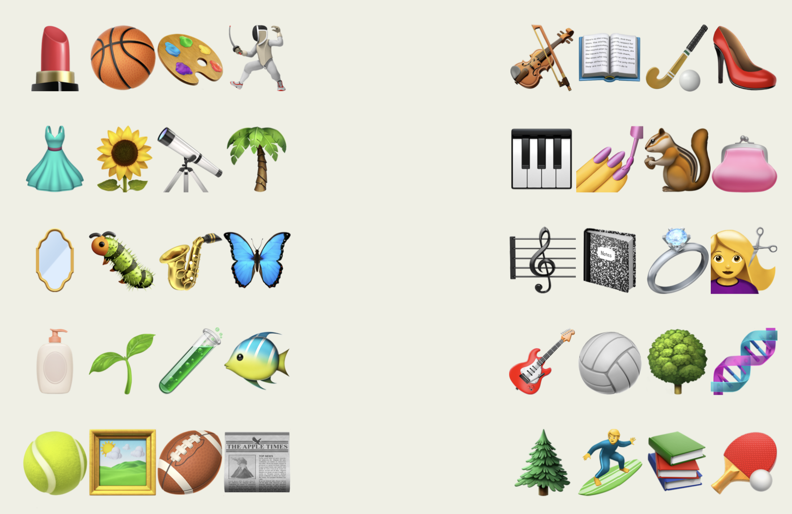

# ⭐

## 题面

    
<b>孩子们</b>看了<b>动画片</b>后，各自发展出了<b>各色</b>的兴趣爱好。你正思索着是哪部动画片时，周围突然响起了掌声：<b>babababa...</b>

    
    <!--  
    
    <pre style="font-size: 72px">
    ????	????
    ????	???️?
    ????	????‍♀️
    ????	????
    ??️??	??‍♂️??
    </pre>-->

## 答案

`CAVERN`

## 解析

_官方存档未填写解析。_

## 提示

### 1. 我毫无头绪

提示里说的是《巴巴爸爸》这部动画，找到不同颜色的巴巴孩子及他们的爱好，将题目里的格子涂成 emoji 对应的颜色。

### 2. 该如何提取

把所有颜色分成红黄蓝三个部分，然后按顺序象形。(顺序是【左边的红、黄、蓝】+【右边的红、黄、蓝】。）

## 本地附件

- [f10da51a9afe426faeea9a2a6882a3f3.webp](../../../assets/archive.cipherpuzzles.com/ccbc13/images/asteroid/f10da51a9afe426faeea9a2a6882a3f3.webp)

来源：[https://archive.cipherpuzzles.com/ccbc13/problems/asteroid/176.yaml](https://archive.cipherpuzzles.com/ccbc13/problems/asteroid/176.yaml)
