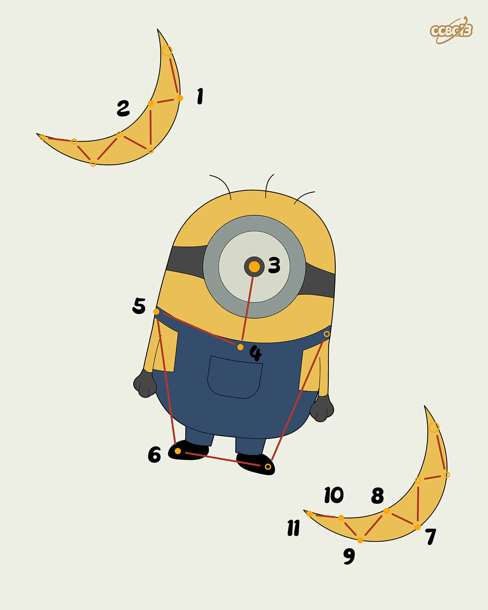

# ⭐

## 题面

## 答案

`REMINISCENT`

## 解析

_官方存档未填写解析。_

## 提示

### 1. 我毫无思路

两个新月都是同一个单词，中间的是MINION

## 本地附件

- [195455f51bd743d8be34f86391d61f72.webp](../../../assets/archive.cipherpuzzles.com/ccbc13/images/asteroid/195455f51bd743d8be34f86391d61f72.webp)

来源：[https://archive.cipherpuzzles.com/ccbc13/problems/asteroid/177.yaml](https://archive.cipherpuzzles.com/ccbc13/problems/asteroid/177.yaml)
