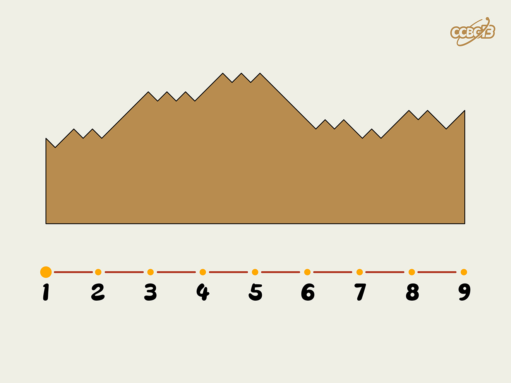

# ⭐

## 题面

## 答案

`MOUNTAINS`

## 解析

_官方存档未填写解析。_

## 提示

### 1. 我毫无头绪

根据斜线走势上下，翻译五位一组的二进制。

## 本地附件

- [de4e557d1f374338809ce024e5fff1d5.webp](../../../assets/archive.cipherpuzzles.com/ccbc13/images/asteroid/de4e557d1f374338809ce024e5fff1d5.webp)

来源：[https://archive.cipherpuzzles.com/ccbc13/problems/asteroid/181.yaml](https://archive.cipherpuzzles.com/ccbc13/problems/asteroid/181.yaml)
