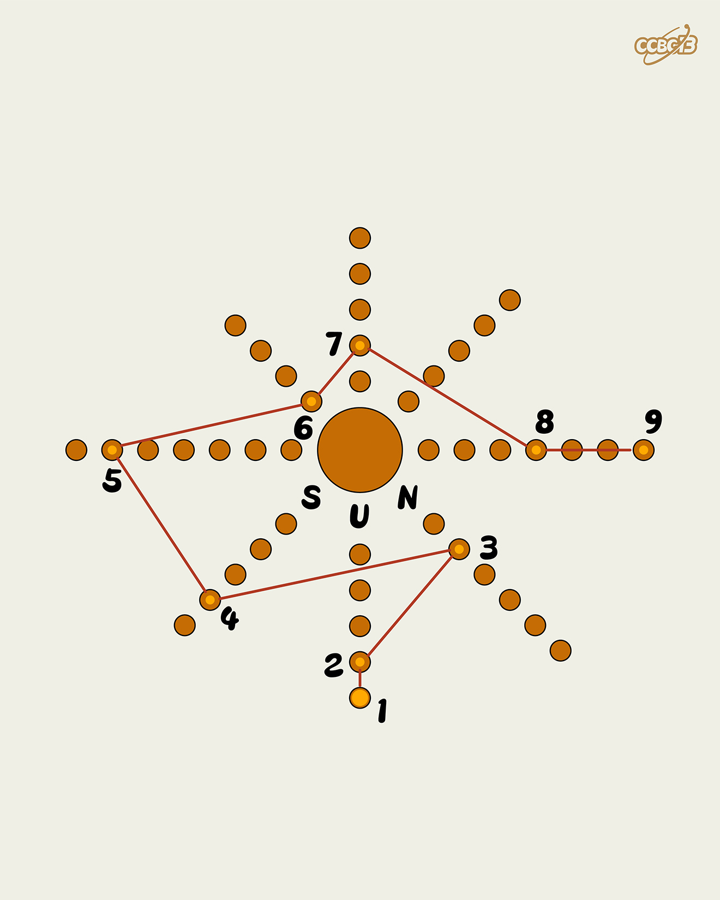

# ⭐

## 题面

## 答案

`SUPREMACY`

## 解析

_官方存档未填写解析。_

## 提示

### 1. 我毫无头绪

八串圆圈代表太阳系的八大行星

## 本地附件

- [7d8ce8d331a54214b43be683ae3ef0b2.webp](../../../assets/archive.cipherpuzzles.com/ccbc13/images/asteroid/7d8ce8d331a54214b43be683ae3ef0b2.webp)

来源：[https://archive.cipherpuzzles.com/ccbc13/problems/asteroid/183.yaml](https://archive.cipherpuzzles.com/ccbc13/problems/asteroid/183.yaml)
