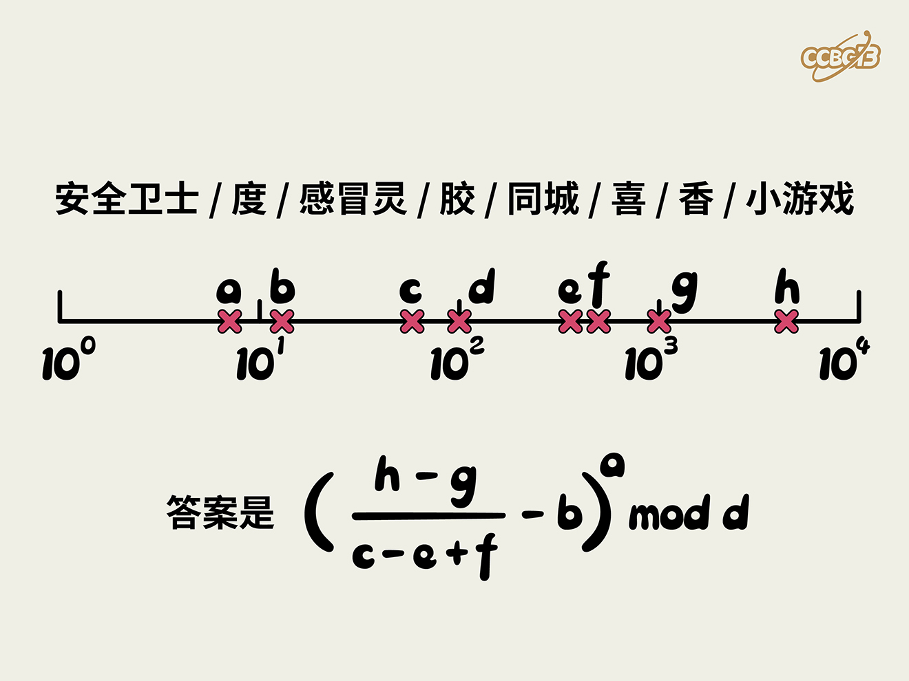

# ⭐

## 题面

## 答案

`EIGHTY FOUR`

## 解析

_官方存档未填写解析。_

## 提示

### 1. 我毫无思路

每个点对应一个常见品牌，求出a到h之后计算最后的式子

## 中间答案

| 提交 | 回复 | 附加信息 |
| --- | --- | --- |
| 84 | 正确，请输入 EIGHTY FOUR 作为答案。 |  |

## 本地附件

- [174e073861c04071a95da465ef0c7b24.webp](../../../assets/archive.cipherpuzzles.com/ccbc13/images/asteroid/174e073861c04071a95da465ef0c7b24.webp)

来源：[https://archive.cipherpuzzles.com/ccbc13/problems/asteroid/184.yaml](https://archive.cipherpuzzles.com/ccbc13/problems/asteroid/184.yaml)
