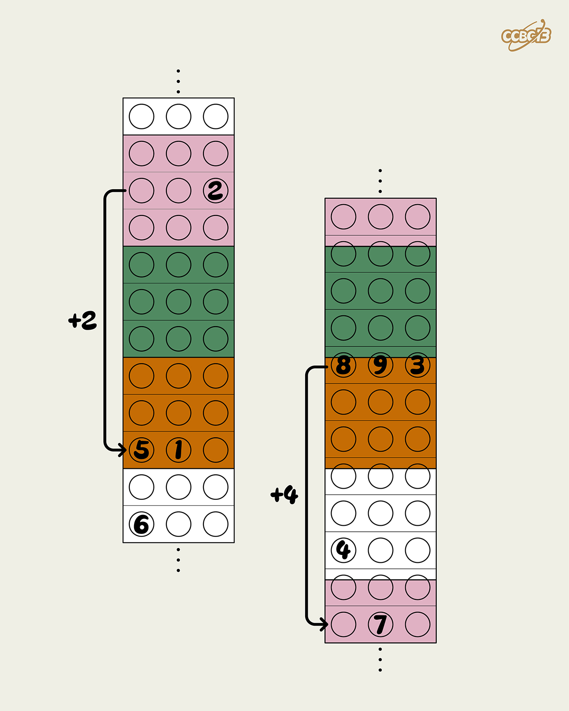

# ⭐

## 题面

## 答案

`CROCODILE`

## 解析

_官方存档未填写解析。_

## 提示

### 1. 我毫无头绪

四种颜色对应了四个季节。

## 本地附件

- [b3250cdf56984abf8bc1feecee4b53e4.webp](../../../assets/archive.cipherpuzzles.com/ccbc13/images/asteroid/b3250cdf56984abf8bc1feecee4b53e4.webp)

来源：[https://archive.cipherpuzzles.com/ccbc13/problems/asteroid/185.yaml](https://archive.cipherpuzzles.com/ccbc13/problems/asteroid/185.yaml)
