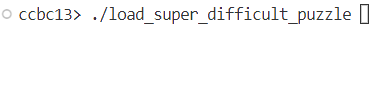

# ⭐

## 题面

## 答案

`OVERLOADING`

## 解析

_官方存档未填写解析。_

## 提示

### 1. 我毫无头绪

数每个 * 出来花了多少时间（... 部分改动一次算 1）

## 本地附件

- [734e797f8f0a4bb58b65ab30e0dc16e7.gif](../../../assets/static.cipherpuzzles.com/static/images/734e797f8f0a4bb58b65ab30e0dc16e7.gif)

来源：[https://archive.cipherpuzzles.com/ccbc13/problems/asteroid/188.yaml](https://archive.cipherpuzzles.com/ccbc13/problems/asteroid/188.yaml)
