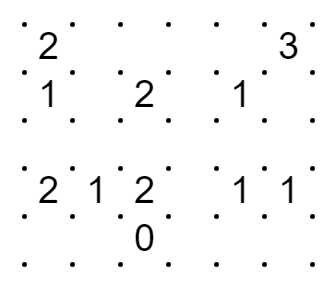
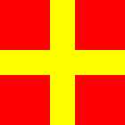
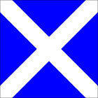
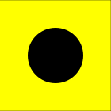
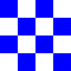
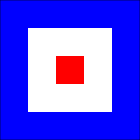
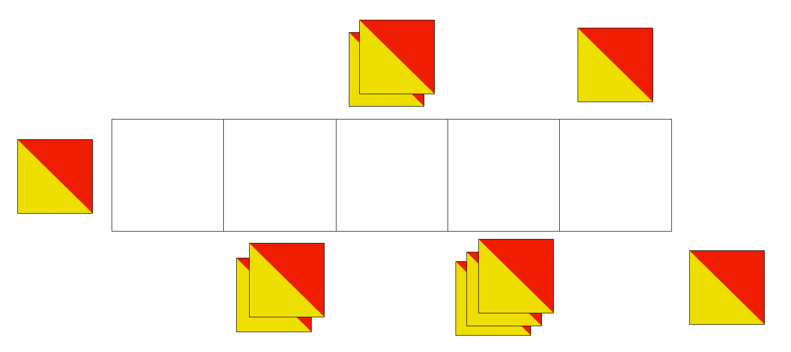
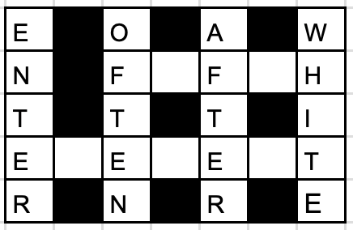
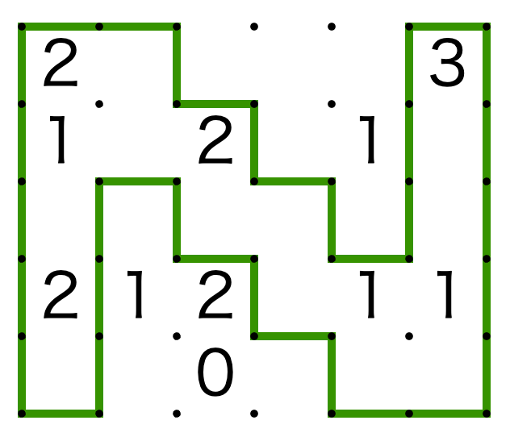

# 一道好题

## 题面

<ol style="clear: both;margin-bottom:50px" id="pzs">
    <li>
        

            <table>
                <tr><td>①</td><td class="black"></td><td>②</td><td class="black"></td><td>③</td><td class="black"></td><td>④</td></tr>
                <tr><td></td><td class="black"></td><td>⑤<td></td><td></td></td><td></td><td></td></tr>
                <tr><td></td><td class="black"></td><td></td><td class="black"></td><td></td><td class="black"></td><td></td></tr>
                <tr><td>⑥</td><td></td><td></td><td></td><td></td><td></td><td></td></tr>
                <tr><td></td><td class="black"></td><td></td><td class="black"></td><td></td><td class="black"></td><td></td></tr>
            </table>
            

                
<b>Across</b>

                
⑤+⑥ Answer

            

            

                
<b>Down</b>

                
① Opposite of exit
                 ② Opposite of rarely
                 ③ Opposite of before
                 ④ Opposite of black

            

        

    </li> 
    <li style="clear: both">183 26842 14789 123258</li> 
    <li>OSCAR NOVEMBER ECHO</li> 
    <li>
    <li>tlrreelcntoattwsheee</li> 
    <li>derauqs owt</li> 
    <li id="pz7">
    
    
    
    
     
    
    
    
    
     
    
    </li> 
    <li>A1Z6A2Q2Q3Q4 Q8A2 Q9Z6Q3</li> 
    <li>65rfcx ert</li> 
    <li></li> 
    <li>k; 9l 3a wr 4f xv qz ad 4s zc</li> 
    <li>827171327323217432 72</li> 
</ol>

（这一步需要某个 p1 和 p2 的内容）

在认真学习了过去的经典题目及答案之后，我们终于做出了一道好题。你也学会了吗？

## 答案

`NOODLE`

## 解析

首先解出每个小题，得到 `BV1Nj411f7xQ`，可以想到/搜到这是 bilibili 上 SEVENKING 的<a target="_blank" href="https://www.bilibili.com/video/BV1Nj411f7xQ/">《一道好题的诞生》</a>。

题目里提到了我们需要用到该视频 p1 和 p2 的内容。p1 是一段相声，里面比较显眼的是有一段各种谜题的贯口，是这样开头的：“凯撒，栅栏、摩斯、倒序、培根、北约、键盘、手机、手语、旗语、盲文、猪圈、搜词、填词、数独、数回……“。我们可以根据这 12 小题的题型，以这个为顺序将其转换成序号数字。

接下来注意题目里写的“认真学习了过去的经典题目及答案“，这里”答案“二字有下划虚线。而视频 p2 正是回顾了一些经典题目，给出答案的也正好有 12 个，幻灯片里也都以下划虚线标出，所以很明显这就是我们需要从 p2 提取的信息。

现在将以上两者结合起来，不难想到我们可以按顺序将 12 小题的题型序号跟这 12 个答案一一对应，以序号从答案里提取字母得到 `SUBMIT NOODLE`，提交 `NOODLE` 为最终答案。

<table id="ak">
<tr><th>#</th><th>小题解释</th><th>小题答案</th><th>小题题型</th><th>贯口序号</th><th>p2 幻灯片里的答案</th></tr>
<tr><td>1</td><td>填完词后可以看出 5 和 6 的单词应为 FIFTH ELEMENT，第五元素，即 Boron。

</td><td>B</td><td>填词</td><td>14</td><td>INCLUDE A BREAK <b>S</b>TATEMENT</td></tr>
<tr><td>2</td><td>在手机 9 键盘上跟着数字画线得 VOLT。</td><td>V</td><td>手机</td><td>8</td><td>I LOVE YO<b>U</b> TOO</td></tr>
<tr><td>3</td><td>NATO 字母的 ONE。</td><td>1</td><td>北约</td><td>6</td><td>PETER <b>B</b>UCK</td></tr>
<tr><td>4</td><td>数回的答案形成 N。

</td><td>N</td><td>数回</td><td>16</td><td>HONEYCOMB KINGDO<b>M</b></td></tr>
<tr><td>5</td><td>20个字母分4列栅栏，得 tenth letter lowercase。</td><td>j</td><td>栅栏</td><td>2</td><td>D<b>I</b>NGDONGS</td></tr>
<tr><td>6</td><td>倒序后是 two squared，2 的平方，即 4。</td><td>4</td><td>倒序</td><td>4</td><td>SUI<b>T</b></td></tr>
<tr><td>7</td><td>国际海事信号旗 THREE MINUS TWO，即 1。</td><td>1</td><td>旗语</td><td>10</td><td>TODAY IS TO<b>N</b>IGHT</td></tr>
<tr><td>8</td><td>以 QAZ 为纵轴，1234567890 为横轴的键盘坐标，ANSWER IS ONE。</td><td>1</td><td>键盘</td><td>7</td><td>WHITE M<b>O</b>UNTAIN PEAK</td></tr>
<tr><td>9</td><td>在键盘上按顺序可以描出 f 的形状。</td><td>f</td><td>键盘</td><td>7</td><td>WORLD V<b>O</b>YAGER</td></tr>
<tr><td>10</td><td>双手旗语，SEVEN。</td><td>7</td><td>旗语</td><td>10</td><td>CUTTERHEA<b>D</b></td></tr>
<tr><td>11</td><td>取每组两个字符在键盘上之间的字母，lowercase x。</td><td>x</td><td>键盘</td><td>7</td><td>RED CHI<b>L</b>I</td></tr>
<tr><td>12</td><td>手机九键，82 表示 8 键上的第 2 个字母，翻译得 uppercase q。</td><td>Q</td><td>手机</td><td>8</td><td>RAIN WAT<b>E</b>R</td></tr>
</table>

## 提示

### 1. 这些都是什么密码？

从1~12的顺序分别为填词、手机、北约、数回、栅栏、倒序、旗语、键盘、键盘、旗语、键盘、手机。

### 2. p2的内容有什么用？

找到讲座里有下划虚线的12个历史题目答案，最后用p1里得到的数字（某个序号）分别提取这些答案里的字母。例如如果第一个数字是5，则在第一个出现的历史题目的答案里提取第5个字母。

### 3. p1的内容有什么用？

在p1里出现了一长串连续的元素。取这道题中12个小题里元素的出现次序为数字。

### 4. 什么p1和p2？

十二道小题的答案都是单个字母（注意大小写）或数字，连起来可以得到一个bv号。

### 5. 第2题怎么做？

在手机上将数字连线形成字母，得到一个物理单位，再取这个单位的单字母缩写。

### 6. 第7题怎么做？

这是海事国际信号通信，一面旗子代表一个字母。

### 7. 第10题怎么做？

是五个双手旗语，但是因为站的很近，相邻字母的旗子重叠在了一起。建议从右向左推理。

## 中间答案

| 提交 | 回复 | 附加信息 |
| --- | --- | --- |
| @/^BV1Nj411f7xQ$ | 思路正确！请按此指引找到下一步需要的资源！ |  |
| SUBMIT NOODLE | 很接近了！SUBMIT是“提交”的意思。 |  |

## 本地附件

- [028117db942d46d282a7af0327279420.webp](../../../assets/archive.cipherpuzzles.com/ccbc13/images/CCBC-13/028117db942d46d282a7af0327279420.webp)
- [220cb8d111f9478b9434d88b7c5ec884.webp](../../../assets/archive.cipherpuzzles.com/ccbc13/images/CCBC-13/220cb8d111f9478b9434d88b7c5ec884.webp)
- [3128de0521a94653bb3a0ea5ddfe4699.webp](../../../assets/archive.cipherpuzzles.com/ccbc13/images/CCBC-13/3128de0521a94653bb3a0ea5ddfe4699.webp)
- [4c2247d49d7443d9976bf775e94cddc9.webp](../../../assets/archive.cipherpuzzles.com/ccbc13/images/CCBC-13/4c2247d49d7443d9976bf775e94cddc9.webp)
- [5b2f5f6db5b44b5ba53a419ae33272fc.webp](../../../assets/archive.cipherpuzzles.com/ccbc13/images/CCBC-13/5b2f5f6db5b44b5ba53a419ae33272fc.webp)
- [730f6b3b234143ab92bbabb9a6235b7d.webp](../../../assets/archive.cipherpuzzles.com/ccbc13/images/CCBC-13/730f6b3b234143ab92bbabb9a6235b7d.webp)
- [7e5d03ff38b44159a69e9b3fcf428cdd.webp](../../../assets/archive.cipherpuzzles.com/ccbc13/images/CCBC-13/7e5d03ff38b44159a69e9b3fcf428cdd.webp)
- [9add1bdc299f4e0f85147791f8e63d61.webp](../../../assets/archive.cipherpuzzles.com/ccbc13/images/CCBC-13/9add1bdc299f4e0f85147791f8e63d61.webp)
- [a1378f5b11ec401b888fc9d1b1690575.webp](../../../assets/archive.cipherpuzzles.com/ccbc13/images/CCBC-13/a1378f5b11ec401b888fc9d1b1690575.webp)
- [b0640f2ed0d44bf081da306257c94e92.webp](../../../assets/archive.cipherpuzzles.com/ccbc13/images/CCBC-13/b0640f2ed0d44bf081da306257c94e92.webp)
- [c050cf5a87ca42b8ab76dcba76e48684.webp](../../../assets/archive.cipherpuzzles.com/ccbc13/images/CCBC-13/c050cf5a87ca42b8ab76dcba76e48684.webp)
- [c26575b0377345238a015c3a9cd9b886.webp](../../../assets/archive.cipherpuzzles.com/ccbc13/images/CCBC-13/c26575b0377345238a015c3a9cd9b886.webp)
- [c2f52eea1b5c40959f872b86348ff8f1.webp](../../../assets/archive.cipherpuzzles.com/ccbc13/images/CCBC-13/c2f52eea1b5c40959f872b86348ff8f1.webp)
- [c75519dace284dcbae3ce72a983ecb38.webp](../../../assets/archive.cipherpuzzles.com/ccbc13/images/CCBC-13/c75519dace284dcbae3ce72a983ecb38.webp)
- [fd35182449f44d9bb142946eafc9acc7.webp](../../../assets/archive.cipherpuzzles.com/ccbc13/images/CCBC-13/fd35182449f44d9bb142946eafc9acc7.webp)

来源：[https://archive.cipherpuzzles.com/ccbc13/problems/CCBC-13/1.yaml](https://archive.cipherpuzzles.com/ccbc13/problems/CCBC-13/1.yaml)
