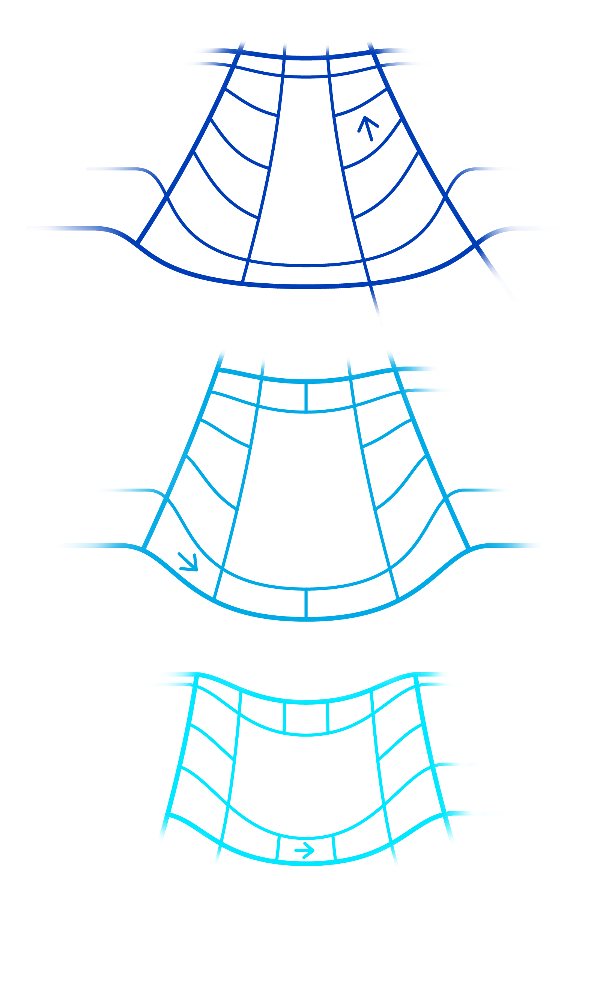
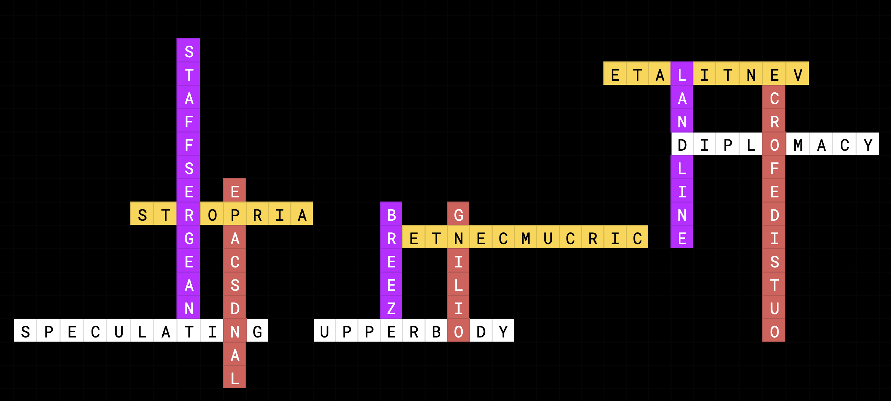

# Meta: CCBC-13

## 题面

在4个中心的引导下，12股气流往对应方向而去，彼此垂直交织，形成了3个逆时针漩涡，将碎片卷入其上下，成为下一步的指引。

下一步应该前往何处？

<b>气流</b>

<table id="rows">
    <tr class="row1">
        <td></td><td></td><td></td><td></td><td></td><td></td><td></td><td></td><td></td><td></td><td></td><td></td><td></td><td></td>
    </tr>
    <tr class="row2">
        <td></td><td></td><td></td><td></td><td></td><td></td><td></td><td></td><td></td><td></td><td></td><td></td><td></td><td></td>
    </tr>
    <tr class="row3">
        <td></td><td></td><td></td><td></td><td></td><td></td><td></td><td></td><td></td><td></td><td></td><td></td><td></td><td></td>
    </tr>
    <tr>
        <td>1</td>
        <td>5</td>
        <td>2</td>
        <td>5</td>
        <td>1</td>
        <td>1</td>
        <td></td>
        <td>1</td>
        <td>3</td>
        <td>2</td>
        <td>4</td>
        <td>4</td>
        <td>6</td>
        <td></td>
    </tr>
</table>

<b>碎片</b>

<ul id="brokenpieces">
    <li>ARD</li>
    <li>BELL</li>
    <li>CU</li>
    <li>D</li>
    <li>DE</li>
    <li>EA</li>
    <li>HER</li>
    <li>UCT</li>
    <li>LI</li>
    <li>LY</li>
    <li>N</li>
    <li>NE</li>
    <li>OCK</li>
    <li>P</li>
    <li>PAS</li>
    <li>S</li>
    <li>TICON</li>
    <li>VALE</li>
    <li>W</li>
</ul>

<ul style="clear:both;display:grid;grid-template-columns: auto auto auto auto">
    <li>家具</li>
    <li>反派</li>
    <li>动词</li>
    <li>电器</li>
    <li>飞禽</li>
    <li>国家</li>
    <li>布料</li>
    <li>文本</li>
    <li>走兽</li>
    <li>颜料</li>
    <li>节日</li>
    <li>职业</li>
</ul>

## 解题后内容

前往 CCBC-13 结局 →

## 答案

`DOUBLE PLANET`

## 解析

四个中心的答案是 `EXTENT`、`SOVIET`、`WATER`、和 `NOODLE`，刚好首字母对应东（E）南（S）西（W）北（N）。题目提示了“在4个中心的引导下，12股气流往对应方向而去”，也就是说每个面的三个非中心答案是要往该中心方向而去的。举例，`EXTENT`是白色面的中心，该面其它三个答案是 `UPPER BODY`、`SPECULATING`、以及`DIPLOMACY`，这三个词填入方框的顺序需要向东，也就是从左到右。加上题目里说到的”形成逆时针漩涡“，我们可以确定这三个答案须是填入每个方框的下沿。

正确填入方框的方法为：

  

从箭头所示的地方将三个框展开填入蓝色格则，将碎片置于上下形成一些符合中文描述的单词，最后再由数字提取每个单词里的字母，得到最后答案 `DOUBLE PLANET`。

<table class="ak">
<tr><td> </td><td> </td><td> </td><td> </td><td> </td><td> </td><td> </td><td> </td><td>V</td><td> </td><td> </td><td> </td><td> </td><td> </td></tr>
<tr><td> </td><td> </td><td> </td><td> </td><td> </td><td> </td><td> </td><td> </td><td>A</td><td>P</td><td> </td><td> </td></tr>
<tr><td class="indexed">D</td><td> </td><td>C</td><td> </td><td class="indexed">L</td><td class="indexed">E</td><td> </td><td> </td><td class="indexed">L</td><td class="indexed">A</td><td> </td><td>L</td><td> </td></tr>
<tr><td>E</td><td>W</td><td class="indexed">U</td><td>D</td><td>Y</td><td>A</td><td></td><td class="indexed">P</td><td>E</td><td>S</td><td> </td><td>I</td><td> </td><td> </td></tr>
<tr class="row1"><td>C</td><td>A</td><td>P</td><td>O</td><td>R</td><td>G</td><td>E</td><td>A</td><td>N</td><td>T</td><td>I</td><td>N</td><td>D</td><td>S</td></tr>
<tr class="row2"><td>E</td><td>R</td><td>B</td><td>O</td><td>I</td><td>L</td><td>I</td><td>N</td><td>T</td><td>E</td><td>R</td><td class="indexed">E</td><td>E</td><td>Z</td></tr>
<tr class="row3"><td>P</td><td>L</td><td>O</td><td>R</td><td>C</td><td>E</td><td>N</td><td>T</td><td>I</td><td>L</td><td>A</td><td>N</td><td>D</td><td>I</td></tr>
<tr><td>T</td><td class="indexed">O</td><td>A</td><td class="indexed">B</td><td>S</td><td> </td><td> </td><td>H</td><td>N</td><td>  </td><td class="indexed">N</td><td> </td><td>U</td><td> </td></tr>
<tr><td>I</td><td>C</td><td>R</td><td>E</td><td></td><td> </td><td> </td><td>E</td><td>E</td><td> </td><td> </td><td> </td><td>C</td><td> </td></tr>
<tr><td>C</td><td>K</td><td>D</td><td>L</td><td> </td><td></td><td> </td><td>R</td><td> </td><td></td><td></td><td></td><td class="indexed">T</td><td> </td></tr>
<tr><td>O</td><td> </td><td> </td><td>L</td></tr>
<tr><td>N</td><td> </td><td> </td><td> </td><td> </td><td> </td><td> </td></tr>
<tr><td>1</td><td>5</td><td>2</td><td>5</td><td>1</td><td>1</td><td> </td><td>1</td><td>3</td><td>2</td><td>4</td><td>4</td><td>6</td></tr>
<tr><td>反派</td><td>职业</td><td>家具</td><td>电器</td><td>文本</td><td>飞禽</td><td> </td><td>走兽</td><td>节日</td><td>颜料</td><td>国家</td><td>布料</td><td>动词</td></tr>
</table>

## 提示

### 1. 如何填这三个环？

四个面的中心首字母分别指示了一个方向，需要将其它三个角的答案向那个方向填入，形成三个逆时针的环。

另外注意三个环周围的细节，有些格子伸展到环外面代表该单词尚未结束，反之则表示该单词开头结尾在此处。

### 2. 三条横着的格子是什么？

上面三个环填完以后，以箭头为起点，展开后填入对应颜色的横条格子。

### 3. 字母碎片以及中文有什么用

填完三条横着的格子以后，将碎片放在格子上下方组成单词。下面的中文给出了单词的范围，帮助你确认你找到了正确的单词。

### 4. 数字有什么用？

将横条和字母组成单词后，用数字提取每一列单词里的第 n 个字母。

## 本地附件

- [a5d6807fa45c42779336db91507e81b0.webp](../../../assets/archive.cipherpuzzles.com/ccbc13/images/CCBC-13/a5d6807fa45c42779336db91507e81b0.webp)
- [f04724d1fde74a3d8832df85a3b2a197.webp](../../../assets/archive.cipherpuzzles.com/ccbc13/images/CCBC-13/f04724d1fde74a3d8832df85a3b2a197.webp)

来源：[https://archive.cipherpuzzles.com/ccbc13/problems/CCBC-13/13417491.yaml](https://archive.cipherpuzzles.com/ccbc13/problems/CCBC-13/13417491.yaml)
