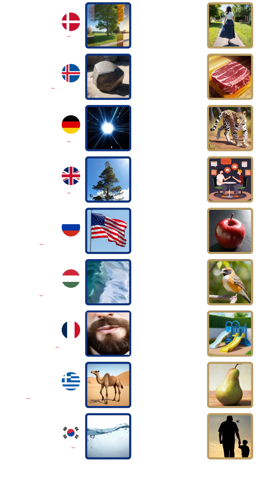

# 翻译官

## 题面

  

<table id="translate"><tr><td>bō</td><td>cháng</td><td>chē</td><td>dēng</td><td>dié</td><td>guò</td><td>hú</td></tr>
<tr><td>huā</td><td>huí</td><td>jǐng</td><td>lù</td><td>luó</td><td>měi</td><td>mián</td></tr>
<tr><td>pào</td><td>rén</td><td>shān</td><td>shēng</td><td>táng</td><td>yú</td><td>yú</td></tr>
</table>

## 答案

`DIPLOMACY`

## 解析

首先图案左侧的横线数字恰与最下方的拼音对应，可以猜想这题的目的是要将拼音放入这些格子。另外蓝框的图数量与黄框的图相同，可以推测我们需要某种配对。

但是具体怎么做呢？根据本题名字《翻译官》以及各种国旗，可以想到跟外语翻译相关。这里英国国旗旁边松树可以是切入点，注意到松树 PINE 和右侧黄框图之一的苹果 APPLE 可以组成 PINEAPPLE，菠萝，而 bō luó 在下面的拼音选项之中，长度 2 3 也正好跟松树左边的横线对应。其它部分也正是利用了外语里一些常见词的有趣直译，具体为：

<table id="ak">
<tr><th>中文</th><th>拼音</th><th>外语</th><th>外语单词</th><th>直译</th></tr>
<tr><td>蝴蝶</td><td>hú <b>d</b>ié</td><td>丹麦语</td><td>sommerfugl</td><td>夏天的鸟</td></tr>
<tr><td>回声</td><td>hu<b>í</b> shēng</td><td>冰岛语</td><td>bergmál</td><td>岩石的语言</td></tr>
<tr><td>灯泡</td><td>dēng <b>p</b>ào</td><td>德语</td><td>Glühbirne</td><td>发光的梨</td></tr>
<tr><td>菠萝</td><td>bō <b>l</b>uó</td><td>英语</td><td>pineapple</td><td>松树苹果</td></tr>
<tr><td>过山车</td><td>gu<b>ò</b> shān chē</td><td>俄语</td><td>американские горки</td><td>美国山坡</td></tr>
<tr><td>美人鱼</td><td><b>m</b>ěi rén yú</td><td>匈牙利语</td><td>hableány</td><td>泡沫女孩</td></tr>
<tr><td>棉花糖</td><td>mián hu<b>ā</b> táng</td><td>法语</td><td>barbe à papa</td><td>爸爸的胡子</td></tr>
<tr><td>长颈鹿</td><td><b>c</b>háng jǐng lù</td><td>希腊语</td><td>καμηλοπάρδαλις</td><td>骆驼豹</td></tr>
<tr><td>鱼</td><td><b>y</b>ú</td><td>韩语</td><td>물고기</td><td>水肉</td></tr>
</table>

提取红色短线上的字母得到 `DIPLOMACY`。

## 提示

### 1. 这题要干什么？

把黄框和蓝框的图一一配对起来，使得形成的词组在左侧语言里有非字面的意义。举例：如果有??语，? 可以配对 ? 组成日文的“花火”，意思则是“烟火”。

### 2. 左边的图片都是什么？

夏天、岩石、发光、松树、美国、泡沫、胡子、骆驼、水

### 3. 右边的图片都是什么？

女孩、肉、豹子、语言、苹果、鸟、滑梯、梨、爸爸

## 本地附件

- [50df831af1b34f588e17d2a79b76c1f9.webp](../../../assets/archive.cipherpuzzles.com/ccbc13/images/CCBC-13/50df831af1b34f588e17d2a79b76c1f9.webp)

来源：[https://archive.cipherpuzzles.com/ccbc13/problems/CCBC-13/14.yaml](https://archive.cipherpuzzles.com/ccbc13/problems/CCBC-13/14.yaml)
