# 看图说话

## 题面

_官方存档未提供可提取的文字题面；请查看下方附件或交互源码。_

## 交互源码

### vue_template

```html
<template>
    <div>
        <p>上一次比赛已经是一年多前的事了，你看着这些熟悉的图标陷入了回忆……</p>
        <div style="position:relative;margin-bottom:20px;width:800px;height:294px">
            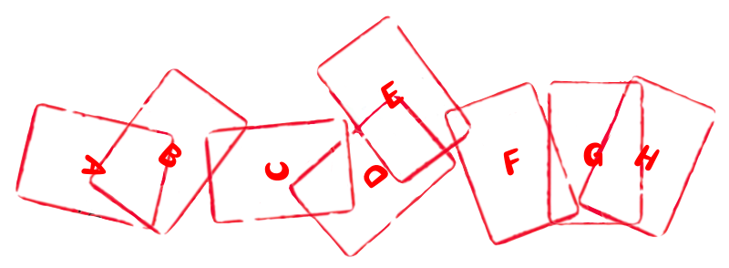
            <svg width="800" height="294" style="position: absolute; left:0">
                <rect class="link"  @click="nowShowPage = 1" :class="{selectedPage: nowShowPage == 1}" x="17" y="220" width="110" height="155" transform = "rotate(-77 17 220)" />
                <rect class="link" @click="nowShowPage = 2" :class="{selectedPage: nowShowPage == 2}" x="188" y="70" width="110" height="155" transform = "rotate(37 188 70)" />
                <rect class="link" @click="nowShowPage = 3" :class="{selectedPage: nowShowPage == 3}" x="237" y="247" width="106" height="155" transform = "rotate(-95 237 247)" />
                <rect class="link" @click="nowShowPage = 4" :class="{selectedPage: nowShowPage == 4}" x="433" y="103" width="106" height="155" transform = "rotate(50 433 103)" />
                <rect class="link" @click="nowShowPage = 5" :class="{selectedPage: nowShowPage == 5}" x="343" y="76" width="106" height="155" transform = "rotate(-36 343 76)" />
                <rect class="link" @click="nowShowPage = 6" :class="{selectedPage: nowShowPage == 6}" x="487" y="124" width="106" height="155" transform = "rotate(-19 487 124)" />
                <rect class="link" @click="nowShowPage = 7" :class="{selectedPage: nowShowPage == 7}" x="600" y="89" width="106" height="155" />
                <rect class="link" @click="nowShowPage = 8" :class="{selectedPage: nowShowPage == 8}" x="692" y="82" width="106" height="155" transform = "rotate(23 692 82)" />
            </svg>
        </div>
        <div v-if="nowShowPage == 1">
            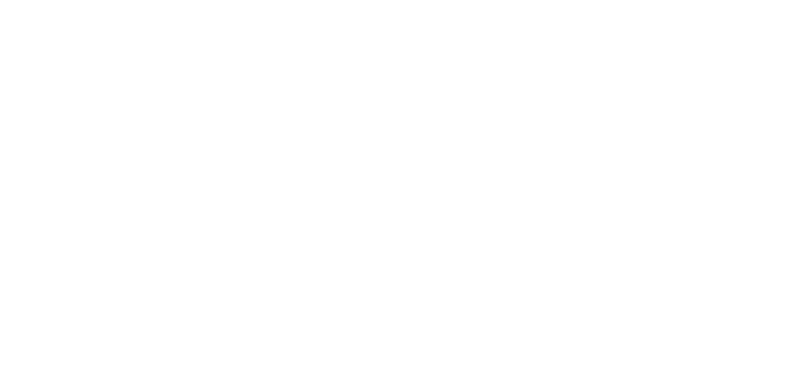
            <p class="text-warning">(7)</p>
        </div>
        <div v-if="nowShowPage == 2">
            <div style="font-size:48px">
                <!--<p>(???)+?-➕+?‍♂️</p>
                <p>?-?</p>
                <p>✋+(??)-?</p>
                <p>?+?-?</p>-->
                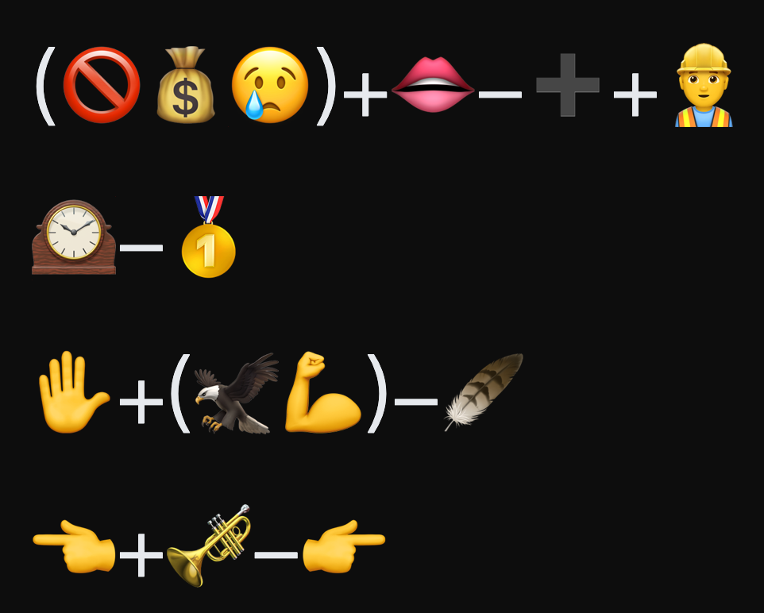
            </div>
            <p class="text-warning">（四）</p>
        </div>
        <div v-if="nowShowPage == 3">
            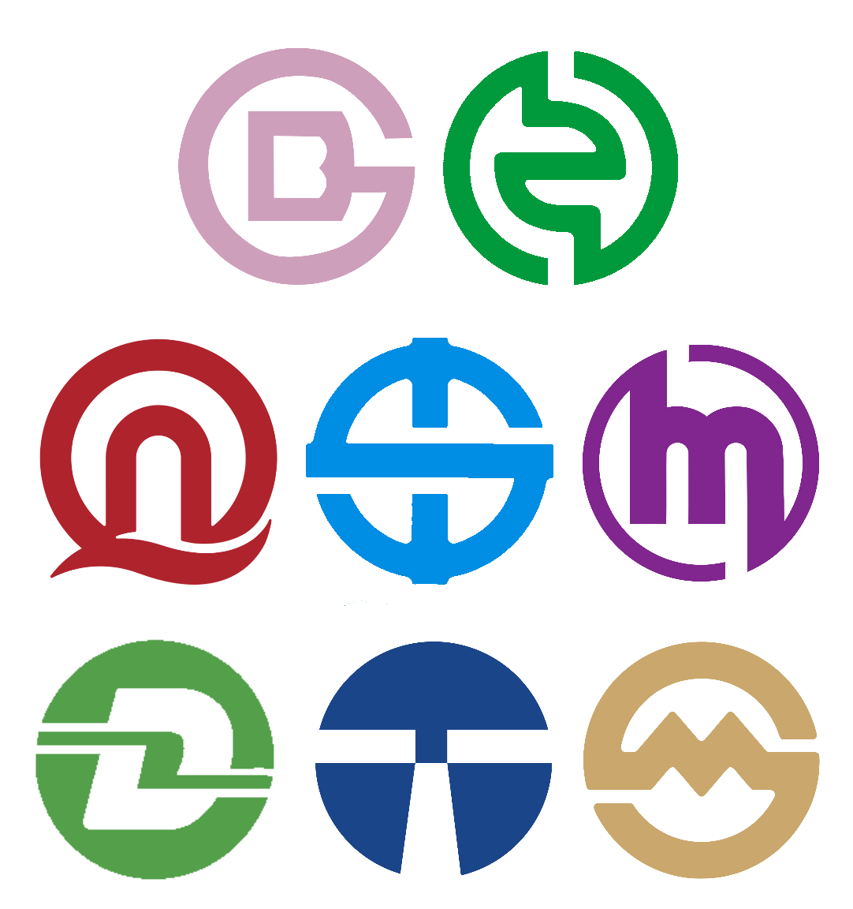
            <p class="text-warning">(2) 3 3</p>
        </div>
        <div v-if="nowShowPage == 4">
            <p style="font-size:48px">👌🏳️👌💧☹️👈✋👆👇</p>
            <p class="text-warning">(9)</p>
        </div>
        <div v-if="nowShowPage == 5">
            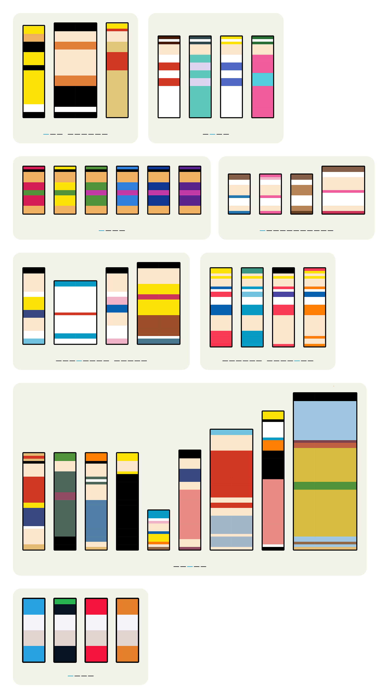
            <p class="text-warning">(8)</p>
        </div>
        <div v-if="nowShowPage == 6">
            <p>横看成岭侧成峰……</p>
            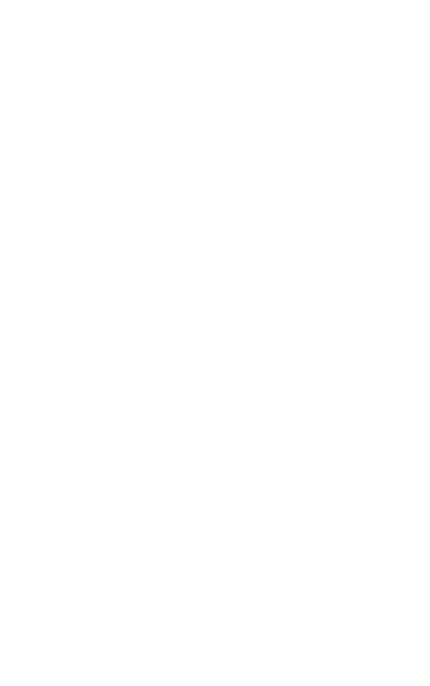
            <p class="text-warning">(6)</p>
        </div>
        <div v-if="nowShowPage == 7">
            <p><a href="https://docs.qq.com/sheet/DVkt6c2VtWUlXUmRa?tab=BB08J2" target="_blank">腾讯文档</a></p>
            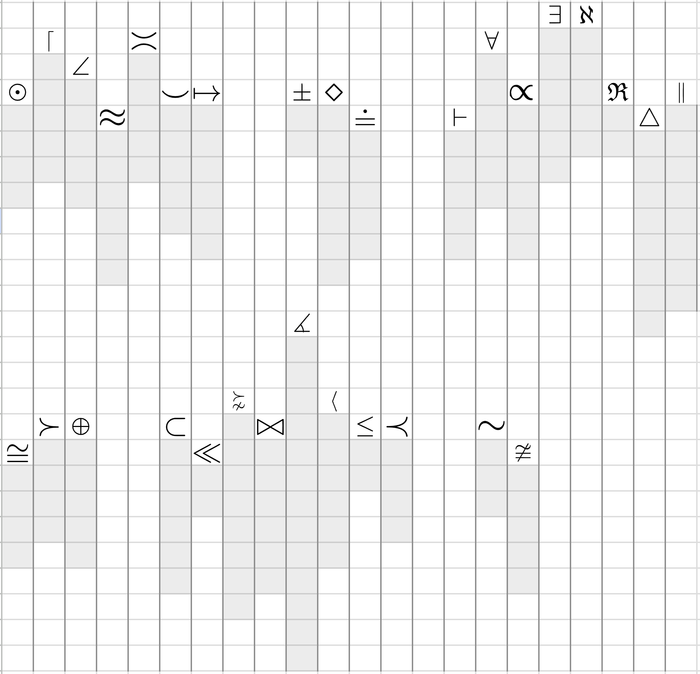
            <p class="text-warning">(6)</p>
        </div>
        <div v-if="nowShowPage == 8">
            <table cellpadding='0' cellspacing='0' class='colorgrid'>
                <tr><td class='yellow'></td><td class='red'></td><td class='yellow'></td><td class='red'></td><td class='yellow'></td><td class='red'></td><td class='black'></td><td class='white'></td><td class='black'></td><td class='white'></td><td class='black'></td><td class='white'></td></tr>
                <tr><td class='yellow'></td><td class='blue'></td><td class='blue'></td><td class='blue'></td><td class='yellow'></td><td class='blue'></td><td class='blue'></td><td class='blue'></td><td class='yellow'></td><td class='blue'></td><td class='blue'></td><td class='blue'></td></tr>
                <tr><td class='yellow'></td><td class='red'></td><td class='yellow'></td><td class='red'></td><td class='yellow'></td><td class='red'></td><td class='black'></td><td class='white'></td><td class='black'></td><td class='white'></td><td class='black'></td><td class='white'></td></tr>
                <tr><td class='yellow'></td><td class='blue'></td><td class='blue'></td><td class='blue'></td><td class='yellow'></td><td class='blue'></td><td class='blue'></td><td class='blue'></td><td class='yellow'></td><td class='blue'></td><td class='blue'></td><td class='blue'></td></tr>
                <tr><td class='yellow'></td><td class='red'></td><td class='yellow'></td><td class='red'></td><td class='yellow'></td><td class='red'></td><td class='black'></td><td class='white'></td><td class='black'></td><td class='white'></td><td class='black'></td><td class='white'></td></tr>
                <tr><td class='yellow'></td><td class='blue'></td><td class='blue'></td><td class='blue'></td><td class='yellow'></td><td class='blue'></td><td class='blue'></td><td class='blue'></td><td class='yellow'></td><td class='blue'></td><td class='blue'></td><td class='blue'></td></tr>
                <tr><td class='black'></td><td class='white'></td><td class='black'></td><td class='white'></td><td class='black'></td><td class='white'></td><td class='yellow'></td><td class='red'></td><td class='yellow'></td><td class='red'></td><td class='yellow'></td><td class='red'></td></tr>
                <tr><td class='yellow'></td><td class='red'></td><td class='blue'></td><td class='red'></td><td class='yellow'></td><td class='red'></td><td class='blue'></td><td class='red'></td><td class='yellow'></td><td class='red'></td><td class='blue'></td><td class='red'></td></tr>
                <tr><td class='black'></td><td class='white'></td><td class='black'></td><td class='white'></td><td class='black'></td><td class='white'></td><td class='yellow'></td><td class='red'></td><td class='yellow'></td><td class='red'></td><td class='yellow'></td><td class='red'></td></tr>
                <tr><td class='yellow'></td><td class='red'></td><td class='blue'></td><td class='red'></td><td class='yellow'></td><td class='red'></td><td class='blue'></td><td class='red'></td><td class='yellow'></td><td class='red'></td><td class='blue'></td><td class='red'></td></tr>
                <tr><td class='black'></td><td class='white'></td><td class='black'></td><td class='white'></td><td class='black'></td><td class='white'></td><td class='yellow'></td><td class='red'></td><td class='yellow'></td><td class='red'></td><td class='yellow'></td><td class='red'></td></tr>
                <tr><td class='yellow'></td><td class='red'></td><td class='blue'></td><td class='red'></td><td class='yellow'></td><td class='red'></td><td class='blue'></td><td class='red'></td><td class='yellow'></td><td class='red'></td><td class='blue'></td><td class='red'></td></tr>
            </table>
            <p class="text-warning">(4)</p>
        </div>
    </div>
</template>

<style>
	.link {
		cursor: pointer;
        fill:rgba(0,0,0, 0);
	}
    .link:hover {
		fill: rgba(255,255,0,0.3);
	}
    rect.selectedPage {
        fill:rgba(255,0,0, 0.3);
    }
    .colorgrid { border-collapse: collapse; }
    .colorgrid td { height:30px; width:30px; padding:0;}
    .colorgrid td.black { background-color: black;}
    .colorgrid td.white { background-color: white;}
    .colorgrid td.red { background-color: red;}
    .colorgrid td.yellow { background-color: yellow;}
    .colorgrid td.blue { background-color: blue;}
</style>
```

### vue_script

```text
const { ref } = Vue; //由于网页中无法import，Vue所有组件都已预先导出至Vue对象中。

export default {
    setup() {
        let nowShowPage = ref(1);

        return {
            nowShowPage
        }
    }
}
```


## 答案

`WATER`

## 解析

## A
找出每个动物的英文名字，然后以笔画数提取：

JELLYFISH (1) = J  
DUCK (2) = U  
SHRIMP (5) = M  
ELEPHANT (4) = P  
DOLPHIN (6) = I  
MONKEY (3) = N  
KANGAROO (4) = G

得到 `JUMPING`。

## B

穷 + 口 - 加 + 工 = 空  
钟 - 金 = 中  
手（扌）+ 翅 - 羽 = 技  
左 + 号 - 右 = 巧

得到 `空中技巧`。

## C
这些都是中国城市的地铁标志，找到城市后再找到对应颜色的线号，分别是：

（北京19号线 哈尔滨2号线）  
青岛2号线 沈阳9号线 杭州7号线  
大连1号线 天津9号线 上海18号线

把数字转换成英文得 `(SB) BIG AIR`。

## D
这是用 emoji 表示的 Wingdings 字体，查看 Wingdings 字体表就可以翻译出来答案 `BOBSLEIGH`。

## E
这是用色块表示的人物图，每组都少了一个人物，找到后填入横线，提取蓝色横线上的字母，得到 `SKELETON`。
<style>
.ak td, .ak th {
padding: 5px 10px;
}
.ak b {
color: DodgerBlue;
}
</style>
<table class="ak">
<tr><th>组合</th><th>缺少的人物</th><th>英文/拼音</th></tr>
<tr><td>西游记</td><td>沙悟净</td><td><b>S</b>HA WUJING</td></tr>
<tr><td>圣斗士星矢</td><td>一辉</td><td>I<b>K</b>KI</td></tr>
<tr><td>葫芦娃</td><td>二娃</td><td><b>E</b>RWA</td></tr>
<tr><td>喜羊羊</td><td>懒羊羊</td><td><b>L</b>ANYANGYANG</td></tr>
<tr><td>机器猫</td><td>小夫</td><td>HON<b>E</b>KAWA SUNEO</td></tr>
<tr><td>美少女战士</td><td>水兵木星</td><td>SAILOR JUPI<b>T</b>ER</td></tr>
<tr><td>海贼王</td><td>骗人布</td><td>US<b>O</b>PP</td></tr>
<tr><td>福娃</td><td>妮妮</td><td><b>N</b>INI</td></tr>
</table>

## F
这是三视图中的俯视图和右视图，可以推理出正面形状为 `ALPINE`。

## G
这里需要根据符号填入 LaTex 里的符号名字
<p>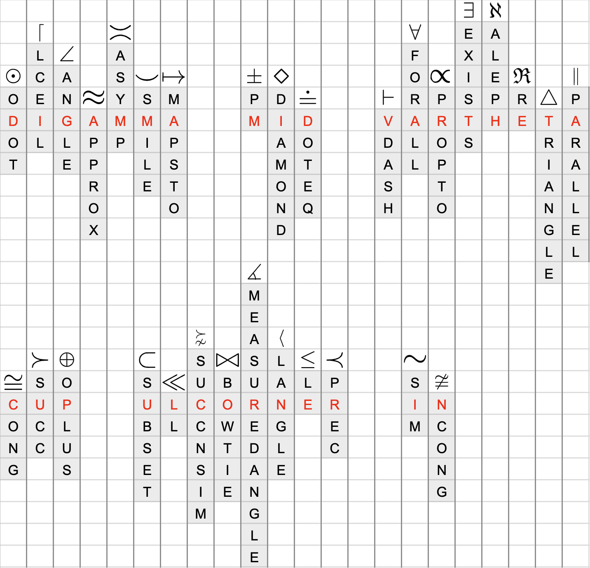</p>
横着读其中一行是 digamma, mid, vartheta, cup, ulcorner, in。这些仍然是 LaTex 里的符号：
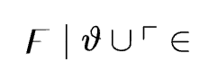

形似 `FIGURE`。

## H
红黄蓝黑白像是国际海事信号旗，经过观察可以发现这是四个信号旗交织在一起的图案（可以将图分割成6x6的方块，每个方块里有2x2像素，每次只看左上/右上/左下/右下其中一个。）：
<p>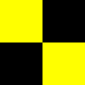

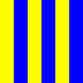
</p>

信号旗翻译为 `LUGE`。


# meta
搜索以上一些单词可以发现大多跟冬季运动有关，加上题目里的“上一次比赛已经是一年多前的事了”，不难联想到这里说的是 2022 年在北京举办的冬季奥运会。加上“熟悉的图标”，可以搜索到冬奥会的体育图标：

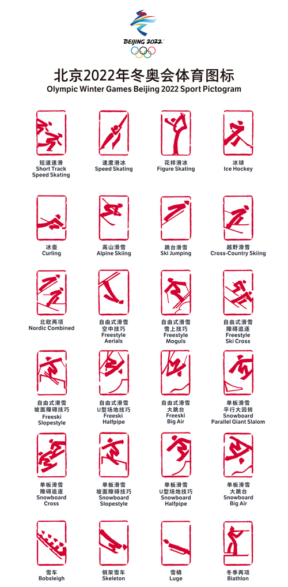

<br><br>

不难看出每个答案都对应了一个运动图标，A-H 四周的红色方框也进一步印证了这一点：

JUMPING: 跳台滑雪 (Ski Jumping)  
空中技巧：自由式滑雪空中技巧 (Freestyle Aerials)  
(SB) BIG AIR：单板滑雪大跳台 (Snowboard Big Air)  
BOBSLEIGH：雪车 (Bobsleigh)  
SKELETON：钢架雪车 (Skeleton)  
ALPINE：高山滑雪 (Alpine Skiing)  
FIGURE：花样滑冰 (Figure Skating)  
LUGE：雪橇 (Luge)  

将这八个图标按照字母朝向放入 A-H 框可以得到下图：

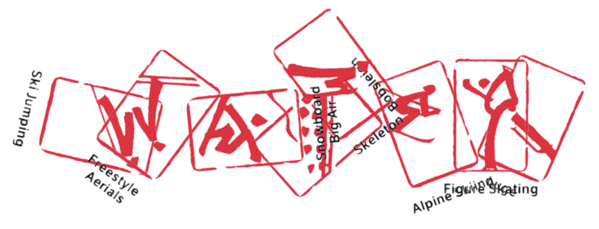

<br><br>

答案就是 `WATER`。

## 提示

### 1. A不会做

辨认出动物的英文后，用笔画数提取字母。

### 2. B不会做

把表情翻译成汉字，再进行加减。每组括号代表一个字，括号外则是每个表情代表一个字。

### 3. C不会做

先找到每个地铁标志的城市，再找到对应颜色的地图线号。

### 4. D不会做

根据Wingdings字体把表情转换成字母。

### 5. E不会做

辨识出每组人物，找到缺少的人物（名字长度应该对应横线），提取蓝色横线上面的字母。

### 6. F不会做

这是给出了三视图中的俯视图和右视图，根据这两个试图还原出正视图。

### 7. G不会做

查找 LaTeX 里这些符号的名字，填入方格后横着读其中一行。

### 8. H不会做

把图分成 36 个 2x2 大小的彩色格子，每次只看左上/右上/左下/右下其中一个。然后对照旗语。

### 9. 不知道最上面几个红色方框是干什么用的

根据每题答案以及“上一次比赛”“一年多前”的提示，找到每个答案对应的图标再填入上面的红色方框。


## 中间答案

| 提交 | 回复 | 附加信息 |
| --- | --- | --- |
| JUMPING | 这是本题小题答案之一。 |  |
| 空中技巧 | 这是本题小题答案之一。 |  |
| BOBSLEIGH | 这是本题小题答案之一。 |  |
| SKELETON | 这是本题小题答案之一。 |  |
| ALPINE | 这是本题小题答案之一。 |  |
| FIGURE | 这是本题小题答案之一。 |  |
| LUGE | 这是本题小题答案之一。 |  |
| SB BIG AIR | 这是本题小题答案之一。 |  |
| (sb) big air | 这是本题小题答案之一。 |  |

## 本地附件

- [06b91c7b597449dfaae235f34e19931c.webp](../../../assets/archive.cipherpuzzles.com/ccbc13/images/CCBC-13/06b91c7b597449dfaae235f34e19931c.webp)
- [143b6ae4b39742009d7ef501a0f61cd6.webp](../../../assets/archive.cipherpuzzles.com/ccbc13/images/CCBC-13/143b6ae4b39742009d7ef501a0f61cd6.webp)
- [1780eff16f8249dda47fb78c75e809c9.webp](../../../assets/archive.cipherpuzzles.com/ccbc13/images/CCBC-13/1780eff16f8249dda47fb78c75e809c9.webp)
- [1d57485fc0614564875da4fdbd677f01.webp](../../../assets/archive.cipherpuzzles.com/ccbc13/images/CCBC-13/1d57485fc0614564875da4fdbd677f01.webp)
- [279f1ee8ab324496af0519c52f5c0efb.webp](../../../assets/archive.cipherpuzzles.com/ccbc13/images/CCBC-13/279f1ee8ab324496af0519c52f5c0efb.webp)
- [4a58eacc2b8e478d8e304f2b6ab77b90.webp](../../../assets/archive.cipherpuzzles.com/ccbc13/images/CCBC-13/4a58eacc2b8e478d8e304f2b6ab77b90.webp)
- [5a98ed48fde54f4d8dc595a29cb0d401.webp](../../../assets/archive.cipherpuzzles.com/ccbc13/images/CCBC-13/5a98ed48fde54f4d8dc595a29cb0d401.webp)
- [779e5ff734fe41a69b5ddc6d8a7241ac.webp](../../../assets/archive.cipherpuzzles.com/ccbc13/images/CCBC-13/779e5ff734fe41a69b5ddc6d8a7241ac.webp)
- [88288055981a4316b254f2cb5c8c8b98.webp](../../../assets/archive.cipherpuzzles.com/ccbc13/images/CCBC-13/88288055981a4316b254f2cb5c8c8b98.webp)
- [ac270aaad8c04686a1795f7a081c1540.webp](../../../assets/archive.cipherpuzzles.com/ccbc13/images/CCBC-13/ac270aaad8c04686a1795f7a081c1540.webp)
- [b14b82ae902c4a1f93056d48a3128290.webp](../../../assets/archive.cipherpuzzles.com/ccbc13/images/CCBC-13/b14b82ae902c4a1f93056d48a3128290.webp)
- [d9240f297f7348ee873ed5dfa795a414.webp](../../../assets/archive.cipherpuzzles.com/ccbc13/images/CCBC-13/d9240f297f7348ee873ed5dfa795a414.webp)
- [e5d1cc80d4b14588ba470c0a6231da1b.webp](../../../assets/archive.cipherpuzzles.com/ccbc13/images/CCBC-13/e5d1cc80d4b14588ba470c0a6231da1b.webp)
- [eabbbdc74d464040a888d8d5c5c4a6ff.webp](../../../assets/archive.cipherpuzzles.com/ccbc13/images/CCBC-13/eabbbdc74d464040a888d8d5c5c4a6ff.webp)
- [f84bf9297289430e98c02c29b64685c2.webp](../../../assets/archive.cipherpuzzles.com/ccbc13/images/CCBC-13/f84bf9297289430e98c02c29b64685c2.webp)

来源：[https://archive.cipherpuzzles.com/ccbc13/problems/CCBC-13/6.yaml](https://archive.cipherpuzzles.com/ccbc13/problems/CCBC-13/6.yaml)
