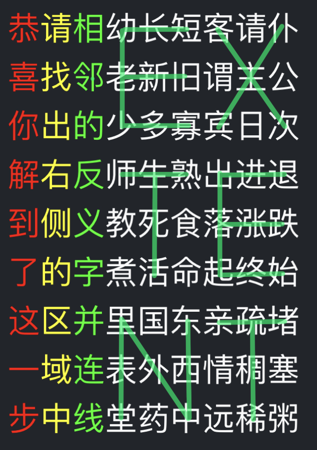

# 汉字方阵

## 题面

棋竹恭菊这剘肪忑骐枨伥吆幼謗釡冣単请象取相幼长短客疮桀彀请仆喜鸣找辆邻兰国梅空老书吓撷囗协斐结新喙书轰写旧銝中填洛谓颔垡笇刷武苦作画每棋主谜字双〇圐圙公体你召甜组辣皈琴十出的少五一四多寡我宾刃日酸次黑篆思解右言反点师元生熟叶出方字出隶对正进诗退到飞侧义组教咖死平数处腻草斜全食入称上落十涨慎三氧的取所朋构歪字跌欧称天了的洲诚国羶字煮油活命起家终平国去始旗癣这俗学日柴字米法栓称章区并汉界里疲国前上畔东盐饮饿森两将哀字怒亲及疏字不而山云酣这的堵能一域外楚河绿连红两空水归歌里第表全外喜前乐西者侧情拆无白秋出应三稠字成所塞步中黄示蓝位象云水平填个线置堂药为中语答远稀案大朝阔原入字粥

## 答案

`EXTENT`

## 解析

按照标题“汉字方阵”的提示，将题目排成17*17的方阵。`〇`周围的八个方向分别延伸，可以得到8个小题的题目名字。

<font color = yellow>棋</font>竹恭菊这剘肪忑骐枨伥吆幼謗釡冣単  
请<font color = yellow>象</font>取相幼长短客疮桀彀请仆喜鸣找辆  
邻兰<font color = yellow>国</font>梅<font color = orange>空</font>老<font color = yellow>书</font>吓撷囗协斐结新喙书轰  
写旧銝<font color = yellow>中</font><font color = orange>填</font><font color = yellow>洛</font>谓颔垡笇刷武苦作画每棋  
主<font color = orange>谜字双</font><font color = red>〇</font><font color = orange>圐圙</font>公体你召甜组辣皈琴十  
出的少<font color = yellow>五</font><font color = orange>一</font><font color = yellow>四</font>多寡我宾刃日酸次黑篆思  
解右<font color = yellow>言</font>反<font color = orange>点</font>师<font color = yellow>元</font>生熟叶出方字出隶对正  
进<font color = yellow>诗</font>退到<font color = orange>飞</font>侧义<font color = yellow>组</font>教咖死平数处腻草斜  
全食入称<font color = orange>上</font>落十涨慎三氧的取所朋构歪  
字跌欧称<font color = orange>天</font>了的洲诚国羶字煮油活命起  
家终平国去始旗癣这俗学日柴字米法栓  
称章区并汉界里疲国前上畔东盐饮饿森  
两将哀字怒亲及疏字不而山云酣这的堵  
能一域外楚河绿连红两空水归歌里第表  
全外喜前乐西者侧情拆无白秋出应三稠  
字成所塞步中黄示蓝位象云水平填个线  
置堂药为中语答远稀案大朝阔原入字粥  

---

## 中国象棋
根据`楚河`和`汉界`确定棋盘位置，将棋子位置汉字连接得到  
`全称十三字欧洲国家国旗俗称前两字及不能两全前者拆字所示位置为答案`→  
`大不列颠及北爱尔兰联合王国国旗俗称前两字及忠孝前者拆字所示位置为答案`→  
`米字旗前两字及忠拆字所示位置为答案`→  
`米字中心为答案`  
取象棋棋盘上米字中心得到`将字`，故本小题答案为`将`。

棋竹恭菊这剘肪忑骐枨伥吆幼謗釡冣単  
请象取相幼长短客疮桀彀请仆喜鸣找辆  
邻兰国梅空老书吓撷囗协斐结新喙书轰  
写旧銝中填洛谓颔垡笇刷武苦作画每棋  
主谜字双〇圐圙公体你召甜组辣皈琴十  
出的少五一四多寡我宾刃日酸次黑篆思  
解右言反点师元生熟叶出方字出隶对正  
进诗退到飞侧义组教咖死平数处腻草斜  
<font color = yellow>全</font>食入<font color = yellow>称</font>上落<font color = yellow>十</font>涨慎<font color = yellow>三</font>氧的取所朋构歪  
<font color = yellow>字</font>跌<font color = yellow>欧</font>称天了的<font color = yellow>洲</font>诚<font color = yellow>国</font>羶字煮油活命起  
<font color = yellow>家</font>终平<font color = yellow>国</font>去始<font color = yellow>旗</font>癣这<font color = yellow>俗</font>学日柴字米法栓  
<font color = yellow>称</font>章区并<font color = red>汉界</font>里疲国<font color = yellow>前</font>上畔东盐饮饿森  
<font color = yellow>两</font><font color = lime>将</font>哀<font color = yellow>字</font>怒亲<font color = yellow>及</font>疏<font color = lime>字</font><font color = yellow>不</font>而山云酣这的堵  
<font color = yellow>能</font>一域外<font color = red>楚河</font>绿连红<font color = yellow>两</font>空水归歌里第表  
<font color = yellow>全</font>外喜<font color = yellow>前</font>乐西<font color = yellow>者</font>侧情<font color = yellow>拆</font>无白秋出应三稠  
<font color = yellow>字</font>成<font color = yellow>所</font>塞步中黄<font color = yellow>示</font>蓝<font color = yellow>位</font>象云水平填个线  
<font color = yellow>置</font>堂药<font color = yellow>为</font>中语<font color = yellow>答</font>远稀<font color = yellow>案</font>大朝阔原入字粥  

---

## 双字谜
在方阵中寻找相邻的字谜，如`咖→叶`（口字旁边一个加号是叶），所有17对构成了一个`刈`字，再利用字谜转换得到本小题答案`剩`。

棋竹恭菊这剘肪忑骐枨伥吆幼謗釡冣単  
请象取相幼长短客疮桀彀请仆喜<font color = yellow>鸣</font>找<font color = yellow>辆</font>  
邻兰国梅空老书<font color = yellow>吓</font>撷囗协<font color = yellow>斐</font>结新<font color = yellow>喙</font>书<font color = yellow>轰</font>  
写旧銝中填洛谓<font color = yellow>颔</font>垡笇刷<font color = yellow>武</font>苦作画每棋  
主谜字双〇圐圙公<font color = yellow>体</font>你<font color = yellow>召</font>甜组辣<font color = yellow>皈</font>琴<font color = yellow>十</font>  
出的少五一四多寡<font color = yellow>我</font>宾<font color = yellow>刃</font>日酸次<font color = yellow>黑</font>篆<font color = yellow>思</font>  
解右言反点师元生熟<font color = yellow>叶</font>出方字出隶对正  
进诗退到飞侧义组教<font color = yellow>咖</font>死平数处<font color = yellow>腻</font>草<font color = yellow>斜</font>  
全食入称上落十涨<font color = yellow>慎</font>三<font color = yellow>氧</font>的取所<font color = yellow>朋</font>构<font color = yellow>歪</font>  
字跌欧称天了的洲<font color = yellow>诚</font>国<font color = yellow>羶</font>字煮油活命起  
家终平国去始旗<font color = yellow>癣</font>这俗学<font color = yellow>日</font>柴字米法<font color = yellow>栓</font>  
称章区并汉界里<font color = yellow>疲</font>国前上<font color = yellow>畔</font>东盐<font color = yellow>饮</font><font color = yellow>饿</font><font color = yellow>森</font>  
两将哀字怒亲及疏字不而山云酣这的堵  
能一域外楚河绿连红两空水归歌里第表  
全外喜前乐西者侧情拆无白秋出应三稠  
字成所塞步中黄示蓝位象云水平填个线  
置堂药为中语答远稀案大朝阔原入字粥  

---

## 五言诗
查得前三句分别对应的上下句，可以发现它们的前三字形成了对称矩阵。找到剩下组成对称矩阵的两句诗，填入其上下句，并按照`这里应填入的第三个字`得到本小题答案`下`。

```
　　　　　　风月清江夜，山水白云朝。
云归秋水阔，月出夜山深。
　　　　　　清夜方归来，酣歌出平原。
　　　　　　江山归谢客，神鬼下刘根。
楚驿南渡口，夜深来客稀。
```

棋竹恭菊这剘肪忑骐枨伥吆幼謗釡冣単  
请象取相幼长短客疮桀彀请仆喜鸣找辆  
邻兰国梅空老书吓撷囗协斐结新喙书轰  
写旧銝中填洛谓颔垡笇刷武苦作画每棋  
主谜字双〇圐圙公体你召甜组辣皈琴十  
出的少五一四多寡我宾刃日酸次黑篆思  
解右言反点师元生熟叶出方字出隶对正  
进诗退到飞侧义组教咖死平数处腻草斜  
全食入称上落十涨慎三氧的取所朋构歪  
字跌欧称天了的洲诚国羶字煮油活命起  
家终平国去始旗癣这俗学日柴字米法栓  
称章区并汉界里疲国前上畔东盐饮饿森  
两将哀字怒亲及疏字不而<font color = yellow>山云酣这的</font>堵  
能一域外楚河绿连红两空<font color = yellow>水归歌里第</font>表  
全外喜前乐西者侧情拆无<font color = yellow>白秋出应三</font>稠  
字成所塞步中黄示蓝位象<font color = yellow>云水平填个</font>线  
置堂药为中语答远稀案大<font color = yellow>朝阔原入字</font>粥  

---

## 一点飞上天
`一点飞上天`来自于Biang字的口诀，其中每句口诀描述了该字的其中一部分。找到方阵中的对应部分后，取剩下部分得到`单取金旁加休其下方其文`，对照得到本小题答案为`字`。

<style>
table tr:nth-child(even) td {
    background-color: #444;
}
table td {
    vertical-align: middle;
    padding: 3px 10px;
}
</style>

|口诀|对应部件|对应汉字|剩余部分|
|-|-|-|-|
|一点飞上天|丶|単|单|
|黄河两边弯|冖|冣|取|
|八字大张口|八|釡|金|
|言字往里走|言|謗|旁|
|左一弯，右一弯|幺幺|幼吆|加|
|左一长，右一长|长长|伥枨|休|
|中间夹个马大王|马|骐|其|
|心字底|心|忑|下|
|月字旁|月|肪|方|
|留个钩搭挂麻糖|刂|剘|其|
|推个车车进咸阳|辶|这|文|


棋竹恭菊<font color = yellow>这剘肪忑骐枨伥吆幼謗釡冣単</font>  
请象取相幼长短客疮桀彀请仆喜鸣找辆  
邻兰国梅空老书吓撷囗协斐结新喙书轰  
写旧<font color = yellow>銝</font>中填洛谓颔垡笇刷武苦作画每棋  
主谜<font color = lime>字</font>双〇圐圙公体你召甜组辣皈琴十  
出的少五一四多寡我宾刃日酸次黑篆思  
解右言反点师元生熟叶出方字出隶对正  
进诗退到飞侧义组教咖死平数处腻草斜  
全食入称上落十涨慎三氧的取所朋构歪  
字跌欧称天了的洲诚国羶字煮油活命起  
家终平国去始旗癣这俗学日柴字米法栓  
称章区并汉界里疲国前上畔东盐饮饿森  
两将哀字怒亲及疏字不而山云酣这的堵  
能一域外楚河绿连红两空水归歌里第表  
全外喜前乐西者侧情拆无白秋出应三稠  
字成所塞步中黄示蓝位象云水平填个线  
置堂药为中语答远稀案大朝阔原入字粥  

---

## 四元组
在方阵中找到8个四元组，读取中心得到`取每组对称字外侧`，再取取得`写作结构章法成语`，即`起承转合`，取其中对称字，故本小题答案为`合`。

棋<font color = red>竹</font>恭<font color = red>菊</font>这剘肪忑骐枨伥吆幼謗釡冣単  
请象<font color = yellow>取</font>相幼长短客疮桀彀请仆喜鸣找辆  
邻<font color = red>兰</font>国<font color = red>梅</font>空老书吓撷囗协斐<font color = lime>结</font>新喙<font color = red>书</font>轰  
<font color = lime>写</font>旧銝中填洛谓颔垡笇刷武<font color = red>苦</font><font color = lime>作</font><font color = red>画</font><font color = yellow>每</font><font color = red>棋</font>  
主谜字双〇圐圙公体你召<font color = red>甜</font><font color = yellow>组</font><font color = red>辣</font>皈<font color = red>琴</font>十  
出的少五一四多寡我宾刃日<font color = red>酸</font>次黑<font color = red>篆</font>思  
解右言反点师元生熟叶出方字出<font color = red>隶</font><font color = yellow>对</font><font color = red>正</font>  
进诗退到飞侧义组教咖死平数处腻<font color = red>草</font>斜  
全食<font color = red>入</font>称<font color = red>上</font>落十涨慎三氧的取所朋<font color = lime>构</font>歪  
字跌欧<font color = yellow>称</font>天了的洲诚国羶字煮<font color = red>油</font>活命起  
家终<font color = red>平</font>国<font color = red>去</font>始旗癣这俗学日<font color = red>柴</font><font color = yellow>字</font><font color = red>米</font><font color = lime>法</font>栓  
称<font color = lime>章</font>区并汉界里疲国前上畔东<font color = red>盐</font>饮饿森  
两将<font color = red>哀</font>字<font color = red>怒</font>亲及疏字不而山云酣这的堵  
能一域<font color = yellow>外</font>楚河<font color = red>绿</font>连<font color = red>红</font>两空水归歌里第表  
全外<font color = red>喜</font>前<font color = red>乐</font>西者<font color = yellow>侧</font>情拆无白秋出应三稠  
字<font color = lime>成</font>所塞步中<font color = red>黄</font>示<font color = red>蓝</font>位象云水平填个线  
置堂药为中<font color = lime>语</font>答远稀案大朝阔原入字粥  

---

## 圐圙
观察囗字（不是口字）的八个方向，可以得到`仓颉戈竹尸十弓木`，利用仓颉输入法输入可得`成字`，故本小题答案为`成`。

疮桀彀　仓木弓  
撷囗协　颉囗十  
垡笇刷　戈竹尸  

棋竹恭菊这剘肪忑骐枨伥吆幼謗釡冣単  
请象取相幼长短客<font color = yellow>疮桀彀</font>请仆喜鸣找辆  
邻兰国梅空老书吓<font color = yellow>撷<font color = red>囗</font>协</font>斐结新喙书轰  
写旧銝中填洛谓颔<font color = yellow>垡笇刷</font>武苦作画每棋  
主谜字双〇圐圙公体你召甜组辣皈琴十  
出的少五一四多寡我宾刃日酸次黑篆思  
解右言反点师元生熟叶出方字出隶对正  
进诗退到飞侧义组教咖死平数处腻草斜  
全食入称上落十涨慎三氧的取所朋构歪  
字跌欧称天了的洲诚国羶字煮油活命起  
家终平国去始旗癣这俗学日柴字米法栓  
称章区并汉界里疲国前上畔东盐饮饿森  
两将哀字怒亲及疏字不而山云酣这的堵  
能一域外楚河绿连红两空水归歌里第表  
全外喜前乐西者侧情拆无白秋出应三稠  
字成所塞步中黄示蓝位象云水平填个线  
置堂药为中语答远稀案大朝阔原入字粥  

---

## 洛书
将洛书对应至所示部分，按照洛书数字顺序可以得到`取出平方数所处的字`，再只取一四九所对应位置可得`取方字`，故本小题答案为`方`。

四九二　方字出  
三五七　平数处  
八一六　的取所  

棋竹恭菊这剘肪忑骐枨伥吆幼謗釡冣単  
请象取相幼长短客疮桀彀请仆喜鸣找辆  
邻兰国梅空老书吓撷囗协斐结新喙书轰  
写旧銝中填洛谓颔垡笇刷武苦作画每棋  
主谜字双〇圐圙公体你召甜组辣皈琴十  
出的少五一四多寡我宾刃日酸次黑篆思  
解右言反点师元生熟叶出<font color = yellow>方字出</font>隶对正  
进诗退到飞侧义组教咖死<font color = yellow>平数处</font>腻草斜  
全食入称上落十涨慎三氧<font color = yellow>的取所</font>朋构歪  
字跌欧称天了的洲诚国羶字煮油活命起  
家终平国去始旗癣这俗学日柴字米法栓  
称章区并汉界里疲国前上畔东盐饮饿森  
两将哀字怒亲及疏字不而山云酣这的堵  
能一域外楚河绿连红两空水归歌里第表  
全外喜前乐西者侧情拆无白秋出应三稠  
字成所塞步中黄示蓝位象云水平填个线  
置堂药为中语答远稀案大朝阔原入字粥  

---

## 填空
在方阵中找到`空`字并填入，故本小题答案为`形`。

棋竹恭菊这剘肪忑骐枨伥吆幼謗釡冣単  
请象取相幼长短客疮桀彀请仆喜鸣找辆  
邻兰国梅空老书吓撷囗协斐结新喙书轰  
写旧銝中填洛谓颔垡笇刷武苦作画每棋  
主谜字双〇圐圙公体你召甜组辣皈琴十  
出的少五一四多寡我宾刃日酸次黑篆思  
解右言反点师元生熟叶出方字出隶对正  
进诗退到飞侧义组教咖死平数处腻草斜  
全食入称上落十涨慎三氧的取所朋构歪  
字跌欧称天了的洲诚国羶字煮油活命起  
家终平国去始旗癣这俗<font color = yellow>学</font>日柴字米法栓  
称章区并汉界里疲国前<font color = yellow>上</font>畔东盐饮饿森  
两将哀字怒亲及疏字不<font color = yellow>而</font>山云酣这的堵  
能一域外楚河绿连红两<font color = yellow>空</font>水归歌里第表  
全外喜前乐西者侧情拆<font color = yellow>无</font>白秋出应三稠  
字成所塞步中黄示蓝位<font color = yellow>象</font>云水平填个线  
置堂药为中语答远稀案<font color = yellow>大</font>朝阔原入字粥  

---

## 将剩下字合成方形
将八道小题的答案连接可得到`将剩下字合成方形`，此时剩下81个字还没用过，将其重排可以得到：

<font color = red>恭</font><font color = yellow>请</font><font color =lime>相</font>幼长短客请仆  
<font color = red>喜</font><font color = yellow>找</font><font color =lime>邻</font>老新旧谓主公  
<font color = red>你</font><font color = yellow>出</font><font color =lime>的</font>少多寡宾日次  
<font color = red>解</font><font color = yellow>右</font><font color =lime>反</font>师生熟出进退  
<font color = red>到</font><font color = yellow>侧</font><font color =lime>义</font>教死食落涨跌  
<font color = red>了</font><font color = yellow>的</font><font color =lime>字</font>煮活命起终始  
<font color = red>这</font><font color = yellow>区</font><font color =lime>并</font>里国东亲疏堵  
<font color = red>一</font><font color = yellow>域</font><font color =lime>连</font>表外西情稠塞  
<font color = red>步</font><font color = yellow>中</font><font color =lime>线</font>堂药中远稀粥  

连线后象形得到最终答案 `EXTENT` ：



## 提示

### 1. 一开始要怎么做？

注意到一共有289个字，可以排成方阵。
〇的周围有八个关键词，对应八个独立的小题，每题答案是一个字。

### 2. （四个字）怎么做？

（中国象棋）
找到“楚河”“汉界”，然后以此为中心画一个棋盘，找到棋子对应的32个字。

### 3. （四 六 十一）怎么做？

（双字谜）
有17对相邻的汉字，它们中一个字可以看做描述另一个字的字谜。举例：“吓颔”，”吓“可以理解成”口下“，嘴的下面就是“颔”。

### 4. （四 七 八）怎么做？

（五言诗）
右下角有一个五乘五的方阵。找到前三句的对应上/下句，寻找规律之后推理出第四句。（其实还有第五句，但这道题不需要）

### 5. （五个字）怎么做？

（一点飞上天）
这个关键词是一个字笔顺口诀的第一句。方阵中第一行从右到左可以依次找到这个字的各个部件。

### 6. （五 四 八）怎么做？

（四元组）
方阵中有若干个形成并列关系的四字组，从上到下读取每一组中心的字之后再从每一组周围提取一个字。

### 7. （十二 十四）怎么做？

（圐圙）
这个关键词提示的是“囗的四面八方”。在囗周围的八个字中最靠近囗的部分都可以看作一个字，其中前两个字提示了某种编码方式。

### 8. （九 四）怎么做？

（洛书）
这道题和“数”有关。方阵中有一个三乘三的方阵，可以按照洛书的顺序读出一个九个字的提示。

### 9. （十三 八）怎么做？

（填空）
寻找另一个“空”字，然后根据其上下文推理出这个“空”应该是什么字。

### 10. 最后一步怎么做？

新的方阵中左三列提示应该在右六列里做什么。


## 中间答案

| 提交 | 回复 | 附加信息 |
| --- | --- | --- |
| 将 | 这是本题小题答案之一。 |  |
| 剩 | 这是本题小题答案之一。 |  |
| 下 | 这是本题小题答案之一。 |  |
| 字 | 这是本题小题答案之一。 |  |
| 合 | 这是本题小题答案之一。 |  |
| 成 | 这是本题小题答案之一。 |  |
| 方 | 这是本题小题答案之一。 |  |
| 形 | 这是本题小题答案之一。 |  |
| 将剩下字合成方形 | 这是本题的中间答案。 |  |
| 刈 | 还不是本题小题答案，是中间答案。 |  |
| 起承转合 | 还不是本题小题答案，是中间答案。 |  |
| 将字 | 还不是本题小题答案，是中间答案。 |  |
| 成字 | 还不是本题小题答案，是中间答案。 |  |
| 每组中特殊字外侧 | 还不是本题小题答案，是中间答案。 |  |
| 写作结构章法成语 | 还不是本题小题答案，是中间答案。 |  |
| 取出平方数所处的字 | 还不是本题小题答案，是中间答案。 |  |
| 取方字 | 还不是本题小题答案，是中间答案。 |  |

## 本地附件

- [427a714a58c64490bcf4820f25005fc5.webp](../../../assets/archive.cipherpuzzles.com/ccbc13/images/CCBC-13/427a714a58c64490bcf4820f25005fc5.webp)

来源：[https://archive.cipherpuzzles.com/ccbc13/problems/CCBC-13/7.yaml](https://archive.cipherpuzzles.com/ccbc13/problems/CCBC-13/7.yaml)
