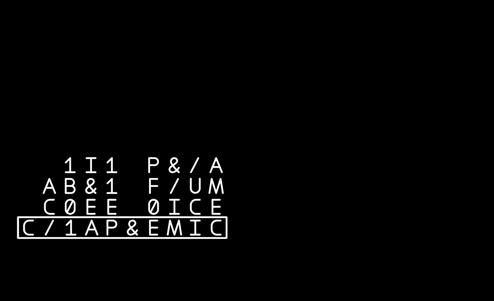
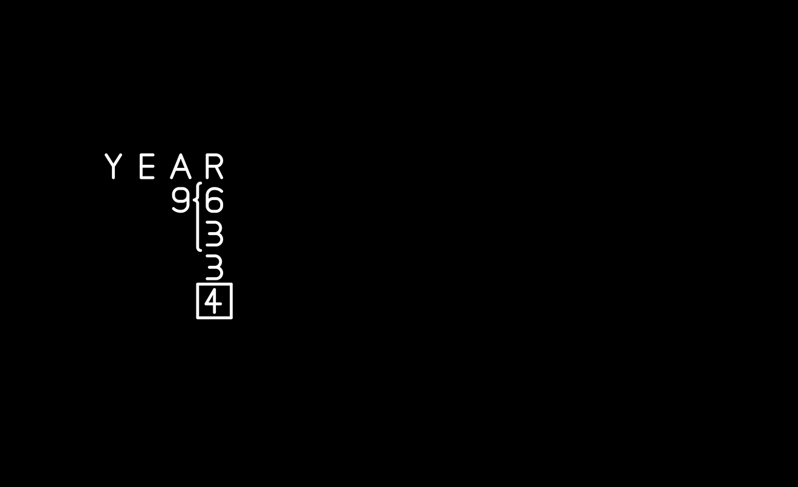
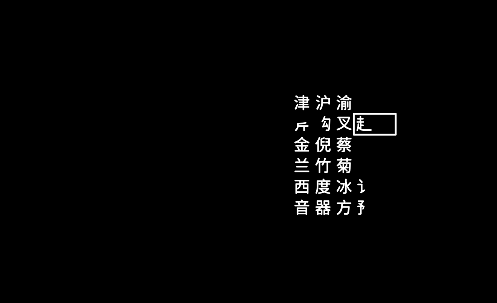
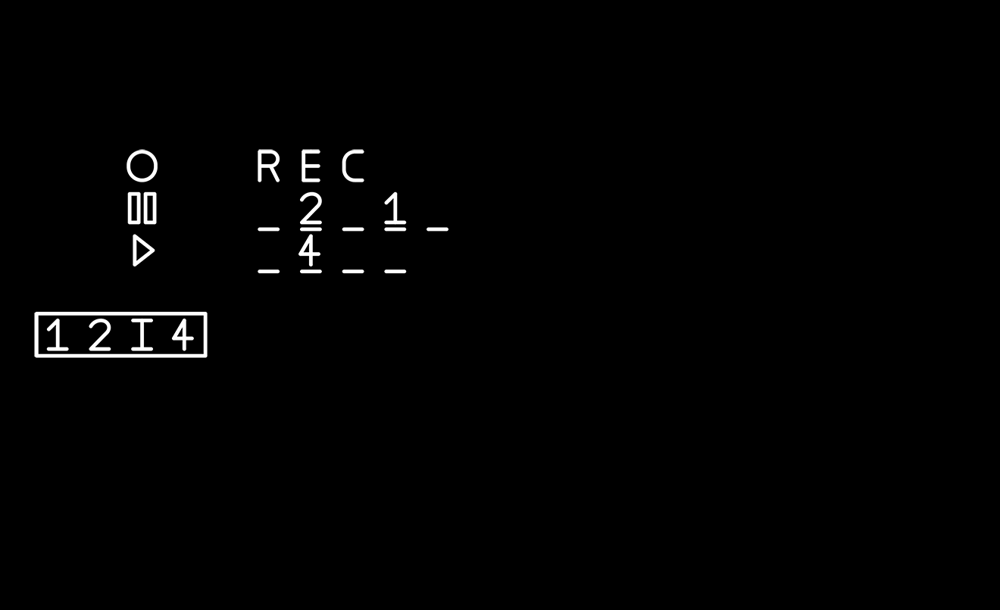
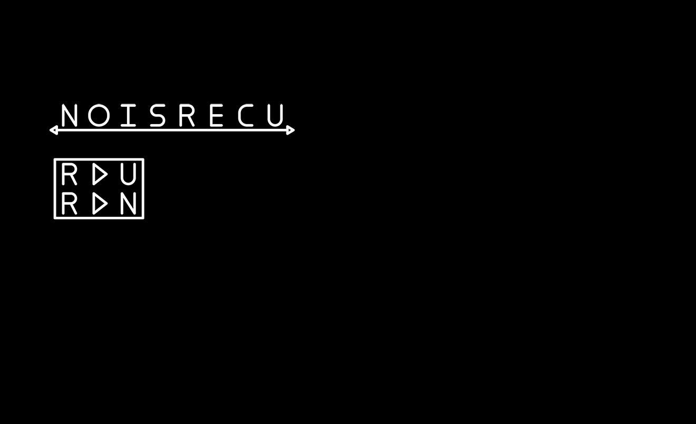
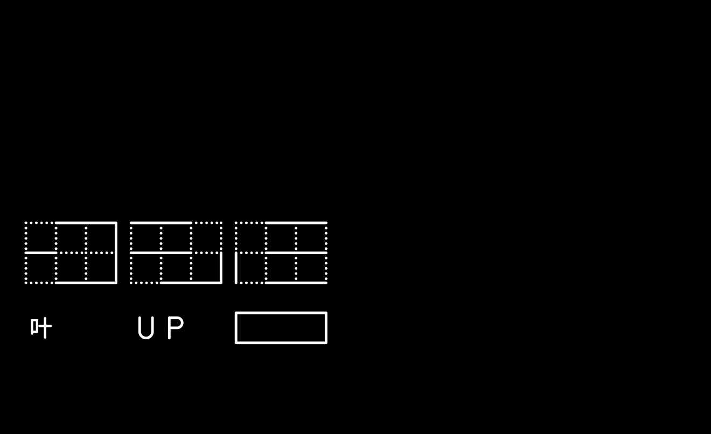
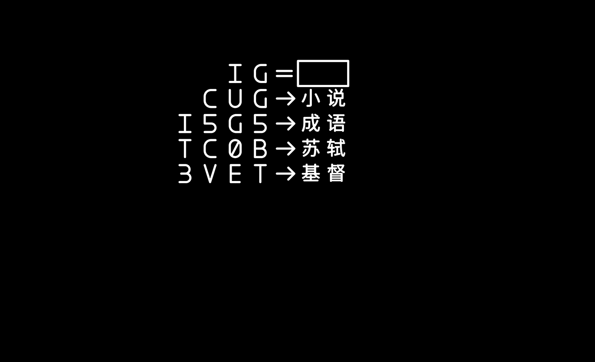
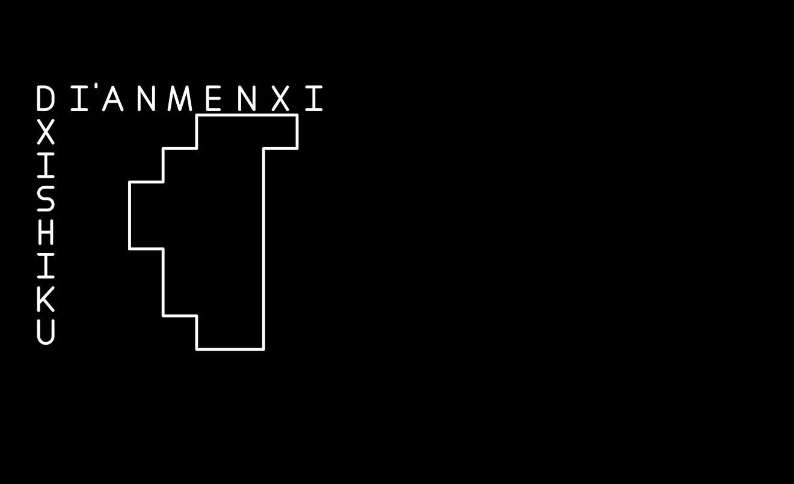
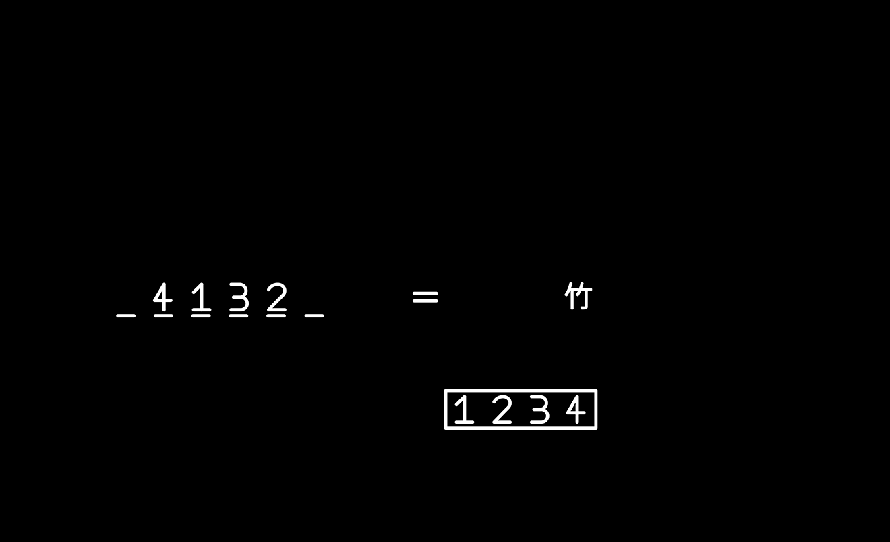
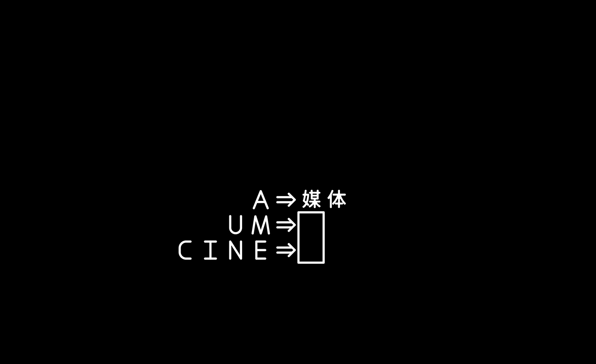

# 十重塔

## 题面

本题中的图片由多层重叠而成，每层是一个独立的谜题，拥有一个答案。

每一层都有一个框，你的任务是推测每层的内容，进而找出该层的框中是什么内容，并以此内容作为答案提交。

若你提交的答案确实是某一层的答案，则会触发系统的“共鸣”。图片中对应的层将会消去，你将看到此层消去后的其他未消去的层重叠而成的新图片。

(3) · (4) · (4) · (6 8) · (9) · (三 八) · (十 三) · (十二 十) · (四 九) · (五 十 四 七)

> 存档版说明：在正式比赛中，选手需要在答案框提交对应的答案，触发系统的“里程碑”来更新图片。由于存档版不支持这一功能，所以请在图片下方的输入框中输入答案。

## 交互源码

### vue_template

```html
<!-- TenfoldTowerRemake Puzzle -->
<template>

  <div class="puzzle-container">
    <div class="canvas-container">
      <canvas 
        ref="gameCanvas" 
        width="1320" 
        height="806"
        @click="handleCanvasClick"
      ></canvas>
    </div>
    
    <div class="input-container">
      <input 
        v-model="userAnswer" 
        @keyup.enter="submitAnswer"
        placeholder="请输入答案..."
        class="answer-input"
      />
      <button @click="submitAnswer" class="submit-btn">提交答案</button>
      <button @click="resetGame" class="reset-btn">重置</button>
    </div>
    
    <div v-if="message" class="message" :class="messageClass">
      {{ message }}
    </div>
  </div>

</template>

<style>

.puzzle-container {
  background-color: black;
  min-height: 100vh;
  display: flex;
  flex-direction: column;
  align-items: center;
  justify-content: center;
  padding: 20px;
}

.canvas-container {
  margin-bottom: 20px;
  border: 2px solid #333;
}

canvas {
  display: block;
  background-color: transparent;
}

.input-container {
  display: flex;
  gap: 10px;
  margin-bottom: 20px;
}

.answer-input {
  padding: 10px 15px;
  font-size: 16px;
  border: 2px solid #333;
  border-radius: 5px;
  background-color: #222;
  color: white;
  width: 300px;
}

.answer-input:focus {
  outline: none;
  border-color: #555;
}

.submit-btn {
  padding: 10px 20px;
  font-size: 16px;
  border: 2px solid #333;
  border-radius: 5px;
  background-color: #444;
  color: white;
  cursor: pointer;
  transition: background-color 0.3s;
}

.submit-btn:hover {
  background-color: #555;
}

.reset-btn {
  padding: 10px 20px;
  font-size: 16px;
  border: 2px solid #333;
  border-radius: 5px;
  background-color: #6a4444;
  color: white;
  cursor: pointer;
  transition: background-color 0.3s;
}

.reset-btn:hover {
  background-color: #7a5555;
}

.message {
  padding: 15px 20px;
  border-radius: 5px;
  font-size: 16px;
  text-align: center;
  max-width: 600px;
}

.message.success {
  background-color: #2d5a2d;
  color: #90ee90;
  border: 1px solid #4a7c4a;
}

.message.info {
  background-color: #2d4a5a;
  color: #87ceeb;
  border: 1px solid #4a6a7c;
}

.message.error {
  background-color: #5a2d2d;
  color: #ffb3b3;
  border: 1px solid #7c4a4a;
}

</style>
```

### vue_script

```text
var __vue_puzzle_component__=function(e){"use strict";const t=[{src:"bg.webp",text:"这层是背景层，应该没有对应答案",info:""},{src:"t-13.webp",text:"这层是最底部画着斜塔的层，应该没有对应答案",info:""},{src:"t-12.webp",text:"塔底",info:"你抵达了塔底。如果一开始就直通塔底会如何？"},{src:"t-11.webp",text:"中药",info:"你成功消去了一层楼"},{src:"t-10.webp",text:"MOBA",info:"你成功消去了一层楼"},{src:"t-09.webp",text:"北海公园",info:"你成功消去了一层楼"},{src:"t-08.webp",text:"埃及",info:"你成功消去了一层楼"},{src:"t-07.webp",text:"911",info:"你成功消去了一层楼"},{src:"t-06.webp",text:"RECURSION",info:"你成功消去了一层楼"},{src:"t-05.webp",text:"SAIL",info:"你成功消去了一层楼"},{src:"t-04.webp",text:"越剧",info:"你成功消去了一层楼"},{src:"t-03.webp",text:"大学",info:"你成功消去了一层楼"},{src:"t-02.webp",text:"CORONAPANDEMIC",info:"你成功消去了一层楼"},{src:"t-01.webp",text:"十重塔",info:"欢迎来到十重塔"}],r=["德尔塔","象牙塔","珍珠塔","灯塔","河内塔","汉诺塔","双子塔","金字塔","白塔","刀塔","千层塔"],s=["DELTA","IVORY","PEARL","LIGHT","HANOI","TOWER","METAL","WHITE","KNIFE","LAYER"],a=["DIEINWATER"];return{setup(){const o=e.ref(null),n=e.ref(""),c=e.ref(""),i=e.ref(""),u=e.ref([]),l=e.ref([]),f=()=>{l.value=Array(t.length).fill(!0)},p=()=>{if(!o.value||0===u.value.length)return;const e=o.value.getContext("2d");e.clearRect(0,0,1320,806),t.forEach(((t,r)=>{l.value[r]&&u.value[r]&&e.drawImage(u.value[r],0,0,1320,806)}))},v=(e,t)=>{c.value=e,i.value=t,setTimeout((()=>{c.value="",i.value=""}),5e3)};return e.onMounted((async()=>{f(),await e.nextTick(),await(async()=>{const e=t.map(((e,t)=>new Promise(((r,s)=>{const a=new Image;a.onload=()=>r({img:a,index:t}),a.onerror=s,a.src="/ccbc13/images/CCBC-14/tower/"+e.src}))));try{(await Promise.all(e)).forEach((({img:e,index:t})=>{u.value[t]=e})),p()}catch(r){console.error("图片加载失败:",r),v("图片加载失败","error")}})()})),{gameCanvas:o,userAnswer:n,message:c,messageClass:i,submitAnswer:()=>{if(!n.value.trim())return void v("请输入答案","error");const e=n.value.replace(/\s+/g,"").toUpperCase();if("DROWN"===e)return v("恭喜你通关十重塔！","success"),void(n.value="");if(r.some((t=>t.replace(/\s+/g,"").toUpperCase()===e)))return v("这是十座塔之一","info"),void(n.value="");if(s.some((t=>t.replace(/\s+/g,"").toUpperCase()===e)))return v("这是其中一层的答案","info"),void(n.value="");if(a.some((t=>t.replace(/\s+/g,"").toUpperCase()===e)))return v("这是最后的中间答案","info"),void(n.value="");let o=!1;t.forEach(((t,r)=>{t.text.replace(/\s+/g,"").toUpperCase()===e&&(o=!0,l.value[r]?(l.value[r]=!1,v(t.info,"success"),p()):v("这层已经不存在了","info"))})),o||v("答案错误，请重试","error"),n.value=""},resetGame:()=>{f(),p(),n.value="",v("游戏已重置，所有图层已恢复","success")},handleCanvasClick:e=>{}}}}}(Vue);
export default __vue_puzzle_component__;
```


## 答案

`DROWN`

## 解析

<style>
#answerkey tr:nth-child(even) td {
    background-color: #444;
}
#answerkey th {
    font-weight: bold;
    vertical-align: middle;
    padding: 3px 5px;
}
#answerkey td {
    vertical-align: middle;
    padding: 3px 7px;
    border: 1px solid #444;
}
</style>

本小题先将10道重叠的题目解出，根据答案联想至十个以塔结尾的词，扣合题目“十重塔”，再通过重置看到每层题目中隐藏的提取，翻译成英文单词后按照背景取字母得到 `DIE IN WATER` ，从而得到本题的最终答案 `DROWN` 。

<table id="answerkey">
<thead><th>图片（可点击）</th><th>答案</th><th>长度/笔画</th><th>解题思路</th><th>塔</th><th>提取</th><th>中文</th><th>英文</th><th>提取字母</th></thead>
<tr><td><a href="../../../assets/archive.cipherpuzzles.com/ccbc13/images/CCBC-14/28339a43d6cc45848082bd3e7570ea8f.webp" target="_blank"></a></td><td>CORONAPANDEMIC</td><td>(6 8)</td><td>&, /, 1, 0 分别对应 AND, OR, ON, OFF<br>上方给出了一些例子<br>ONION　PANDORA<br>ABANDON　FORUM<br>COFFEE　OFFICE<br></td><td><font color=yellow>德尔塔</font></td><td>○○○</td><td>德尔塔</td><td><font color=yellow>D</font>ELTA</td><td>D</td></tr>
<tr><td><a href="../../../assets/archive.cipherpuzzles.com/ccbc13/images/CCBC-14/eb4b3ad8f82a4a9e8caef1f0b0b11d32.webp" target="_blank"></a></td><td>大学</td><td>(三 八)</td><td>6,3,3,4分别对应小学、初中、高中、大学<br>9对应九年义务教育</td><td><font color=yellow>象牙</font>塔</td><td>○○×</td><td>象牙</td><td><font color=yellow>I</font>VORY</td><td>I</td></tr>
<tr><td><a href="../../../assets/archive.cipherpuzzles.com/ccbc13/images/CCBC-14/2d0715fa65ff451c9603622f8b68ec96.webp" target="_blank"></a></td><td>越剧</td><td>(十二 十)</td><td>补全缺失的四元组后组成了五大戏曲：京越黄梅评豫<br>第一行为四个直辖市简称<br>第二行为斧钺钩叉去偏旁<br>第三行为香港四大才子<br>第四行是花中四君子<br>第五行是四大洋的第二字<br>第六行是“大方无隅，大器免成，大音希声，大象无形”</td><td><font color=yellow>珍珠</font>塔</td><td>○○×</td><td>珍珠</td><td>P<font color=yellow>E</font>ARL</td><td>E</td></tr>
<tr><td><a href="../../../assets/archive.cipherpuzzles.com/ccbc13/images/CCBC-14/6c2ff040cf2c432cb0b79c348b15d1b5.webp" target="_blank"></a></td><td>SAIL</td><td>(4)</td><td>剩下两个符号对应为PLAY和PAUSE</td><td><font color=yellow>灯</font>塔</td><td>○×</td><td>灯</td><td>L<font color=yellow>I</font>GHT</td><td>I</td></tr>
<tr><td><a href="../../../assets/archive.cipherpuzzles.com/ccbc13/images/CCBC-14/ddf10cb35bbe4d6db03a00c7ab95dcda.webp" target="_blank"></a></td><td>RECURSION</td><td>(9)</td><td>按照标注读字母</td><td><font color=yellow>河内</font>塔</td><td>○○×</td><td>河内</td><td>HA<font color=yellow>N</font>OI</td><td>N</td></tr>
<tr><td><a href="../../../assets/archive.cipherpuzzles.com/ccbc13/images/CCBC-14/a2a791db17bf4d918ffe36a96b3a8be9.webp" target="_blank"></a></td><td>911</td><td>(3)</td><td>只看虚线处</td><td>双子<font color=yellow>塔</font></td><td>××○</td><td>塔</td><td>TO<font color=yellow>W</font>ER</td><td>W</td></tr>
<tr><td><a href="../../../assets/archive.cipherpuzzles.com/ccbc13/images/CCBC-14/dcfdce3119754d98a0592a2a46a6b723.webp" target="_blank"></a></td><td>埃及</td><td>(十 三)</td><td>读音谐音<br>西游记，爱屋及乌，题西林壁，三位一体</td><td><font color=yellow>金</font>字塔</td><td>○××</td><td>金</td><td>MET<font color=yellow>A</font>L</td><td>A</td></tr>
<tr><td><a href="../../../assets/archive.cipherpuzzles.com/ccbc13/images/CCBC-14/7a2a50dbbc1b4b7dbe68da690e677b03.webp" target="_blank"></a></td><td>北海公园</td><td>(五 十 四 七)</td><td>根据旁边路名确定对应位置</td><td><font color=yellow>白</font>塔</td><td>○×</td><td>白</td><td>WHI<font color=yellow>T</font>E</td><td>T</td></tr>
<tr><td><a href="../../../assets/archive.cipherpuzzles.com/ccbc13/images/CCBC-14/7027d59de9b845b19bf95dc7d683ff3c.webp" target="_blank"></a></td><td>MOBA</td><td>(4)</td><td>翻译“竹”为BAMBOO后取字母</td><td><font color=yellow>刀</font>塔</td><td>○×</td><td>刀</td><td>KNIF<font color=yellow>E</font></td><td>E</td></tr>
<tr><td><a href="../../../assets/archive.cipherpuzzles.com/ccbc13/images/CCBC-14/6a27a14abe444573aca831153ffe7964.webp" target="_blank"></a></td><td>中药</td><td>(四 九)</td><td>在前面均添加MEDI<br>MEDIA, MEDIUM, MEDICINE</td><td>千<font color=yellow>层</font>塔</td><td>×○×</td><td>层</td><td>LAYE<font color=yellow>R</font></td><td>R</td></tr>

</table>

## 提示

### 1. 题目在哪里可以看到？

请先输入初始图片的框里的文字，也就是【十重塔】。

### 2. (3)对应的题目

<a href="../../../assets/archive.cipherpuzzles.com/ccbc13/images/CCBC-14/a2a791db17bf4d918ffe36a96b3a8be9.webp" target="_blank"></a>

### 3. (4)对应的题目（第一个字母在A~M中）

<a href="../../../assets/archive.cipherpuzzles.com/ccbc13/images/CCBC-14/7027d59de9b845b19bf95dc7d683ff3c.webp" target="_blank"></a>

### 4. (4)对应的题目（第一个字母在N~Z中）

<a href="../../../assets/archive.cipherpuzzles.com/ccbc13/images/CCBC-14/6c2ff040cf2c432cb0b79c348b15d1b5.webp" target="_blank"></a>

### 5. (6 8)对应的题目

<a href="../../../assets/archive.cipherpuzzles.com/ccbc13/images/CCBC-14/28339a43d6cc45848082bd3e7570ea8f.webp" target="_blank"></a>

### 6. (9)对应的题目

<a href="../../../assets/archive.cipherpuzzles.com/ccbc13/images/CCBC-14/ddf10cb35bbe4d6db03a00c7ab95dcda.webp" target="_blank"></a>

### 7. (三 八)对应的题目

<a href="../../../assets/archive.cipherpuzzles.com/ccbc13/images/CCBC-14/eb4b3ad8f82a4a9e8caef1f0b0b11d32.webp" target="_blank"></a>

### 8. (十 三)对应的题目

<a href="../../../assets/archive.cipherpuzzles.com/ccbc13/images/CCBC-14/dcfdce3119754d98a0592a2a46a6b723.webp" target="_blank"></a>

### 9. (十二 十)对应的题目

<a href="../../../assets/archive.cipherpuzzles.com/ccbc13/images/CCBC-14/2d0715fa65ff451c9603622f8b68ec96.webp" target="_blank"></a>

### 10. (四 九)对应的题目

<a href="../../../assets/archive.cipherpuzzles.com/ccbc13/images/CCBC-14/6a27a14abe444573aca831153ffe7964.webp" target="_blank"></a>

### 11. (五 十 四 七)对应的题目

<a href="../../../assets/archive.cipherpuzzles.com/ccbc13/images/CCBC-14/7a2a50dbbc1b4b7dbe68da690e677b03.webp" target="_blank"></a>

### 12. (3)对应题目的提示

不需要关注实线。

### 13. (4)对应题目的提示（第一个字母在A~M中）

翻译成英文后按数字提取。

### 14. (4)对应题目的提示（第一个字母在N~Z中）

填入英文名后按数字提取。

### 15. (6 8)对应题目的提示

4种非字母可以分别对应成4个单词。

### 16. (9)对应题目的提示

按照下方的指示读取上方。

### 17. (三 八)对应题目的提示

下面四项对应了大部分中国人都熟知的几个阶段。（少数地区可能稍有不同）

### 18. (十 三)对应题目的提示

考虑读音。

### 19. (十二 十)对应题目的提示

补全缺少的部分后提示对应事物。

### 20. (四 九)对应题目的提示

需要左侧补上相同的几个字母。

### 21. (五 十 四 七)对应题目的提示

需要搜索所对应之处的名称。

### 22. 做完了题到达了底部，但不知道要做什么？

消去的最后一层也是一个正常的图层，可以试着重置后换个顺序消去？

### 23. 每一层的答案有什么用？

每个答案都和某个“塔”有关。


## 中间答案

| 提交 | 回复 | 附加信息 |
| --- | --- | --- |
| 背景background$*0019 | 叠谜引擎说明：在附加信息中使用 set [id] [层数] [图片] 定义各层图片。<br>其中，id作为图片的索引，图片内容变化（比如版本变更）id必须变化，否则不会更新图片<br>层数数字越小，最终生成的图片中位于更低的层。<br>图片必须上传到本站系统中，使用透明底的webp格式（上传png自动转换） | set bg 0 ../../../assets/static.cipherpuzzles.com/static/images/d951a78f452441b58c46ea984c93e547.webp |
| 这层是最底部画着斜塔的层，应该没有对应答案 | 空 | set t-13 1 ../../../assets/static.cipherpuzzles.com/static/images/7a2a1999072f427b922662561547c050.webp |
| 塔底 | 你抵达了塔底。如果一开始就直通塔底会如何？ | set t-12 2 ../../../assets/static.cipherpuzzles.com/static/images/bb4e0b08be4b4814a491416f5cca63b7.webp |
| 中药 | 你成功消去了一层楼 | set t-11 3 ../../../assets/static.cipherpuzzles.com/static/images/9cc63afaff5f48b6b660af693a1e0fa6.webp |
| MOBA | 你成功消去了一层楼 | set t-10 4 ../../../assets/static.cipherpuzzles.com/static/images/eec4fa75c65e4cd691d47e7a951c3524.webp |
| 北海公园 | 你成功消去了一层楼 | set t-09 5 ../../../assets/static.cipherpuzzles.com/static/images/b469c35fe1654715adb853bc6e27f4b9.webp |
| 埃及 | 你成功消去了一层楼 | set t-08 6 ../../../assets/static.cipherpuzzles.com/static/images/fb1b48877fc448868ca3080c37888b98.webp |
| 911 | 你成功消去了一层楼 | set t-07 7 ../../../assets/static.cipherpuzzles.com/static/images/a22edc2cbc374048999e4d969f185ba2.webp |
| RECURSION | 你成功消去了一层楼 | set t-06 8 ../../../assets/static.cipherpuzzles.com/static/images/475ecfe51d5945a3a93f9b7485006eba.webp |
| SAIL | 你成功消去了一层楼 | set t-05 9 ../../../assets/static.cipherpuzzles.com/static/images/68958f241f5b4217ac0065aece863460.webp |
| 越剧 | 你成功消去了一层楼 | set t-04 10 ../../../assets/static.cipherpuzzles.com/static/images/855c78b349684a9d9a7281a4fd50e96b.webp |
| 大学 | 你成功消去了一层楼 | set t-03 11 ../../../assets/static.cipherpuzzles.com/static/images/782ddc51207d4a0a9d4424b1d04fd640.webp |
| CORONAPANDEMIC | 你成功消去了一层楼 | set t-02 12 ../../../assets/static.cipherpuzzles.com/static/images/34f057564f5e42c18b06c6bbee992c91.webp |
| 重置 | 已重置 | clear |
| DELTA | 这是其中一层的答案 |  |
| IVORY | 这是其中一层的答案 |  |
| PEARL | 这是其中一层的答案 |  |
| LIGHT | 这是其中一层的答案 |  |
| HANOI | 这是其中一层的答案 |  |
| TOWER | 这是其中一层的答案 |  |
| METAL | 这是其中一层的答案 |  |
| WHITE | 这是其中一层的答案 |  |
| KNIFE | 这是其中一层的答案 |  |
| LAYER | 这是其中一层的答案 |  |
| DIEINWATER | 这是最后的中间答案 |  |
| 十重塔 | 你成功消去了一层楼 | set t-01-2 13 ../../../assets/static.cipherpuzzles.com/static/images/b8228c0f604f44ca867beb1221e1cd08.webp |
| 德尔塔 | 这是十座塔之一。 |  |
| 象牙塔 | 这是十座塔之一。 |  |
| 珍珠塔 | 这是十座塔之一。 |  |
| 灯塔 | 这是十座塔之一。 |  |
| 河内塔 | 这是十座塔之一。 |  |
| 汉诺塔 | 这是十座塔之一。 |  |
| 双子塔 | 这是十座塔之一。 |  |
| 金字塔 | 这是十座塔之一。 |  |
| 白塔 | 这是十座塔之一。 |  |
| 刀塔 | 这是十座塔之一。 |  |
| 千层塔 | 这是十座塔之一。 |  |

## 本地附件

- [28339a43d6cc45848082bd3e7570ea8f.webp](../../../assets/archive.cipherpuzzles.com/ccbc13/images/CCBC-14/28339a43d6cc45848082bd3e7570ea8f.webp)
- [2d0715fa65ff451c9603622f8b68ec96.webp](../../../assets/archive.cipherpuzzles.com/ccbc13/images/CCBC-14/2d0715fa65ff451c9603622f8b68ec96.webp)
- [6a27a14abe444573aca831153ffe7964.webp](../../../assets/archive.cipherpuzzles.com/ccbc13/images/CCBC-14/6a27a14abe444573aca831153ffe7964.webp)
- [6c2ff040cf2c432cb0b79c348b15d1b5.webp](../../../assets/archive.cipherpuzzles.com/ccbc13/images/CCBC-14/6c2ff040cf2c432cb0b79c348b15d1b5.webp)
- [7027d59de9b845b19bf95dc7d683ff3c.webp](../../../assets/archive.cipherpuzzles.com/ccbc13/images/CCBC-14/7027d59de9b845b19bf95dc7d683ff3c.webp)
- [7a2a50dbbc1b4b7dbe68da690e677b03.webp](../../../assets/archive.cipherpuzzles.com/ccbc13/images/CCBC-14/7a2a50dbbc1b4b7dbe68da690e677b03.webp)
- [a2a791db17bf4d918ffe36a96b3a8be9.webp](../../../assets/archive.cipherpuzzles.com/ccbc13/images/CCBC-14/a2a791db17bf4d918ffe36a96b3a8be9.webp)
- [dcfdce3119754d98a0592a2a46a6b723.webp](../../../assets/archive.cipherpuzzles.com/ccbc13/images/CCBC-14/dcfdce3119754d98a0592a2a46a6b723.webp)
- [ddf10cb35bbe4d6db03a00c7ab95dcda.webp](../../../assets/archive.cipherpuzzles.com/ccbc13/images/CCBC-14/ddf10cb35bbe4d6db03a00c7ab95dcda.webp)
- [eb4b3ad8f82a4a9e8caef1f0b0b11d32.webp](../../../assets/archive.cipherpuzzles.com/ccbc13/images/CCBC-14/eb4b3ad8f82a4a9e8caef1f0b0b11d32.webp)
- [34f057564f5e42c18b06c6bbee992c91.webp](../../../assets/static.cipherpuzzles.com/static/images/34f057564f5e42c18b06c6bbee992c91.webp)
- [475ecfe51d5945a3a93f9b7485006eba.webp](../../../assets/static.cipherpuzzles.com/static/images/475ecfe51d5945a3a93f9b7485006eba.webp)
- [68958f241f5b4217ac0065aece863460.webp](../../../assets/static.cipherpuzzles.com/static/images/68958f241f5b4217ac0065aece863460.webp)
- [782ddc51207d4a0a9d4424b1d04fd640.webp](../../../assets/static.cipherpuzzles.com/static/images/782ddc51207d4a0a9d4424b1d04fd640.webp)
- [7a2a1999072f427b922662561547c050.webp](../../../assets/static.cipherpuzzles.com/static/images/7a2a1999072f427b922662561547c050.webp)
- [855c78b349684a9d9a7281a4fd50e96b.webp](../../../assets/static.cipherpuzzles.com/static/images/855c78b349684a9d9a7281a4fd50e96b.webp)
- [9cc63afaff5f48b6b660af693a1e0fa6.webp](../../../assets/static.cipherpuzzles.com/static/images/9cc63afaff5f48b6b660af693a1e0fa6.webp)
- [a22edc2cbc374048999e4d969f185ba2.webp](../../../assets/static.cipherpuzzles.com/static/images/a22edc2cbc374048999e4d969f185ba2.webp)
- [b469c35fe1654715adb853bc6e27f4b9.webp](../../../assets/static.cipherpuzzles.com/static/images/b469c35fe1654715adb853bc6e27f4b9.webp)
- [b8228c0f604f44ca867beb1221e1cd08.webp](../../../assets/static.cipherpuzzles.com/static/images/b8228c0f604f44ca867beb1221e1cd08.webp)
- [bb4e0b08be4b4814a491416f5cca63b7.webp](../../../assets/static.cipherpuzzles.com/static/images/bb4e0b08be4b4814a491416f5cca63b7.webp)
- [d951a78f452441b58c46ea984c93e547.webp](../../../assets/static.cipherpuzzles.com/static/images/d951a78f452441b58c46ea984c93e547.webp)
- [eec4fa75c65e4cd691d47e7a951c3524.webp](../../../assets/static.cipherpuzzles.com/static/images/eec4fa75c65e4cd691d47e7a951c3524.webp)
- [fb1b48877fc448868ca3080c37888b98.webp](../../../assets/static.cipherpuzzles.com/static/images/fb1b48877fc448868ca3080c37888b98.webp)

来源：[https://archive.cipherpuzzles.com/ccbc13/problems/CCBC-14/19.yaml](https://archive.cipherpuzzles.com/ccbc13/problems/CCBC-14/19.yaml)
