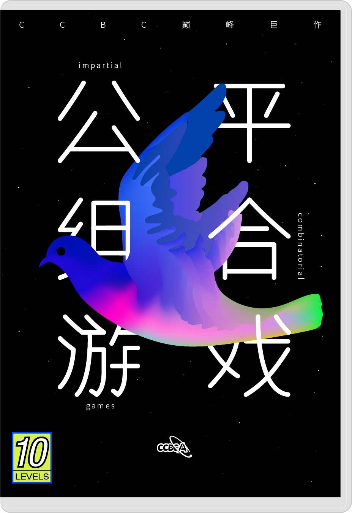

# 奇怪的游戏

## 题面

_官方存档未提供可提取的文字题面；请查看下方附件或交互源码。_

## 交互源码

### vue_template

```html
<template>
    <div class="main-puzzle-content">
        <div><i>你收到一盒奇怪的游戏。关卡之间似乎没有任何联系，但是却又隐隐约约有一些共性。</i></div>
        <div></div>
        <div id="header"><h1 v-text="header"></h1></div>
        <div v-if="curGame == -1" id="select_game" class="gamegrid-container">
            <table id="select_game_grid"><tbody>
                <tr v-for="game in gameInfo">
                    <td :class="{game_won: game.won}" @click="selectGame(game.id)">{{game.title + game.extra}}</td>
                </tr>
            </tbody></table>
        </div>
        <div v-if="curGame != -1" class="gamegrid-container">
            <div id="playground">
                <table id="game_grid"><tbody>
                    <tr v-for="row in curBoard">
                        <td v-for="cell in row" :class="{cell_zero: !cell.one, cell_one: cell.one, cell_selected: cell.selected, cell_com_selected: cell.com_selected}" @click="cell.selected = !cell.selected"></td>
                    </tr>
                </tbody></table>
            </div>
            <div id="command" v-if="curGame!=-1">
                <button class="btn btn-primary" @click="selectGameScreen()">返回</button>
                <button class="btn btn-primary" @click="restartGame()">重新开始</button>
                <button class="btn btn-primary" @click="clearSelection()">清空选择</button>
                <button class="btn btn-primary" @click="suggestMove()">随机选择</button>
                <button class="btn btn-primary" @click="executeMove()">行动</button>
                <button class="btn btn-primary" @click="undoMove()">撤销</button>
            </div>
        </div>
        <div id="message_box" class="gamegrid-container">
            <div><button class="btn btn-primary" @click="clearMsgBox()">清空消息</button></div>
            <textarea rows="20" disabled v-text="message" id="textarea"></textarea>
        </div>
    </div>
</template>

<style>
.main-puzzle-content {
  display: flex;
  flex-direction: column;
  align-items: center;
}
.main-puzzle-content .gamegrid-container {
  display: flex;
  flex-direction: column;
  align-items: center;
}
#header {
  text-align: center;
}

#select_game_grid {
  table-layout: fixed;
  width: 100%;
  max-width: 500px;
  height: 500px;
  margin-top: 10px;
  margin-bottom: 10px;
}

#select_game_grid td {
  border: 3px solid #0046ff;
  text-align: center;
  cursor: pointer;
}

#select_game_grid .game_hidden {
  visibility: hidden;
}

#select_game_grid td:hover {
  background-color: #ff4c4f;
}

#select_game_grid .game_won {
  background-color: darkgreen;
}

#game_grid {
  table-layout: fixed;
  margin-top: 10px;
  margin-bottom: 10px;
  border-collapse: separate;
}

#game_grid td {
  border: 2px solid #0046ff;
  width: 50px;
  height: 50px;
  text-align: center;
  cursor: pointer;
}

#game_grid .cell_com_selected {
  border: 4px solid orange;
}

#game_grid .cell_selected {
  border: 4px solid #ff4c4f;
}

#game_grid .cell_zero {
  background-color: white;
}

#game_grid .cell_one {
  background-color: black;
}

#command {
  text-align: center;
}

#message_box {
  width: 100%;
}

.main-puzzle-content button {
  margin: 3px;
}

.main-puzzle-content textarea {
  border: 3px solid #0046ff;
  background-color: gray;
  margin: 3px;
  color: white;
  width: 100%;
  max-width: 500px;
}
</style>
```

### vue_script

```text
const { ref, onMounted } = Vue;
export default {
    setup() {
        const numGames = 10;
        const header = ref("");

        const curGame = ref(-1);

        const gameInfo = ref([]);
        for (let i = 0; i < numGames; i++) {
            const info = {
                id: i,
                won: false,
                title: "第"+(i+1)+"关",
                extra: ""
            };
            gameInfo.value.push(info);
        }

        const curGameInfo = {};

        const curBoard = ref([[]]);

        let messages = [];
        let msgId = 0;

        const message = ref("");

        const addMessage = (msgs) => {
            if (msgs == null) return;
            function addSingleMessage(msg) {
                messages.unshift(msgId.toString() + ". " + msg);
                msgId++;
                while (messages.length > 100) {
                  messages.pop();
                }
                message.value = messages.join("\n");
            };
            if ((typeof msgs) == "string") {
                addSingleMessage(msgs);
            } else {
                for (let msg of msgs) {
                    addSingleMessage(msg);
                }
            }
        }

        const archiveApiModule = import("../../../assets/archive.cipherpuzzles.com/ccbc13/scripts/CCBC-14/impartialGame20Api.js");

        const submit = async (query) => {
            const { archiveApi } = await archiveApiModule;
            let res = await archiveApi('/spfunc/impartialgame/20', query);

            let data = await res.json();
            if (data.status !== 1) {
                console.error("archive api error", data);
                return;
            }

            return data.data;
        };

        const selectGameScreen = async () => {
            let data = await submit({
                func: "getWonStatus"
            });
            curGame.value = -1;

            let wons = data.wons;
            let extras = data.extras;

            for (let i = 0; i < numGames; i++) {
                gameInfo.value[i].won = wons[i];
                gameInfo.value[i].extra = extras[i];
            }

            header.value = "选择关卡";
        };

        const buildBoard = () => {
            const nR = curGameInfo.nRow;
            const nC = curGameInfo.nCol;
            const isReverse = curGameInfo.isReverse;
            let board = [];
            for (let i = 0; i < nR; i++) {
                let row = [];
                for (let j = 0; j < nC; j++) {
                    const id = i*nC + (isReverse?(nC-1-j):j);
                    let cell = {one: false, selected: false, com_selected: false, id: id};
                    row.push(cell);
                }
                board.push(row);
            }
            curBoard.value = board;
        };

        const updateState = (state) => {
            for (let row of curBoard.value) {
                for (let cell of row) {
                    cell.one = (state>>cell.id)&1;
                }
            }
        };

        const updateMove = (move) => {
            for (let row of curBoard.value) {
                for (let cell of row) {
                    cell.selected = (move>>cell.id)&1;
                }
            }
        };

        const updateComMove = (move) => {
            for (let row of curBoard.value) {
                for (let cell of row) {
                    cell.com_selected = (move>>cell.id)&1;
                }
            }
        };

        const getMove = () => {
            let move = 0;
            for (let row of curBoard.value) {
                for (let cell of row) {
                    move |= (cell.selected<<cell.id);
                }
            }
            return move;
        };

        const selectGame = async (gameId) => {
            let data = await submit({
                func: "selectGame",
                gameId: gameId
            });

            curGame.value = gameId;
            curGameInfo.nRow = data.gameInfo.nRow;
            curGameInfo.nCol = data.gameInfo.nCol;
            curGameInfo.isReverse = data.gameInfo.isReverse;
            buildBoard();

            header.value = gameInfo.value[gameId].title;
            updateState(data.state);
            addMessage(data.message);
        };

        const restartGame = async () => {
            let data = await submit({
                func: "restartGame",
                gameId: curGame.value
            });

            updateState(data.state);
            updateMove(0);
            updateComMove(0);
            addMessage(data.message);
        };

        const clearSelection = async () => {
            updateMove(0);
            addMessage("已清空选择");
        };

        const suggestMove = async () => {
            let data = await submit({
                func: "suggestMove",
                gameId: curGame.value,
            });
            if (data.move) {
                updateMove(data.move);
            }
            addMessage(data.message);
        };

        const executeMove = async () => {
            const move = getMove();
            let data = await submit({
                func: "executeMove",
                gameId: curGame.value,
                move: move
            });

            if (data.valid) {
                updateState(data.state);
                updateMove(0);
                if (data.won) {
                    updateComMove(0);
                    gameInfo.value[curGame.value].extra = data.extra;
                } else {
                    updateComMove(data.comMove);
                }
            }
            addMessage(data.message);
        };

        const undoMove = async () => {
            let data = await submit({
                func: "undoMove",
                gameId: curGame.value
            });
            updateState(data.state);
            updateMove(0);
            updateComMove(0);
            addMessage(data.message);
        };

        const clearMsgBox = async () => {
            messages.length = 0;
            msgId = 0;
            addMessage("消息将显示在此处");
        };

        onMounted(() => {
            selectGameScreen();
            clearMsgBox();
        });

        return {
            header,
            curGame,
            gameInfo,
            curBoard,
            message,
            selectGameScreen,
            selectGame,
            restartGame,
            clearSelection,
            suggestMove,
            executeMove,
            undoMove,
            clearMsgBox
        };
    }
}
```


## 答案

`DEEP DIVING`

## 解析

# 概要

题目给出了10关，每关都是一个公平组合游戏。赢得一关后会获得一个字母。将字母连接可以得到中间答案 ```SG FUNCTION```。

搜索可以得知SG函数对于游戏的每个局面都给出一个值，定义如下：
* 考虑一个局面A的所有后继。A的SG值即为最小的非负整数x，满足x不是A的任何后继的SG值。

根据此定义，一个局面为必败局面当且仅当该局面的SG值等于0。

根据定义可以计算出一个局面的SG函数值。此外，一个非常有用的结论是 Sprague–Grundy 定理。定理的叙述如下：
* 对于两个局面A和B，定义其**和** A⊕B 为这样的一个游戏：起始局面是(A, B)，每次行动是选择其中一个局面进行行动。
* 则 A⊕B 的SG值等于A的SG值与B的SG值的异或。

利用SG定理可以大大简化部分关卡SG值的计算。

计算每关的SG函数，得到答案 ```DEEP DIVING```。

| 编号 | 规则 | 取胜策略 | 给出字母 | SG值计算方法 | SG值 | 提取 |
| --- | --- | --- | --- | --- | --- | --- |
| 1 | 翻一行内的若干格，最左格必须为黑 | 保持每列有偶数个黑格 | S | 取所有行的异或 | 4 | D |
| 2 | 翻同一行或同一列的两格，右或下的格子必须为黑 | 根据SG函数行动 | G | 取所有坐标的异或 | 5 | E |
| 3 | 翻长方形的四个顶点，右下格必须为黑 | 根据SG函数行动 | F | 查表或直接计算 | 5 | E |
| 4 | 翻一行内的若干黑格，或在两行翻同样数量的黑格；每行内必须从右向左翻 | 尝试或查表 | U | 查表或直接计算 | 16 | P |
| 5 | 翻一黑格或相邻的两黑格 | 第一步取中心格，然后对称操作 | N | 查表或直接计算 | 4 | D |
| 6 | 翻一黑格以及位于其右下（包括同行以及同列）的所有黑格 | “偷策略” | C | 编程 | 9 | I |
| 7 | 二进制，每次减1到26 | 计算或“偷策略” | T | 模27 | 22 | V |
| 8 | 翻马步相邻的两白格 | 尝试或编程 | I | 编程 | 9 | I |
| 9 | 翻三格，最右格必须为黑 | 根据SG函数行动 | O | 查表或直接计算 | 14 | N |
| 10 | 翻一个不与黑格邻接的白格 | 尝试或编程 | N | 编程 | 7 | G |

注意表格里的取胜策略以及SG值计算方法仅为推荐方法，实际上通过编程可以轻易得到所有的获胜策略以及计算出SG值。

# 关卡
## 第1关
将每行转成二进制后，实际上是标准nim游戏。一个简单的获胜策略是保持每列有偶数个黑格。SG值计算方法为计算所有数的异或。

## 第2关
经过变换后等价于标准nim：将每个黑格变为两堆石子，数量分别是该格上方的格子数量以及左边的格子数量。SG值计算方法为计算所有数的异或。

## 第3关
此游戏是nim积的定义。可以查询nim积乘法表。

## 第4关
此游戏被称为威佐夫游戏 (Wythoff's game)。其必胜策略与黄金分割有关。SG值可以在 [oeis](https://oeis.org/A004481) 查到。

## 第5关
此游戏被称为 Kayles（又称 octal game 0.77）。

由于初始局面所有格子都是黑的，一个简单的获胜策略是第一步取中心格，之后的步骤对称操作。

SG值可以在 [oeis](https://oeis.org/A002186) 查到。

## 第6关
此游戏被称为 Chomp。一个简单的获胜策略是“偷策略”：随便翻右下角的一格，如果电脑下一步的操作在此格左上角，那么可以撤回，然后进行电脑选择的行动。

SG值的计算需要根据定义编程计算。

## 第7关
转为二进制后，每一步可以减1到26。必败局面为27的倍数，SG值即为局面对应的数模27。可以根据此结论计算行动，也可以“偷策略”。

## 第8关
每步翻马步相邻的两白格。本关不编程很难取胜。预期的获胜策略以及SG值计算方法均为编程。

## 第9关
此游戏被称为 Triplets。SG值可以利用SG定理进行编程计算。

## 第10关
翻一个不与黑格邻接的白格。经过一些尝试后可以获胜（难度比第8关稍低）。预期的SG值计算方法为编程。

## 提示

### 1. 我毫无头绪

每一关都是一个不同的组合游戏，通过点击若干个方格翻转它们的颜色，目标是让对方没有合法的操作。每个游戏里合法的操作可以通过尝试或者多次点击“随机选择”而推理得出。

### 2. 我得到了中间答案，该如何提取

你需要计算每个游戏初始局面的SG函数值。
关于SG函数的定义和计算，请参考 [链接](https://oi-wiki.org/math/game-theory/impartial-game/)。有些值可能需要编程计算。此外，SG定理会大大简化某些关卡的SG函数的计算。

### 3. 每个游戏的规则是什么？

共通规则：按照指定规则行动，当一方没有合法行动时游戏结束。以下为每个游戏的具体规则。

| 编号 | 规则 |
| --- | --- | 
| 1 | 翻一行内的若干格，最左格必须为黑 |
| 2 | 翻同一行或同一列的两格，右或下的格子必须为黑 |
| 3 | 翻长方形的四个顶点，右下格必须为黑 |
| 4 | 翻一行内的若干黑格，或在两行翻同样数量的黑格；每行内必须从右向左翻 |
| 5 | 翻一黑格或相邻的两黑格 | 第一步取中心格，然后对称操作 |
| 6 | 翻一黑格以及位于其右下（包括同行以及同列）的所有黑格 |
| 7 | 二进制，每次减1到26 |
| 8 | 翻马步相邻的两白格 |
| 9 | 翻三格，最右格必须为黑 |
| 10 | 翻一个不与黑格邻接的白格 |


## 中间答案

| 提交 | 回复 | 附加信息 |
| --- | --- | --- |
| SGFUNCTION | 这是本题的中间答案。 |  |

## 本地附件

- [cb5f206b1256406b98e51766e3c308ff.webp](../../../assets/archive.cipherpuzzles.com/ccbc13/images/CCBC-14/cb5f206b1256406b98e51766e3c308ff.webp)
- [impartialGame20Api.js](../../../assets/archive.cipherpuzzles.com/ccbc13/scripts/CCBC-14/impartialGame20Api.js)

来源：[https://archive.cipherpuzzles.com/ccbc13/problems/CCBC-14/20.yaml](https://archive.cipherpuzzles.com/ccbc13/problems/CCBC-14/20.yaml)
