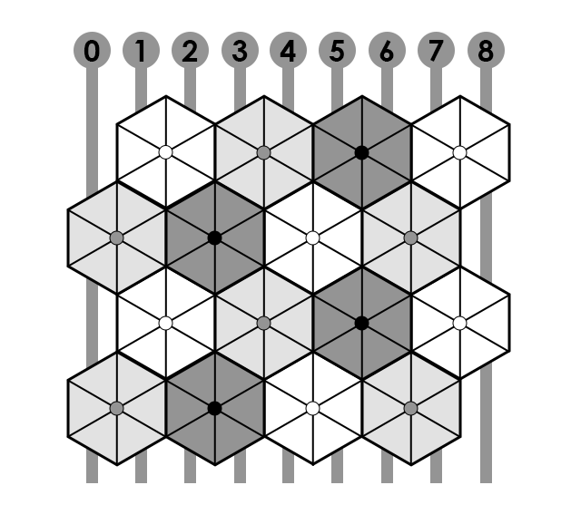

# 六角花园

## 题面

<a href="https://docs.qq.com/sheet/DVnl0Z0xOdXJXWWVx?tab=BB08J2" target="_blank">腾讯文档</a>

 

花园里花的单词都是六字母，填入方式可以是顺时针也可以是逆时针。

注意英文填词题目要求答案和提示词性一致，例如 "lion or tiger" 可以对应 animal 但是不可以对应 animals，"had discussions" 可以对应 talked 但是不可以对应 talk/talks/talking。

<table id="garden_clues"><tr><td><b>Columns</b></td><td></td></tr>
<tr><td>0 and 8</td><td>What to extract from hexagon clues</td></tr>
<tr><td>1</td><td>A given name or a dagger / first man / olive products</td></tr>
<tr><td>2</td><td>Crouches down / bring in</td></tr>
<tr><td>3</td><td>Styles or directions / less hot</td></tr>
<tr><td>4</td><td>Saw visions</td></tr>
<tr><td>5</td><td>Looked happy / speaker</td></tr>
<tr><td>6</td><td>McDonald's first name / protect</td></tr>
<tr><td>7</td><td>Christmas trees / warms up / Plural form of "is"</td></tr>
<tr><td><b>白花</b></td><td></td></tr>
<tr><td></td><td>Chose the best items and excluded others from group</td></tr>
<tr><td></td><td>Region or field</td></tr>
<tr><td></td><td>Decayed or worsened</td></tr>
<tr><td></td><td>Tyrannic octopus-like dictator from My Little Pony</td></tr>
<tr><td></td><td>Type of ancient coin used in Greece</td></tr>
<tr><td></td><td>Item of very little value</td></tr>
<tr><td><b>灰花</b></td><td></td></tr>
<tr><td></td><td>Climb up on a slope</td></tr>
<tr><td></td><td>Stricken, scolded</td></tr>
<tr><td></td><td>Bottle sizes</td></tr>
<tr><td></td><td>Edged toward</td></tr>
<tr><td></td><td>Actress for Katara in movie The Last Airbender</td></tr>
<tr><td></td><td>Old German silver coin</td></tr>
<tr><td><b>黑花</b></td><td></td></tr>
<tr><td></td><td>Type of headwear named after a French play</td></tr>
<tr><td></td><td>Children of age seventeen or younger</td></tr>
<tr><td></td><td>To decrease the amount</td></tr>
<tr><td></td><td>Is upright (not sitting)</td></tr>
</table>

(3 3 3 2 5) -> 7

## 答案

`SAILORS`

## 解析

这是英文hunt中常见的Rows Garden题型（当然本题做了个转置变成了Columns），其中花对应的6字母词可以按任意方向任意起点填入。

解出完整的填词列表为：

<table id="garden_clues"><tr><td><b>Columns</b></td><td></td></tr>
<tr><td style="color:orange;">CENTER LETTER</td><td>What to extract from hexagon clues</td></tr>
<tr><td>KRIS / ADAM / OILS</td><td>A given name or a dagger / first man / olive products</td></tr>
<tr><td>SQUATS / INDUCE</td><td>Crouches down / bring in</td></tr>
<tr><td>TRENDS / COLDER</td><td>Styles or directions / less hot</td></tr>
<tr><td>HALLUCINATED</td><td>Saw visions</td></tr>
<tr><td>SMILED / ROTTED</td><td>Looked happy / speaker</td></tr>
<tr><td>RONALD / DEFEND</td><td>McDonald's first name / protect</td></tr>
<tr><td>FIRS / HEATS / ARE</td><td>Christmas trees / warms up / Plural form of "is"</td></tr>
<tr><td><b>白花</b></td><td></td></tr>
<tr><td>CULLED</td><td>Chose the best items and excluded others from group</td></tr>
<tr><td>DOMAIN</td><td>Region or field</td></tr>
<tr><td>ROTTED</td><td>Decayed or worsened</td></tr>
<tr><td>SQUIRK</td><td>Tyrannic octopus-like dictator from My Little Pony</td></tr>
<tr><td>STATER</td><td>Type of ancient coin used in Greece</td></tr>
<tr><td>TRIFLE</td><td>Item of very little value</td></tr>
<tr><td><b>灰花</b></td><td></td></tr>
<tr><td>ASCEND</td><td>Climb up on a slope</td></tr>
<tr><td>LASHED</td><td>Stricken, scolded</td></tr>
<tr><td>LITERS</td><td>Bottle sizes</td></tr>
<tr><td>NEARED</td><td>Edged toward</td></tr>
<tr><td>NICOLA</td><td>Actress for Katara in movie The Last Airbender</td></tr>
<tr><td>THALER</td><td>Old German silver coin</td></tr>
<tr><td><b>黑花</b></td><td></td></tr>
<tr><td>FEDORA</td><td>Type of headwear named after a French play</td></tr>
<tr><td>MINORS</td><td>Children of age seventeen or younger</td></tr>
<tr><td>REDUCE</td><td>To decrease the amount</td></tr>
<tr><td>STANDS</td><td>Is upright (not sitting)</td></tr>
</table>

其中0 8两列的答案提示去看花朵线索的中间字母。观察发现花朵线索均为奇数个字母，于是提出相应的中间字母得到``XOR COL ONE TO SEVEN``。按这个提示将1-7列每一列的字母进行异或操作（按A1Z26或按ASCII异或均可，结果一致）得到最终答案``SAILORS``。

## 提示

### 1. 能给我所有白花的对应答案吗？

分别是 `CULLED`, `DOMAIN`, `ROTTED`, `SQUIRK`, `STATER`, `TRIFLE`.

### 2. 能给我所有灰花的对应答案吗？

分别是 `ASCEND`, `LASHED`, `LITERS`, `NEARED`, `NICOLA`, `THALER`.

### 3. 能给我所有黑花的对应答案吗？

分别是 `FEDORA`, `MINORS`, `REDUCE`, `STANDS`.

### 4. 得到中间答案后怎么做？

观察每个花朵线索（不是答案）的字母数，按题面里的顺序提取新的信息。

然后通过这个信息，将每一列的答案字母转成二进制（可以先按照 A=1 Z=26 转十进制再转二进制），然后对这12个二进制进行某种操作，再转回字母。每列一个字母，7列连起来是一个7字母的单词，即答案。

## 中间答案

| 提交 | 回复 | 附加信息 |
| --- | --- | --- |
| XOR COL ONE TO SEVEN | 步骤正确，你离最终答案只有一步之遥了！ |  |
| CENTER LETTER | 这是本题的一个中间答案 |  |

## 本地附件

- [c3a47b6a92ba4905af1cf7cc3b83e1e9.webp](../../../assets/archive.cipherpuzzles.com/ccbc13/images/CCBC-14/c3a47b6a92ba4905af1cf7cc3b83e1e9.webp)

来源：[https://archive.cipherpuzzles.com/ccbc13/problems/CCBC-14/21.yaml](https://archive.cipherpuzzles.com/ccbc13/problems/CCBC-14/21.yaml)
