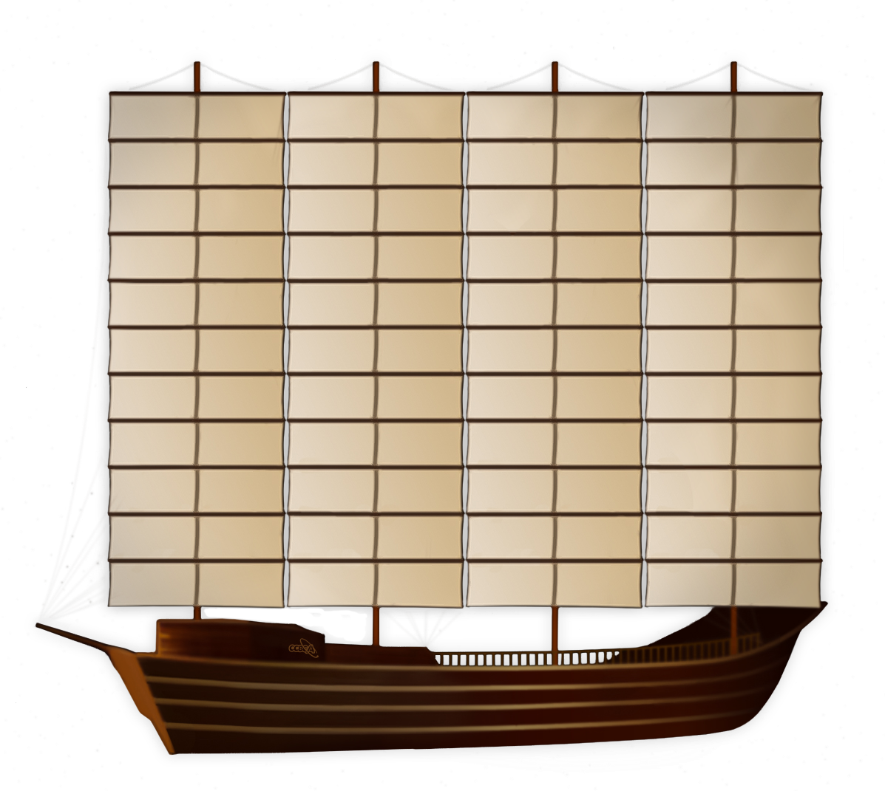
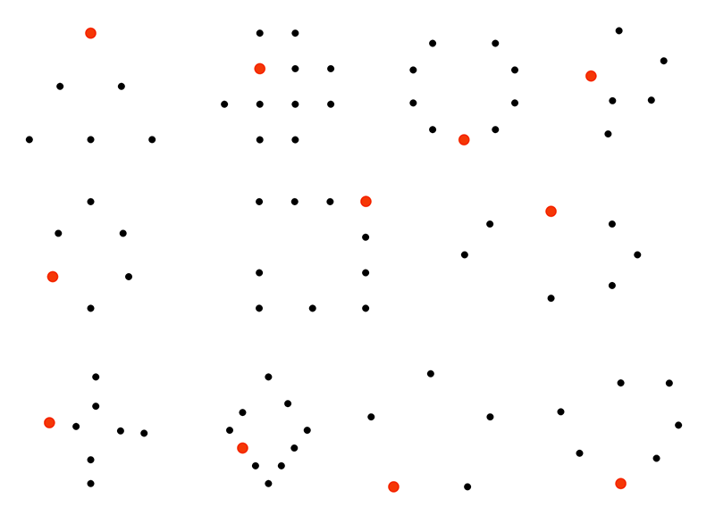
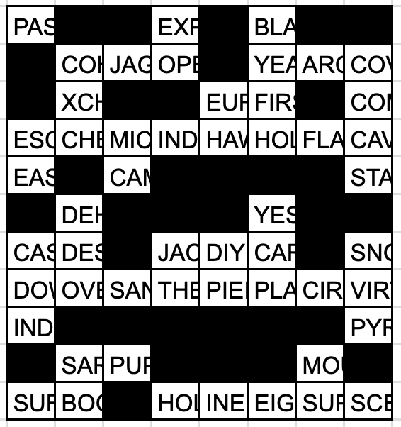

# 元宇宙

## 题面

_官方存档未提供可提取的文字题面；请查看下方附件或交互源码。_

## 交互源码

### vue_template

```html
<template>
    <div>
		我们的征途是星辰大海！
        <div style="position:relative;margin-bottom:20px;width:1197px;height:1071px">
			
            <svg width="1197" height="1071" style="position: absolute; left:0">
                <rect class="link"  @click="nowShowPage = 1" :class="{selectedPage: nowShowPage == 1}" x="149" y="128" width="116" height="695" />
                <rect class="link"  @click="nowShowPage = 2" :class="{selectedPage: nowShowPage == 2}" x="268" y="128" width="115" height="695" />
                <rect class="link"  @click="nowShowPage = 3" :class="{selectedPage: nowShowPage == 3}" x="390" y="128" width="117" height="695" />
                <rect class="link"  @click="nowShowPage = 4" :class="{selectedPage: nowShowPage == 4}" x="510" y="128" width="115" height="695" />
                <rect class="link"  @click="nowShowPage = 5" :class="{selectedPage: nowShowPage == 5}" x="632" y="128" width="117" height="695" />
                <rect class="link"  @click="nowShowPage = 6" :class="{selectedPage: nowShowPage == 6}" x="752" y="128" width="115" height="695" />
                <rect class="link"  @click="nowShowPage = 7" :class="{selectedPage: nowShowPage == 7}" x="874" y="128" width="117" height="695" />
                <rect class="link"  @click="nowShowPage = 8" :class="{selectedPage: nowShowPage == 8}" x="994" y="128" width="115" height="695" />
            </svg>
        </div>
		<div style="padding-bottom:30px">
			<!--本题需要用到<a href="https://puzzle.cipherpuzzles.com/detail/9">《宇宙航线》</a>里填入的答案。-->
			每解出一列帆布的题目后，把用到的11个小题答案按照用的顺序从上到下填入帆布，然后再根据你得到的八个答案进行下一步操作。
		</div>
        <div v-if="nowShowPage == 1">
            <p></p>
            <p>7 4 -> <span class="text-warning">9</span></p>
        </div>
        <div v-if="nowShowPage == 2">
            <table class="problem2">
				<tr>
					<td style="background-color: hsl(0, 150%, 80%)"></td><td rowspan="2" style="background-color: hsl(32, 150%, 80%)"></td><td></td><td></td><td></td><td></td><td></td><td></td><td></td><td></td><td></td>
				</tr>
				<tr>
					<td></td><td rowspan="2" style="background-color: hsl(65, 150%, 80%)"></td><td></td><td></td><td></td><td></td><td></td><td></td><td></td><td></td>
				</tr>
				<tr>
					<td></td><td></td><td rowspan="2" style="background-color: hsl(98, 150%, 80%)"></td><td></td><td></td><td></td><td></td><td></td><td></td><td></td>
				</tr>
				<tr>
					<td></td><td></td><td></td><td rowspan="2" style="background-color: hsl(131, 150%, 80%)"></td><td></td><td></td><td></td><td></td><td></td><td></td>
				</tr>
				<tr>
					<td></td><td></td><td></td><td></td><td rowspan="2" style="background-color: hsl(164, 150%, 80%)"></td><td></td><td></td><td></td><td></td><td></td>
				</tr>
				<tr>
					<td></td><td></td><td></td><td></td><td></td><td rowspan="2" style="background-color: hsl(196, 150%, 80%)"></td><td></td><td></td><td></td><td></td>
				</tr>
				<tr>
					<td></td><td></td><td></td><td></td><td></td><td></td><td rowspan="2" style="background-color: hsl(229, 150%, 80%)"></td><td></td><td></td><td></td>
				</tr>
				<tr>
					<td></td><td></td><td></td><td></td><td></td><td></td><td></td><td rowspan="2" style="background-color: hsl(262, 150%, 80%)"></td><td></td><td></td>
				</tr>
				<tr>
					<td></td><td></td><td></td><td></td><td></td><td></td><td></td><td></td><td rowspan="2" style="background-color: hsl(295, 150%, 80%)"></td><td></td>
				</tr>
				<tr>
					<td></td><td></td><td></td><td></td><td></td><td></td><td></td><td></td><td></td><td rowspan="2" style="background-color: hsl(327, 150%, 80%)"></td>
				</tr>
				<tr>
					<td style="background-color: hsl(0, 150%, 80%)"></td><td></td><td></td><td></td><td></td><td></td><td></td><td></td><td></td><td></td>
				</tr>
			</table>
		<div style="padding-top: 20px">4'1 6 -> <span class="text-warning">2</span></div>
        </div>
        <div v-if="nowShowPage == 3">
<pre style="font-size:24px">
  ___<span class='problem4a'>g</span>__n             3/6
_____<span class='problem4a'>r</span>                3/4
   _____a_            6/9
        m___          2/8
     ___e_            7/7
        s_______      1/5
    _<span class='problem4a'>o</span>____            3/5
____ ____             2/10
_________             4/4
   _<span class='problem4a'>up</span>__              2/6
_______ ___           10/10</pre>
	(5 3 3) -> <span class="text-warning">9</span>
		</div>
        <div v-if="nowShowPage == 4">
			<div class='problem3line'>
				<div class='problem3 problem3x'></div>
				<div class='problem3 problem3x'></div>
				<div class='problem3 problem3x'></div>
				<div class='problem3 problem3x'></div>
				<div class='problem3 problem3x'></div>
				<div class='problem3 problem3y'></div>
				<div class='problem3 problem3y'></div>
				<div class='problem3 problem3x'></div>
				<div class='problem3 problem3y'></div>
				<div class='problem3 problem3y'></div>
				<div class='problem3 problem3x'></div>
				<div class='problem3 problem3x'></div>
			</div>
			<div class='problem3line'>
				<div class='problem3 problem3x'></div>
				<div class='problem3 problem3x'></div>
				<div class='problem3 problem3x'></div>
				<div class='problem3 problem3x'></div>
				<div class='problem3 problem3y'></div>
				<div class='problem3 problem3x'></div>
				<div class='problem3 problem3x'></div>
				<div class='problem3 problem3x'></div>
				<div class='problem3 problem3y'></div>
				<div class='problem3 problem3x'></div>
				<div class='problem3 problem3x'></div>
				<div class='problem3 problem3y'></div>
			</div>
			<div class='problem3line'>
				<div class='problem3 problem3x'></div>
				<div class='problem3 problem3x'></div>
				<div class='problem3 problem3x'></div>
				<div class='problem3 problem3x'></div>
				<div class='problem3 problem3x'></div>
				<div class='problem3 problem3x'></div>
				<div class='problem3 problem3y'></div>
				<div class='problem3 problem3x'></div>
				<div class='problem3 problem3x'></div>
				<div class='problem3 problem3x'></div>
				<div class='problem3 problem3x'></div>
			</div>
			<div class='problem3line'>
				<div class='problem3 problem3y'></div>
				<div class='problem3 problem3x'></div>
				<div class='problem3 problem3x'></div>
				<div class='problem3 problem3y'></div>
				<div class='problem3 problem3y'></div>
				<div class='problem3 problem3y'></div>
				<div class='problem3 problem3x'></div>
				<div class='problem3 problem3x'></div>
				<div class='problem3 problem3x'></div>
				<div class='problem3 problem3x'></div>
				<div class='problem3 problem3y'></div>
				<div class='problem3 problem3x'></div>
				<div class='problem3 problem3x'></div>
			</div>
			<div class='problem3line'>
				<div class='problem3 problem3y'></div>
				<div class='problem3 problem3x'></div>
				<div class='problem3 problem3x'></div>
				<div class='problem3 problem3x'></div>
				<div class='problem3 problem3x'></div>
				<div class='problem3 problem3y'></div>
				<div class='problem3 problem3y'></div>
				<div class='problem3 problem3x'></div>
				<div class='problem3 problem3x'></div>
				<div class='problem3 problem3y'></div>
				<div class='problem3 problem3y'></div>
				<div class='problem3 problem3x'></div>
			</div>
			<div class='problem3line'>
				<div class='problem3 problem3y'></div>
				<div class='problem3 problem3x'></div>
				<div class='problem3 problem3x'></div>
				<div class='problem3 problem3y'></div>
				<div class='problem3 problem3x'></div>
				<div class='problem3 problem3x'></div>
				<div class='problem3 problem3x'></div>
				<div class='problem3 problem3x'></div>
				<div class='problem3 problem3y'></div>
				<div class='problem3 problem3y'></div>
				<div class='problem3 problem3x'></div>
				<div class='problem3 problem3x'></div>
				<div class='problem3 problem3x'></div>
				<div class='problem3 problem3x'></div>
				<div class='problem3 problem3x'></div>
				<div class='problem3 problem3y'></div>
				<div class='problem3 problem3x'></div>
				<div class='problem3 problem3x'></div>
				<div class='problem3 problem3x'></div>
			</div>
			<div class='problem3line'>
				<div class='problem3 problem3y'></div>
				<div class='problem3 problem3x'></div>
				<div class='problem3 problem3x'></div>
				<div class='problem3 problem3x'></div>
				<div class='problem3 problem3x'></div>
				<div class='problem3 problem3x'></div>
				<div class='problem3 problem3x'></div>
				<div class='problem3 problem3x'></div>
				<div class='problem3 problem3x'></div>
				<div class='problem3 problem3y'></div>
				<div class='problem3 problem3x'></div>
				<div class='problem3 problem3x'></div>
				<div class='problem3 problem3x'></div>
			</div>
			<div class='problem3line'>
				<div class='problem3 problem3y'></div>
				<div class='problem3 problem3x'></div>
				<div class='problem3 problem3x'></div>
				<div class='problem3 problem3x'></div>
				<div class='problem3 problem3y'></div>
				<div class='problem3 problem3x'></div>
				<div class='problem3 problem3x'></div>
				<div class='problem3 problem3x'></div>
				<div class='problem3 problem3x'></div>
				<div class='problem3 problem3x'></div>
				<div class='problem3 problem3x'></div>
				<div class='problem3 problem3x'></div>
				<div class='problem3 problem3x'></div>
			</div>
			<div class='problem3line'>
				<div class='problem3 problem3x'></div>
				<div class='problem3 problem3x'></div>
				<div class='problem3 problem3y'></div>
				<div class='problem3 problem3y'></div>
				<div class='problem3 problem3y'></div>
				<div class='problem3 problem3x'></div>
				<div class='problem3 problem3x'></div>
				<div class='problem3 problem3x'></div>
				<div class='problem3 problem3x'></div>
				<div class='problem3 problem3x'></div>
				<div class='problem3 problem3x'></div>
				<div class='problem3 problem3y'></div>
				<div class='problem3 problem3x'></div>
				<div class='problem3 problem3x'></div>
			</div>
			<div class='problem3line'>
				<div class='problem3 problem3x'></div>
				<div class='problem3 problem3x'></div>
				<div class='problem3 problem3y'></div>
				<div class='problem3 problem3x'></div>
				<div class='problem3 problem3x'></div>
				<div class='problem3 problem3x'></div>
			</div>
			<div class='problem3line'>
				<div class='problem3 problem3x'></div>
				<div class='problem3 problem3x'></div>
				<div class='problem3 problem3x'></div>
				<div class='problem3 problem3x'></div>
				<div class='problem3 problem3y'></div>
				<div class='problem3 problem3x'></div>
				<div class='problem3 problem3y'></div>
				<div class='problem3 problem3x'></div>
				<div class='problem3 problem3y'></div>
				<div class='problem3 problem3y'></div>
				<div class='problem3 problem3x'></div>
			</div>
			<p style="clear:both; padding: 20px 0">（本部分建议用小写字母）</p>
			<p>3 3 2 3 -> <span class="text-warning">2</span></p>
		</div>
        <div v-if="nowShowPage == 5">
			<p>Between the eyes...</p>
	<pre> 1. A
 2. R
 3. E
 4. H
 5. T
 6. M
 7. D
 8. P
 9. K
10. S
11. I</pre>
<p>3 2 6 -> <span class="text-warning">6</span></p>
		</div>
        <div v-if="nowShowPage == 6">
			<ol>
				<li>烤馅饼的儿歌</li>
				<li>哈利波特结局</li>
				<li>现在</li>
				<li>高尔夫</li>
				<li>大约27格令</li>
				<li>猜心游戏</li>
				<li>甲烷</li>
				<li>魁地奇</li>
				<li>奔驰OM617</li>
				<li>犹太教</li>
				<li>反乌托邦</li>
			</ol>
			<p>1 10 -> <span class="text-warning">2</span> or <span class="text-warning">6-3</span></p>
		</div>
        <div v-if="nowShowPage == 7">
			<table id="problem7">
				<tr><td style='color:#c0c0c0'>3</td><td>大约5～6元/克</td></tr>
				<tr><td style='color:#ee82ee'>3</td><td>加拿大作曲家</td></tr>
				<tr><td style='color:#808080'>5</td><td>Photoshop 模式</td></tr>
				<tr><td style='color:#ffc0cb'>8</td><td>电影</td></tr>
				<tr><td style='color:#fffafa'>6</td><td>操作系统代号</td></tr>
				<tr><td style='color:#ffa500'>1</td><td>曾经的国家</td></tr>
				<tr><td style='color:#0000ff'>3</td><td>电脑故障</td></tr>
				<tr><td style='color:#ff0000'>2</td><td>福尔摩斯案件</td></tr>
				<tr><td style='color:#000080'>7</td><td>船长</td></tr>
				<tr><td style='color:#ffff00'>6</td><td>自然景区</td></tr>
				<tr><td style='color:#ffffff'>9</td><td>种族主义</td></tr>
			</table>
			<p><span class="text-warning">?????</span> 3 2 6</p>
		</div>
        <div v-if="nowShowPage == 8">
			<p>不得不说这题有点多余……</p>
			<ol>
				<li>ONE GAME</li>
				<li>CONVERT</li>
				<li>COSMIC</li>
				<li>CREW VAN</li>
				<li>DISMUTASE</li>
				<li>TEXTERS</li>
				<li>SENSOR</li>
				<li>ILUVATAR</li>
				<li>EXPIRY</li>
				<li>CRANIAL</li>
				<li>RESPECTS</li>
			</ol>
			<p>6 5 -> <span class="text-warning">5</span></p>
		</div>
		<hr>
		<div style="margin-top: 30px">
			<p>归档说明：本题是一道 meta-matching 题，用到的小题答案来自参赛者在宇宙航线内填入的88个答案。</p>
		</div>
    </div>
</template>

<style>
    .problem2 {
		border-collapse: collapse;
	}
	.problem2 td {
		border: 1px solid #ccc;
		width: 50px;
		height: 50px;
		text-align: center;
		font-size: 30px;
		color: green;
	}
	.problem4a {
		color: red;
	}
	.problem3line {
		padding: 20px 0;
		clear: both;
	}
	.problem3 {
		width: 50px;
		height: 50px;
		float: left;
		border: 1px solid #ccc;
	}
	.problem3x {
		font-size: 30px;
		text-align:center;
		background-color: #555;
	}
	.problem3y {
		font-size: 30px;
		text-align:center;
		background-color: #585;
	}
	#problem7 tr td:nth-child(odd) {
		font-size: 48px;
		width: 50px;
	}

	.link {
        cursor: pointer;
        fill:rgba(0,0,0, 0);
    }
    .link:hover {
        fill: rgba(255,255,180,0.3);
    }
    rect.selectedPage {
        fill:rgba(255,160,0, 0.3);
    }
	</style>
```

### vue_script

```text
const { ref, reactive, computed, inject } = Vue; //由于网页中无法import，Vue所有组件都已预先导出至Vue对象中。

const sourceData = JSON.parse(`[{"i":"1","x":"1321","y":"67","h":[3,4,8],"w":[11]},{"i":"2","x":"3417","y":"80","h":[1,2,3],"w":[7]},{"i":"3","x":"2592","y":"142","h":[0,1,2],"w":[5]},{"i":"4","x":"3713","y":"300","h":[0,1,2],"w":[7]},{"i":"5","x":"1338","y":"330","h":[0,1,2],"w":[4]},{"i":"6","x":"1880","y":"400","h":[1,5,6],"w":[9]},{"i":"7","x":"163","y":"455","h":[1,2,3],"w":[9]},{"i":"8","x":"392","y":"534","h":[0,1,11],"w":[8,6]},{"i":"9","x":"792","y":"600","h":[1,3,5],"w":[7]},{"i":"10","x":"142","y":"796","h":[0,1,3],"w":[7]},{"i":"11","x":"555","y":"667","h":[0,4,6],"w":[7]},{"i":"12","x":"763","y":"767","h":[0,3,4],"w":[7]},{"i":"13","x":"463","y":"834","h":[2,6,11],"w":[13]},{"i":"14","x":"188","y":"917","h":[1,10,11],"w":[3,2,2,9]},{"i":"15","x":"617","y":"992","h":[1,3,9],"w":[11]},{"i":"16","x":"1042","y":"675","h":[3,4,5],"w":[6]},{"i":"17","x":"1371","y":"530","h":[0,1,2],"w":[11]},{"i":"18","x":"1284","y":"655","h":[0,2,3],"w":[6]},{"i":"19","x":"1750","y":"559","h":[0,2,5],"w":[6]},{"i":"20","x":"1325","y":"880","h":[2,4,5],"w":[6]},{"i":"21","x":"1734","y":"755","h":[2,5,6],"w":[1,10]},{"i":"22","x":"2205","y":"625","h":[1,3,4],"w":[9]},{"i":"23","x":"2501","y":"492","h":[2,3,8],"w":[4,7]},{"i":"24","x":"2184","y":"838","h":[2,3,8],"w":[10]},{"i":"25","x":"184","y":"1034","h":[1,3,11],"w":[7,6]},{"i":"26","x":"34","y":"1359","h":[0,9,15],"w":[10,2,5]},{"i":"27","x":"88","y":"1521","h":[8,9,11],"w":[4,2,6]},{"i":"28","x":"38","y":"1730","h":[0,5,16],"w":[3,4,2,3,7]},{"i":"29","x":"455","y":"1234","h":[2,3,4],"w":[6]},{"i":"30","x":"484","y":"1409","h":[0,1,2],"w":[4]},{"i":"31","x":"238","y":"1625","h":[4,11,12],"w":[6,6]},{"i":"32","x":"755","y":"1300","h":[0,4,5],"w":[8]},{"i":"33","x":"659","y":"1580","h":[0,2,4],"w":[3,9]},{"i":"34","x":"650","y":"1684","h":[2,7,10],"w":[12]},{"i":"35","x":"750","y":"1121","h":[3,6,9],"w":[5,7]},{"i":"36","x":"767","y":"1463","h":[7,8,9],"w":[12]},{"i":"37","x":"967","y":"1617","h":[2,3,7],"w":[5,5]},{"i":"38","x":"1280","y":"1605","h":[1,2,3],"w":[5]},{"i":"39","x":"1171","y":"1734","h":[5,6,8],"w":[10]},{"i":"40","x":"1275","y":"1834","h":[1,5,10],"w":[11]},{"i":"41","x":"1509","y":"1738","h":[0,1,2],"w":[6]},{"i":"42","x":"1400","y":"1484","h":[1,5,6],"w":[4,2]},{"i":"43","x":"1342","y":"1134","h":[3,4,7],"w":[10]},{"i":"44","x":"1592","y":"1088","h":[8,13,14],"w":[7,2,5]},{"i":"45","x":"1792","y":"1521","h":[1,3,5],"w":[6]},{"i":"46","x":"1963","y":"1625","h":[0,3,9],"w":[11]},{"i":"47","x":"1800","y":"1775","h":[0,2,8],"w":[9]},{"i":"48","x":"1984","y":"1921","h":[7,8,11],"w":[5,6]},{"i":"49","x":"2188","y":"1825","h":[0,1,5],"w":[7]},{"i":"50","x":"2213","y":"988","h":[0,1,2],"w":[6]},{"i":"51","x":"2046","y":"1113","h":[0,1,4],"w":[5]},{"i":"52","x":"1780","y":"1184","h":[0,4,9],"w":[11]},{"i":"53","x":"2142","y":"1375","h":[2,5,7],"w":[11]},{"i":"54","x":"2446","y":"1392","h":[0,1,4],"w":[5]},{"i":"55","x":"2334","y":"1542","h":[1,2,4],"w":[11]},{"i":"56","x":"2446","y":"1675","h":[0,1,2],"w":[6]},{"i":"57","x":"2496","y":"1780","h":[4,8,15],"w":[10,5]},{"i":"58","x":"2680","y":"934","h":[0,2,3],"w":[5]},{"i":"59","x":"2755","y":"1059","h":[0,1,2],"w":[6]},{"i":"60","x":"2946","y":"963","h":[1,3,7],"w":[11]},{"i":"61","x":"2751","y":"1250","h":[0,2,4],"w":[9]},{"i":"62","x":"3092","y":"1171","h":[0,1,3],"w":[7]},{"i":"63","x":"2634","y":"1392","h":[0,1,2],"w":[5]},{"i":"64","x":"2913","y":"1405","h":[0,2,7],"w":[9]},{"i":"65","x":"3196","y":"1255","h":[1,2,3],"w":[9]},{"i":"66","x":"3146","y":"1463","h":[1,2,4],"w":[5]},{"i":"67","x":"3005","y":"1588","h":[0,2,3],"w":[5]},{"i":"68","x":"2988","y":"1696","h":[0,1,6],"w":[8]},{"i":"69","x":"2909","y":"1859","h":[2,8,9],"w":[11]},{"i":"70","x":"3292","y":"509","h":[3,4,5],"w":[11]},{"i":"71","x":"3663","y":"633","h":[7,8,12],"w":[3,11]},{"i":"72","x":"3763","y":"538","h":[1,2,3],"w":[4,4]},{"i":"73","x":"3521","y":"721","h":[0,4,7],"w":[9]},{"i":"74","x":"3126","y":"775","h":[1,2,5],"w":[8]},{"i":"75","x":"3796","y":"909","h":[0,2,3],"w":[6]},{"i":"76","x":"3713","y":"1130","h":[0,3,5],"w":[6]},{"i":"77","x":"3396","y":"1367","h":[7,8,10],"w":[6,4]},{"i":"78","x":"3776","y":"1300","h":[0,1,10],"w":[7,3]},{"i":"79","x":"3271","y":"1567","h":[1,2,7],"w":[10]},{"i":"80","x":"3696","y":"1488","h":[0,8,9],"w":[3,2,3,3]},{"i":"81","x":"3417","y":"1805","h":[5,9,12],"w":[4,5,4]},{"i":"82","x":"3255","y":"1692","h":[1,2,6],"w":[4,5]},{"i":"83","x":"1105","y":"1371","h":[6,7,8],"w":[3,10]},{"i":"84","x":"2934","y":"559","h":[1,3,5],"w":[6]},{"i":"85","x":"2488","y":"792","h":[2,4,10],"w":[6,5,8]},{"i":"86","x":"2746","y":"763","h":[0,1,4],"w":[6]},{"i":"87","x":"2267","y":"1221","h":[2,3,6],"w":[11]},{"i":"88","x":"1005","y":"988","h":[0,1,11],"w":[7,5]}]`);
let sourceDict = {};

for (let sd of sourceData) {
    sourceDict[sd.i] = {
        h: sd.h,
        w: sd.w
    }
}

export default {
    setup() {
        const PUZZLE_KEY = "spaceroute";
        const ySync = inject("ysync");
        const nowShowPage = ref(1);

        //数据源
        const d = reactive({
            text: [...new Array(sourceData.length + 1)].map(i => ""),
        });

        const data = computed(() => {
            let tempd = d.text.map((word, i) => {
                let c = sourceDict[i];
                if (!c) return {a: "", b: ""};

                let padc = c.w.map(wl => "".padStart(wl, '?')).join(' ');
                let b = padc;
                if (word && word.length > 0) {
                    b = word + padc.substring(word.length, padc.length);
                }
                let a = c.h.map(ci => b[ci]).join('');

                return {a: a, b: b};
            }).filter(sfd => sfd.b && sfd.b.length > 0);
            tempd.sort((a, b) => { if (a.a > b.a) return 1; else if (a.a < b.a) return -1; else return 0;});

            return tempd;
        });        return {
            data,
            nowShowPage
        }
    }
}
```


## 答案

`FRINGE`

## 解析

我们需要把 88 个星座小题的答案分成 8 组，分别对应一个 meta （元谜题）。具体分组建议从简单的开始（例如第四题里有一些答案比较长，可以直接靠字母数），逐渐找到单词规律/共同点，同时通过排除已经分好组的答案，慢慢缩小范围直至全部分组完毕。

## 1
这里给出了一些图形，各能和答案之一组成词组，将答案按照箭头顺序填入横线上的小圈，提取红圈里的字母：

<style>
.ag th, .ag td {
padding: 5px 10px;
}
.ag u, pre u {
font-weight: bold;
color: orange;
}
#allanswers {
color: black;
background-color: white;
border-collapse: collapse;
}
#allanswers td {
border: 1px solid #aaa;
}
</style>

<table class="ag">
<tr><th>#</th><th>形状</th><th>词组</th><th>答案</th></tr>
<tr><td>1</td><td>TRIANGLE</td><td>PASCAL TRIANGLE</td><td><u>P</u>ASCAL</td></tr>
<tr><td>2</td><td>CROSS</td><td>CROSS EXAMINATION</td><td><u>E</u>XAMINATION</td></tr>
<tr><td>3</td><td>CIRCLE</td><td>ANTARCTIC CIRCLE</td><td>ANTA<u>R</u>CTIC</td></tr>
<tr><td>4</td><td>FIRE</td><td>FIRE ESCAPE</td><td>E<u>S</u>CAPE</td></tr>
<tr><td>5</td><td>EGG</td><td>EASTER EGG</td><td>EAST<u>E</u>R</td></tr>
<tr><td>6</td><td>SQUARE</td><td>SQUARE-SHOULDERED</td><td>SHO<u>U</u>LDERED</td></tr>
<tr><td>7</td><td>OVAL</td><td>CASSINI OVAL</td><td>CA<u>S</u>SINI</td></tr>
<tr><td>8</td><td>SPIRAL</td><td>DOWNWARD SPIRAL</td><td>DOWN<u>W</u>ARD</td></tr>
<tr><td>9</td><td>DIAMOND</td><td>INDUSTRIAL DIAMOND</td><td>INDUSTR<u>I</u>AL</td></tr>
<tr><td>10</td><td>STAR</td><td>STARCRAFT</td><td>CRA<u>F</u>T</td></tr>
<tr><td>11</td><td>HEART</td><td>HEART SURGERY</td><td>SURG<u>E</u>RY</td></tr>
</table>

得到 `PERSEUS WIFE`，珀耳修斯的妻子是安德洛墨达，`ANDROMEDA`。

## 2
这里可以填入十一个长度为 11 的答案，其中有颜色的部分上下为同一字母：

<table class="problem2">
<tr>
<td style="background-color: hsl(0, 150%, 80%)">B</td><td rowspan="2" style="background-color: hsl(32, 150%, 80%)">O</td><td>U</td><td>R</td><td>G</td><td>E</td><td>O</td><td>I</td><td>S</td><td>I</td><td>E</td>
</tr>
<tr>
<td>C</td><td rowspan="2" style="background-color: hsl(65, 150%, 80%)">H</td><td>O</td><td>R</td><td>T</td><td>A</td><td>T</td><td>I</td><td>V</td><td>E</td>
</tr>
<tr>
<td>X</td><td>C</td><td rowspan="2" style="background-color: hsl(98, 150%, 80%)">R</td><td>O</td><td>M</td><td>O</td><td>S</td><td>O</td><td>M</td><td>E</td>
</tr>
<tr>
<td>C</td><td>H</td><td>E</td><td rowspan="2" style="background-color: hsl(131, 150%, 80%)">S</td><td>O</td><td>N</td><td>E</td><td>S</td><td>U</td><td>S</td>
</tr>
<tr>
<td>A</td><td>T</td><td>L</td><td>A</td><td rowspan="2" style="background-color: hsl(164, 150%, 80%)">R</td><td>O</td><td>C</td><td>K</td><td>E</td><td>T</td>
</tr>
<tr>
<td>D</td><td>E</td><td>H</td><td>Y</td><td>D</td><td rowspan="2" style="background-color: hsl(196, 150%, 80%)">A</td><td>T</td><td>I</td><td>O</td><td>N</td>
</tr>
<tr>
<td>D</td><td>E</td><td>S</td><td>P</td><td>E</td><td>R</td><td rowspan="2" style="background-color: hsl(229, 150%, 80%)">D</td><td>O</td><td>E</td><td>S</td>
</tr>
<tr>
<td>O</td><td>V</td><td>E</td><td>R</td><td>L</td><td>O</td><td>A</td><td rowspan="2" style="background-color: hsl(262, 150%, 80%)">I</td><td>N</td><td>G</td>
</tr>
<tr>
<td>C</td><td>O</td><td>L</td><td>U</td><td>M</td><td>B</td><td>A</td><td>R</td><td rowspan="2" style="background-color: hsl(295, 150%, 80%)">U</td><td>M</td>
</tr>
<tr>
<td>S</td><td>A</td><td>R</td><td>C</td><td>O</td><td>P</td><td>H</td><td>A</td><td>G</td><td rowspan="2" style="background-color: hsl(327, 150%, 80%)">S</td>
</tr>
<tr>
<td style="background-color: hsl(0, 150%, 80%)">B</td><td>O</td><td>O</td><td>K</td><td>K</td><td>E</td><td>E</td><td>P</td><td>E</td><td>R</td>
</tr>
</table>
<br><br>

提取对角线上的字母得到 `BOHR'S RADIUS`，但是由于提示字母数为 4'1 6 -> 2，玻尔半径通常用 a0 表示，所以这部分答案为 `a0`。

## 3
本题每个答案的长度已经通过_给出，另外也有一些字母是给定的，通过查找符合要求的答案，不难看出很多都是动物。这题每行需要填入一个动物名称。另外已给的字母是 group names，也就是说我们要找到这些动物的群体名称（英语里一群动物的“群”因动物而异）。虽然有些动物可能有不只一个说法，但是我们可以选择长度符合 / 后面的数字的，再按照 / 前面的数字提取字母：
<table class="ag">
<tr><th>动物</th><th>群名</th></tr>
<tr><td>PENGUIN</td><td>CO<u>L</u>ONY</td></tr>
<tr><td>JAGUAR</td><td>LE<u>A</u>P</td></tr>
<tr><td>CHEETAH</td><td>COALI<u>T</u>ION</td></tr>
<tr><td>MICE</td><td>M<u>I</u>SCHIEF</td></tr>
<tr><td>CAMEL</td><td>CARAVA<u>N</u></td></tr>
<tr><td>STINGRAY</td><td><u>F</u>EVER</td></tr>
<tr><td>MONKEY</td><td>TR<u>O</u>OP</td></tr>
<tr><td>SAND LARK</td><td>E<u>X</u>ALTATION</td></tr>
<tr><td>CROCODILE</td><td>BAS<u>K</u></td></tr>
<tr><td>PUPPY</td><td>L<u>I</u>TTER</td></tr>
<tr><td>SCREECH OWL</td><td>PARLIAMEN<u>T</u></td></tr>
</table>

得到提示句子 `LATIN FOX KIT`，KIT 是小狐狸的意思，所以意思是找小狐狸的拉丁说法，`VULPECULA`。

## 4
我们可以通过先填最长的那几个答案判断出这题的规律，即落在绿色格子里的都是 fijt 四个字母之一。

<div class='problem3line'>
				<div class='problem3 problem3x'>e</div>
				<div class='problem3 problem3x'>x</div>
				<div class='problem3 problem3x'>p</div>
				<div class='problem3 problem3x'>l</div>
				<div class='problem3 problem3x'>o</div>
				<div class='problem3 problem3y'>i</div>
				<div class='problem3 problem3y'>t</div>
				<div class='problem3 problem3x'>a</div>
				<div class='problem3 problem3y'>t</div>
				<div class='problem3 problem3y'>i</div>
				<div class='problem3 problem3x'>v</div>
				<div class='problem3 problem3x'>e</div>
			</div>
			<div class='problem3line'>
				<div class='problem3 problem3x'>o</div>
				<div class='problem3 problem3x'>p</div>
				<div class='problem3 problem3x'>e</div>
				<div class='problem3 problem3x'>n</div>
				<div class='problem3 problem3y'>i</div>
				<div class='problem3 problem3x'>n</div>
				<div class='problem3 problem3x'>g</div>
				<div class='problem3 problem3x'>n</div>
				<div class='problem3 problem3y'>i</div>
				<div class='problem3 problem3x'>g</div>
				<div class='problem3 problem3x'>h</div>
				<div class='problem3 problem3y'>t</div>
			</div>
			<div class='problem3line'>
				<div class='problem3 problem3x'>r</div>
				<div class='problem3 problem3x'>a</div>
				<div class='problem3 problem3x'>c</div>
				<div class='problem3 problem3x'>q</div>
				<div class='problem3 problem3x'>u</div>
				<div class='problem3 problem3x'>e</div>
				<div class='problem3 problem3y'>t</div>
				<div class='problem3 problem3x'>b</div>
				<div class='problem3 problem3x'>a</div>
				<div class='problem3 problem3x'>l</div>
				<div class='problem3 problem3x'>l</div>
			</div>
			<div class='problem3line'>
				<div class='problem3 problem3y'>i</div>
				<div class='problem3 problem3x'>n</div>
				<div class='problem3 problem3x'>d</div>
				<div class='problem3 problem3y'>i</div>
				<div class='problem3 problem3y'>f</div>
				<div class='problem3 problem3y'>f</div>
				<div class='problem3 problem3x'>e</div>
				<div class='problem3 problem3x'>r</div>
				<div class='problem3 problem3x'>e</div>
				<div class='problem3 problem3x'>n</div>
				<div class='problem3 problem3y'>t</div>
				<div class='problem3 problem3x'>l</div>
				<div class='problem3 problem3x'>y</div>
			</div>
			<div class='problem3line'>
				<div class='problem3 problem3y'>t</div>
				<div class='problem3 problem3x'>h</div>
				<div class='problem3 problem3x'>e</div>
				<div class='problem3 problem3x'>l</div>
				<div class='problem3 problem3x'>u</div>
				<div class='problem3 problem3y'>f</div>
				<div class='problem3 problem3y'>t</div>
				<div class='problem3 problem3x'>w</div>
				<div class='problem3 problem3x'>a</div>
				<div class='problem3 problem3y'>f</div>
				<div class='problem3 problem3y'>f</div>
				<div class='problem3 problem3x'>e</div>
			</div>
			<div class='problem3line'>
				<div class='problem3 problem3y'>t</div>
				<div class='problem3 problem3x'>h</div>
				<div class='problem3 problem3x'>e</div>
				<div class='problem3 problem3y'>t</div>
				<div class='problem3 problem3x'>u</div>
				<div class='problem3 problem3x'>r</div>
				<div class='problem3 problem3x'>n</div>
				<div class='problem3 problem3x'>o</div>
				<div class='problem3 problem3y'>f</div>
				<div class='problem3 problem3y'>t</div>
				<div class='problem3 problem3x'>h</div>
				<div class='problem3 problem3x'>e</div>
				<div class='problem3 problem3x'>c</div>
				<div class='problem3 problem3x'>e</div>
				<div class='problem3 problem3x'>n</div>
				<div class='problem3 problem3y'>t</div>
				<div class='problem3 problem3x'>u</div>
				<div class='problem3 problem3x'>r</div>
				<div class='problem3 problem3x'>y</div>
			</div>
			<div class='problem3line'>
				<div class='problem3 problem3y'>j</div>
				<div class='problem3 problem3x'>a</div>
				<div class='problem3 problem3x'>c</div>
				<div class='problem3 problem3x'>q</div>
				<div class='problem3 problem3x'>u</div>
				<div class='problem3 problem3x'>e</div>
				<div class='problem3 problem3x'>s</div>
				<div class='problem3 problem3x'>c</div>
				<div class='problem3 problem3x'>h</div>
				<div class='problem3 problem3y'>i</div>
				<div class='problem3 problem3x'>r</div>
				<div class='problem3 problem3x'>a</div>
				<div class='problem3 problem3x'>c</div>
			</div>
			<div class='problem3line'>
				<div class='problem3 problem3y'>t</div>
				<div class='problem3 problem3x'>h</div>
				<div class='problem3 problem3x'>e</div>
				<div class='problem3 problem3x'>d</div>
				<div class='problem3 problem3y'>i</div>
				<div class='problem3 problem3x'>s</div>
				<div class='problem3 problem3x'>c</div>
				<div class='problem3 problem3x'>o</div>
				<div class='problem3 problem3x'>v</div>
				<div class='problem3 problem3x'>e</div>
				<div class='problem3 problem3x'>r</div>
				<div class='problem3 problem3x'>e</div>
				<div class='problem3 problem3x'>r</div>
			</div>
			<div class='problem3line'>
				<div class='problem3 problem3x'>b</div>
				<div class='problem3 problem3x'>e</div>
				<div class='problem3 problem3y'>i</div>
				<div class='problem3 problem3y'>j</div>
				<div class='problem3 problem3y'>i</div>
				<div class='problem3 problem3x'>n</div>
				<div class='problem3 problem3x'>g</div>
				<div class='problem3 problem3x'>v</div>
				<div class='problem3 problem3x'>s</div>
				<div class='problem3 problem3x'>c</div>
				<div class='problem3 problem3x'>a</div>
				<div class='problem3 problem3y'>i</div>
				<div class='problem3 problem3x'>r</div>
				<div class='problem3 problem3x'>o</div>
			</div>
			<div class='problem3line'>
				<div class='problem3 problem3x'>s</div>
				<div class='problem3 problem3x'>l</div>
				<div class='problem3 problem3y'>i</div>
				<div class='problem3 problem3x'>p</div>
				<div class='problem3 problem3x'>u</div>
				<div class='problem3 problem3x'>p</div>
			</div>
			<div class='problem3line'>
				<div class='problem3 problem3x'>h</div>
				<div class='problem3 problem3x'>o</div>
				<div class='problem3 problem3x'>l</div>
				<div class='problem3 problem3x'>y</div>
				<div class='problem3 problem3y'>t</div>
				<div class='problem3 problem3x'>r</div>
				<div class='problem3 problem3y'>i</div>
				<div class='problem3 problem3x'>n</div>
				<div class='problem3 problem3y'>i</div>
				<div class='problem3 problem3y'>t</div>
				<div class='problem3 problem3x'>y</div>
			</div>

<p style="clear:both">&nbsp;</p>

那么 fijt 有何特殊之处呢？注意本题特地说明用小写字母，通过观察，fijt 都有点或者横，很自然地将其用摩尔斯翻译出来得 `PUT 200 IN HEX`，也就是写出十六进制 200，即 `C8`。

## 5
“Between the eyes" 谐音 "between the I's"，这里有若干答案含有 I?I，且以给出的字母之一开头，提取两个 I 之间的字母即可。

<pre>ANTI<u>A</u>IRCRAFT
REMI<u>N</u>ISCENT
EUROVI<u>S</u>IONFINAL
HAWAI<u>I</u>ISLAND
TELEVI<u>S</u>ION
MERI<u>D</u>IANS
DI<u>Y</u>INSTRUCTION
PI<u>E</u>INTHESKY
KINGHENRYVI<u>I</u>I
SECONDPLACEFI<u>N</u>ISHER
INELI<u>G</u>IBLE
</pre>
得到 `ANS IS DYEING`，答案即 `DYEING`。

## 6
这里用到的每个答案在前面加上一个数字后可以对应这里的一个描述：
<table class="ag">
<tr><th>#</th><th>描述</th><th>数字</th><th>小题答案</th><th>解释</th></tr>
<tr><td>1</td><td>烤馅饼的儿歌</td><td>24</td><td>BLACKBIRD</td><td>有一首英语儿歌是“Four and twenty blackbirds / Baked in a pie.”</td></tr>
<tr><td>2</td><td>哈利波特结局</td><td>19</td><td>YEARS LATER</td><td>《哈利波特与死亡圣器》的尾声章节叫《十九年后》。</td></tr>
<tr><td>3</td><td>现在</td><td>20</td><td>FIRST CENTURY</td><td>连起来就是 twenty-first century，二十一世纪。</td></tr>
<tr><td>4</td><td>高尔夫</td><td>18</td><td>HOLE IN GROUND</td><td>一个标准的高尔夫球场有 18 个洞。</td></tr>
<tr><td>5</td><td>大约27格令</td><td>1</td><td>DRAM</td><td>英制单位就是这么的神奇！</td></tr>
<tr><td>6</td><td>猜心游戏</td><td>20</td><td>YES OR NO QUESTIONS</td><td>指“20个问题猜到你在想什么”的游戏。</td></tr>
<tr><td>7</td><td>甲烷</td><td>1</td><td>CARBON</td><td>一个甲烷分子有一个碳原子。</td></tr>
<tr><td>8</td><td>魁地奇</td><td>7</td><td>PLAYERS</td><td>魁地奇每个队伍七个人。</td></tr>
<tr><td>9</td><td>奔驰OM617</td><td>5</td><td>CYLINDER ENGINE</td><td>这个车有五缸引擎。</td></tr>
<tr><td>10</td><td>犹太教</td><td>13</td><td>PRINCIPLES OF FAITH</td><td>犹太教的基本信仰是是“十三信条”。</td></tr>
<tr><td>11</td><td>反乌托邦</td><td>19</td><td>EIGHTY-FOUR</td><td>反乌托邦小说《1984》。</td></tr>
</table>
<br><br>

将数字转换为字母得 `X STRATAGEMS`，很明显这里是要求 X，按照本题加数字的方式再来一遍的话，可以在 STRATAGEMS 前添加 36 成为“三十六计”，所以 `36` 为本题答案。

## 7
首先认出每种颜色都对应一个 html 特定颜色名字，然后将这个颜色跟答案之一配对能够组成符合描述的词组，最后用数字在答案里提取字母。

<table class="ag">
<tr><th>数字</th><th>颜色</th><th>小题答案</th><th>描述</th></tr>
<tr><td>3</td><td>SILVER</td><td>PR<u>I</u>CE</td><td>大约5～6元/克</td></tr>
<tr><td>3</td><td>VIOLET</td><td>AR<u>C</u>HER</td><td>加拿大作曲家</td></tr>
<tr><td>5</td><td>GRAY</td><td>SCAL<u>E</u></td><td>Photoshop 模式</td></tr>
<tr><td>8</td><td>PINK</td><td>FLAMING<u>O</u>S</td><td>电影</td></tr>
<tr><td>6</td><td>SNOW</td><td>LEOPA<u>R</u>D</td><td>操作系统代号</td></tr>
<tr><td>1</td><td>ORANGE</td><td><u>F</u>REE STATE</td><td>曾经的国家</td></tr>
<tr><td>3</td><td>BLUE</td><td>SC<u>R</u>EEN</td><td>电脑故障</td></tr>
<tr><td>2</td><td>RED</td><td>C<u>I</u>RCLE</td><td>福尔摩斯案件</td></tr>
<tr><td>7</td><td>NAVY</td><td>COMMAN<u>D</u>ER</td><td>船长</td></tr>
<tr><td>6</td><td>YELLOW</td><td>MOUNT<u>A</u>INS</td><td>自然景区</td></tr>
<tr><td>9</td><td>WHITE</td><td>SUPREMAC<u>Y</u></td><td>种族主义</td></tr>
</table>
<br><br>

提取得到 `ICE OR FRIDAY`，根据 ????? 3 2 6 的提示，前面需要再加一个 5 字母的单词，根据本题机制，合理猜想是再加一个颜色，此处 `BLACK` 符合要求（black ice 指路面上结的透明的冰，Black Friday 黑色星期五是美国感恩节后打折日）。

## 8
这题如文本所写，略有多余，是一个凑数的 meta。通过观察可以发现每个给出的词/词组也有一个多余的字母，去掉之后可以重组成答案之一。提取多余的字母。
<pre>
ONE GAME  - GENOME   = A
CONVERT   - COVERT   = N
COSMIC    - COMIC    = S
CREW VAN  - CAVERN   = W
DISMUTASE - STADIUMS = E
TEXTERS   - SEXTET   = R
SENSOR    - SNORE    = S
ILUVATAR  - VIRTUAL  = A
EXPIRY	  - PYREX    = I
CRANIAL   - CARINA   = L
RESPECTS  - SCEPTER  = S</pre>

答案就是 `SAILS`。

## meta
终于写到 meta 了！大家都在等这一刻吧！

根据提示所说，我们先把所有小题答案按使用顺序分别填入帆布，得到：

<table id="allanswers">
<tr><td>PASCAL</td><td>BOURGEOISIE</td><td>PENGUIN</td><td>EXPLOITATIVE</td><td>ANTIAIRCRAFT</td><td>BLACKBIRD</td><td>PRICE</td><td>GENOME</td></tr>
<tr><td>EXAMINATION</td><td>COHORTATIVE</td><td>JAGUAR</td><td>OPENINGNIGHT</td><td>REMINISCENT</td><td>YEARSLATER</td><td>ARCHER</td><td>COVERT</td></tr>
<tr><td>ANTARCTIC</td><td>XCHROMOSOME</td><td>CHEETAH</td><td>RACQUETBALL</td><td>EUROVISIONFINAL</td><td>FIRSTCENTURY</td><td>SCALE</td><td>COMIC</td></tr>
<tr><td>ESCAPE</td><td>CHERSONESUS</td><td>MICE</td><td>INDIFFERENTLY</td><td>HAWAIIISLAND</td><td>HOLEINGROUND</td><td>FLAMINGOS</td><td>CAVERN</td></tr>
<tr><td>EASTER</td><td>ATLASROCKET</td><td>CAMEL</td><td>THELUFTWAFFE</td><td>TELEVISION</td><td>DRAM</td><td>LEOPARD</td><td>STADIUMS</td></tr>
<tr><td>SHOULDERED</td><td>DEHYDRATION</td><td>STINGRAY</td><td>THETURNOFTHECENTURY</td><td>MERIDIANS</td><td>YESORNOQUESTIONS</td><td>FREESTATE</td><td>SEXTET</td></tr>
<tr><td>CASSINI</td><td>DESPERADOES</td><td>MONKEY</td><td>JACQUESCHIRAC</td><td>DIYINSTRUCTION</td><td>CARBON</td><td>SCREEN</td><td>SNORE</td></tr>
<tr><td>DOWNWARD</td><td>OVERLOADING</td><td>SANDLARK</td><td>THEDISCOVERER</td><td>PIEINTHESKY</td><td>PLAYERS</td><td>CIRCLE</td><td>VIRTUAL</td></tr>
<tr><td>INDUSTRIAL</td><td>COLUMBARIUM</td><td>CROCODILE</td><td>BEIJINGVSCAIRO</td><td>KINGHENRYVIII</td><td>CYLINDERENGINE</td><td>COMMANDER</td><td>PYREX</td></tr>
<tr><td>CRAFT</td><td>SARCOPHAGUS</td><td>PUPPY</td><td>SLIPUP</td><td>SECONDPLACEFINISHER</td><td>PRINCIPLESOFFAITH</td><td>MOUNTAINS</td><td>CARINA</td></tr>
<tr><td>SURGERY</td><td>BOOKKEEPERS</td><td>SCREECHOWL</td><td>HOLYTRINITY</td><td>INELIGIBLE</td><td>EIGHTYFOUR</td><td>SUPREMACY</td><td>SCEPTER</td></tr>
</table>
<br><br>

然后把我们解出来的八个答案连起来看：`ANDROMEDA A0 VULPECULA C8 DYEING 36 BLACK SAILS`。

这里说的是要将 88 块帆布中的 36 块染成黑色，这两个数字是不是很眼熟呢？我们可以联想到钢琴 88 个键中有 36 个是黑键。想到钢琴前半句就好理解了。

A0 是 88 键钢琴的第一个，C8 是最后一个键。而 ANDROMEDA 是仙女座，VULPECULA 是狐狸座，正好是所有星座字母排序后的第一个和最后一个。也就是说我们可以按照这个字母顺序（注意既然 ANDROMEDA 和 VULPECULA 是全名，所以是星座全名排序，不是星座缩写排序）把 88 个星座一一对应到琴键上，然后将对应到黑键的那 36 个答案所在位置的“帆布染黑”，做完（然后调整一下宽度后）是这样的：



盲文翻译得到 `SUBMIT FRINGE`，最后的答案就是 `FRINGE`。

## 提示

### 1. 第一列不会解

每个单词可以和某个形状代表的单词组成一个词组。

### 2. 第二列不会解

选择 11 个 11 字母的答案，使得第 N 和第 N+1 个答案的第 N+1 个字母相同（模 11）。

### 3. 第三列不会解

左侧根据答案长度以及已有的字母，填入一些动物的名字。然后根据动物群的名字提取。例如鱼是 fish，但是一群鱼是 school (a school of fish)。

### 4. 第四列不会解

填入绿色方框的字母都是带点的 ij 或者带横线的 tf，根据这个解摩斯密码。

### 5. 第五列不会解

Between the eyes 指的是在两个 I 中间的字母。

### 6. 第六列不会解

每个中文提示了<一个英文数字>+<一个答案>的词组。

### 7. 第七列不会解

每个颜色都有对应的 html 颜色名，能跟某个答案连起来形成符合后面描述的词组。

### 8. 第八列不会解

题目中每个单词或词组是某个答案加一个字母后的重新排列。

### 9. 已经解出来了第二、四列的答案，但是看不懂是什么意思

这是音名。

### 10. 关于最后一步有什么需要注意的

（因为上一步给的是全称）这里排序也一定要用全称。

### 11. 第三列的 5 3 3 解完了不懂要找什么 9

要用 5 翻译 3 3，注意你可能会搜到（第二个 3，第一个 3）的内容，无视它。并且第二个 3 指的是（某种形容词）的第一个 3。

### 12. 最后一步要怎么做？

最后一步要用到钢琴和盲文。

### 13. 第一列要用到哪些答案？

```
ANT
ARI
CAP
CAS
CRT
DOR
HOR
PSC
SER
SGE
TRA
```

### 14. 第二列要用到哪些答案？

```
APS
BOO
COM
CRU
CRV
HYA
OCT
ORI
PER
UMI
VEL
```

### 15. 第三列要用到哪些答案？

```
AND
AUR
CAM
CHA
COL
MIC
MON
PEG
PUP
SCL
SGR
```

### 16. 第四列要用到哪些答案？

```
AQL
AQR
DEL
LUP
LYN
OPH
PAV
SCO
TEL
TUC
VIR
```

### 17. 第五列要用到哪些答案？

```
CNC
CRA
ERI
HYI
IND
LEO
LIB
MEN
PHE
TRI
VOL
```

### 18. 第六列要用到哪些答案？

```
ARA
CRB
CYG
DRA
EQU
FOR
GRU
LAC
LYR
PSA
SCT
```

### 19. 第七列要用到哪些答案？

```
CAE
CEN
CIR
CMA
HER
LEP
LMI
MUS
PIC
RET
UMA
```

### 20. 第八列要用到哪些答案？

```
CAR
CEP
CET
CMI
CVN
GEM
NOR
PYX
SEX
TAU
VUL
```


## 中间答案

| 提交 | 回复 | 附加信息 |
| --- | --- | --- |
| ANDROMEDA | 这是本题小题答案之一。 |  |
| a0 | 这是本题小题答案之一。 |  |
| VULPECULA | 这是本题小题答案之一。 |  |
| C8 | 这是本题小题答案之一。 |  |
| DYEING | 这是本题小题答案之一。 |  |
| THIRTY SIX | 这是本题小题答案之一。 |  |
| 36 | 这是本题小题答案之一。 |  |
| BLACK | 这是本题小题答案之一。 |  |
| SAILS | 这是本题小题答案之一。 |  |

## 本地附件

- [5e5d91abc7b645cc952995dd699c6270.webp](../../../assets/archive.cipherpuzzles.com/ccbc13/images/CCBC-14/5e5d91abc7b645cc952995dd699c6270.webp)
- [93314438fe3649e3a87c523b2a537a61.webp](../../../assets/archive.cipherpuzzles.com/ccbc13/images/CCBC-14/93314438fe3649e3a87c523b2a537a61.webp)
- [de539c61341542f4a624f803679c1891.webp](../../../assets/archive.cipherpuzzles.com/ccbc13/images/CCBC-14/de539c61341542f4a624f803679c1891.webp)

来源：[https://archive.cipherpuzzles.com/ccbc13/problems/CCBC-14/22.yaml](https://archive.cipherpuzzles.com/ccbc13/problems/CCBC-14/22.yaml)
