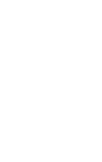
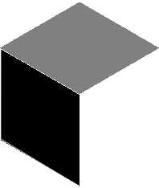
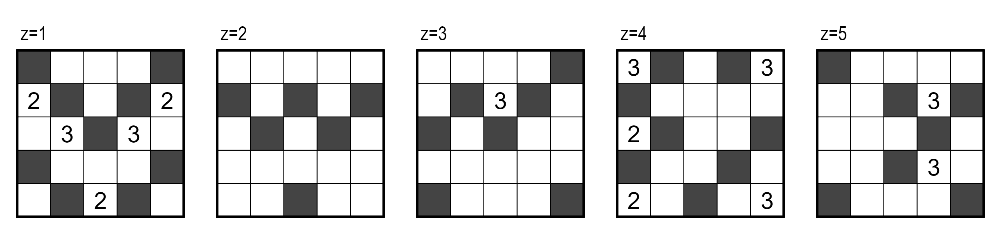
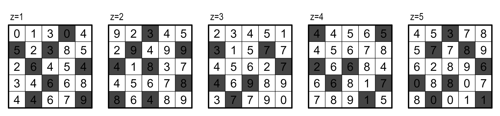
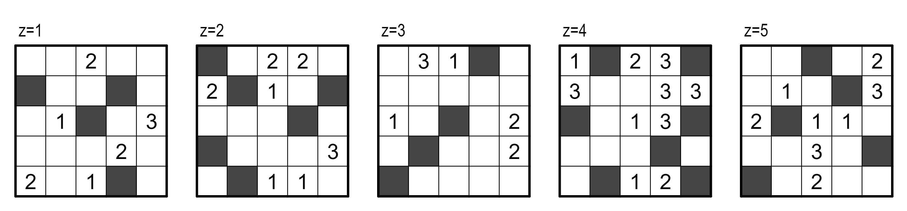
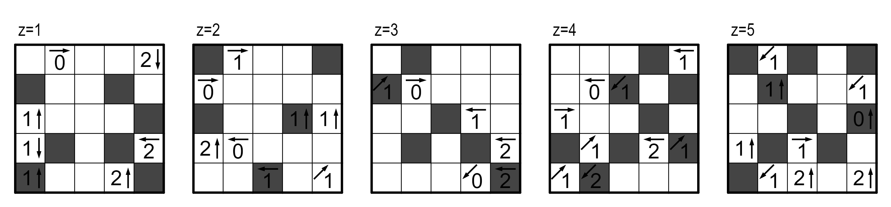
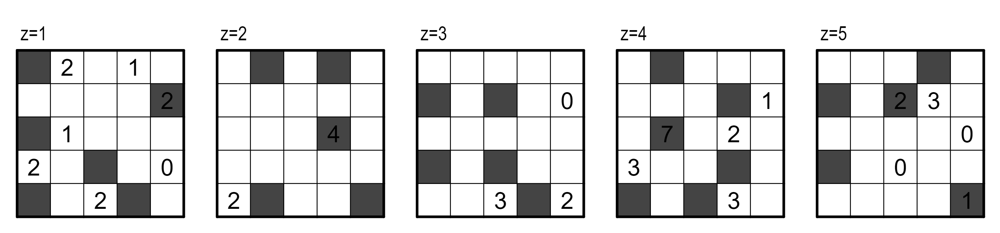

# 三维国

## 题面

_官方存档未提供可提取的文字题面；请查看下方附件或交互源码。_

## 交互源码

### vue_template

```html
<template>
    <div>
        <div><a href="https://docs.qq.com/sheet/DS29ucGNCVGJsVE1Z?tab=BB08J2" target="_blank">腾讯文档</a></div>
        <div>
            <p><i>在三维国，我感受到了什么？</i></p>
        </div>
        <div>
            <p>共通规则：</p>
            <p>涂黑一些1x1x1的格子。
            <br>若两格共有一个面，则不可都涂黑。
            <br>所有未涂黑的格子（白格）通过面邻接连通（即：可以从任意白格出发，通过面邻接，只经过白格，到达任意白格）。</p>
            
        </div>
        <div style="padding-bottom: 40px">
            
            
            
            
            
        </div>
        <div v-if="nowShowPage == 1">
            <p>Kurodoko</p>
            <p>有线索的格子不可涂黑。
            <br>线索数字表示在六个方向上能够看到的白格数量（包含自身）。视线被黑格遮挡。</p>
            <p><a href="https://ikp.yt/0B1YPV" target="_blank">在线做题链接（无答案检查）</a></p>
<div class='threed'>
<div>z = 1</div>
<div>z = 2</div>
<div>z = 3</div>
<div>z = 4</div>
<div>z = 5</div>
<table>
<tr>
<td><span class='clue'></span><span class='letter'>A</span></td>
<td><span class='clue'></span><span class='letter'>O</span></td>
<td><span class='clue'></span><span class='letter'>I</span></td>
<td><span class='clue'></span><span class='letter'>B</span></td>
<td><span class='clue'></span><span class='letter'>N</span></td>
</tr>
<tr>
<td><span class='clue'>2</span><span class='letter'>R</span></td>
<td><span class='clue'></span><span class='letter'>U</span></td>
<td><span class='clue'></span><span class='letter'>I</span></td>
<td><span class='clue'></span><span class='letter'>N</span></td>
<td><span class='clue'>2</span><span class='letter'>F</span></td>
</tr>
<tr>
<td><span class='clue'></span><span class='letter'>L</span></td>
<td><span class='clue'>3</span><span class='letter'>R</span></td>
<td><span class='clue'></span><span class='letter'>S</span></td>
<td><span class='clue'>3</span><span class='letter'>H</span></td>
<td><span class='clue'></span><span class='letter'>I</span></td>
</tr>
<tr>
<td><span class='clue'></span><span class='letter'>P</span></td>
<td><span class='clue'></span><span class='letter'>O</span></td>
<td><span class='clue'></span><span class='letter'>H</span></td>
<td><span class='clue'></span><span class='letter'>E</span></td>
<td><span class='clue'></span><span class='letter'>E</span></td>
</tr>
<tr>
<td><span class='clue'></span><span class='letter'>Y</span></td>
<td><span class='clue'></span><span class='letter'>A</span></td>
<td><span class='clue'>2</span><span class='letter'>S</span></td>
<td><span class='clue'></span><span class='letter'>K</span></td>
<td><span class='clue'></span><span class='letter'>S</span></td>
</tr>
</table>
<table>
<tr>
<td><span class='clue'></span><span class='letter'>A</span></td>
<td><span class='clue'></span><span class='letter'>E</span></td>
<td><span class='clue'></span><span class='letter'>D</span></td>
<td><span class='clue'></span><span class='letter'>A</span></td>
<td><span class='clue'></span><span class='letter'>T</span></td>
</tr>
<tr>
<td><span class='clue'></span><span class='letter'>A</span></td>
<td><span class='clue'></span><span class='letter'>R</span></td>
<td><span class='clue'></span><span class='letter'>B</span></td>
<td><span class='clue'></span><span class='letter'>P</span></td>
<td><span class='clue'></span><span class='letter'>L</span></td>
</tr>
<tr>
<td><span class='clue'></span><span class='letter'>L</span></td>
<td><span class='clue'></span><span class='letter'>E</span></td>
<td><span class='clue'></span><span class='letter'>I</span></td>
<td><span class='clue'></span><span class='letter'>H</span></td>
<td><span class='clue'></span><span class='letter'>N</span></td>
</tr>
<tr>
<td><span class='clue'></span><span class='letter'>F</span></td>
<td><span class='clue'></span><span class='letter'>L</span></td>
<td><span class='clue'></span><span class='letter'>P</span></td>
<td><span class='clue'></span><span class='letter'>T</span></td>
<td><span class='clue'></span><span class='letter'>C</span></td>
</tr>
<tr>
<td><span class='clue'></span><span class='letter'>L</span></td>
<td><span class='clue'></span><span class='letter'>E</span></td>
<td><span class='clue'></span><span class='letter'>O</span></td>
<td><span class='clue'></span><span class='letter'>I</span></td>
<td><span class='clue'></span><span class='letter'>R</span></td>
</tr>
</table>
<table>
<tr>
<td><span class='clue'></span><span class='letter'>L</span></td>
<td><span class='clue'></span><span class='letter'>S</span></td>
<td><span class='clue'></span><span class='letter'>E</span></td>
<td><span class='clue'></span><span class='letter'>I</span></td>
<td><span class='clue'></span><span class='letter'>R</span></td>
</tr>
<tr>
<td><span class='clue'></span><span class='letter'>A</span></td>
<td><span class='clue'></span><span class='letter'>R</span></td>
<td><span class='clue'>3</span><span class='letter'>H</span></td>
<td><span class='clue'></span><span class='letter'>O</span></td>
<td><span class='clue'></span><span class='letter'>P</span></td>
</tr>
<tr>
<td><span class='clue'></span><span class='letter'>R</span></td>
<td><span class='clue'></span><span class='letter'>T</span></td>
<td><span class='clue'></span><span class='letter'>R</span></td>
<td><span class='clue'></span><span class='letter'>E</span></td>
<td><span class='clue'></span><span class='letter'>I</span></td>
</tr>
<tr>
<td><span class='clue'></span><span class='letter'>E</span></td>
<td><span class='clue'></span><span class='letter'>T</span></td>
<td><span class='clue'></span><span class='letter'>E</span></td>
<td><span class='clue'></span><span class='letter'>M</span></td>
<td><span class='clue'></span><span class='letter'>E</span></td>
</tr>
<tr>
<td><span class='clue'></span><span class='letter'>E</span></td>
<td><span class='clue'></span><span class='letter'>F</span></td>
<td><span class='clue'></span><span class='letter'>T</span></td>
<td><span class='clue'></span><span class='letter'>E</span></td>
<td><span class='clue'></span><span class='letter'>E</span></td>
</tr>
</table>
<table>
<tr>
<td><span class='clue'>3</span><span class='letter'>L</span></td>
<td><span class='clue'></span><span class='letter'>Z</span></td>
<td><span class='clue'></span><span class='letter'>E</span></td>
<td><span class='clue'></span><span class='letter'>E</span></td>
<td><span class='clue'>3</span><span class='letter'>M</span></td>
</tr>
<tr>
<td><span class='clue'></span><span class='letter'>D</span></td>
<td><span class='clue'></span><span class='letter'>D</span></td>
<td><span class='clue'></span><span class='letter'>U</span></td>
<td><span class='clue'></span><span class='letter'>Y</span></td>
<td><span class='clue'></span><span class='letter'>L</span></td>
</tr>
<tr>
<td><span class='clue'>2</span><span class='letter'>F</span></td>
<td><span class='clue'></span><span class='letter'>M</span></td>
<td><span class='clue'></span><span class='letter'>L</span></td>
<td><span class='clue'></span><span class='letter'>E</span></td>
<td><span class='clue'></span><span class='letter'>E</span></td>
</tr>
<tr>
<td><span class='clue'></span><span class='letter'>T</span></td>
<td><span class='clue'></span><span class='letter'>S</span></td>
<td><span class='clue'></span><span class='letter'>C</span></td>
<td><span class='clue'></span><span class='letter'>H</span></td>
<td><span class='clue'></span><span class='letter'>L</span></td>
</tr>
<tr>
<td><span class='clue'>2</span><span class='letter'>T</span></td>
<td><span class='clue'></span><span class='letter'>E</span></td>
<td><span class='clue'></span><span class='letter'>E</span></td>
<td><span class='clue'></span><span class='letter'>H</span></td>
<td><span class='clue'>3</span><span class='letter'>T</span></td>
</tr>
</table>
<table>
<tr>
<td><span class='clue'></span><span class='letter'>A</span></td>
<td><span class='clue'></span><span class='letter'>R</span></td>
<td><span class='clue'></span><span class='letter'>H</span></td>
<td><span class='clue'></span><span class='letter'>E</span></td>
<td><span class='clue'></span><span class='letter'>H</span></td>
</tr>
<tr>
<td><span class='clue'></span><span class='letter'>N</span></td>
<td><span class='clue'></span><span class='letter'>N</span></td>
<td><span class='clue'></span><span class='letter'>E</span></td>
<td><span class='clue'>3</span><span class='letter'>A</span></td>
<td><span class='clue'></span><span class='letter'>W</span></td>
</tr>
<tr>
<td><span class='clue'></span><span class='letter'>O</span></td>
<td><span class='clue'></span><span class='letter'>A</span></td>
<td><span class='clue'></span><span class='letter'>A</span></td>
<td><span class='clue'></span><span class='letter'>A</span></td>
<td><span class='clue'></span><span class='letter'>T</span></td>
</tr>
<tr>
<td><span class='clue'></span><span class='letter'>E</span></td>
<td><span class='clue'></span><span class='letter'>R</span></td>
<td><span class='clue'></span><span class='letter'>S</span></td>
<td><span class='clue'>3</span><span class='letter'>H</span></td>
<td><span class='clue'></span><span class='letter'>T</span></td>
</tr>
<tr>
<td><span class='clue'></span><span class='letter'>D</span></td>
<td><span class='clue'></span><span class='letter'>A</span></td>
<td><span class='clue'></span><span class='letter'>N</span></td>
<td><span class='clue'></span><span class='letter'>E</span></td>
<td><span class='clue'></span><span class='letter'>D</span></td>
</tr>
</table>
</div>
        </div>
        <div v-if="nowShowPage == 2">
            <p>Hitori</p>
            <p>不存在两个白格，数字相同，且三个坐标xyz中有两个相同。</p>
            <p><a href="https://ikp.yt/3wNa4R" target="_blank">在线做题链接（无答案检查）</a></p>
<div class='threed'>
<div>z = 1</div>
<div>z = 2</div>
<div>z = 3</div>
<div>z = 4</div>
<div>z = 5</div>
<table>
<tr>
<td><span class='clue'>0</span><span class='letter'>T</span></td>
<td><span class='clue'>1</span><span class='letter'>I</span></td>
<td><span class='clue'>3</span><span class='letter'>E</span></td>
<td><span class='clue'>0</span><span class='letter'>A</span></td>
<td><span class='clue'>4</span><span class='letter'>E</span></td>
</tr>
<tr>
<td><span class='clue'>5</span><span class='letter'>R</span></td>
<td><span class='clue'>2</span><span class='letter'>S</span></td>
<td><span class='clue'>3</span><span class='letter'>K</span></td>
<td><span class='clue'>8</span><span class='letter'>N</span></td>
<td><span class='clue'>5</span><span class='letter'>O</span></td>
</tr>
<tr>
<td><span class='clue'>2</span><span class='letter'>S</span></td>
<td><span class='clue'>6</span><span class='letter'>N</span></td>
<td><span class='clue'>4</span><span class='letter'>T</span></td>
<td><span class='clue'>5</span><span class='letter'>I</span></td>
<td><span class='clue'>4</span><span class='letter'>B</span></td>
</tr>
<tr>
<td><span class='clue'>3</span><span class='letter'>A</span></td>
<td><span class='clue'>4</span><span class='letter'>L</span></td>
<td><span class='clue'>6</span><span class='letter'>S</span></td>
<td><span class='clue'>6</span><span class='letter'>M</span></td>
<td><span class='clue'>8</span><span class='letter'>N</span></td>
</tr>
<tr>
<td><span class='clue'>4</span><span class='letter'>F</span></td>
<td><span class='clue'>4</span><span class='letter'>S</span></td>
<td><span class='clue'>6</span><span class='letter'>U</span></td>
<td><span class='clue'>7</span><span class='letter'>O</span></td>
<td><span class='clue'>9</span><span class='letter'>T</span></td>
</tr>
</table>
<table>
<tr>
<td><span class='clue'>9</span><span class='letter'>H</span></td>
<td><span class='clue'>2</span><span class='letter'>N</span></td>
<td><span class='clue'>3</span><span class='letter'>H</span></td>
<td><span class='clue'>4</span><span class='letter'>I</span></td>
<td><span class='clue'>5</span><span class='letter'>E</span></td>
</tr>
<tr>
<td><span class='clue'>2</span><span class='letter'>F</span></td>
<td><span class='clue'>9</span><span class='letter'>E</span></td>
<td><span class='clue'>4</span><span class='letter'>N</span></td>
<td><span class='clue'>9</span><span class='letter'>R</span></td>
<td><span class='clue'>9</span><span class='letter'>N</span></td>
</tr>
<tr>
<td><span class='clue'>4</span><span class='letter'>A</span></td>
<td><span class='clue'>1</span><span class='letter'>M</span></td>
<td><span class='clue'>8</span><span class='letter'>I</span></td>
<td><span class='clue'>3</span><span class='letter'>H</span></td>
<td><span class='clue'>7</span><span class='letter'>O</span></td>
</tr>
<tr>
<td><span class='clue'>4</span><span class='letter'>T</span></td>
<td><span class='clue'>5</span><span class='letter'>E</span></td>
<td><span class='clue'>6</span><span class='letter'>Y</span></td>
<td><span class='clue'>7</span><span class='letter'>H</span></td>
<td><span class='clue'>8</span><span class='letter'>I</span></td>
</tr>
<tr>
<td><span class='clue'>8</span><span class='letter'>Z</span></td>
<td><span class='clue'>6</span><span class='letter'>S</span></td>
<td><span class='clue'>4</span><span class='letter'>Z</span></td>
<td><span class='clue'>8</span><span class='letter'>A</span></td>
<td><span class='clue'>9</span><span class='letter'>A</span></td>
</tr>
</table>
<table>
<tr>
<td><span class='clue'>2</span><span class='letter'>T</span></td>
<td><span class='clue'>3</span><span class='letter'>T</span></td>
<td><span class='clue'>4</span><span class='letter'>E</span></td>
<td><span class='clue'>5</span><span class='letter'>A</span></td>
<td><span class='clue'>1</span><span class='letter'>S</span></td>
</tr>
<tr>
<td><span class='clue'>3</span><span class='letter'>Y</span></td>
<td><span class='clue'>1</span><span class='letter'>E</span></td>
<td><span class='clue'>5</span><span class='letter'>A</span></td>
<td><span class='clue'>7</span><span class='letter'>S</span></td>
<td><span class='clue'>7</span><span class='letter'>A</span></td>
</tr>
<tr>
<td><span class='clue'>4</span><span class='letter'>K</span></td>
<td><span class='clue'>5</span><span class='letter'>L</span></td>
<td><span class='clue'>6</span><span class='letter'>I</span></td>
<td><span class='clue'>2</span><span class='letter'>E</span></td>
<td><span class='clue'>7</span><span class='letter'>T</span></td>
</tr>
<tr>
<td><span class='clue'>4</span><span class='letter'>C</span></td>
<td><span class='clue'>6</span><span class='letter'>H</span></td>
<td><span class='clue'>9</span><span class='letter'>K</span></td>
<td><span class='clue'>8</span><span class='letter'>S</span></td>
<td><span class='clue'>9</span><span class='letter'>S</span></td>
</tr>
<tr>
<td><span class='clue'>3</span><span class='letter'>P</span></td>
<td><span class='clue'>7</span><span class='letter'>E</span></td>
<td><span class='clue'>7</span><span class='letter'>Y</span></td>
<td><span class='clue'>9</span><span class='letter'>I</span></td>
<td><span class='clue'>0</span><span class='letter'>E</span></td>
</tr>
</table>
<table>
<tr>
<td><span class='clue'>4</span><span class='letter'>N</span></td>
<td><span class='clue'>4</span><span class='letter'>L</span></td>
<td><span class='clue'>5</span><span class='letter'>L</span></td>
<td><span class='clue'>6</span><span class='letter'>I</span></td>
<td><span class='clue'>5</span><span class='letter'>I</span></td>
</tr>
<tr>
<td><span class='clue'>4</span><span class='letter'>E</span></td>
<td><span class='clue'>5</span><span class='letter'>A</span></td>
<td><span class='clue'>6</span><span class='letter'>N</span></td>
<td><span class='clue'>7</span><span class='letter'>E</span></td>
<td><span class='clue'>8</span><span class='letter'>T</span></td>
</tr>
<tr>
<td><span class='clue'>2</span><span class='letter'>N</span></td>
<td><span class='clue'>6</span><span class='letter'>N</span></td>
<td><span class='clue'>6</span><span class='letter'>G</span></td>
<td><span class='clue'>8</span><span class='letter'>L</span></td>
<td><span class='clue'>4</span><span class='letter'>E</span></td>
</tr>
<tr>
<td><span class='clue'>6</span><span class='letter'>A</span></td>
<td><span class='clue'>6</span><span class='letter'>S</span></td>
<td><span class='clue'>8</span><span class='letter'>D</span></td>
<td><span class='clue'>1</span><span class='letter'>H</span></td>
<td><span class='clue'>7</span><span class='letter'>S</span></td>
</tr>
<tr>
<td><span class='clue'>7</span><span class='letter'>I</span></td>
<td><span class='clue'>8</span><span class='letter'>P</span></td>
<td><span class='clue'>9</span><span class='letter'>E</span></td>
<td><span class='clue'>1</span><span class='letter'>N</span></td>
<td><span class='clue'>5</span><span class='letter'>O</span></td>
</tr>
</table>
<table>
<tr>
<td><span class='clue'>4</span><span class='letter'>U</span></td>
<td><span class='clue'>5</span><span class='letter'>A</span></td>
<td><span class='clue'>3</span><span class='letter'>S</span></td>
<td><span class='clue'>7</span><span class='letter'>L</span></td>
<td><span class='clue'>8</span><span class='letter'>P</span></td>
</tr>
<tr>
<td><span class='clue'>5</span><span class='letter'>A</span></td>
<td><span class='clue'>7</span><span class='letter'>A</span></td>
<td><span class='clue'>7</span><span class='letter'>T</span></td>
<td><span class='clue'>8</span><span class='letter'>O</span></td>
<td><span class='clue'>9</span><span class='letter'>I</span></td>
</tr>
<tr>
<td><span class='clue'>6</span><span class='letter'>L</span></td>
<td><span class='clue'>2</span><span class='letter'>L</span></td>
<td><span class='clue'>8</span><span class='letter'>H</span></td>
<td><span class='clue'>9</span><span class='letter'>U</span></td>
<td><span class='clue'>6</span><span class='letter'>I</span></td>
</tr>
<tr>
<td><span class='clue'>0</span><span class='letter'>O</span></td>
<td><span class='clue'>8</span><span class='letter'>T</span></td>
<td><span class='clue'>8</span><span class='letter'>N</span></td>
<td><span class='clue'>0</span><span class='letter'>O</span></td>
<td><span class='clue'>7</span><span class='letter'>I</span></td>
</tr>
<tr>
<td><span class='clue'>8</span><span class='letter'>N</span></td>
<td><span class='clue'>0</span><span class='letter'>O</span></td>
<td><span class='clue'>0</span><span class='letter'>I</span></td>
<td><span class='clue'>1</span><span class='letter'>E</span></td>
<td><span class='clue'>1</span><span class='letter'>F</span></td>
</tr>
</table>
</div>

        </div>
        <div v-if="nowShowPage == 3">
            <p>Kurochute</p>
            <p>有线索的格子不可涂黑。
            <br>线索数字表示有且仅有一个黑格满足以下条件：到当前格的距离等于线索数字，且与当前格在三个坐标xyz中有两个相同。</p>
            <p><a href="https://ikp.yt/3dsr5s" target="_blank">在线做题链接（无答案检查）</a></p>
<div class='threed'>
<div>z = 1</div>
<div>z = 2</div>
<div>z = 3</div>
<div>z = 4</div>
<div>z = 5</div>
<table>
<tr>
<td><span class='clue'></span><span class='letter'>E</span></td>
<td><span class='clue'></span><span class='letter'>P</span></td>
<td><span class='clue'>2</span><span class='letter'>T</span></td>
<td><span class='clue'></span><span class='letter'>N</span></td>
<td><span class='clue'></span><span class='letter'>I</span></td>
</tr>
<tr>
<td><span class='clue'></span><span class='letter'>N</span></td>
<td><span class='clue'></span><span class='letter'>O</span></td>
<td><span class='clue'></span><span class='letter'>H</span></td>
<td><span class='clue'></span><span class='letter'>I</span></td>
<td><span class='clue'></span><span class='letter'>P</span></td>
</tr>
<tr>
<td><span class='clue'></span><span class='letter'>W</span></td>
<td><span class='clue'>1</span><span class='letter'>B</span></td>
<td><span class='clue'></span><span class='letter'>G</span></td>
<td><span class='clue'></span><span class='letter'>A</span></td>
<td><span class='clue'>3</span><span class='letter'>N</span></td>
</tr>
<tr>
<td><span class='clue'></span><span class='letter'>R</span></td>
<td><span class='clue'></span><span class='letter'>L</span></td>
<td><span class='clue'></span><span class='letter'>U</span></td>
<td><span class='clue'>2</span><span class='letter'>F</span></td>
<td><span class='clue'></span><span class='letter'>L</span></td>
</tr>
<tr>
<td><span class='clue'>2</span><span class='letter'>X</span></td>
<td><span class='clue'></span><span class='letter'>G</span></td>
<td><span class='clue'>1</span><span class='letter'>E</span></td>
<td><span class='clue'></span><span class='letter'>H</span></td>
<td><span class='clue'></span><span class='letter'>F</span></td>
</tr>
</table>
<table>
<tr>
<td><span class='clue'></span><span class='letter'>T</span></td>
<td><span class='clue'></span><span class='letter'>H</span></td>
<td><span class='clue'>2</span><span class='letter'>O</span></td>
<td><span class='clue'>2</span><span class='letter'>A</span></td>
<td><span class='clue'></span><span class='letter'>S</span></td>
</tr>
<tr>
<td><span class='clue'>2</span><span class='letter'>N</span></td>
<td><span class='clue'></span><span class='letter'>T</span></td>
<td><span class='clue'>1</span><span class='letter'>O</span></td>
<td><span class='clue'></span><span class='letter'>R</span></td>
<td><span class='clue'></span><span class='letter'>M</span></td>
</tr>
<tr>
<td><span class='clue'></span><span class='letter'>M</span></td>
<td><span class='clue'></span><span class='letter'>C</span></td>
<td><span class='clue'></span><span class='letter'>L</span></td>
<td><span class='clue'></span><span class='letter'>A</span></td>
<td><span class='clue'></span><span class='letter'>E</span></td>
</tr>
<tr>
<td><span class='clue'></span><span class='letter'>T</span></td>
<td><span class='clue'></span><span class='letter'>P</span></td>
<td><span class='clue'></span><span class='letter'>M</span></td>
<td><span class='clue'></span><span class='letter'>O</span></td>
<td><span class='clue'>3</span><span class='letter'>F</span></td>
</tr>
<tr>
<td><span class='clue'></span><span class='letter'>L</span></td>
<td><span class='clue'></span><span class='letter'>W</span></td>
<td><span class='clue'>1</span><span class='letter'>S</span></td>
<td><span class='clue'>1</span><span class='letter'>D</span></td>
<td><span class='clue'></span><span class='letter'>C</span></td>
</tr>
</table>
<table>
<tr>
<td><span class='clue'></span><span class='letter'>I</span></td>
<td><span class='clue'>3</span><span class='letter'>A</span></td>
<td><span class='clue'>1</span><span class='letter'>F</span></td>
<td><span class='clue'></span><span class='letter'>A</span></td>
<td><span class='clue'></span><span class='letter'>I</span></td>
</tr>
<tr>
<td><span class='clue'></span><span class='letter'>H</span></td>
<td><span class='clue'></span><span class='letter'>H</span></td>
<td><span class='clue'></span><span class='letter'>S</span></td>
<td><span class='clue'></span><span class='letter'>M</span></td>
<td><span class='clue'></span><span class='letter'>N</span></td>
</tr>
<tr>
<td><span class='clue'>1</span><span class='letter'>C</span></td>
<td><span class='clue'></span><span class='letter'>S</span></td>
<td><span class='clue'></span><span class='letter'>S</span></td>
<td><span class='clue'></span><span class='letter'>I</span></td>
<td><span class='clue'>2</span><span class='letter'>A</span></td>
</tr>
<tr>
<td><span class='clue'></span><span class='letter'>E</span></td>
<td><span class='clue'></span><span class='letter'>N</span></td>
<td><span class='clue'></span><span class='letter'>M</span></td>
<td><span class='clue'></span><span class='letter'>L</span></td>
<td><span class='clue'>2</span><span class='letter'>F</span></td>
</tr>
<tr>
<td><span class='clue'></span><span class='letter'>O</span></td>
<td><span class='clue'></span><span class='letter'>C</span></td>
<td><span class='clue'></span><span class='letter'>N</span></td>
<td><span class='clue'></span><span class='letter'>E</span></td>
<td><span class='clue'></span><span class='letter'>N</span></td>
</tr>
</table>
<table>
<tr>
<td><span class='clue'>1</span><span class='letter'>F</span></td>
<td><span class='clue'></span><span class='letter'>A</span></td>
<td><span class='clue'>2</span><span class='letter'>T</span></td>
<td><span class='clue'>3</span><span class='letter'>N</span></td>
<td><span class='clue'></span><span class='letter'>L</span></td>
</tr>
<tr>
<td><span class='clue'>3</span><span class='letter'>R</span></td>
<td><span class='clue'></span><span class='letter'>P</span></td>
<td><span class='clue'></span><span class='letter'>V</span></td>
<td><span class='clue'>3</span><span class='letter'>T</span></td>
<td><span class='clue'>3</span><span class='letter'>A</span></td>
</tr>
<tr>
<td><span class='clue'></span><span class='letter'>I</span></td>
<td><span class='clue'></span><span class='letter'>H</span></td>
<td><span class='clue'>1</span><span class='letter'>N</span></td>
<td><span class='clue'>3</span><span class='letter'>D</span></td>
<td><span class='clue'></span><span class='letter'>K</span></td>
</tr>
<tr>
<td><span class='clue'></span><span class='letter'>N</span></td>
<td><span class='clue'></span><span class='letter'>G</span></td>
<td><span class='clue'></span><span class='letter'>Y</span></td>
<td><span class='clue'></span><span class='letter'>E</span></td>
<td><span class='clue'></span><span class='letter'>N</span></td>
</tr>
<tr>
<td><span class='clue'></span><span class='letter'>O</span></td>
<td><span class='clue'></span><span class='letter'>S</span></td>
<td><span class='clue'>1</span><span class='letter'>I</span></td>
<td><span class='clue'>2</span><span class='letter'>R</span></td>
<td><span class='clue'></span><span class='letter'>E</span></td>
</tr>
</table>
<table>
<tr>
<td><span class='clue'></span><span class='letter'>I</span></td>
<td><span class='clue'></span><span class='letter'>S</span></td>
<td><span class='clue'></span><span class='letter'>I</span></td>
<td><span class='clue'></span><span class='letter'>Y</span></td>
<td><span class='clue'>2</span><span class='letter'>E</span></td>
</tr>
<tr>
<td><span class='clue'></span><span class='letter'>K</span></td>
<td><span class='clue'>1</span><span class='letter'>N</span></td>
<td><span class='clue'></span><span class='letter'>I</span></td>
<td><span class='clue'></span><span class='letter'>I</span></td>
<td><span class='clue'>3</span><span class='letter'>F</span></td>
</tr>
<tr>
<td><span class='clue'>2</span><span class='letter'>H</span></td>
<td><span class='clue'></span><span class='letter'>N</span></td>
<td><span class='clue'>1</span><span class='letter'>T</span></td>
<td><span class='clue'>1</span><span class='letter'>O</span></td>
<td><span class='clue'></span><span class='letter'>V</span></td>
</tr>
<tr>
<td><span class='clue'></span><span class='letter'>L</span></td>
<td><span class='clue'></span><span class='letter'>T</span></td>
<td><span class='clue'>3</span><span class='letter'>S</span></td>
<td><span class='clue'></span><span class='letter'>E</span></td>
<td><span class='clue'></span><span class='letter'>G</span></td>
</tr>
<tr>
<td><span class='clue'></span><span class='letter'>I</span></td>
<td><span class='clue'></span><span class='letter'>R</span></td>
<td><span class='clue'>2</span><span class='letter'>S</span></td>
<td><span class='clue'></span><span class='letter'>H</span></td>
<td><span class='clue'></span><span class='letter'>W</span></td>
</tr>
</table>
</div>
        </div>
        <div v-if="nowShowPage == 4">
            <p>Yajisan-Kazusan</p>
            <p>白格的线索表示在箭头方向上恰有数字个黑格。↗表示z增加方向，↙表示z减小方向。
            <br>黑格的线索不包含任何信息。</p>
            <p><a href="https://ikp.yt/0S80hs" target="_blank">在线做题链接（无答案检查）</a></p>
<div class='threed'>
<div>z = 1</div>
<div>z = 2</div>
<div>z = 3</div>
<div>z = 4</div>
<div>z = 5</div>
<table>
<tr>
<td><span class='clue'></span><span class='letter'>O</span></td>
<td><span class='clue'>0→</span><span class='letter'>P</span></td>
<td><span class='clue'></span><span class='letter'>I</span></td>
<td><span class='clue'></span><span class='letter'>A</span></td>
<td><span class='clue'>2↓</span><span class='letter'>Y</span></td>
</tr>
<tr>
<td><span class='clue'></span><span class='letter'>S</span></td>
<td><span class='clue'></span><span class='letter'>O</span></td>
<td><span class='clue'></span><span class='letter'>A</span></td>
<td><span class='clue'></span><span class='letter'>N</span></td>
<td><span class='clue'></span><span class='letter'>D</span></td>
</tr>
<tr>
<td><span class='clue'>1↑</span><span class='letter'>T</span></td>
<td><span class='clue'></span><span class='letter'>E</span></td>
<td><span class='clue'></span><span class='letter'>M</span></td>
<td><span class='clue'></span><span class='letter'>A</span></td>
<td><span class='clue'></span><span class='letter'>W</span></td>
</tr>
<tr>
<td><span class='clue'>1↓</span><span class='letter'>N</span></td>
<td><span class='clue'></span><span class='letter'>A</span></td>
<td><span class='clue'></span><span class='letter'>H</span></td>
<td><span class='clue'></span><span class='letter'>L</span></td>
<td><span class='clue'>2←</span><span class='letter'>G</span></td>
</tr>
<tr>
<td><span class='clue'>1↑</span><span class='letter'>I</span></td>
<td><span class='clue'></span><span class='letter'>O</span></td>
<td><span class='clue'></span><span class='letter'>H</span></td>
<td><span class='clue'>2↑</span><span class='letter'>R</span></td>
<td><span class='clue'></span><span class='letter'>N</span></td>
</tr>
</table>
<table>
<tr>
<td><span class='clue'></span><span class='letter'>D</span></td>
<td><span class='clue'>1→</span><span class='letter'>O</span></td>
<td><span class='clue'></span><span class='letter'>W</span></td>
<td><span class='clue'></span><span class='letter'>E</span></td>
<td><span class='clue'></span><span class='letter'>T</span></td>
</tr>
<tr>
<td><span class='clue'>0→</span><span class='letter'>E</span></td>
<td><span class='clue'></span><span class='letter'>A</span></td>
<td><span class='clue'></span><span class='letter'>T</span></td>
<td><span class='clue'></span><span class='letter'>A</span></td>
<td><span class='clue'></span><span class='letter'>L</span></td>
</tr>
<tr>
<td><span class='clue'></span><span class='letter'>H</span></td>
<td><span class='clue'></span><span class='letter'>A</span></td>
<td><span class='clue'></span><span class='letter'>T</span></td>
<td><span class='clue'>1↑</span><span class='letter'>A</span></td>
<td><span class='clue'>1↑</span><span class='letter'>H</span></td>
</tr>
<tr>
<td><span class='clue'>2↑</span><span class='letter'>O</span></td>
<td><span class='clue'>0←</span><span class='letter'>G</span></td>
<td><span class='clue'></span><span class='letter'>T</span></td>
<td><span class='clue'></span><span class='letter'>R</span></td>
<td><span class='clue'></span><span class='letter'>B</span></td>
</tr>
<tr>
<td><span class='clue'></span><span class='letter'>R</span></td>
<td><span class='clue'></span><span class='letter'>T</span></td>
<td><span class='clue'>1←</span><span class='letter'>T</span></td>
<td><span class='clue'></span><span class='letter'>M</span></td>
<td><span class='clue'>1↗</span><span class='letter'>W</span></td>
</tr>
</table>
<table>
<tr>
<td><span class='clue'></span><span class='letter'>K</span></td>
<td><span class='clue'></span><span class='letter'>W</span></td>
<td><span class='clue'></span><span class='letter'>A</span></td>
<td><span class='clue'></span><span class='letter'>L</span></td>
<td><span class='clue'></span><span class='letter'>M</span></td>
</tr>
<tr>
<td><span class='clue'>1↗</span><span class='letter'>A</span></td>
<td><span class='clue'>0→</span><span class='letter'>N</span></td>
<td><span class='clue'></span><span class='letter'>T</span></td>
<td><span class='clue'></span><span class='letter'>H</span></td>
<td><span class='clue'></span><span class='letter'>T</span></td>
</tr>
<tr>
<td><span class='clue'></span><span class='letter'>I</span></td>
<td><span class='clue'></span><span class='letter'>H</span></td>
<td><span class='clue'></span><span class='letter'>S</span></td>
<td><span class='clue'>1←</span><span class='letter'>I</span></td>
<td><span class='clue'></span><span class='letter'>C</span></td>
</tr>
<tr>
<td><span class='clue'></span><span class='letter'>I</span></td>
<td><span class='clue'></span><span class='letter'>I</span></td>
<td><span class='clue'></span><span class='letter'>O</span></td>
<td><span class='clue'></span><span class='letter'>O</span></td>
<td><span class='clue'>2←</span><span class='letter'>F</span></td>
</tr>
<tr>
<td><span class='clue'></span><span class='letter'>T</span></td>
<td><span class='clue'></span><span class='letter'>L</span></td>
<td><span class='clue'></span><span class='letter'>E</span></td>
<td><span class='clue'>0↙</span><span class='letter'>I</span></td>
<td><span class='clue'>2←</span><span class='letter'>L</span></td>
</tr>
</table>
<table>
<tr>
<td><span class='clue'></span><span class='letter'>I</span></td>
<td><span class='clue'></span><span class='letter'>S</span></td>
<td><span class='clue'></span><span class='letter'>R</span></td>
<td><span class='clue'></span><span class='letter'>I</span></td>
<td><span class='clue'>1←</span><span class='letter'>K</span></td>
</tr>
<tr>
<td><span class='clue'></span><span class='letter'>L</span></td>
<td><span class='clue'>0←</span><span class='letter'>T</span></td>
<td><span class='clue'>1↙</span><span class='letter'>N</span></td>
<td><span class='clue'></span><span class='letter'>R</span></td>
<td><span class='clue'></span><span class='letter'>E</span></td>
</tr>
<tr>
<td><span class='clue'>1→</span><span class='letter'>L</span></td>
<td><span class='clue'></span><span class='letter'>R</span></td>
<td><span class='clue'></span><span class='letter'>G</span></td>
<td><span class='clue'></span><span class='letter'>S</span></td>
<td><span class='clue'></span><span class='letter'>N</span></td>
</tr>
<tr>
<td><span class='clue'></span><span class='letter'>P</span></td>
<td><span class='clue'>1↗</span><span class='letter'>N</span></td>
<td><span class='clue'></span><span class='letter'>A</span></td>
<td><span class='clue'>2←</span><span class='letter'>A</span></td>
<td><span class='clue'>1↗</span><span class='letter'>A</span></td>
</tr>
<tr>
<td><span class='clue'>1↗</span><span class='letter'>O</span></td>
<td><span class='clue'>2↙</span><span class='letter'>E</span></td>
<td><span class='clue'></span><span class='letter'>R</span></td>
<td><span class='clue'></span><span class='letter'>N</span></td>
<td><span class='clue'></span><span class='letter'>L</span></td>
</tr>
</table>
<table>
<tr>
<td><span class='clue'></span><span class='letter'>T</span></td>
<td><span class='clue'>1↙</span><span class='letter'>B</span></td>
<td><span class='clue'></span><span class='letter'>H</span></td>
<td><span class='clue'></span><span class='letter'>N</span></td>
<td><span class='clue'></span><span class='letter'>A</span></td>
</tr>
<tr>
<td><span class='clue'></span><span class='letter'>O</span></td>
<td><span class='clue'>1↑</span><span class='letter'>T</span></td>
<td><span class='clue'></span><span class='letter'>N</span></td>
<td><span class='clue'></span><span class='letter'>R</span></td>
<td><span class='clue'>1↙</span><span class='letter'>B</span></td>
</tr>
<tr>
<td><span class='clue'></span><span class='letter'>Y</span></td>
<td><span class='clue'></span><span class='letter'>C</span></td>
<td><span class='clue'></span><span class='letter'>W</span></td>
<td><span class='clue'></span><span class='letter'>C</span></td>
<td><span class='clue'>0↑</span><span class='letter'>A</span></td>
</tr>
<tr>
<td><span class='clue'>1↑</span><span class='letter'>L</span></td>
<td><span class='clue'></span><span class='letter'>S</span></td>
<td><span class='clue'>1→</span><span class='letter'>I</span></td>
<td><span class='clue'></span><span class='letter'>G</span></td>
<td><span class='clue'></span><span class='letter'>E</span></td>
</tr>
<tr>
<td><span class='clue'></span><span class='letter'>O</span></td>
<td><span class='clue'>1↙</span><span class='letter'>I</span></td>
<td><span class='clue'>2↑</span><span class='letter'>T</span></td>
<td><span class='clue'></span><span class='letter'>R</span></td>
<td><span class='clue'>2↑</span><span class='letter'>D</span></td>
</tr>
</table>
</div>
        </div>
        <div v-if="nowShowPage == 5">
            <p>Context</p>
            <p>黑格的线索表示恰有数字个黑格与当前格共有顶点且不共有边或面（不包含自身）。
            <br>白格的线索表示恰有数字个黑格与当前格共有面。</p>
            <p><a href="https://ikp.yt/4sJ0jK" target="_blank">在线做题链接（无答案检查）</a></p>
<div class='threed'>
<div>z = 1</div>
<div>z = 2</div>
<div>z = 3</div>
<div>z = 4</div>
<div>z = 5</div>
<table>
<tr>
<td><span class='clue'></span><span class='letter'>T</span></td>
<td><span class='clue'>2</span><span class='letter'>E</span></td>
<td><span class='clue'></span><span class='letter'>N</span></td>
<td><span class='clue'>1</span><span class='letter'>N</span></td>
<td><span class='clue'></span><span class='letter'>I</span></td>
</tr>
<tr>
<td><span class='clue'></span><span class='letter'>H</span></td>
<td><span class='clue'></span><span class='letter'>M</span></td>
<td><span class='clue'></span><span class='letter'>I</span></td>
<td><span class='clue'></span><span class='letter'>A</span></td>
<td><span class='clue'>2</span><span class='letter'>S</span></td>
</tr>
<tr>
<td><span class='clue'></span><span class='letter'>P</span></td>
<td><span class='clue'>1</span><span class='letter'>A</span></td>
<td><span class='clue'></span><span class='letter'>C</span></td>
<td><span class='clue'></span><span class='letter'>O</span></td>
<td><span class='clue'></span><span class='letter'>I</span></td>
</tr>
<tr>
<td><span class='clue'>2</span><span class='letter'>D</span></td>
<td><span class='clue'></span><span class='letter'>H</span></td>
<td><span class='clue'></span><span class='letter'>O</span></td>
<td><span class='clue'></span><span class='letter'>S</span></td>
<td><span class='clue'>0</span><span class='letter'>R</span></td>
</tr>
<tr>
<td><span class='clue'></span><span class='letter'>C</span></td>
<td><span class='clue'></span><span class='letter'>A</span></td>
<td><span class='clue'>2</span><span class='letter'>R</span></td>
<td><span class='clue'></span><span class='letter'>E</span></td>
<td><span class='clue'></span><span class='letter'>G</span></td>
</tr>
</table>
<table>
<tr>
<td><span class='clue'></span><span class='letter'>Y</span></td>
<td><span class='clue'></span><span class='letter'>N</span></td>
<td><span class='clue'></span><span class='letter'>D</span></td>
<td><span class='clue'></span><span class='letter'>W</span></td>
<td><span class='clue'></span><span class='letter'>E</span></td>
</tr>
<tr>
<td><span class='clue'></span><span class='letter'>L</span></td>
<td><span class='clue'></span><span class='letter'>L</span></td>
<td><span class='clue'></span><span class='letter'>A</span></td>
<td><span class='clue'></span><span class='letter'>M</span></td>
<td><span class='clue'></span><span class='letter'>S</span></td>
</tr>
<tr>
<td><span class='clue'></span><span class='letter'>I</span></td>
<td><span class='clue'></span><span class='letter'>N</span></td>
<td><span class='clue'></span><span class='letter'>R</span></td>
<td><span class='clue'>4</span><span class='letter'>A</span></td>
<td><span class='clue'></span><span class='letter'>H</span></td>
</tr>
<tr>
<td><span class='clue'></span><span class='letter'>I</span></td>
<td><span class='clue'></span><span class='letter'>S</span></td>
<td><span class='clue'></span><span class='letter'>S</span></td>
<td><span class='clue'></span><span class='letter'>D</span></td>
<td><span class='clue'></span><span class='letter'>S</span></td>
</tr>
<tr>
<td><span class='clue'>2</span><span class='letter'>K</span></td>
<td><span class='clue'></span><span class='letter'>S</span></td>
<td><span class='clue'></span><span class='letter'>U</span></td>
<td><span class='clue'></span><span class='letter'>G</span></td>
<td><span class='clue'></span><span class='letter'>M</span></td>
</tr>
</table>
<table>
<tr>
<td><span class='clue'></span><span class='letter'>F</span></td>
<td><span class='clue'></span><span class='letter'>L</span></td>
<td><span class='clue'></span><span class='letter'>U</span></td>
<td><span class='clue'></span><span class='letter'>D</span></td>
<td><span class='clue'></span><span class='letter'>O</span></td>
</tr>
<tr>
<td><span class='clue'></span><span class='letter'>Y</span></td>
<td><span class='clue'></span><span class='letter'>S</span></td>
<td><span class='clue'></span><span class='letter'>S</span></td>
<td><span class='clue'></span><span class='letter'>T</span></td>
<td><span class='clue'>0</span><span class='letter'>B</span></td>
</tr>
<tr>
<td><span class='clue'></span><span class='letter'>O</span></td>
<td><span class='clue'></span><span class='letter'>O</span></td>
<td><span class='clue'></span><span class='letter'>O</span></td>
<td><span class='clue'></span><span class='letter'>A</span></td>
<td><span class='clue'></span><span class='letter'>H</span></td>
</tr>
<tr>
<td><span class='clue'></span><span class='letter'>A</span></td>
<td><span class='clue'></span><span class='letter'>R</span></td>
<td><span class='clue'></span><span class='letter'>L</span></td>
<td><span class='clue'></span><span class='letter'>D</span></td>
<td><span class='clue'></span><span class='letter'>N</span></td>
</tr>
<tr>
<td><span class='clue'></span><span class='letter'>A</span></td>
<td><span class='clue'></span><span class='letter'>A</span></td>
<td><span class='clue'>3</span><span class='letter'>K</span></td>
<td><span class='clue'></span><span class='letter'>F</span></td>
<td><span class='clue'>2</span><span class='letter'>T</span></td>
</tr>
</table>
<table>
<tr>
<td><span class='clue'></span><span class='letter'>T</span></td>
<td><span class='clue'></span><span class='letter'>A</span></td>
<td><span class='clue'></span><span class='letter'>F</span></td>
<td><span class='clue'></span><span class='letter'>U</span></td>
<td><span class='clue'></span><span class='letter'>N</span></td>
</tr>
<tr>
<td><span class='clue'></span><span class='letter'>C</span></td>
<td><span class='clue'></span><span class='letter'>B</span></td>
<td><span class='clue'></span><span class='letter'>N</span></td>
<td><span class='clue'></span><span class='letter'>N</span></td>
<td><span class='clue'>1</span><span class='letter'>R</span></td>
</tr>
<tr>
<td><span class='clue'></span><span class='letter'>D</span></td>
<td><span class='clue'>7</span><span class='letter'>D</span></td>
<td><span class='clue'></span><span class='letter'>H</span></td>
<td><span class='clue'>2</span><span class='letter'>Y</span></td>
<td><span class='clue'></span><span class='letter'>T</span></td>
</tr>
<tr>
<td><span class='clue'>3</span><span class='letter'>H</span></td>
<td><span class='clue'></span><span class='letter'>L</span></td>
<td><span class='clue'></span><span class='letter'>N</span></td>
<td><span class='clue'></span><span class='letter'>N</span></td>
<td><span class='clue'></span><span class='letter'>A</span></td>
</tr>
<tr>
<td><span class='clue'></span><span class='letter'>O</span></td>
<td><span class='clue'></span><span class='letter'>A</span></td>
<td><span class='clue'></span><span class='letter'>T</span></td>
<td><span class='clue'>3</span><span class='letter'>O</span></td>
<td><span class='clue'></span><span class='letter'>D</span></td>
</tr>
</table>
<table>
<tr>
<td><span class='clue'></span><span class='letter'>T</span></td>
<td><span class='clue'></span><span class='letter'>H</span></td>
<td><span class='clue'></span><span class='letter'>K</span></td>
<td><span class='clue'></span><span class='letter'>M</span></td>
<td><span class='clue'></span><span class='letter'>O</span></td>
</tr>
<tr>
<td><span class='clue'></span><span class='letter'>Y</span></td>
<td><span class='clue'></span><span class='letter'>S</span></td>
<td><span class='clue'>2</span><span class='letter'>L</span></td>
<td><span class='clue'>3</span><span class='letter'>L</span></td>
<td><span class='clue'></span><span class='letter'>E</span></td>
</tr>
<tr>
<td><span class='clue'></span><span class='letter'>I</span></td>
<td><span class='clue'></span><span class='letter'>E</span></td>
<td><span class='clue'></span><span class='letter'>S</span></td>
<td><span class='clue'></span><span class='letter'>C</span></td>
<td><span class='clue'>0</span><span class='letter'>Y</span></td>
</tr>
<tr>
<td><span class='clue'></span><span class='letter'>E</span></td>
<td><span class='clue'></span><span class='letter'>E</span></td>
<td><span class='clue'>0</span><span class='letter'>H</span></td>
<td><span class='clue'></span><span class='letter'>O</span></td>
<td><span class='clue'></span><span class='letter'>N</span></td>
</tr>
<tr>
<td><span class='clue'></span><span class='letter'>T</span></td>
<td><span class='clue'></span><span class='letter'>W</span></td>
<td><span class='clue'></span><span class='letter'>N</span></td>
<td><span class='clue'></span><span class='letter'>H</span></td>
<td><span class='clue'>1</span><span class='letter'>L</span></td>
</tr>
</table>
</div>
        </div>
    </div>
</template>

<style>
.cube {
    cursor: pointer;
    width: 100px;
}
.selectedPage {
    background-color: #444;
}

.threed {
    display: grid;
    grid-template-columns: repeat(5, 220px)
}
.threed table {
    border-collapse: collapse;
    margin: 5px;
    table-layout: fixed
}
.threed td {
    padding: 0;
    height: 40px;
    width: 40px;
    border: 1px solid;
    position: relative;
    text-align: center;
}
.threed .letter {
    font-size: 11px;
    color: #888;
    position: absolute;
    right: 3px;
    bottom: 3px;
}
</style>
```

### vue_script

```text
const { ref } = Vue; //由于网页中无法import，Vue所有组件都已预先导出至Vue对象中。

export default {
    setup() {
        let nowShowPage = ref(1);

        return {
            nowShowPage
        }
    }
}
```


## 答案

`WINDS`

## 解析

首先解出纸笔谜题。











提取涂黑格位置字母，得到 ```ANUNSPEAKABLEHORRORREEZEDMETHEAEWASDDARKNBSSTHENAIIZZYSTCKENINGSSNSAOIONOFNIGHTTMATWASNOALIKESEIINGISNWALINDTHATWASIOLINESPAAETHATWASGOTSPOCENWASMYSALFANDNOTMYLEL```。

搜索后发现这段话出自《平面国》，但部分字母有修改。原文为 ```ANUNSPEAKABLEHORRORSEIZEDMETHEREWASADARKNESSTHENADIZZYSICKENINGSENSATIONOFSIGHTTHATWASNOTLIKESEEINGISAWALINETHATWASNOLINESPACETHATWASNOTSPACEIWASMYSELFANDNOTMYSEL```。

提取修改后的字母，得到 ```READ BITS ON MAIN DIAGONAL```。

对于每个纸笔谜题，提取对角线上的五个bit，然后按照二进制转换，得到答案 ```WINDS```。

## 提示

### 1. Kurodoko 的答案


### 2. Hitori 的答案


### 3. Kurochute 的答案


### 4. Yajisan-Kazusan 的答案


### 5. Context 的答案


### 6. 我做完了纸笔部分，该如何提取

按照从左到右，从上到下，从z小到z大的顺序读出涂黑格的字母。这是一段著名文本，但是某些字母被修改了。


## 中间答案

| 提交 | 回复 | 附加信息 |
| --- | --- | --- |
| READ BITS ON MAIN DIAGONAL | 这是本题的中间答案。 |  |

## 本地附件

- [367e3f9e5b234d269cce4b6edfd51abc.webp](../../../assets/archive.cipherpuzzles.com/ccbc13/images/CCBC-14/367e3f9e5b234d269cce4b6edfd51abc.webp)
- [529e09c27fb148a889f0004944301ca5.webp](../../../assets/archive.cipherpuzzles.com/ccbc13/images/CCBC-14/529e09c27fb148a889f0004944301ca5.webp)
- [8443594d2c5240f8a17cff73e0b22982.webp](../../../assets/archive.cipherpuzzles.com/ccbc13/images/CCBC-14/8443594d2c5240f8a17cff73e0b22982.webp)
- [85d15e478b9343faadeec1a2e918d3f7.webp](../../../assets/archive.cipherpuzzles.com/ccbc13/images/CCBC-14/85d15e478b9343faadeec1a2e918d3f7.webp)
- [8ad70408fb4b4671a147207b5ce4997b.webp](../../../assets/archive.cipherpuzzles.com/ccbc13/images/CCBC-14/8ad70408fb4b4671a147207b5ce4997b.webp)
- [b51080c66304464f887ebc1e1cba2501.webp](../../../assets/archive.cipherpuzzles.com/ccbc13/images/CCBC-14/b51080c66304464f887ebc1e1cba2501.webp)
- [d2ab7cfb8cd3489d9d9b62c00709c2ca.webp](../../../assets/archive.cipherpuzzles.com/ccbc13/images/CCBC-14/d2ab7cfb8cd3489d9d9b62c00709c2ca.webp)

来源：[https://archive.cipherpuzzles.com/ccbc13/problems/CCBC-14/23.yaml](https://archive.cipherpuzzles.com/ccbc13/problems/CCBC-14/23.yaml)
