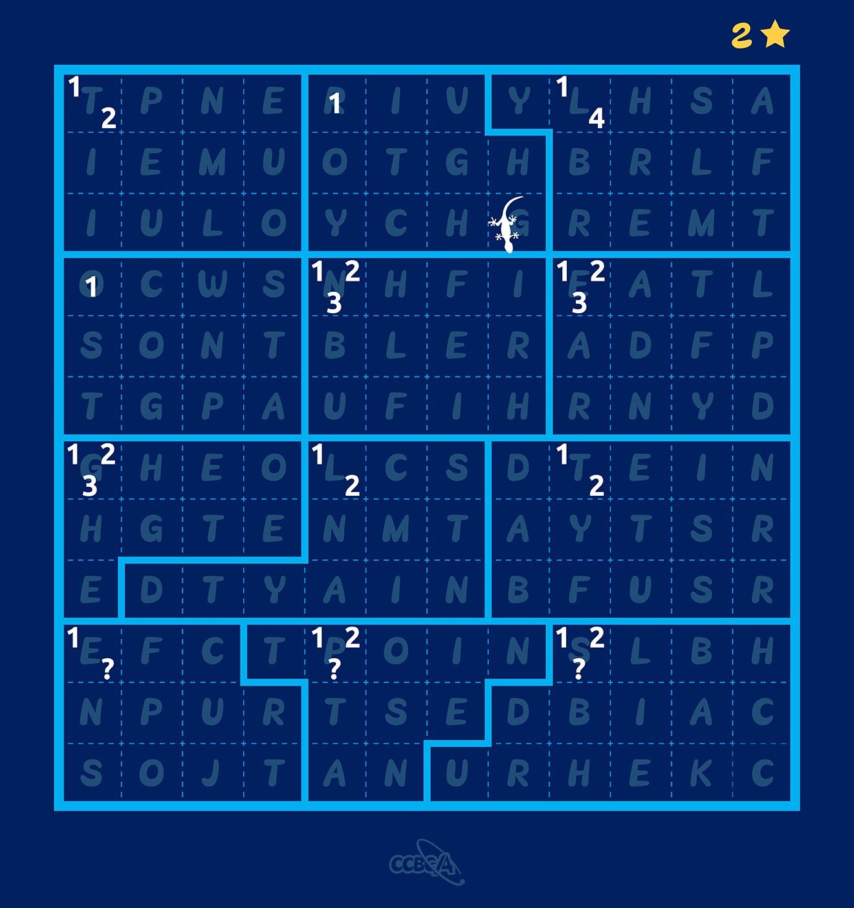
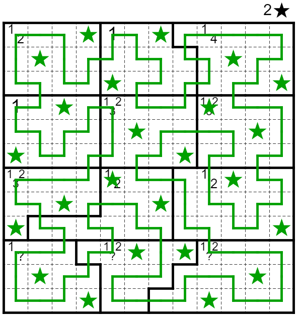
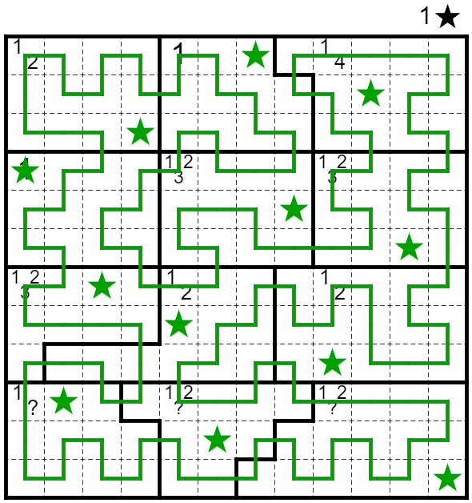
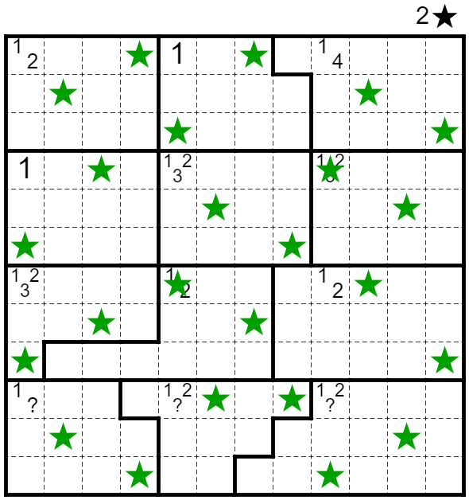
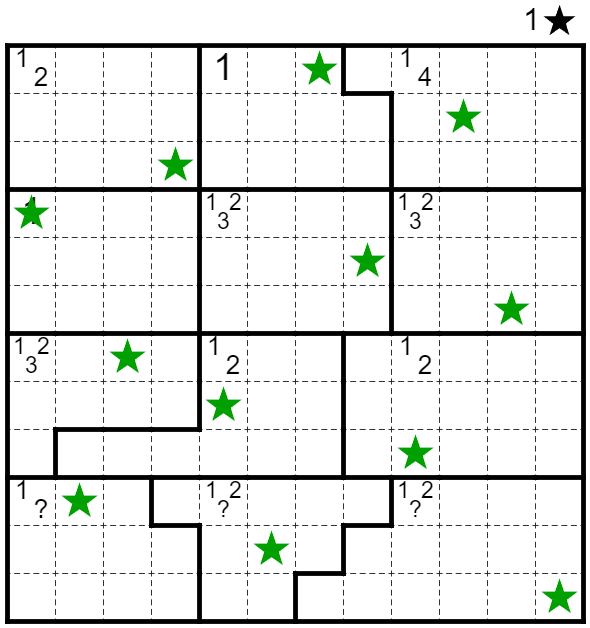

# 星穹铁道

## 题面

<p><a href="https://docs.qq.com/sheet/DS1lTZVVRTWtqeFpa?tab=BB08J2" target="_blank">腾讯文档</a><p/>

<p>星穹铁道 (Star Rail) 是传统纸笔谜题 Star Battle 和 Rail Pool 的混合。</p>
<ul>
<li>在一些格子中放星星，使得每行、每列、每个区域内都有相同数量的星星。星星互相不能相邻或者对角相邻。</li>
<li>画一条经过所有无星星的格子的回路。回路不能与自身接触或相交。</li>
<li>将每个问号变为一个数字，使得每个区域内不存在重复的数字。</li>
<li>将整个回路视为一些直线段的不交并（在转弯处断开）。对于每个区域和每个与该区域接触（或包含于该区域）的直线段，该直线段的长度必须是区域内的一个数字；反之，对于区域内的每个数字，必须存在一条与该区域接触（或包含于该区域）的该长度的直线段。换句话说，区域内包含的数字的集合必须恰好是与该区域接触（或包含于该区域）的直线段长度的集合。</li>
</ul>
<p>如果对规则理解有疑问，可以参考 <a href="https://puzz.cipherpuzzles.com/rules.html?starrail" target="_blank">链接</a>。</p>
<p>本题有中间答案验证。</p>
<p>点击图片以在网页上做题。</p>
<a href="https://puzz.cipherpuzzles.com/p.html?starrail/12/12/2/12n1n14zv1n123n123zv123n12n12zv10n120n120zv28120h08g4824140i210882818004001vvg0000vvo00s0fvs8g080" target="_blank"></a>

## 答案

`LENGTH`

## 解析

首先按规则解出纸笔谜题。



从上到下从左到右提取星星处的字母，得到 ```EVERY TWELFTH LETTER ON PATH```。

从蜥蜴处出发按路径走，每十二格提取一个字母，得到 ```USE ONE STAR```。

按照一星规则重新解出纸笔谜题。



从蜥蜴处出发按路径走，每十二格提取一个字母，得到 ```ANS IS LENGTH```。

答案即 ```LENGTH```。

## 提示

### 1. 请帮我简化一下纸笔谜题

下图给出了解答中所有星星的位置。
<a href="../../../assets/archive.cipherpuzzles.com/ccbc13/images/CCBC-14/1ff51d8eaef44c3b878a96ca7cfc2efa.webp" target="_blank"></a>

### 2. 请帮我简化一下【数据删除】

请提交 ```HOWTO``` 加上长度10的中间答案（即提交一个长度15的字符串），即可获得此资料的内容。

### 3. 【数据删除】做完了，该如何提取？

和前一部分的提取一样，但只提取回路上的字母。


## 中间答案

| 提交 | 回复 | 附加信息 |
| --- | --- | --- |
| EVERYTWELFTHLETTERONPATH | 这是本题的中间答案。 |  |
| USEONESTAR | 这是本题的中间答案。<br><br>如果在下一步纸笔谜题遇到困难，请购买标题为【数据删除】的资料以获取其简化版本。 |  |
| HOWTOUSEONESTAR | 下图给出了解答中所有星星的位置。<br><a href="../../../assets/static.cipherpuzzles.com/static/images/17fc100700dc4489bf5cae38b4ee5ae4.webp" target="_blank"></a> |  |

## 本地附件

- [1ff51d8eaef44c3b878a96ca7cfc2efa.webp](../../../assets/archive.cipherpuzzles.com/ccbc13/images/CCBC-14/1ff51d8eaef44c3b878a96ca7cfc2efa.webp)
- [2d16b59018904e30b4c3f5cb7fd18ffe.webp](../../../assets/archive.cipherpuzzles.com/ccbc13/images/CCBC-14/2d16b59018904e30b4c3f5cb7fd18ffe.webp)
- [bfe9545d5d1140848467886a65dce57d.webp](../../../assets/archive.cipherpuzzles.com/ccbc13/images/CCBC-14/bfe9545d5d1140848467886a65dce57d.webp)
- [e153e2cde2914290a5b6d8978ae075ee.webp](../../../assets/archive.cipherpuzzles.com/ccbc13/images/CCBC-14/e153e2cde2914290a5b6d8978ae075ee.webp)
- [17fc100700dc4489bf5cae38b4ee5ae4.webp](../../../assets/static.cipherpuzzles.com/static/images/17fc100700dc4489bf5cae38b4ee5ae4.webp)

来源：[https://archive.cipherpuzzles.com/ccbc13/problems/CCBC-14/26.yaml](https://archive.cipherpuzzles.com/ccbc13/problems/CCBC-14/26.yaml)
