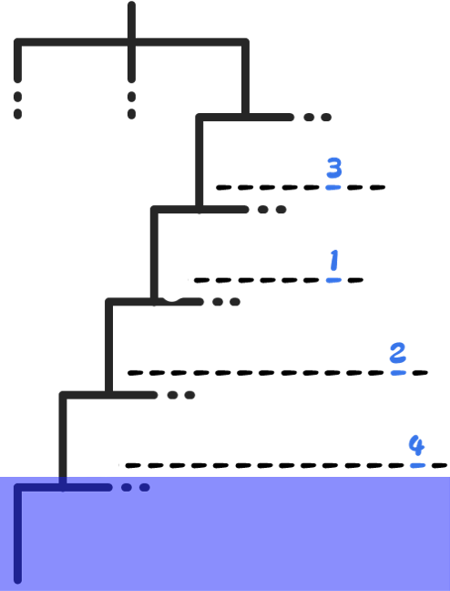
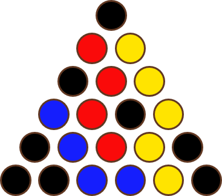
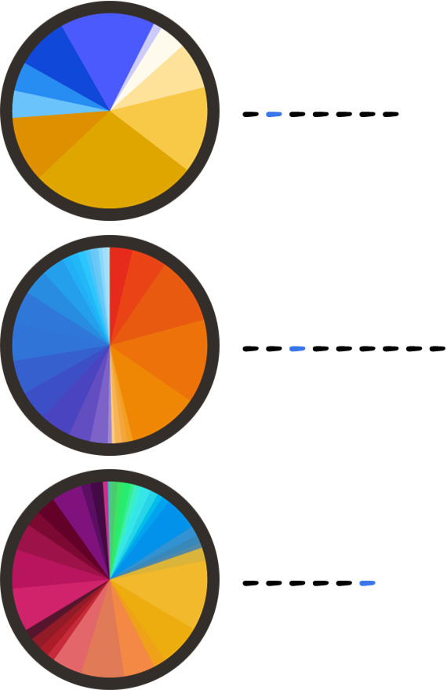
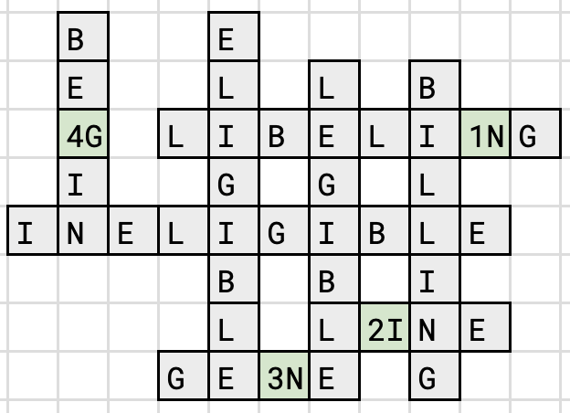
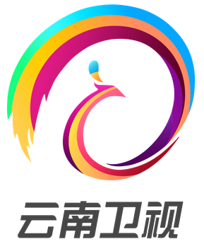

# 燃烧吧！小宇宙

## 题面

_官方存档未提供可提取的文字题面；请查看下方附件或交互源码。_

## 交互源码

### vue_template

```html
<template>
<p>据说当年为了帮助青铜五小强提升实力，十二位黄金圣斗士每人送给了他们一条锦囊妙计。然而如今人们似乎已经忘记了他们都是谁，那份记忆也如同这些锦囊一般沉入了海底……</p>
<p>（本题有五个 milestone。）</p>
<!--<p>提示：本题需要用到<a href="https://puzzle.cipherpuzzles.com/detail/9">《宇宙航线》</a>里填入的一部分答案。</p>-->
<div style="background-image: url('../../../assets/archive.cipherpuzzles.com/ccbc13/images/CCBC-14/530ad3319988451db9e7ed09809d3c54.webp'); width: 1000px; height: 831px">
  <div style="position:relative;width: 240px; height: 350px; left: 385px; top: 240px; color: black;">

    <div id="content" class="vertical-center">
      <div id="bag1" v-if="nowShowPage == 1">
        
      </div>
      <div id="bag2" v-if="nowShowPage == 2">
        <table><tr><td>阿根廷（1969）</td><td>(3/8)</td></tr>
        <tr><td>英国（1975）</td><td>(5/7)</td></tr>
        <tr><td>中国（1985）</td><td>(1/9)</td></tr>
        <tr><td>智利（1995）</td><td>(4/8)</td></tr>
        </table>
      </div>
      <div id="bag3" v-if="nowShowPage == 3">
        <table><tr><td>Caspian</td><td>(3/8)</td></tr>
        <tr><td>Greenland</td><td>(2/3 6)</td></tr>
        <tr><td>Pacific</td><td>(2/8)</td></tr>
        <tr><td>Everest</td><td>(7/7)</td></tr>
        <tr><td>Mariana</td><td>(1/5)</td></tr>
        </table>
      </div>
      <div id="bag4" v-if="nowShowPage == 4">
        <p>举办过奥运会？☐☐
<br>举办过世界杯？☐☐
<br>举办过亚运会？☐☐</p>
        <p>附近有中古世界七大奇迹？☐☐
<br>附近有古代世界七大奇迹？☐☐
<br>附近有世界七大工程奇迹？☐☐</p>
        <p>官方语言是汉语？☐☐
<br>是首都？　　　　☐☐
<br>地铁线超过10条？☐☐</p>
      </div>
      <div id="bag5" v-if="nowShowPage == 5">
        <p>红黄蓝</p>
        
      </div>
      <div id="bag6" v-if="nowShowPage == 6">
        <table><tr><td>后任</td><td>(2/7 7)</td></tr>
        <tr><td>后后任</td><td>(5/8 8)</td></tr>
        <tr><td>后后后任</td><td>(4/8 6)</td></tr>
        </table>
      </div>
      <div id="bag7" v-if="nowShowPage == 7">
        <table><tr><td>曼联</td><td>(2/3 8)</td></tr>
        <tr><td>巴塞罗那</td><td>(2/4 3)</td></tr>
        <tr><td>皇家马德里</td><td>(4/8 8)</td></tr>
        <tr><td>利物浦</td><td>(5/7)</td></tr>
        </table>
      </div>
      <div id="bag8" v-if="nowShowPage == 8">
        <p style="word-wrap: break-word; font-family: monospace">
        mdecgsrirrrvslpkrnrpslgcifgaptaaelvpgdegkeeeem...       (5/8)
        </p>
        <p style="word-wrap: break-word; font-family: monospace">
        mirlgapqslvlltllvaavlrcqgqdvrqpgpkgqkgepgdikdi...       (2/8)
        </p>
        <p style="word-wrap: break-word; font-family: monospace">
        msassdaemavfgeaapylrksekerieaqnkpfdaktsvfvaepk...       (1/6)
        </p>
      </div>
      <div id="bag9" v-if="nowShowPage == 9">
        <p>每个单词的字母集都是答案的字母（多重集）的子集。</p>
        <table class="minicw">
        <tr><td></td><td class='cw'></td><td></td><td></td><td class='cw'></td><td></td><td></td><td></td><td></td><td></td><td></td></tr>
        <tr><td></td><td class='cw'></td><td></td><td></td><td class='cw'></td><td></td><td class='cw'></td><td></td><td class='cw'></td><td></td><td></td></tr>
        <tr><td></td><td class='cw'>4</td><td></td><td class='cw'></td><td class='cw'></td><td class='cw'></td><td class='cw'></td><td class='cw'></td><td class='cw'></td><td class='cw'>1</td><td class='cw'></td></tr>
        <tr><td></td><td class='cw'></td><td></td><td></td><td class='cw'></td><td></td><td class='cw'></td><td></td><td class='cw'></td><td></td><td></td></tr>
        <tr><td class='cw'></td><td class='cw'></td><td class='cw'></td><td class='cw'></td><td class='cw'></td><td class='cw'></td><td class='cw'></td><td class='cw'></td><td class='cw'></td><td class='cw'></td><td></td></tr>
        <tr><td></td><td></td><td></td><td></td><td class='cw'></td><td></td><td class='cw'></td><td></td><td class='cw'></td><td></td><td></td></tr>
        <tr><td></td><td></td><td></td><td></td><td class='cw'></td><td></td><td class='cw'></td><td class='cw'>2</td><td class='cw'></td><td class='cw'></td><td></td></tr>
        <tr><td></td><td></td><td></td><td class='cw'></td><td class='cw'></td><td class='cw'>3</td><td class='cw'></td><td></td><td class='cw'></td><td></td><td></td></tr>
        </table>
      </div>
      <div id="bag10" v-if="nowShowPage == 10">
        <table><tr><td>钽</td><td>(7/7)</td></tr>
        <tr><td>铒</td><td>(8/8)</td></tr>
        <tr><td>铬</td><td>(2/9)</td></tr>
        <tr><td>钫</td><td>(5/5)</td></tr>
        </table>
      </div>
      <div id="bag11" v-if="nowShowPage == 11">
        <p>这些都是哪里的标志啊……</p>
        
      </div>
      <div id="bag12" v-if="nowShowPage == 12">
        <p>这是什么字符？</p>
        <table><tr><td>b</td><td>(6/9)</td></tr>
        <tr><td>r</td><td>(2/8 6)</td></tr>
        <tr><td>t</td><td>(1/3)</td></tr>
        <tr><td>\</td><td>(9/9)</td></tr>
        </table>
      </div>
    </div>
  </div>
  <div id="bags" style="position:relative;top: 480px;left:75px">
    <div @click="nowShowPage = 1"></div>
    <div @click="nowShowPage = 2"></div>
    <div @click="nowShowPage = 3"></div>
    <div @click="nowShowPage = 4"></div>
    <div @click="nowShowPage = 5"></div>
    <div @click="nowShowPage = 6"></div>
    <div @click="nowShowPage = 7"></div>
    <div @click="nowShowPage = 8"></div>
    <div @click="nowShowPage = 9"></div>
    <div @click="nowShowPage = 10"></div>
    <div @click="nowShowPage = 11"></div>
    <div @click="nowShowPage = 12"></div>
  </div>
</div> 
  <p class='answerarea'>归档说明：本题是一道 meta-matching 题，用到的小题答案来自参赛者在宇宙航线内填入的88个答案中的一部分。</p> 
</template>

<style>
#bags div {
width: 70px;
float:left;
cursor:pointer;
}
#content {
width: 100%;
transform: rotate(-5deg);
}
#content table:not(.minicw) {
width: 100%;
}
#content table td:nth-child(1) {
width: 70%;
}
.vertical-center {
  margin: 0;
  position: absolute;
  top: 20%;
  -ms-transform: translateY(-50%);
  transform: translateY(-50%);
}
#content table td.minicw { border-collapse: collapse; }
#content table.minicw td {
height:20px;
width:20px;
padding:0;
font-size: 12px;
}
#content table.minicw td.cw { text-align: center;
border: 1px solid DarkGoldenRod;
background-color: AntiqueWhite
}
.answerarea {
  margin-top: 105px;
}
.answerarea-p {
  display: flex;
  flex-wrap: wrap;
}
.answerarea-p p {
  display: block;
  width: 284px;
}
</style>
```

### vue_script

```text
const { ref, reactive, computed, inject } = Vue; //由于网页中无法import，Vue所有组件都已预先导出至Vue对象中。

const sourceData = JSON.parse(`[{"i":"1","x":"1321","y":"67","h":[3,4,8],"w":[11]},{"i":"2","x":"3417","y":"80","h":[1,2,3],"w":[7]},{"i":"3","x":"2592","y":"142","h":[0,1,2],"w":[5]},{"i":"4","x":"3713","y":"300","h":[0,1,2],"w":[7]},{"i":"5","x":"1338","y":"330","h":[0,1,2],"w":[4]},{"i":"6","x":"1880","y":"400","h":[1,5,6],"w":[9]},{"i":"7","x":"163","y":"455","h":[1,2,3],"w":[9]},{"i":"8","x":"392","y":"534","h":[0,1,11],"w":[8,6]},{"i":"9","x":"792","y":"600","h":[1,3,5],"w":[7]},{"i":"10","x":"142","y":"796","h":[0,1,3],"w":[7]},{"i":"11","x":"555","y":"667","h":[0,4,6],"w":[7]},{"i":"12","x":"763","y":"767","h":[0,3,4],"w":[7]},{"i":"13","x":"463","y":"834","h":[2,6,11],"w":[13]},{"i":"14","x":"188","y":"917","h":[1,10,11],"w":[3,2,2,9]},{"i":"15","x":"617","y":"992","h":[1,3,9],"w":[11]},{"i":"16","x":"1042","y":"675","h":[3,4,5],"w":[6]},{"i":"17","x":"1371","y":"530","h":[0,1,2],"w":[11]},{"i":"18","x":"1284","y":"655","h":[0,2,3],"w":[6]},{"i":"19","x":"1750","y":"559","h":[0,2,5],"w":[6]},{"i":"20","x":"1325","y":"880","h":[2,4,5],"w":[6]},{"i":"21","x":"1734","y":"755","h":[2,5,6],"w":[1,10]},{"i":"22","x":"2205","y":"625","h":[1,3,4],"w":[9]},{"i":"23","x":"2501","y":"492","h":[2,3,8],"w":[4,7]},{"i":"24","x":"2184","y":"838","h":[2,3,8],"w":[10]},{"i":"25","x":"184","y":"1034","h":[1,3,11],"w":[7,6]},{"i":"26","x":"34","y":"1359","h":[0,9,15],"w":[10,2,5]},{"i":"27","x":"88","y":"1521","h":[8,9,11],"w":[4,2,6]},{"i":"28","x":"38","y":"1730","h":[0,5,16],"w":[3,4,2,3,7]},{"i":"29","x":"455","y":"1234","h":[2,3,4],"w":[6]},{"i":"30","x":"484","y":"1409","h":[0,1,2],"w":[4]},{"i":"31","x":"238","y":"1625","h":[4,11,12],"w":[6,6]},{"i":"32","x":"755","y":"1300","h":[0,4,5],"w":[8]},{"i":"33","x":"659","y":"1580","h":[0,2,4],"w":[3,9]},{"i":"34","x":"650","y":"1684","h":[2,7,10],"w":[12]},{"i":"35","x":"750","y":"1121","h":[3,6,9],"w":[5,7]},{"i":"36","x":"767","y":"1463","h":[7,8,9],"w":[12]},{"i":"37","x":"967","y":"1617","h":[2,3,7],"w":[5,5]},{"i":"38","x":"1280","y":"1605","h":[1,2,3],"w":[5]},{"i":"39","x":"1171","y":"1734","h":[5,6,8],"w":[10]},{"i":"40","x":"1275","y":"1834","h":[1,5,10],"w":[11]},{"i":"41","x":"1509","y":"1738","h":[0,1,2],"w":[6]},{"i":"42","x":"1400","y":"1484","h":[1,5,6],"w":[4,2]},{"i":"43","x":"1342","y":"1134","h":[3,4,7],"w":[10]},{"i":"44","x":"1592","y":"1088","h":[8,13,14],"w":[7,2,5]},{"i":"45","x":"1792","y":"1521","h":[1,3,5],"w":[6]},{"i":"46","x":"1963","y":"1625","h":[0,3,9],"w":[11]},{"i":"47","x":"1800","y":"1775","h":[0,2,8],"w":[9]},{"i":"48","x":"1984","y":"1921","h":[7,8,11],"w":[5,6]},{"i":"49","x":"2188","y":"1825","h":[0,1,5],"w":[7]},{"i":"50","x":"2213","y":"988","h":[0,1,2],"w":[6]},{"i":"51","x":"2046","y":"1113","h":[0,1,4],"w":[5]},{"i":"52","x":"1780","y":"1184","h":[0,4,9],"w":[11]},{"i":"53","x":"2142","y":"1375","h":[2,5,7],"w":[11]},{"i":"54","x":"2446","y":"1392","h":[0,1,4],"w":[5]},{"i":"55","x":"2334","y":"1542","h":[1,2,4],"w":[11]},{"i":"56","x":"2446","y":"1675","h":[0,1,2],"w":[6]},{"i":"57","x":"2496","y":"1780","h":[4,8,15],"w":[10,5]},{"i":"58","x":"2680","y":"934","h":[0,2,3],"w":[5]},{"i":"59","x":"2755","y":"1059","h":[0,1,2],"w":[6]},{"i":"60","x":"2946","y":"963","h":[1,3,7],"w":[11]},{"i":"61","x":"2751","y":"1250","h":[0,2,4],"w":[9]},{"i":"62","x":"3092","y":"1171","h":[0,1,3],"w":[7]},{"i":"63","x":"2634","y":"1392","h":[0,1,2],"w":[5]},{"i":"64","x":"2913","y":"1405","h":[0,2,7],"w":[9]},{"i":"65","x":"3196","y":"1255","h":[1,2,3],"w":[9]},{"i":"66","x":"3146","y":"1463","h":[1,2,4],"w":[5]},{"i":"67","x":"3005","y":"1588","h":[0,2,3],"w":[5]},{"i":"68","x":"2988","y":"1696","h":[0,1,6],"w":[8]},{"i":"69","x":"2909","y":"1859","h":[2,8,9],"w":[11]},{"i":"70","x":"3292","y":"509","h":[3,4,5],"w":[11]},{"i":"71","x":"3663","y":"633","h":[7,8,12],"w":[3,11]},{"i":"72","x":"3763","y":"538","h":[1,2,3],"w":[4,4]},{"i":"73","x":"3521","y":"721","h":[0,4,7],"w":[9]},{"i":"74","x":"3126","y":"775","h":[1,2,5],"w":[8]},{"i":"75","x":"3796","y":"909","h":[0,2,3],"w":[6]},{"i":"76","x":"3713","y":"1130","h":[0,3,5],"w":[6]},{"i":"77","x":"3396","y":"1367","h":[7,8,10],"w":[6,4]},{"i":"78","x":"3776","y":"1300","h":[0,1,10],"w":[7,3]},{"i":"79","x":"3271","y":"1567","h":[1,2,7],"w":[10]},{"i":"80","x":"3696","y":"1488","h":[0,8,9],"w":[3,2,3,3]},{"i":"81","x":"3417","y":"1805","h":[5,9,12],"w":[4,5,4]},{"i":"82","x":"3255","y":"1692","h":[1,2,6],"w":[4,5]},{"i":"83","x":"1105","y":"1371","h":[6,7,8],"w":[3,10]},{"i":"84","x":"2934","y":"559","h":[1,3,5],"w":[6]},{"i":"85","x":"2488","y":"792","h":[2,4,10],"w":[6,5,8]},{"i":"86","x":"2746","y":"763","h":[0,1,4],"w":[6]},{"i":"87","x":"2267","y":"1221","h":[2,3,6],"w":[11]},{"i":"88","x":"1005","y":"988","h":[0,1,11],"w":[7,5]}]`);
let sourceDict = {};

for (let sd of sourceData) {
    sourceDict[sd.i] = {
        h: sd.h,
        w: sd.w
    }
}

export default {
    setup() {
        const PUZZLE_KEY = "spaceroute";
        const ySync = inject("ysync");
        const nowShowPage = ref(1);

        //数据源
        const d = reactive({
            text: [...new Array(sourceData.length + 1)].map(i => ""),
        });

        const data = computed(() => {
            let tempd = d.text.map((word, i) => {
                let c = sourceDict[i];
                if (!c) return {a: "", b: ""};

                let padc = c.w.map(wl => "".padStart(wl, '?')).join(' ');
                let b = padc;
                if (word && word.length > 0) {
                    b = word + padc.substring(word.length, padc.length);
                }
                let a = c.h.map(ci => b[ci]).join('');

                return {a: a, b: b};
            }).filter(sfd => sfd.b && sfd.b.length > 0);
            tempd.sort((a, b) => { if (a.a > b.a) return 1; else if (a.a < b.a) return -1; else return 0;});

            return tempd;
        });

        const getBottleImg = (isActive) => {
            if (isActive) return "../../../assets/archive.cipherpuzzles.com/ccbc13/images/CCBC-14/915201a818d44a9ba03f973fa10a4951.webp";
            else return "../../../assets/archive.cipherpuzzles.com/ccbc13/images/CCBC-14/79e895edf13647d1bda53dc65725de93.webp";
        }

        return {
            data,
            nowShowPage,
            getBottleImg
        }
    }
}
```


## 答案

`LATERAL`

## 解析

首先根据题目文本里的“青铜五小强”和“十二位黄金圣斗士”，稍微了解一下《圣斗士星矢》就能知道每位圣斗士都有对应的星座，五小强为天马座、白鸟座（也就是天鹅座）、天龙座、仙女座、凤凰座，黄金圣斗士的星座是黄道十二宫，那么本题自然需要用到这些星座的小题答案。

根据题目写的“十二位黄金圣斗士每人送了一条锦囊妙计”，加上题目下方有十二个漂流瓶，可以想到每个小题需要用到黄道十二宫之一的答案，经过各种观察、排除等可得以下解法：

## 1
用到答案：人马座 STINGRAY

这里的树状图可以看出是生物分类，最上面的三个分支对应三大域，而紫色部分对应答案 STINGRAY（魟鱼）。根据魟鱼的生物分类，从上到下分别为：

<style>
.ak td, .ak th {
padding: 5px 10px;
}
pre u, .ak u {
color: orange;
}
</style>

<pre>动物界：ANIMA<u>L</u>IA  
脊索动物门：CHORDA<u>T</u>A  
软骨鱼纲：CHONDRICHTHY<u>E</u>S  
燕魟目：MYLIOBATIFORM<u>E</u>S</pre>

按照数字提取字母 `TELE`。

## 2
用到答案：白羊座 ANTARCTIC

这些国家都在南极建有考察站，年份指出其中一个，找到对应考察站名字即可：

<pre>MA<u>R</u>AMBIO
ROTH<u>E</u>RA
<u>G</u>REATWALL
ESC<u>U</u>DERO</pre>

按数字提取字母 `REGU`。

## 3
用到答案：巨蟹座 SECOND PLACE FINISHER

可以看出这些都是一些地理上的“世界之最”，找到其后的“第二名”即可。

<table class="ak">
<tr><th></th><th>世界之最</th><th>第二名</th></tr>
<tr><td>Caspian</td><td>最大的湖</td><td>SU<u>P</u>ERIOR</td></tr>
<tr><td>Greenland</td><td>最大的岛</td><td>N<u>E</u>W GUINEA</td></tr>
<tr><td>Pacific</td><td>最大的洋</td><td>A<u>T</u>LANTIC</td></tr>
<tr><td>Everest</td><td>最高的山</td><td>CHOGOR<u>I</u></td></tr>
<tr><td>Mariana</td><td>最深的海峡</td><td><u>T</u>ONGA</td></tr>
</table>

按数字提取字母 `PETIT`。

## 4
用到答案：室女座 BEIJING VS CAIRO

根据每个问题是否在北京或开罗上成立，给方框打勾（北京在左，开罗在右），然后因为格子是 2x3，容易想到是盲文，翻译为字母得 `KER`。

## 5
用到答案：双鱼座 PASCAL

根据帕斯卡和三角形，可以想到帕斯卡三角形，填入数字后分红黄蓝相加，得到 12 12 25，换成字母得到 `LLY`。

## 6
用到答案：水瓶座 JACQUES CHIRAC

JACQUES CHIRAC 曾是法国总统，那么看他后面三位总统名字：

<pre>N<u>I</u>COLAS SARKOZY
FRAN<u>C</u>OIS HOLLANDE
EMM<u>A</u>NUEL MACRON
</pre>
按照数字提取字母得到 `ICA`。

## 7
用到答案：金牛座 STADIUMS

每个足球俱乐部都有专属的球场：
<table class="ak">
<tr><td>曼联</td><td>O<u>L</u>D TRAFFORD</td></tr>
<tr><td>巴塞罗那</td><td>C<u>A</u>MP NOU</td></tr>
<tr><td>皇家马德里</td><td>SAN<u>T</u>IAGO BERNABEU</td></tr>
<tr><td>利物浦</td><td>ANFI<u>E</u>LD</td></tr>
</table>

按照数字提取得 `LATE`。

## 8
用到答案：双子座 GENOME

每组字母都是一段蛋白质代码，搜索找到蛋白质再按照数字提取字母：

<pre>HELI<u>C</u>ASE
C<u>O</u>LLAGEN
<u>M</u>YOSIN</pre>

答案是 `COM`。

## 9
用到答案：天平座 INELIGIBLE

（这题有点凑数，基本靠排除法确定）



填完格子后取数字位置的字母可得 `NING`。

## 10
用到答案：天蝎座 THE DISCOVERER

找到每个元素的发现者，然后在姓氏里按照数字提取字母：

<table class="ak">
<tr><td>钽</td><td>EKEBER<u>G</u></td></tr>
<tr><td>铒</td><td>MOSANDE<u>R</u></td></tr>
<tr><td>铬</td><td>V<u>A</u>NQUELIN</td></tr>
<tr><td>钫</td><td>PERE<u>Y</u></td></tr>
</table>

得到 `GRAY`。

## 11
用到答案：狮子座 TELEVISION

这些代表了电视台台标的颜色组成，分别是：




<pre>N<u>I</u>NGXIA
CH<u>O</u>NGQING
YUNNA<u>N</u></pre>

将这些地区拼音填入横线，提取蓝色横线上的字母可得 `ION`。

## 12
用到答案：摩羯座 ESCAPE

这些都是 escape character（转义字符），一般对应为：

<pre>b   backs<u>p</u>ace
r   c<u>a</u>rriage return
t   <u>t</u>ab
\   backslas<u>h</u></pre>

按照数字提取 `PATH`。

## meta
到目前为止我们每道题都提取出了似词非词的碎片，但是既然这是黄道十二宫，合理的下一步就是按照十二宫的顺序重排，可以得到五个单词：`REGULATE`, `COMPETITION`, `KERNING`, `GRAY`, `TELEPATHICALLY`。

接下来我们要想到这些线索最终还是要归于“青铜五小强”的，所以再看这五个星座的答案：

<pre>天马座 PENGUIN
白鸟座 CYLINDER ENGINE
天龙座 DRAM
仙女座 SAND LARK
凤凰座 PIE IN THE SKY</pre>

通过观察可以发现，这五个答案去掉空格后长度恰与上一步五个单词相同。因此我们将它们一一对齐，提取重叠的字母：
<pre>REGULATE COMPETITION KERNING GRAY TELEPATHICALLY
SANDLARK PIEINTHESKY PENGUIN DRAM CYLINDERENGINE
    LA        T       E       RA    L</pre>

得到最终答案 `LATERAL`。

## 提示

### 1. 这题需要 88 小行星里的哪些答案？

需要《圣斗士星矢》里五位青铜圣斗士和十二位黄金圣斗士所对应的星座的答案。

### 2. 十二个锦囊的题目都解了，还是不会下一步

先将这十二个字符串根据它们的提示者排序，形成一些单词。然后再跟你还没有用到的答案对比。

### 3. 锦囊1的额外提示

提取的是界、门、纲、目。

### 4. 锦囊2的额外提示

年份是对应国家的某个设施的成立年份。

### 5. 锦囊3的额外提示

这些都是一些地理上的“世界之最”。

### 6. 锦囊4的额外提示

按照答案为是还是否转成盲文提取。

### 7. 锦囊5的额外提示

把每个颜色里的数字相加转字母。

### 8. 锦囊6的额外提示

搜索关键人物曾当过的最重要职位。

### 9. 锦囊7的额外提示

各个足球俱乐部都有专属的【数据删除】，首字母分别为O，C，S，A。

### 10. 锦囊8的额外提示

建议使用 https://blast.ncbi.nlm.nih.gov/smartblast/?LINK_LOC=BlastHomeLink 搜索。

### 11. 锦囊9的额外提示

最长的一行填的就是关键词本身。

### 12. 锦囊10的额外提示

取姓氏，其中首字母分别为E，M，V，P。

### 13. 锦囊11的额外提示

每个地方都是一个省份。

### 14. 锦囊12的额外提示

搜索“【关键词】character”。


## 中间答案

| 提交 | 回复 | 附加信息 |
| --- | --- | --- |
| REGULATE | 思路正确。 |  |
| COMPETITION | 思路正确。 |  |
| KERNING | 思路正确。 |  |
| GRAY | 思路正确。 |  |
| TELEPATHICALLY | 思路正确。 |  |

## 本地附件

- [47971f34caf8421097dfb267b8d5f9b6.webp](../../../assets/archive.cipherpuzzles.com/ccbc13/images/CCBC-14/47971f34caf8421097dfb267b8d5f9b6.webp)
- [530ad3319988451db9e7ed09809d3c54.webp](../../../assets/archive.cipherpuzzles.com/ccbc13/images/CCBC-14/530ad3319988451db9e7ed09809d3c54.webp)
- [5350b92dd9494880b3b0a8ac04aa003c.webp](../../../assets/archive.cipherpuzzles.com/ccbc13/images/CCBC-14/5350b92dd9494880b3b0a8ac04aa003c.webp)
- [723c27a89eb64e799d49650271a1b367.webp](../../../assets/archive.cipherpuzzles.com/ccbc13/images/CCBC-14/723c27a89eb64e799d49650271a1b367.webp)
- [79e895edf13647d1bda53dc65725de93.webp](../../../assets/archive.cipherpuzzles.com/ccbc13/images/CCBC-14/79e895edf13647d1bda53dc65725de93.webp)
- [7b7a7165901a4e51a6973f0ebd6b4ac5.webp](../../../assets/archive.cipherpuzzles.com/ccbc13/images/CCBC-14/7b7a7165901a4e51a6973f0ebd6b4ac5.webp)
- [915201a818d44a9ba03f973fa10a4951.webp](../../../assets/archive.cipherpuzzles.com/ccbc13/images/CCBC-14/915201a818d44a9ba03f973fa10a4951.webp)
- [9158979974ce4de39aa892a298713544.webp](../../../assets/archive.cipherpuzzles.com/ccbc13/images/CCBC-14/9158979974ce4de39aa892a298713544.webp)
- [ba009a400f804fc1a112751749f0335a.webp](../../../assets/archive.cipherpuzzles.com/ccbc13/images/CCBC-14/ba009a400f804fc1a112751749f0335a.webp)
- [ebd1be8e09744c5c93aba2d47cee58e6.webp](../../../assets/archive.cipherpuzzles.com/ccbc13/images/CCBC-14/ebd1be8e09744c5c93aba2d47cee58e6.webp)

来源：[https://archive.cipherpuzzles.com/ccbc13/problems/CCBC-14/28.yaml](https://archive.cipherpuzzles.com/ccbc13/problems/CCBC-14/28.yaml)
