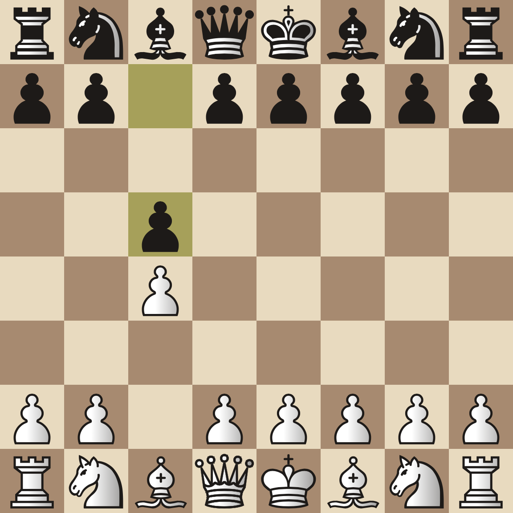
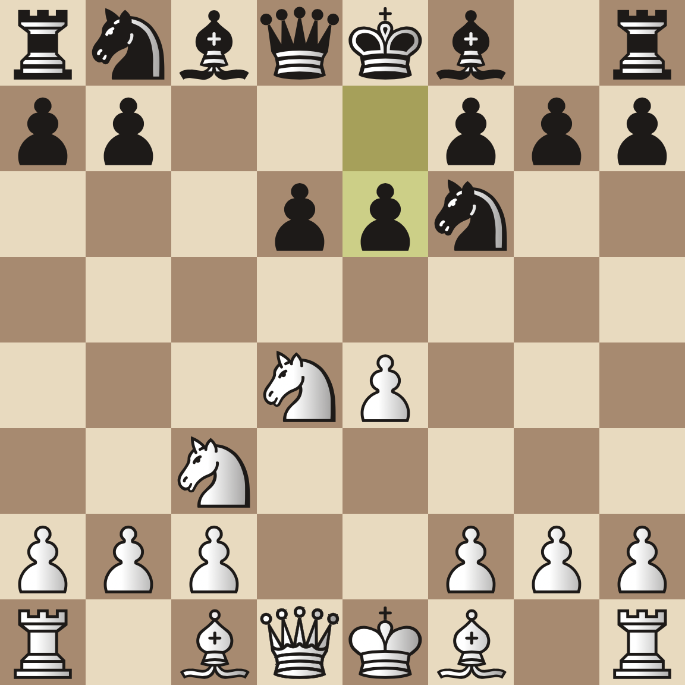
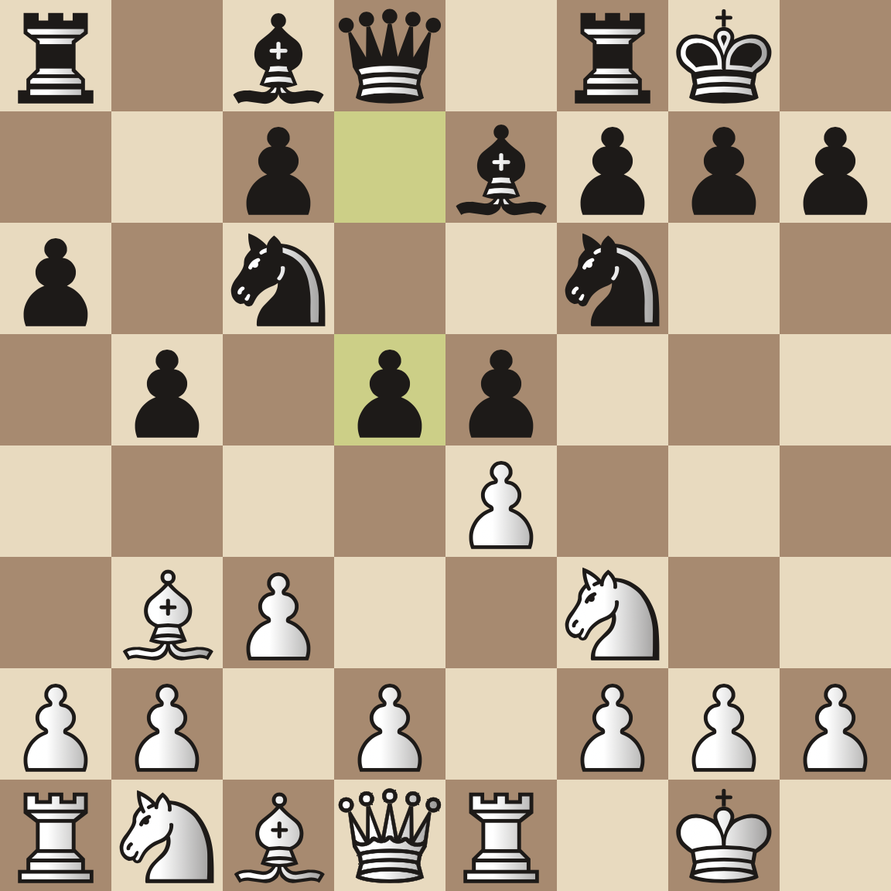
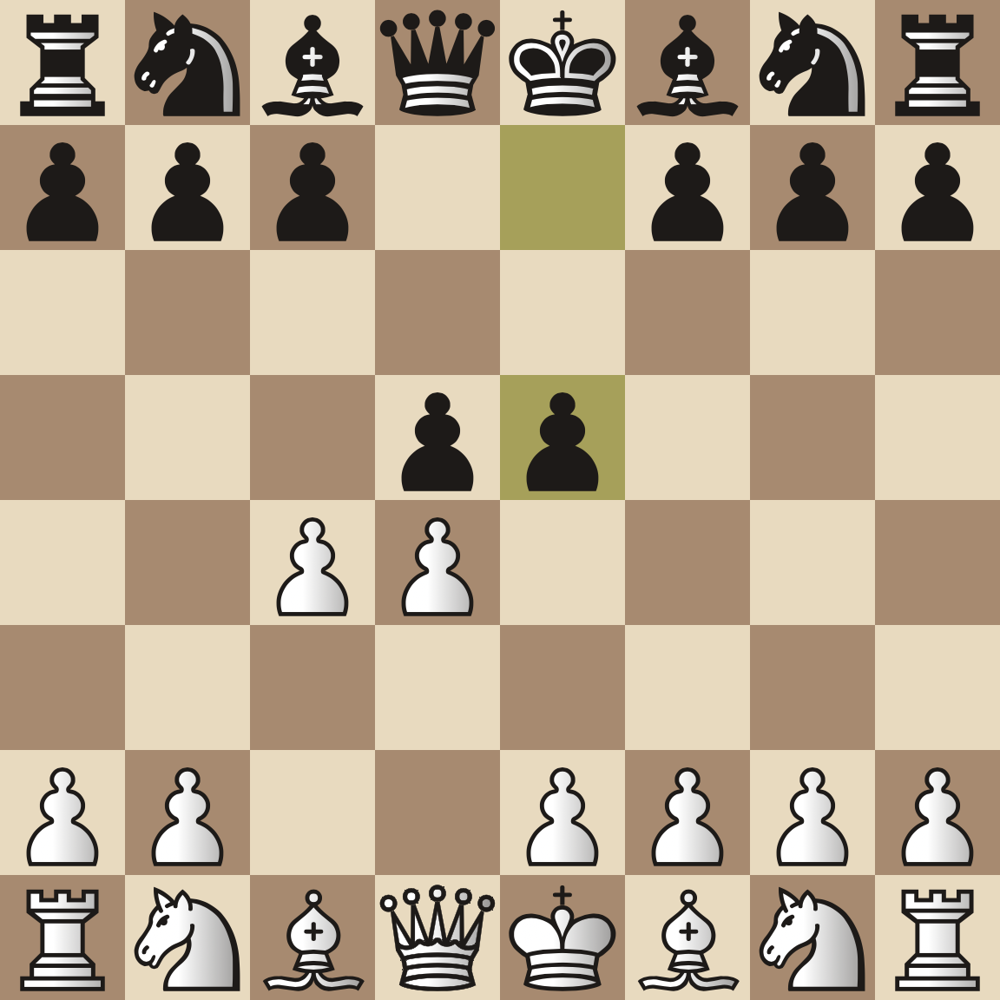
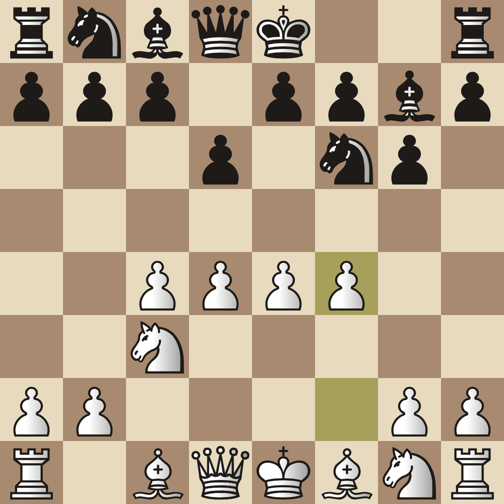

# 梅开二度

## 题面

<style>
    #boards {
        display: grid;
        grid-template-columns: 500px 100px auto;
        row-gap: 50px;
    }
    #boards img {
        width: 400px;
    }
    .myrow {
        clear: both;
        padding: 10px;
    }
    .myrow div {
        height: 57px;
        width: 57px;
        float:left;
    }
    .myrow div.mycell {
        border: 1px solid;
        width: 55px;
        text-align: center;
    }
</style>
<p><i>Find the openings...</i></p>
<div id="boards">

<div>A30</div>
<div>(7 7, 11)</div>

<div>B80</div>
<div>(8, 12 9)</div>

<div>C89</div>
<div>(3 5, 8 13)</div>

<div>D08</div>
<div>(5'1 6 8, 5 13)</div>

<div>E76</div>
<div>(4'1 6, 4 5 6)</div>
</div>

<div style="margin-top: 40px;font-size: 30px;">


<div class='myrow'>
<div class='mycell'>A<sub>15</sub></div><div></div><div class='mycell'>D<sub>12</sub></div><div class='mycell'>D<sub>19</sub></div><div class='mycell'>A<sub>22</sub></div><div class='mycell'>E<sub>19</sub></div><div class='mycell'>E<sub>5</sub></div><div class='mycell'>D<sub>33</sub></div><div class='mycell'>D<sub>21</sub></div><div class='mycell'>E<sub>22</sub></div><div class='mycell'>A<sub>1</sub></div><div class='mycell'>D<sub>13</sub></div><div class='mycell'>B<sub>22</sub></div><div class='mycell'>D<sub>29</sub></div><div class='mycell'>B<sub>18</sub></div><div class='mycell'>B<sub>25</sub></div>
</div>
<div class='myrow'>
<div class='mycell'>E<sub>11</sub></div><div class='mycell'>C<sub>23</sub></div><div class='mycell'>D<sub>27</sub></div><div class='mycell'>E<sub>7</sub></div><div class='mycell'>E<sub>16</sub></div><div class='mycell'>C<sub>27</sub></div><div class='mycell'>A<sub>24</sub></div><div class='mycell'>D<sub>18</sub></div><div></div><div class='mycell'>D<sub>7</sub></div><div class='mycell'>D<sub>4</sub></div><div class='mycell'>C<sub>15</sub></div><div class='mycell'>D<sub>10</sub></div>
</div>
<div class='myrow'>
<div class='mycell'>B<sub>19</sub></div><div class='mycell'>C<sub>14</sub></div><div></div><div class='mycell'>C<sub>21</sub></div><div class='mycell'>D<sub>6</sub></div><div class='mycell'>D<sub>15</sub></div><div class='mycell'>C<sub>13</sub></div><div class='mycell'>A<sub>8</sub></div><div class='mycell'>D<sub>23</sub></div><div class='mycell'>D<sub>11</sub></div><div class='mycell'>B<sub>26</sub></div><div class='mycell'>B<sub>1</sub></div><div class='mycell'>D<sub>3</sub></div><div class='mycell'>A<sub>21</sub></div><div class='mycell'>D<sub>34</sub></div>
</div>
<div class='myrow'>
<div class='mycell'>A<sub>6</sub></div><div class='mycell'>A<sub>19</sub></div><div class='mycell'>E<sub>8</sub></div><div class='mycell'>B<sub>9</sub></div><div class='mycell'>A<sub>16</sub></div><div class='mycell'>D<sub>35</sub></div><div class='mycell'>A<sub>9</sub></div><div></div><div class='mycell'>B<sub>11</sub></div><div class='mycell'>E<sub>13</sub></div><div class='mycell'>A<sub>3</sub></div><div class='mycell'>B<sub>14</sub></div><div class='mycell'>E<sub>17</sub></div><div class='mycell'>E<sub>15</sub></div>
</div>
<div class='myrow'>
<div class='mycell'>C<sub>6</sub></div><div></div><div class='mycell'>D<sub>28</sub></div><div class='mycell'>D<sub>31</sub></div>
</div>
<div class='myrow'>
<div class='mycell'>D<sub>22</sub></div><div class='mycell'>C<sub>4</sub></div><div class='mycell'>C<sub>10</sub></div><div class='mycell'>A<sub>17</sub></div><div class='mycell'>C<sub>24</sub></div><div></div><div class='mycell'>E<sub>4</sub></div><div class='mycell'>B<sub>6</sub></div><div class='mycell'>D<sub>9</sub></div><div class='mycell'>E<sub>21</sub></div><div class='mycell'>D<sub>20</sub></div><div class='mycell'>B<sub>28</sub></div>
</div>
<div class='myrow'>
<div class='mycell'>E<sub>1</sub></div><div></div><div class='mycell'>E<sub>24</sub></div><div class='mycell'>A<sub>18</sub></div><div class='mycell'>D<sub>8</sub></div><div class='mycell'>A<sub>14</sub></div><div class='mycell'>E<sub>6</sub></div>
</div>
<div class='myrow'>
<div class='mycell'>C<sub>17</sub></div><div class='mycell'>B<sub>7</sub></div><div class='mycell'>A<sub>23</sub></div><div class='mycell'>C<sub>16</sub></div><div class='mycell'>E<sub>10</sub></div><div></div><div class='mycell'>C<sub>3</sub></div><div class='mycell'>C<sub>9</sub></div><div class='mycell'>C<sub>18</sub></div><div class='mycell'>B<sub>23</sub></div><div class='mycell'>C<sub>7</sub></div>
</div>


</div>

## 答案

`ON`

## 解析

首先根据给出的图片，ECO编号和字母长度题目搜索出五个国际象棋开局（opening）：
<style>
#answerkey tr:nth-child(even) td {
background-color: #444;
}
#answerkey td {
vertical-align: top;
padding: 3px 10px;
}
</style>
<table id="answerkey">
<tr><td>ECO编号</td><td>开局名称</td></tr>
<tr><td>A30</td><td>English Opening, Symmetrical</td></tr>
<tr><td>B80</td><td>Sicilian, Scheveningen Variation</td></tr>
<tr><td>C89</td><td>Ruy Lopez, Marshall Counterattack</td></tr>
<tr><td>D08</td><td>Queen's Gambit Declined, Albin Countergambit</td></tr>
<tr><td>E76</td><td>King's Indian, Four Pawns Attack</td></tr>
</table>

解出开局后在下面表格中填写对应开局名的第x个字母（如A<sub>15</sub>为English Opening, Symmetrical的第15个字母S），得到8个看似无规律的字符串
```
S TEINSGATEDANGA
NRONPAAN GELB
EA TSCHOBITSERA
SEDSYMPH OGEAR
P UE
LLAMA GIMADO
K AMAGI
CACLA YMORE
```
但仔细观察可以发现这些字符串重新分词后可以得到8部动漫的名字。再根据ft中的opening找出它们的片头曲名，发现长度和给出的表格一致：

<table id="answerkey">
<tr><td>动漫名</td><td>片头曲名</td></tr>
<tr><td>Steins'Gate</td><td>H<font color=yellow>a</font>cking to the gate</td></tr>
<tr><td>Danganronpa</td><td>Never say <font color=yellow>n</font>ever</td></tr>
<tr><td>Angel Beats</td><td>My <font color=yellow>s</font>oul, your beats</td></tr>
<tr><td>Chobits</td><td>Let me be <font color=yellow>w</font>ith you</td></tr>
<tr><td>Erased</td><td>R<font color=yellow>e</font>:Re:</td></tr>
<tr><td>Symphogear</td><td>Synch<font color=yellow>r</font>ogazer</td></tr>
<tr><td>Puella Magi Madoka Magica</td><td>C<font color=yellow>o</font>nnect</td></tr>
<tr><td>Claymore</td><td>Raiso<font color=yellow>n</font> D'Etre</td></tr>
</table>

提取空格处的字母可得`ANSWERON`， 故本题答案为`ON`。

## 提示

### 1. 我毫无头绪

这些是国际象棋开局（opening），以及对应的在开局百科全书（ECO）中的编号。找出它们的名字。这道题只需要五个开局的名字。

### 2. 通过那些字母和数字我得到了八个【数据删除】，但下一步该怎么进行？

结合你得到的新信息，思考 Opening 的另一个意思（常被简写为 op）。

### 3. 通过搜索我找到了上面那八个【数据删除】的【数据删除】，下一步该怎么做？

观察你这一步得到的东西的长度，并且跟题目下面的那些格子做对比，注意题目里空洞的位置。

### 4. 还是第一步，找到了五个【数据删除】后该怎么办？

棋盘下方的信息表示提取对应东西的字母。举例 A15 表示提取上面 A30 所表示的【数据删除】的第 15 个字母。


## 本地附件

- [0349aa1175d74a5db824e46acb948d96.webp](../../../assets/archive.cipherpuzzles.com/ccbc13/images/CCBC-14/0349aa1175d74a5db824e46acb948d96.webp)
- [22ba783c4e074541831e36bbe03a44bc.webp](../../../assets/archive.cipherpuzzles.com/ccbc13/images/CCBC-14/22ba783c4e074541831e36bbe03a44bc.webp)
- [4967bc032a0b48218ab1b006095e6c66.webp](../../../assets/archive.cipherpuzzles.com/ccbc13/images/CCBC-14/4967bc032a0b48218ab1b006095e6c66.webp)
- [71fc8d9d282b467fb22b86dcc66535c3.webp](../../../assets/archive.cipherpuzzles.com/ccbc13/images/CCBC-14/71fc8d9d282b467fb22b86dcc66535c3.webp)
- [8b6805020d74448a8229ed2316ac41d3.webp](../../../assets/archive.cipherpuzzles.com/ccbc13/images/CCBC-14/8b6805020d74448a8229ed2316ac41d3.webp)

来源：[https://archive.cipherpuzzles.com/ccbc13/problems/CCBC-14/30.yaml](https://archive.cipherpuzzles.com/ccbc13/problems/CCBC-14/30.yaml)
