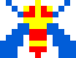
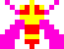

# 大蜜蜂

## 题面

<div id="beepuzzle">
	<div>
		<canvas class="canvas" id="canvas3" width="800" height="800"></canvas>
			<p>
			
			
			
			
			&nbsp;&nbsp;&nbsp;&nbsp;
			
			
			
			
			
			
			
		</p>
	</div>
	<div>
		<canvas class="canvas" id="canvas6" width="800" height="300"></canvas>
		<p>
			
			
			
			
		</p>
	</div>
	<div>
		<canvas class="canvas" id="canvas8" width="800" height="800"></canvas>
		<p>
			
			
			
			
			
			
			
		</p>
	</div>
	<div>
		<canvas class="canvas" id="canvas2" width="800" height="300"></canvas>
		<p>
		
		
		'
		&nbsp;&nbsp;&nbsp;&nbsp;
		
		
		
		
		
		
		
	</p>
	</div>
	<div>
		<canvas class="canvas" id="canvas7" width="800" height="500"></canvas>
		<p>
		
		
		
		
		
		&nbsp;&nbsp;&nbsp;&nbsp;
		
		
		
		
		
		</p>
	</div>
	<div>
		<canvas class="canvas" id="canvas1" width="700" height="300"></canvas>
		<p>
			
			
			
			
			
			'
			&nbsp;&nbsp;&nbsp;&nbsp;
			
			
			
			
			
			
		</p>
	</div>
	<div>
		<canvas class="canvas" id="canvas4" width="650" height="700"></canvas>
		<p>
			
			
			
			
			
		</p>
	</div>
	<div>
		<canvas class="canvas" id="canvas5" width="800" height="800"></canvas>
		<p>
			
			
			
			
			
			
			&nbsp;&nbsp;&nbsp;&nbsp;
			
			
			
			
		</p>
	</div>
</div>

## 交互源码

### javascript

```javascript
( function() {
	const bees = [[new Image(), new Image()], [new Image(), new Image()]];
	const wingspeed = 100;
	var speed2a = 60;
	var speed2b = 20;
	var start2a = 30;
	var start2b = 500;
	const lineHeight = 250;
	var size2a = 30;
	var size2b = 10;
	var zoommode = false;
	var zoomedtime = null;
	var zoomtime = null;
	var zoomspeed = 1;
	var zoomed = 0;
	const size3a = 100;
	const size3b = 50;

	function init() {
		bees[0][0].src = "../../../assets/static.cipherpuzzles.com/static/images/0ac0538daa184b5481d35ac002e85d9c.svg";
		bees[1][0].src = "../../../assets/static.cipherpuzzles.com/static/images/fdb40c12425c4e609299b8de63a51348.svg";
		bees[0][1].src = "../../../assets/static.cipherpuzzles.com/static/images/cd78dd18b9aa41ee801f9938953296ab.svg";
		bees[1][1].src = "../../../assets/static.cipherpuzzles.com/static/images/b1b9109fc0bc49068bdf0ba709af05d8.svg";
		zoomedtime = new Date();
		stepTime = new Date();
		time5 = new Date();
		start8 = new Date();
		init6();
		window.requestAnimationFrame(draw);
	}
	function drawbee(time, ctx, size=30, color=0, angle=0) {
		let x = Math.round((time.getSeconds() * 1000 + time.getMilliseconds()) / wingspeed);
		let phase = x % 2;
		ctx.save();
		ctx.rotate(angle);
		ctx.translate(-size/2, -size/2);
		ctx.drawImage(bees[color][phase], 0, 0, size, size);
		ctx.restore();
	}
	function drawbeeu(time, ctx, size=30, color=0) {
		drawbee(time, ctx, size, color, angle=0);
	}
	function drawbeer(time, ctx, size=30, color=0) {
		drawbee(time, ctx, size, color, angle=Math.PI/2);
	}
	function drawbeel(time, ctx, size=30, color=0) {
		drawbee(time, ctx, size, color, angle=-Math.PI/2);
	}
	function drawbeed(time, ctx, size=30, color=0) {
		drawbee(time, ctx, size, color, angle=Math.PI);
	}

	const maxangle = Math.PI / 4;
	const height = 250;
	const speed1 = 4;
	function drawbee11(time, ctx) {
		var angle = Math.cos((time.getSeconds() + time.getMilliseconds() / 1000) * speed1) * maxangle;
		if (angle < 0) {
			angle = 0;
		}
		ctx.save();
		ctx.rotate(angle);
		ctx.translate(0, height);
		drawbee(time, ctx);
		ctx.restore();
	}
	function drawbee15(time, ctx) {
		var angle = Math.cos((time.getSeconds() + time.getMilliseconds() / 1000) * speed1)* maxangle;
		if (angle > 0) {
			angle = 0;
		}
		ctx.save();
		ctx.rotate(angle);
		ctx.translate(0, height);
		drawbee(time, ctx);
		ctx.restore();
	}
	function draw1(time) {
		const canvas = document.getElementById("canvas1")
		const ctx = canvas.getContext("2d");
		ctx.clearRect(0, 0, canvas1.width, canvas1.height);
		ctx.save();
		ctx.translate(height, 0); 
		drawbee11(time, ctx);
		ctx.translate(35, height);
		drawbee(time, ctx);
		ctx.translate(35, 0);
		drawbee(time, ctx);
		ctx.translate(35, 0);
		drawbee(time, ctx);
		ctx.translate(35, -height);
		drawbee15(time, ctx);
		ctx.restore();
	}

	function draw2(time) {
		const canvas = document.getElementById("canvas2")
		const ctx = canvas.getContext("2d");
		ctx.clearRect(0, 0, canvas.width, canvas.height);
		ctx.strokeStyle = "rgba(0, 255, 0, 1.0)";
		ctx.fillStyle = "rgba(0, 255, 0, 1.0)";
		ctx.save();
		
		ctx.beginPath();
		ctx.moveTo(0, lineHeight);
		ctx.lineTo(canvas.width, lineHeight);
		ctx.stroke();

		if (zoommode) {
			let elapsedTime = (time - zoomtime) / 1000;
			let xa = start2b - (start2b - start2a) / zoomspeed * elapsedTime;
			let endb = start2b + (start2b - start2a) / speed2a * speed2b;
			let xb = endb - (endb - start2b) / zoomspeed * elapsedTime;
			let sizemult = 1 + (speed2a/speed2b - 1) / zoomspeed * elapsedTime;
			let size2a_tmp = size2a * sizemult;
			let size2b_tmp = size2b * sizemult;
			ctx.fillStyle = "rgba(255, 0, 0, 1.0)";
			ctx.fillRect(xa - 1,lineHeight - 1,3,3);
			ctx.fillRect(xb - 1,lineHeight - 1,3,3);
			if (xa <= start2a) {
				zoommode = false;
				zoomedtime = time;
				size2a = size2a_tmp;
				size2b = size2b_tmp;
				speed2a *= 1.5;
				speed2b *= 1.5;
				zoomed += 1;
				// reset
				if (zoomed > 4) {
					size2a = 30;
					size2b = 10;
					speed2a = 60;
					speed2b = 20;
					zoomed = 0;
				}
			}

			ctx.translate(xa, lineHeight - size2a_tmp/2 - 10);
			drawbeer(new Date(0), ctx, size2a_tmp);
			ctx.restore();
			ctx.save();
			ctx.translate(xb, lineHeight - size2b_tmp/2 - 10);
			drawbeer(new Date(0), ctx, size2b_tmp);
		} else {
			ctx.fillRect(start2a - 1,lineHeight - 1,3,3);
			ctx.fillRect(start2b - 1,lineHeight - 1,3,3);
			var elapsedTime = (time - zoomedtime) / 1000;
			var xa = elapsedTime * speed2a + start2a;
			var xb = elapsedTime * speed2b + start2b;
			ctx.fillStyle = "rgba(255, 0, 0, 1.0)";
			ctx.fillRect(xa - 1,lineHeight - 1,3,3);
			ctx.fillRect(xb - 1,lineHeight - 1,3,3);
			ctx.translate(xa, lineHeight - size2a/2 - 10);
			drawbeer(time, ctx, size2a);
			ctx.restore();
			ctx.save();
			ctx.translate(xb, lineHeight - size2b/2 - 10);
			drawbeer(time, ctx, size2b);

			if (xa > start2b) {
				zoommode = true;
				zoomtime = time;
			}
		}
		ctx.restore();
	}

	function draw3(time) {
		const canvas = document.getElementById("canvas3")
		const ctx = canvas.getContext("2d");
		ctx.clearRect(0, 0, canvas.width, canvas.height);
		ctx.save();
		
		let angle1 = -(((2 * Math.PI) / 60) * time.getSeconds() +
		    ((2 * Math.PI) / 60000) * time.getMilliseconds());
		let angle2 = -(((2 * Math.PI) / 6) * time.getSeconds() +
		    ((2 * Math.PI) / 6000) * time.getMilliseconds());

		let dark = Math.abs((angle2 - Math.PI / 2) % (Math.PI * 2)) < Math.PI / 10;

		ctx.translate(canvas.width/2, canvas.height/2);
		drawbee(time, ctx, size3a);
		ctx.rotate(angle1);
		ctx.translate(300, 0);
		drawbee(time, ctx, size3b);
		ctx.fillStyle = "rgba(10, 10, 10, 0.6)";
		if (dark) {
			ctx.translate(-size3b/2, -size3b/2);
			ctx.fillRect(0, 0, size3b, size3b);
			ctx.translate(size3b/2, size3b/2);
		}

		ctx.save();
		ctx.rotate(angle2);
		ctx.translate(0, 50);
		drawbeer(time, ctx, 30);
		ctx.restore();

		ctx.restore();
	}

	var step4 = 0;
	const step4wait = 0.3;
	var stepTime = null;
	function draw4(time) {
		const canvas = document.getElementById("canvas4")
		const ctx = canvas.getContext("2d");
		ctx.clearRect(0, 0, canvas.width, canvas.height);
		ctx.save();
		let deltat = ((time - stepTime) / 500);
		if (deltat > 1 + step4wait) {
			step4 += 1;
			step4 = step4 % 6;
			stepTime = time;
			deltat = 0;
		} else if (deltat > 1) {
			deltat = 1;
		}

		ctx.save();
		if (step4 % 3 == 0) {
			ctx.fillStyle = "rgba(0, 255, 0, 1.0)";	
		} else {
			ctx.fillStyle = "rgba(0, 120, 0, 1.0)";	
		}
		
		ctx.fillRect(100 + 200 * (step4 % 3), 100, 20, 20);
		ctx.restore();

		if (step4 == 0) {
			let deltay = deltat * 300;
			ctx.save();

			ctx.translate(100, 500 - deltay);
			drawbeed(time, ctx, 50);
			ctx.translate(0, 100);
			drawbeeu(time, ctx, 50, 1);

			ctx.restore();
			
			ctx.translate(170, 500);
			drawbeed(time, ctx, 50);
			ctx.translate(0, 100);
			drawbeeu(time, ctx, 50, 1);
		} else if (step4 == 1) {
			ctx.translate(100, 200);
			drawbeed(time, ctx, 50);
			ctx.translate(0, 100);
			drawbeeu(time, ctx, 50, 1);

			let deltay = 0;
			let deltax = 0;
			let bp = 0.65;
			let bpy = 250;
			let bpx = 50;
			if (deltat < bp) {
				deltat /= bp;
				deltay = bpy * deltat;
				deltax = bpx * deltat;
			} else {
				deltay = bpy + (300-bpy) * (deltat - bp) / (1-bp);
				deltax = bpx + (300-bpx) * (deltat - bp) / (1-bp);
			}

			ctx.translate(70 + deltax, 200 - deltay);
			drawbeed(time, ctx, 50);
			ctx.translate(0, 100);
			drawbeeu(time, ctx, 50, 1);
		} else if (step4 == 2) {
			ctx.save();
			let deltax = 300 * deltat;
			ctx.translate(100 + deltax, 200);
			drawbeed(time, ctx, 50);
			ctx.translate(0, 100);
			drawbeeu(time, ctx, 50, 1);
			ctx.restore();

			ctx.translate(470, 200);
			drawbeed(time, ctx, 50);
			ctx.translate(0, 100);
			drawbeeu(time, ctx, 50, 1);
		} else if (step4 == 3) {
			ctx.translate(400, 200);
			drawbeed(time, ctx, 50);
			ctx.save();
			ctx.translate(0, 100);
			drawbeeu(time, ctx, 50, 1);
			ctx.restore();
			let deltay = 300 * deltat;
			ctx.translate(70, deltay);
			drawbeed(time, ctx, 50);
			ctx.translate(0, 100);
			drawbeeu(time, ctx, 50, 1);
		} else if (step4 == 4) {
			ctx.translate(400, 200);
			ctx.save();
			ctx.translate(70, 300);
			drawbeed(time, ctx, 50);
			ctx.translate(0, 100);
			drawbeeu(time, ctx, 50, 1);
			ctx.restore();

			let bp = 0.65;
			let bpy = 250;
			let bpx = 50;
			if (deltat < bp) {
				deltat /= bp;
				deltay = bpy * deltat;
				deltax = bpx * deltat;
			} else {
				deltay = bpy + (300-bpy) * (deltat - bp) / (1-bp);
				deltax = bpx + (300-bpx) * (deltat - bp) / (1-bp);
			}
			ctx.translate(-deltax, deltay);
			drawbeed(time, ctx, 50);
			ctx.translate(0, 100);
			drawbeeu(time, ctx, 50, 1);
		} else if (step4 == 5) {
			ctx.save();
			ctx.translate(100, 500);
			drawbeed(time, ctx, 50);
			ctx.translate(0, 100);
			drawbeeu(time, ctx, 50, 1);
			ctx.restore();
			ctx.translate(470, 500);
			let deltax = -300 * deltat;
			ctx.translate(deltax, 0);
			drawbeed(time, ctx, 50);
			ctx.translate(0, 100);
			drawbeeu(time, ctx, 50, 1);
		}

		ctx.restore();
	}

	const height5_start = [10, 15, 16, 17, 0, 9, 6, 11, 12, 8, 13, 3, 7, 1, 19, 2, 5, 18, 4, 14];
	var height5 = height5_start.slice();
	var index5 = 0;
	var bad5 = false;
	var time5 = null;
	function draw5(time) {
		const canvas = document.getElementById("canvas5")
		const ctx = canvas.getContext("2d");
		ctx.clearRect(0, 0, canvas.width, canvas.height);
		ctx.save();
		let deltat = ((time - time5) / 500);
		if (deltat > 1) {
			deltat = 0;
			if (height5[index5] < height5[index5 + 1]) {
				let tmp = height5[index5];
				height5[index5] = height5[index5 + 1];
				height5[index5 + 1] = tmp;
				bad5 = true;
			}
			index5 += 1;
			index5 = index5 % 19;
			if (index5 == 0) {
				if (!bad5) {
					height5 = height5_start.slice();
				}
				bad5 = false;
			}
			time5 = new Date();
		}
		for (var i in height5) {
			let deltax = 0;
			if (i == index5 || i == index5 + 1) {
				if (height5[index5] < height5[index5 + 1]) {
					if (i == index5) {
						deltax = deltat * 30;
					} else {
						deltax = -deltat * 30;
					}
				}
			}
			ctx.save();
			ctx.translate(30 + i * 35 + deltax, 30 + height5[i] * 35);
			drawbee(time, ctx);
			ctx.restore();
		}
		if (height5[index5] < height5[index5 + 1]) {
			ctx.fillStyle = "rgba(255, 0, 0, 1.0)";	
		} else {
			ctx.fillStyle = "rgba(0, 255, 0, 1.0)";	
		}
		ctx.fillRect(30 + index5 * 35, 750, 20, 20);
		ctx.restore();
	}

	const lineHeight6 = 220;
	const x6_init = 800;
	const y6_init = 200;
	const vx6_init = -180;
	const vy6_init = -150;
	const a6 = 600;
	var x6 = null, y6 = null;
	var time6 = null;
	var vx6 = null;
	var vy6 = null;
	var av6 = 5;
	var av6b = 2;
	var step6 = null;
	var stoptime6 = null;
	var jumped = false;
	var angle6 = -Math.PI/2;
	function init6() {
		time6 = new Date();
		angle6 = -Math.PI/2;
		jumped = false;
		step6 = 0;
		x6 = x6_init;
		y6 = y6_init;
		vx6 = vx6_init;
		vy6 = vy6_init;
	}
	function draw6(time) {
		let elapsedTime = (time - time6) / 1000;

		const canvas = document.getElementById("canvas6")
		const ctx = canvas.getContext("2d");
		ctx.clearRect(0, 0, canvas.width, canvas.height);
		ctx.strokeStyle = "rgba(0, 255, 0, 1.0)";
		ctx.fillStyle = "rgba(0, 255, 0, 1.0)";
		ctx.save();
		
		ctx.beginPath();
		ctx.moveTo(0, lineHeight6);
		ctx.lineTo(canvas.width, lineHeight6);
		ctx.stroke();

		if (step6 <= 5) {
			x6 += elapsedTime * vx6;
			y6 += elapsedTime * vy6;
			vy6 += elapsedTime * a6;
			if (step6 > 3) {
				angle6 += (elapsedTime * a6 / 300);
			}
			if (y6 > 200) {
				vy6 = vy6_init;
				y6 = 200;
				step6++;
				if (step6 == 6) {
					stoptime6 = time;
					angle6 = Math.PI/2;
				}
			}
		} else if (step6 == 6) {
			if (time - stoptime6 > 1000) {
				step6++;
				vy6 = -300;
				vx6 = 50;
			}
		} else if (step6 == 7) {
			x6 += elapsedTime * vx6;
			y6 += elapsedTime * vy6;
			vy6 += elapsedTime * a6;
			if (y6 < 150) {
				jumped = true;
			}
			if (jumped && y6 > 150) {
				step6++;
				vx6 = 0;
				vy6 = -200;
				jumped = false;
			}
		} else if (step6 <= 10) {
			x6 += elapsedTime * vx6;
			y6 += elapsedTime * vy6;
			vy6 += elapsedTime * a6;
			if (y6 < 150) {
				jumped = true;
			}
			if (jumped && y6 > 150 + step6 * 2) {
				step6++;
				vx6 = 0;
				vy6 = -200;
				jumped = false;
				if (step6 == 11) {
					vy6 = -400;
				}
			}
		} else if (step6 == 11) {
			x6 += elapsedTime * vx6;
			y6 += elapsedTime * vy6;
			vy6 += elapsedTime * a6;
			if (y6 < 180) {
				jumped = true;
			}
			if (jumped && y6 >= 200) {
				y6 = 200;
				step6++;
				stoptime6 = time;
			}
		} else if (step6 == 12) {
			if (time - stoptime6 > 100) {
				step6++;
				stoptime6 = time;
			}
		} else if (step6 == 13) {
			angle6 += elapsedTime * av6;
			if (angle6 >= Math.PI) {
				step6++;
			}
		} else if (step6 == 14) {
			angle6 -= elapsedTime * av6;
			if (angle6 <= Math.PI / 2) {
				step6++;
				stoptime6 = time;
			}
		} else if (step6 == 15) {
			if (time - stoptime6 > 300) {
				step6++;
			}
		} else if (step6 == 16) {
			angle6 += elapsedTime * av6b;
			if (angle6 >= Math.PI) {
				step6++;
				stoptime6 = time;
			}
		}

		ctx.translate(x6, y6);
		drawbee(time, ctx, 30, 0, angle6);

		ctx.restore();

		if (step6 == 17) {
			let opacity = (time - stoptime6) / 2000;
			if (opacity > 1) {
				step6++;
				stoptime6 = time;
			}
			ctx.fillStyle = "rgba(0, 0, 0, " + opacity + ")";
			ctx.fillRect(0, 0, canvas.width, canvas.height);
		} else if (step6 == 18) {
			ctx.fillStyle = "rgba(0, 0, 0, 1)";
			ctx.fillRect(0, 0, canvas.width, canvas.height);
			if (time - stoptime6 > 3000) {
				init6();
			}
		}

		time6 = time;
	}


	const av7 = 1000;
	function drawCurve(time, ctx, x, y, r, s, start, end, spacing= 1.2, c=-1, upsidedown = false) {
		ctx.save();
		ctx.translate(x, y);

		let t = time.getSeconds() * 1000 + time.getMilliseconds();
		let n = Math.round(r * (end-start) / (s*spacing));
		let ad = (end-start) / n;
		let phase = (t / (av7*c) / r * 50) % ad;
		ctx.rotate(start + phase);
		for (let i = 0; i < n; i++) {
			ctx.save();
			ctx.translate(r, 0);
			if (upsidedown) {
				drawbeed(time, ctx, s);
			} else {
				drawbee(time, ctx, s);
			}
			ctx.restore();
			ctx.rotate(ad);
		}
		ctx.restore();
	}

	function draw7(time) {
		const canvas = document.getElementById("canvas7")
		const ctx = canvas.getContext("2d");
		ctx.clearRect(0, 0, canvas.width, canvas.height);
		ctx.save();

		drawCurve(time, ctx, 110, 40, 30, 30, 0, Math.PI * 2);
		ctx.translate(110, 40);
		drawbee(time, ctx, 20);
		ctx.restore();
		ctx.save();
		drawCurve(time, ctx, 220, 30, 15, 20, 0, Math.PI * 2);
		drawCurve(time, ctx, 215, 125, 30, 20, 0, Math.PI * 2);
		ctx.translate(215, 125);
		drawbee(time, ctx, 20);
		ctx.restore();
		ctx.save();
		drawCurve(time, ctx, 320, 35, 25, 25, 0, Math.PI * 2);
		ctx.translate(320, 35);
		drawbee(time, ctx, 20);
		ctx.restore();
		ctx.save();
		drawCurve(time, ctx, 390, 50, 15, 20, 0, Math.PI * 2);
		drawCurve(time, ctx, 540, 60, 30, 30, 0, Math.PI * 2);
		ctx.translate(540, 60);
		drawbee(time, ctx, 20);
		ctx.restore();
		ctx.save();
		
		drawCurve(time, ctx, 760, 100, 50, 30, 0, Math.PI * 2);
		drawCurve(time, ctx, 760, 100, 80, 25, 0, Math.PI * 2);
		drawCurve(time, ctx, 760, 100, 110, 25, 0, Math.PI * 2);
		ctx.translate(760, 100);
		drawbeer(time, ctx, 50);
		ctx.restore();
		ctx.save();

		drawCurve(time, ctx, 640, 160, 25, 25, 0, Math.PI * 2);
		ctx.translate(640, 160);
		drawbee(time, ctx, 20);
		ctx.restore();
		ctx.save();

		drawCurve(time, ctx, 310, 230, 15, 15, 0, Math.PI * 2);
		drawCurve(time, ctx, 20, 330, 15, 15, 0, Math.PI * 2);
		
		drawCurve(time, ctx, 115, 350, 25, 25, 0, Math.PI * 2);
		ctx.translate(115, 350);
		drawbee(time, ctx, 20);
		ctx.restore();
		ctx.save();
		drawCurve(time, ctx, 330, 330, 20, 30, 0, Math.PI * 2);
		drawCurve(time, ctx, 330, 330, 50, 20, 0, Math.PI * 2);

		drawCurve(time, ctx, 115, 100, 120, 20,  Math.PI * 0.35, Math.PI * 1, 1.7);
		drawCurve(time, ctx, 115, 140, 110, 20,  Math.PI * 0.3, Math.PI * 1, 1.7);
		drawCurve(time, ctx, 115, 170, 110, 20,  Math.PI / 4, Math.PI * 1, 1.8);
		drawCurve(time, ctx, 115, 200, 110, 20,  Math.PI / 4, Math.PI * 1, 1.8);

		drawCurve(time, ctx, 450, 460, 330, 20,  Math.PI * 1.25, Math.PI * 1.6, 1.9, 1, true)
		drawCurve(time, ctx, 450, 440, 330, 20,  Math.PI * 1.25, Math.PI * 1.6, 1.9, 1, true)
		drawCurve(time, ctx, 450, 480, 330, 20,  Math.PI * 1.25, Math.PI * 1.6, 1.9, 1, true);

		drawCurve(time, ctx, 520, 200, 65, 20,  -Math.PI * 0.4, Math.PI * 0.91, 1.5, 1, true);
		drawCurve(time, ctx, 520, 200, 45, 20,  -Math.PI * 0.4, Math.PI * 0.85, 1.5, 1, true);

		drawCurve(time, ctx, 420, 245, 40, 20,  Math.PI * 0.8, Math.PI * 1.98, 1.4);
		drawCurve(time, ctx, 420, 245, 20, 20,  Math.PI * 1, Math.PI * 2.2, 1.4);

		drawCurve(time, ctx, 490, 230, 75, 20,  Math.PI * 0.25, Math.PI * 0.95, 1.4);
		drawCurve(time, ctx, 490, 230, 95, 20,  Math.PI * 0.2, Math.PI * 0.95, 1.4);

		drawCurve(time, ctx, 610, 293, 35, 20,  Math.PI * 0, Math.PI * 2, 1.4, 1, true);
		drawCurve(time, ctx, 610, 293, 15, 20,  Math.PI * 0, Math.PI * 2, 1.4, 1, true);

		ctx.restore();
	}


	function drawline(time, ctx, x, y, angle, color, bend=false) {
		ctx.save();
		ctx.translate(x, y);
		ctx.rotate(angle);
		ctx.translate(-140, 0);
		for (let i = 0; i < 4; i++) {
			drawbeer(time, ctx, size=30, color=color);
			ctx.translate(40, 0);
		}
		if (bend) {
			ctx.restore();
			ctx.save();
			ctx.translate(x, y);
			ctx.rotate(-angle);
			ctx.translate(20, 0);
		}

		for (let i = 0; i < 3; i++) {
			drawbeer(time, ctx, size=30, color=color);
			ctx.translate(40, 0);
		}
		
		ctx.restore();

	}

	const speed8 = 2;
	const numsteps8 = 6;
	var start8 = null;
	function draw8(time) {
		const canvas = document.getElementById("canvas8")
		const ctx = canvas.getContext("2d");
		ctx.clearRect(0, 0, canvas.width, canvas.height);
		ctx.save();

		let tmp = ((time - start8) / 1000 / 2) % numsteps8;
		let step = Math.floor(tmp);
		let elapsedTime = tmp - step;

		if (step == 0) {
			drawline(time, ctx, 400, 350, 0, 0);
			drawline(time, ctx, 400, 450, 0, 1);
		} else if (step == 1) {
			let angle = Math.PI / 8 * elapsedTime;
			drawline(time, ctx, 400, 350, angle, 0);
			drawline(time, ctx, 400, 450, angle, 1);
			drawline(time, ctx, 400, 350, -angle, 0);
			drawline(time, ctx, 400, 450, -angle, 1);
		} else if (step == 2) {
			let deltay = 50 * elapsedTime;
			let deltax = 200 * elapsedTime;
			drawline(time, ctx, 400 + deltax, 350 + deltay, Math.PI / 8, 0);
			drawline(time, ctx, 400 - deltax, 450 - deltay, Math.PI / 8, 1);
			drawline(time, ctx, 400 + deltax, 350 + deltay, -Math.PI / 8, 0);
			drawline(time, ctx, 400 - deltax, 450 - deltay, -Math.PI / 8, 1);
		} else if (step == 3) {
			let deltay = 200 * elapsedTime;
			let deltax = 50 * elapsedTime;
			let angle = Math.PI / 4 * elapsedTime;
			drawline(time, ctx, 600 - deltax, 400 + deltay, -Math.PI / 8 + angle, 0, true);
			drawline(time, ctx, 200 + deltax, 400 + deltay, -Math.PI / 8 + angle, 1, true);
			drawline(time, ctx, 600 - deltax, 400 - deltay, +Math.PI / 8 - angle, 0, true);
			drawline(time, ctx, 200 + deltax, 400 - deltay, +Math.PI / 8 - angle, 1, true);
		} else if (step == 4) {
			let angle = Math.PI / 8 * (1 - elapsedTime);
			let deltay1 = 150 * elapsedTime;
			let deltay2 = 50 * elapsedTime;
			let deltax = 150 * elapsedTime;
			drawline(time, ctx, 550 - deltax, 600 + deltay2, angle, 0, true);
			drawline(time, ctx, 250 + deltax, 600 + deltay1, angle, 1, true);
			drawline(time, ctx, 550 - deltax, 200 - deltay1, -angle, 0, true);
			drawline(time, ctx, 250 + deltax, 200 - deltay2, -angle, 1, true);
		} else if (step == 5) {
			let deltay = 300 * elapsedTime;
			drawline(time, ctx, 400, 650 - deltay, 0, 0);
			drawline(time, ctx, 400, 750 - deltay, 0, 1);
			drawline(time, ctx, 400, 50 - deltay, 0, 0);
			drawline(time, ctx, 400, 150 - deltay, 0, 1);
		}
		ctx.restore();
	}

	function draw() {
		const time = new Date();
		draw1(time);
		draw2(time);
		draw3(time);
		draw4(time);
		draw5(time);
		draw6(time);
		draw7(time);
		draw8(time);
		window.requestAnimationFrame(draw);
	}
	init();
	})();
```

### css

```css
#beepuzzle {
  font-size: 40px;
  text-align: center;
}
#beepuzzle div {
  margin-bottom: 100px;
}
#beepuzzle .canvas {
  border: 4px solid green;
}
#beepuzzle img {
  width: 40px;
  vertical-align: text-bottom;
  padding: 2px;
}
```


## 答案

`EXTERNAL`

## 解析

每幅画里的内容英文字母数正好对应下面的蜜蜂数，认出每幅画后提取粉色蜜蜂代表的字母可得 ``EXTERNAL``。

一、三只蜜蜂的轨迹象征地球围绕太阳公转，月亮围绕地球公转。而月亮在地球和太阳之间时地球会暂时变暗，所以这幅画的重点是日食现象，SOLAR <u>E</u>CLIPSE。

二、这是皮克斯动画片头（就是那个蹦蹦跳跳的小台灯），PI<u>X</u>AR。

三、有丝分裂，MI<u>T</u>OSIS。

四、大蜜蜂追赶小蜜蜂，但是每当大蜜蜂追到小蜜蜂原来的位置，小蜜蜂已经又往前走了一段距离，大蜜蜂还需要追上这新多出来的差距，而这段时间里小蜜蜂又往前走了一段……周而复始，小蜜蜂永远在大蜜蜂的前面。这就是芝诺悖论，Z<u>E</u>NO'S PARADOX。

五、梵高的星空，STA<u>R</u>RY NIGHT。

六、牛顿摆，<u>N</u>EWTON'S CRADLE。

七、两对不同颜色的蜜蜂代表男女两人的脚步，这是华尔兹的基本步法（华尔兹是最有名的三拍子的舞蹈，其它著名的狐步舞、恰恰舞、摇摆舞等都是四拍子），W<u>A</u>LTZ。

八、冒泡排序，BUBB<u>L</u>E SORT。

## 提示

### 1. 第一张图的内容范围

天文

### 2. 第二张图的内容范围

动画电影

### 3. 第三张图的内容范围

生物

### 4. 第四张图的内容范围

哲学/数学

### 5. 第五张图的内容范围

美术

### 6. 第六张图的内容范围

物理

### 7. 第七张图的内容范围

舞蹈

### 8. 第八张图的内容范围

编程算法


## 本地附件

- [0ac0538daa184b5481d35ac002e85d9c.svg](../../../assets/static.cipherpuzzles.com/static/images/0ac0538daa184b5481d35ac002e85d9c.svg)
- [b1b9109fc0bc49068bdf0ba709af05d8.svg](../../../assets/static.cipherpuzzles.com/static/images/b1b9109fc0bc49068bdf0ba709af05d8.svg)
- [cd78dd18b9aa41ee801f9938953296ab.svg](../../../assets/static.cipherpuzzles.com/static/images/cd78dd18b9aa41ee801f9938953296ab.svg)
- [fdb40c12425c4e609299b8de63a51348.svg](../../../assets/static.cipherpuzzles.com/static/images/fdb40c12425c4e609299b8de63a51348.svg)

来源：[https://archive.cipherpuzzles.com/ccbc13/problems/CCBC-14/31.yaml](https://archive.cipherpuzzles.com/ccbc13/problems/CCBC-14/31.yaml)
