# 邮票传情

## 题面

_官方存档未提供可提取的文字题面；请查看下方附件或交互源码。_

## 交互源码

### vue_template

```html
<template>
    <div>
        <div class="stamp" v-if="nowShowPage == 1">
            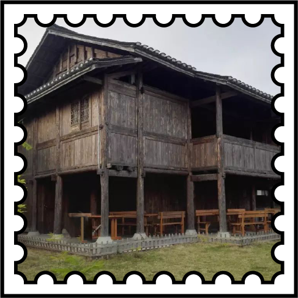
        </div>
        <div class="stamp" v-if="nowShowPage == 2">
            
        </div>
        <div class="stamp" v-if="nowShowPage == 3">
            
        </div>
        <div class="stamp" v-if="nowShowPage == 4">
            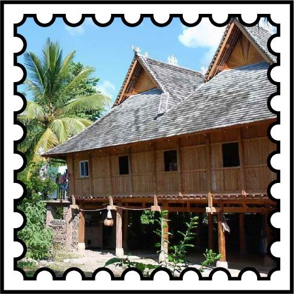
        </div>
        <div class="stamp" v-if="nowShowPage == 5">
            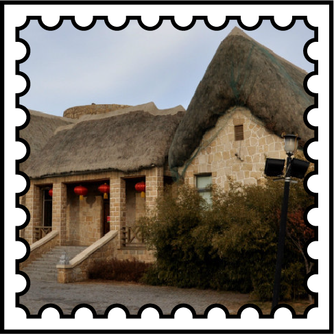
        </div>
        <div class="stamp" v-if="nowShowPage == 6">
            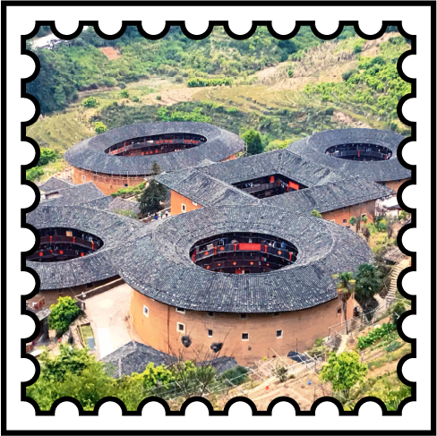
        </div>
        <div class="stamp" v-if="nowShowPage == 7">
            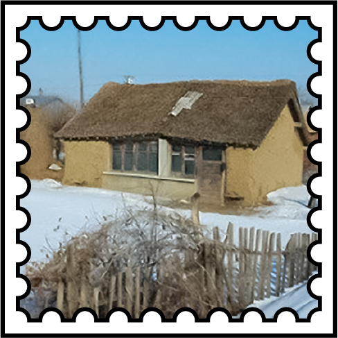
        </div>
        <div class="stamp" v-if="nowShowPage == 8">
            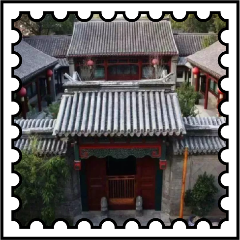
        </div>
        <div class="stamp" v-if="nowShowPage == 9">
            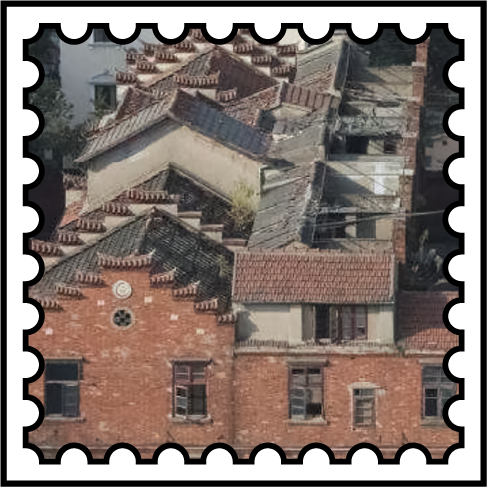
        </div>
        <div class="stamp" v-if="nowShowPage == 10">
            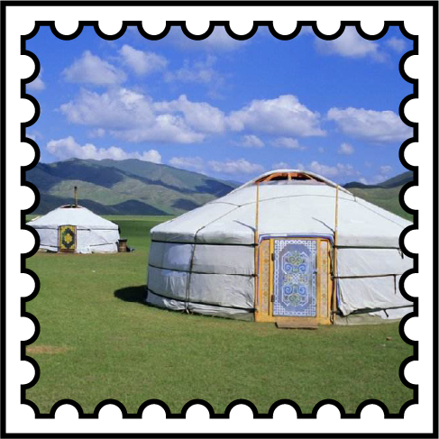
        </div>
        <div class="stamp" v-if="nowShowPage == 11">
            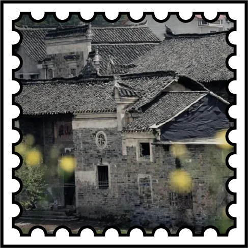
        </div>
        <div v-if="nowShowPage == 0">（可以点击邮票看大图）</div>
        <div style="position:relative;margin-bottom:20px;width:1024px;height:1946px">
            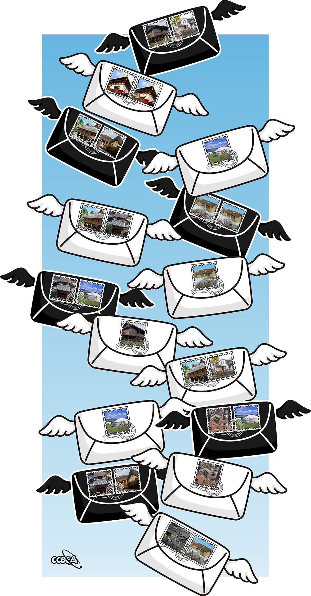
            <svg width="1024" height="1946" style="position: absolute; left:0">
                <rect class="link" x="468" y="88" width="84" height="84" transform = "rotate(-17 468 88)"  @click="nowShowPage = 1"/>
                <rect class="link" x="553" y="61" width="84" height="84" transform = "rotate(-17 553 61)"  @click="nowShowPage = 2"/>
                <rect class="link" x="374" y="221" width="84" height="84" transform = "rotate(19 374 221)"  @click="nowShowPage = 3"/>
                <rect class="link" x="458" y="250" width="84" height="84" transform = "rotate(19 458 250)"  @click="nowShowPage = 3"/>
                <rect class="link" x="265" y="373" width="84" height="84" transform = "rotate(25 265 373)"  @click="nowShowPage = 4"/>
                <rect class="link" x="345" y="412" width="84" height="84" transform = "rotate(25 345 412)"  @click="nowShowPage = 5"/>
                <rect class="link" x="664" y="465" width="84" height="84" transform = "rotate(-17 664 465)"  @click="nowShowPage = 10"/>
                <rect class="link" x="652" y="623" width="84" height="84" transform = "rotate(24 652 623)"  @click="nowShowPage = 7"/>
                <rect class="link" x="734" y="656" width="84" height="84" transform = "rotate(24 734 656)"  @click="nowShowPage = 7"/>
                <rect class="link" x="271" y="665" width="84" height="84" transform = "rotate(14 271 665)"  @click="nowShowPage = 4"/>
                <rect class="link" x="358" y="685" width="84" height="84" transform = "rotate(14 358 685)"  @click="nowShowPage = 8"/>
                <rect class="link" x="627" y="867" width="84" height="84" transform = "rotate(-9 627 867)"  @click="nowShowPage = 7"/>
                <rect class="link" x="178" y="897" width="84" height="84" transform = "rotate(11 178 897)"  @click="nowShowPage = 8"/>
                <rect class="link" x="266" y="913" width="84" height="84" transform = "rotate(11 266 913)"  @click="nowShowPage = 10"/>
                <rect class="link" x="404" y="1046" width="84" height="84" transform = "rotate(8 404 1046)"  @click="nowShowPage = 1"/>
                <rect class="link" x="592" y="1182" width="84" height="84" transform = "rotate(-10 592 1182)"  @click="nowShowPage = 4"/>
                <rect class="link" x="680" y="1165" width="84" height="84" transform = "rotate(-10 680 1165)"  @click="nowShowPage = 2"/>
                <rect class="link" x="338" y="1341" width="84" height="84" transform = "rotate(-10 338 1341)"  @click="nowShowPage = 10"/>
                <rect class="link" x="676" y="1337" width="84" height="84" transform = "rotate(-6 676 1337)"  @click="nowShowPage = 9"/>
                <rect class="link" x="764" y="1328" width="84" height="84" transform = "rotate(-6 764 1328)"  @click="nowShowPage = 10"/>
                <rect class="link" x="286" y="1543" width="84" height="84" transform = "rotate(-8 286 1543)"  @click="nowShowPage = 8"/>
                <rect class="link" x="375" y="1531" width="84" height="84" transform = "rotate(-8 375 1531)"  @click="nowShowPage = 5"/>
                <rect class="link" x="652" y="1500" width="84" height="84" transform = "rotate(11 652 1500)"  @click="nowShowPage = 9"/>
                <rect class="link" x="563" y="1697" width="84" height="84" transform = "rotate(28 563 1697)"  @click="nowShowPage = 11"/>
                <rect class="link" x="640" y="1740" width="84" height="84" transform = "rotate(28 640 1740)"  @click="nowShowPage = 7"/>
            </svg>
        </div>
    </div>
</template>
<style>
    .link {
        cursor: pointer;
        fill:rgba(0,0,0, 0);
    }
    .stamp {
        height: 487px;
        width: 487px;
    }
</style>
```

### vue_script

```text
const { ref } = Vue; //由于网页中无法import，Vue所有组件都已预先导出至Vue对象中。

export default {
    setup() {
        let nowShowPage = ref(0);

        return {
            nowShowPage
        }
    }
}
```


## 答案

`SODIUM CARBONATE`

## 解析

根据邮票和图案里的各地中国民居，不难想到/搜到中国的《民居》邮票系列。找到题目里各个民居来自什么省份，根据《民居》计算每个信封上的面值总和，通过 A1Z26 转换英文字母。黑白信封可以分别得到 ``SODIUM CARBONATE``，即本题答案。

| 图      | 对应邮票 |
| ----------- | ----------- |
|       | 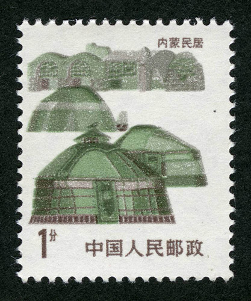       |
|       | 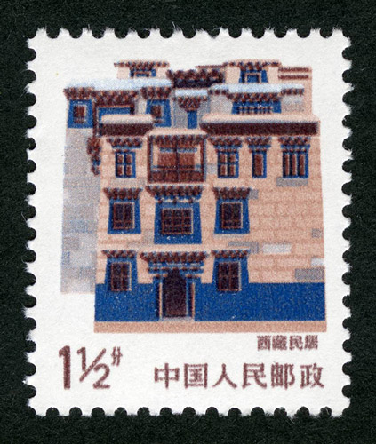       |
|       | 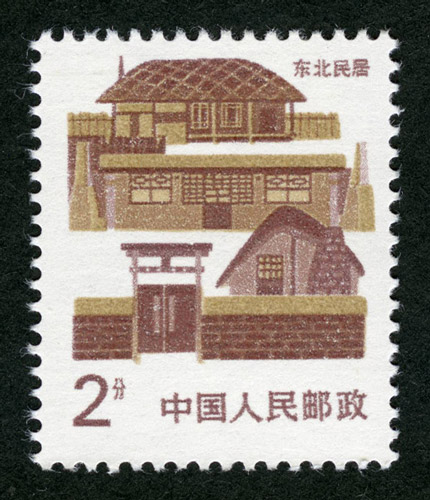       |
|       | 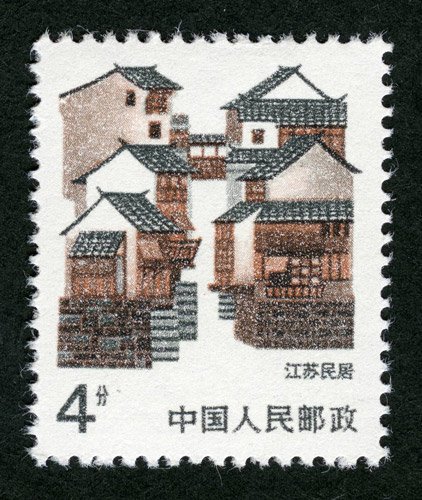       |
|       | 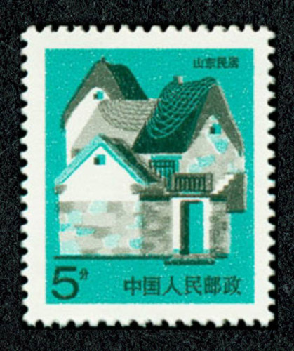       |
|       | 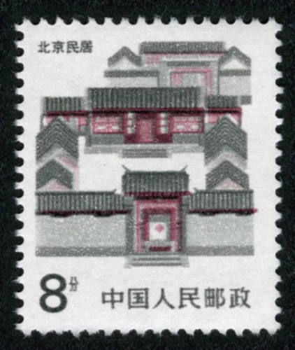       |
|       | 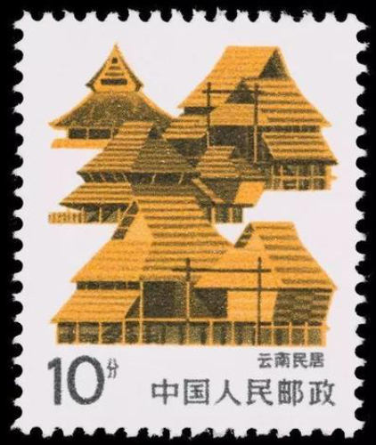       |
|       | 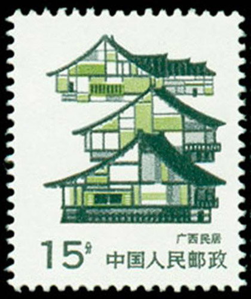       |
|       | 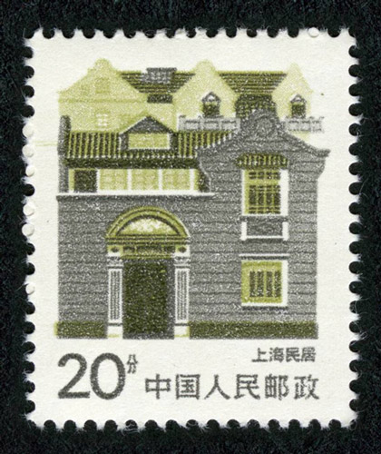       |

## 提示

### 1. 完全不知道这题要找什么

这题需要根据民居邮票系列找到每个民居对应的面值。

### 2. 最后提取要注意什么

把黑色和白色信封分开来可以得到一个单词，然后按照【黑+白】的顺序提交。


## 本地附件

- [036e7884def045b18f8ba4fb8afa5fd0.webp](../../../assets/archive.cipherpuzzles.com/ccbc13/images/CCBC-14/036e7884def045b18f8ba4fb8afa5fd0.webp)
- [1a3ac935960942b586741b292e52f5f7.webp](../../../assets/archive.cipherpuzzles.com/ccbc13/images/CCBC-14/1a3ac935960942b586741b292e52f5f7.webp)
- [221fa1b37ead4d21bbb79ecfb493626b.webp](../../../assets/archive.cipherpuzzles.com/ccbc13/images/CCBC-14/221fa1b37ead4d21bbb79ecfb493626b.webp)
- [2c82ad9fbf41460bbf0b5563c5258744.webp](../../../assets/archive.cipherpuzzles.com/ccbc13/images/CCBC-14/2c82ad9fbf41460bbf0b5563c5258744.webp)
- [33f914bf5d1b4d52bc114e0430567c8d.webp](../../../assets/archive.cipherpuzzles.com/ccbc13/images/CCBC-14/33f914bf5d1b4d52bc114e0430567c8d.webp)
- [5911ce396dd240ef83ed46c39bb170ea.webp](../../../assets/archive.cipherpuzzles.com/ccbc13/images/CCBC-14/5911ce396dd240ef83ed46c39bb170ea.webp)
- [61982dcfb9fe4ed093eb921856160f87.webp](../../../assets/archive.cipherpuzzles.com/ccbc13/images/CCBC-14/61982dcfb9fe4ed093eb921856160f87.webp)
- [62608476848844528c47869f9fb9e2ce.webp](../../../assets/archive.cipherpuzzles.com/ccbc13/images/CCBC-14/62608476848844528c47869f9fb9e2ce.webp)
- [73dd83d0dc234428863a2ccbc96f0fae.webp](../../../assets/archive.cipherpuzzles.com/ccbc13/images/CCBC-14/73dd83d0dc234428863a2ccbc96f0fae.webp)
- [762e8fbe9519401ebcc87b430d75a48d.webp](../../../assets/archive.cipherpuzzles.com/ccbc13/images/CCBC-14/762e8fbe9519401ebcc87b430d75a48d.webp)
- [789ff6026a9348028dd6c7903a609cb5.webp](../../../assets/archive.cipherpuzzles.com/ccbc13/images/CCBC-14/789ff6026a9348028dd6c7903a609cb5.webp)
- [873bea926fc54b6889071485f68df27b.webp](../../../assets/archive.cipherpuzzles.com/ccbc13/images/CCBC-14/873bea926fc54b6889071485f68df27b.webp)
- [96346852095b49a68061404c143131a1.webp](../../../assets/archive.cipherpuzzles.com/ccbc13/images/CCBC-14/96346852095b49a68061404c143131a1.webp)
- [9b7f3fcfdab24d7d97b831a44d5e5c6e.webp](../../../assets/archive.cipherpuzzles.com/ccbc13/images/CCBC-14/9b7f3fcfdab24d7d97b831a44d5e5c6e.webp)
- [a0a834fe55b94b9bac4fc23a57e21693.webp](../../../assets/archive.cipherpuzzles.com/ccbc13/images/CCBC-14/a0a834fe55b94b9bac4fc23a57e21693.webp)
- [b292c4cfe2284867bae08ef2502fbd4e.webp](../../../assets/archive.cipherpuzzles.com/ccbc13/images/CCBC-14/b292c4cfe2284867bae08ef2502fbd4e.webp)
- [b81197bd02734d4fa3e0cb9767b2caad.webp](../../../assets/archive.cipherpuzzles.com/ccbc13/images/CCBC-14/b81197bd02734d4fa3e0cb9767b2caad.webp)
- [cc12c96bbae44091be60d338d0654714.webp](../../../assets/archive.cipherpuzzles.com/ccbc13/images/CCBC-14/cc12c96bbae44091be60d338d0654714.webp)
- [e1f2d39543974a488259ce60dd8d2087.webp](../../../assets/archive.cipherpuzzles.com/ccbc13/images/CCBC-14/e1f2d39543974a488259ce60dd8d2087.webp)
- [eef73c4e04474ad1982c01e87d443fa6.webp](../../../assets/archive.cipherpuzzles.com/ccbc13/images/CCBC-14/eef73c4e04474ad1982c01e87d443fa6.webp)
- [f7722cfb3d43471d8892a263b781bee2.webp](../../../assets/archive.cipherpuzzles.com/ccbc13/images/CCBC-14/f7722cfb3d43471d8892a263b781bee2.webp)

来源：[https://archive.cipherpuzzles.com/ccbc13/problems/CCBC-14/32.yaml](https://archive.cipherpuzzles.com/ccbc13/problems/CCBC-14/32.yaml)
