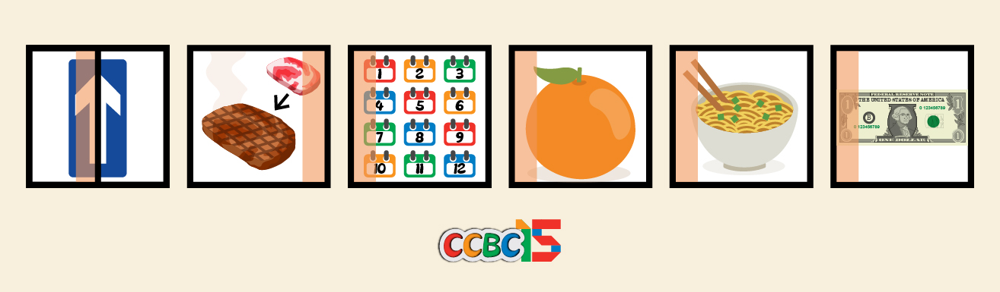

# 看图说话

## 题面

这一关考验你的图片阅读能力。请把图片中的东西念出来。注意单复数哟！

## 答案

`EDMOND`

## 解析

图片从左到右，依次对应 onEway cookeD Months Orange Noodle Dollar，提取答案为**EDMOND**

## 提示

### 1. 我毫无头绪

你应该辨别图片上面的事物，并写出它们对应的英文单词。

### 2. 有些我实在不知道是什么

这些图画的分别是：
“单行道”、“熟”、“月份（复数）”、“橘子”、“面条”、“美元”
他们分别对应一个6字母的英文单词。

### 3. 该如何提取

注意你单词的长度，你有注意到涂色部分大概占图片的几分之几吗？选择对应位置的字母。

## 本地附件

- [d1c475db6c3d43c7928b106d2a25710a.webp](../../../assets/archive.cipherpuzzles.com/ccbc15/images/1/d1c475db6c3d43c7928b106d2a25710a.webp)

来源：[https://archive.cipherpuzzles.com/ccbc15/problems/1/2.yaml](https://archive.cipherpuzzles.com/ccbc15/problems/1/2.yaml)
