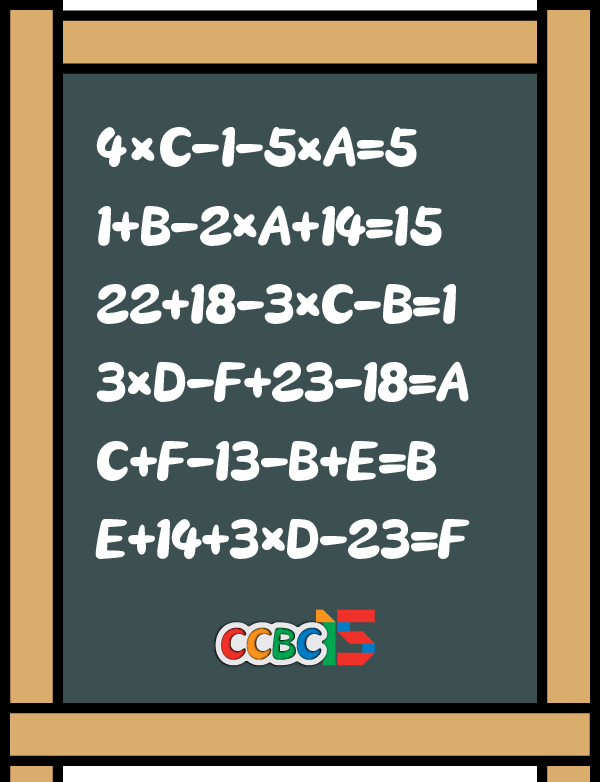

# 数学小能手

## 题面

除了英语，我们还需要考验一下你的数学能力！

## 答案

`FLIGHT`

## 解析

六元一次方程组，首先可进行化简得到六个方程

4C-5A=6 ①

B=2A ②

B+3C=39 ③

F+A-3D=5 ④

C+F+E-2B=13 ⑤

E+3D-F=9 ⑥

②带入③中，和①联立可求出：A=6，B=12，C=9

将A,B,C带入④、⑤中，得

F-3D=-1 ⑦

F+E=28 ⑧

⑧-⑦，得

E+3D=29

带入⑥中可得F=20

继而求出：D=7，E=8

最后通过a1z26将A~F对应的数字转为字母，得到答案**FLIGHT**

## 提示

### 1. 我毫无头绪

这是一道数学解方程题，你应该把A-F的值全部计算出来。

### 2. 该如何提取

使用1=A，2=B，26=Z的编码方法，将对应的数字进行转化，这是一种会被频繁使用的，最基础的加密方法。

## 本地附件

- [dd81be25c9db4364a88f498c77351778.webp](../../../assets/archive.cipherpuzzles.com/ccbc15/images/1/dd81be25c9db4364a88f498c77351778.webp)

来源：[https://archive.cipherpuzzles.com/ccbc15/problems/1/3.yaml](https://archive.cipherpuzzles.com/ccbc15/problems/1/3.yaml)
