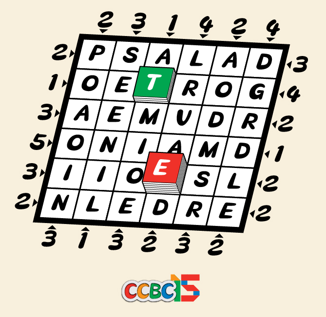

# 积木登天塔

## 题面

接下来，我们需要通过搭积木的能力，来证明你的空间想象能力！

摩天楼规则：
- 在每个格子里都放置一个数字，数字代表这个格子里建筑的高度。
- 数字必须在 1-6 之间。每行和每列都恰好包含 1-6 的每个数字且不重复。
- 从矩阵外面往里看，对应的行或列中有几座建筑可以被看到，这个数字会被标在矩阵的外侧。请记住：较高的建筑将会遮挡后面所有较低的建筑。

<a href="https://puzz.cipherpuzzles.com/p.html?skyscrapers/6/6/231424313232213532342122n3x6n" target="_blank">点击链接以在网页上做题</a>

然后，找到所有“1”的位置。

## 答案

`DOMAIN`

## 解析

根据摩天楼规则解得答案：

|   |   |   |   |   |   |
|:---:|:---:|:---:|:---:|:---:|:---:|
| 5 | 4 | 6 | 2 | 3 | 1 |
| 6 | 5 | 3 | 4 | 1 | 2 |
| 3 | 2 | 1 | 5 | 6 | 4 |
| 2 | 3 | 4 | 1 | 5 | 6 |
| 4 | 1 | 5 | 6 | 2 | 3 |
| 1 | 6 | 2 | 3 | 4 | 5 |

从上至下提取所有1的位置字母，得到答案**DOMAIN**

## 提示

### 1. 我毫无头绪

如果你是第一次接触摩天楼这种规则，你可以查看[这个规则说明页（英语/日语）](https://puzz.cipherpuzzles.com/rules.html?skyscrapers)来熟悉规则。

当然，这里有一个额外的小技巧：当盘面大小为n*n、外提示为x时，该方向第一格的数大小不会超过n-x+1，第二格不会超过n-x+2，以此类推。

### 2. 该如何提取

找到所有“1”所在的位置，从上往下读出对应的字母即可。

## 本地附件

- [47e3f3e9dfa7425aac0f600ce8c9f20a.webp](../../../assets/archive.cipherpuzzles.com/ccbc15/images/1/47e3f3e9dfa7425aac0f600ce8c9f20a.webp)

来源：[https://archive.cipherpuzzles.com/ccbc15/problems/1/5.yaml](https://archive.cipherpuzzles.com/ccbc15/problems/1/5.yaml)
