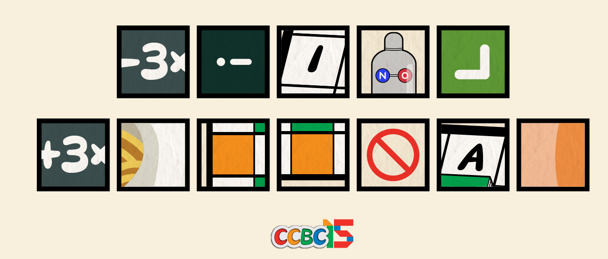

# 拼接艺术

## 题面

接下来，就是我们考验你博采众长的能力了！

<table border="1" style="border-collapse: collapse" class="mattab">
  <tbody>
    <tr>
      <td>密码教学</td>
      <td></td>
      <td></td>
      <td></td>
      <td></td>
      <td></td>
      <td></td>
    </tr>
    <tr>
      <td>看图说话</td>
      <td></td>
      <td></td>
      <td></td>
      <td></td>
      <td></td>
      <td></td>
    </tr>
    <tr>
      <td>数学小能手</td>
      <td></td>
      <td></td>
      <td></td>
      <td></td>
      <td></td>
      <td></td>
    </tr>
    <tr>
      <td>词兜游戏</td>
      <td></td>
      <td></td>
      <td></td>
      <td></td>
      <td></td>
      <td></td>
    </tr>
    <tr>
      <td>积木登天塔</td>
      <td></td>
      <td></td>
      <td></td>
      <td></td>
      <td></td>
      <td></td>
    </tr>
    <tr>
      <td>后院探险</td>
      <td></td>
      <td></td>
      <td></td>
      <td></td>
      <td></td>
      <td></td>
    </tr>
  </tbody>
  <colgroup>
    <col style="width: 150px;">
    <col style="width: 30px;">
    <col style="width: 30px;">
    <col style="width: 30px;">
    <col style="width: 30px;">
    <col style="width: 30px;">
    <col style="width: 30px;">
  </colgroup>
</table>

## 解题后内容

答对了！ 但是怎么感觉……怪怪的？好像是……陷入了时间循环？
（新剧情已解锁）

## 答案

`INDEX UNFOUND`

## 解析

暂无

## 提示

### 1. 我毫无头绪

实际上，这些图片标记的不是对应的字母，而是“相对位置”。你有注意到每题的形状吗？

### 2. 该如何提取

按照题目顺序把你的答案填入一个新的6*6方格中，按顺序读出上一条提示所述位置的字母。

## 本地附件

- [15a82355049e44ad81700d98ad206e7c.webp](../../../assets/archive.cipherpuzzles.com/ccbc15/images/1/15a82355049e44ad81700d98ad206e7c.webp)

来源：[https://archive.cipherpuzzles.com/ccbc15/problems/1/7.yaml](https://archive.cipherpuzzles.com/ccbc15/problems/1/7.yaml)
