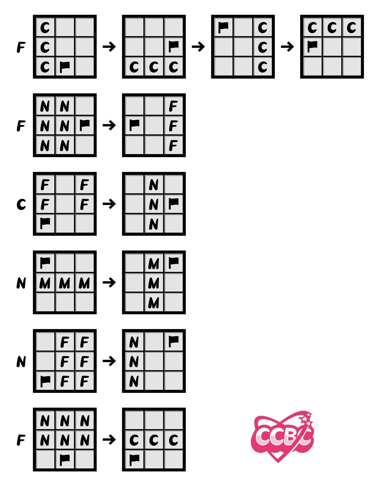
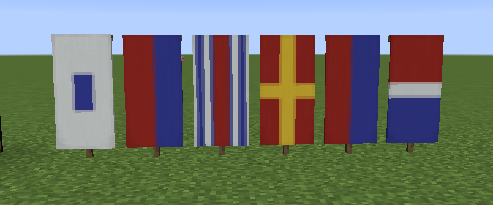

# 装饰彩旗

## 题面

小七没看到Piggy做美食装饰旗但是他却变出了一大堆！原来这些旗帜的**合成配方**都是闲散解谜其他人做的。

对简称作出规范：MUSHROOM缩写为**M**，小白狐缩写为**N**，COL缩写为**C**，FIVERO缩写为**F**

## 答案

`SECRET FORMULA`

## 解析

由旗帜的合成配方和3*3的格子，以及其中填入的东西，可以搜/意识到这些表格其实是Minecraft的旗帜染色合成配方（织布机出现以前），而每个闲散解谜成员分别是一种颜色。通过简单的尝试可以发现每行的配方执行完以后都是旗号的样式，注意Minecraft的旗帜是竖着的所以要旋转90°，由于旗号的图案比较多样化，其实很容易确定颜色。如下：

| **人物**   | **颜色** |
|:--------:|:------:|
| **C**OL      | 白色     |
| **F**IVERO   | 蓝色     |
| **M**ushroom | 黄色     |
| **N**INE     | 红色     |

游戏内效果如图：

可得第一部分答案：**SECRET**

第二部分直接观察合成表，合成表中给出了旗帜的位置，在minecraft中旗帜的位置并不重要因为图案只由染料决定，而旗语加密还有另外一种双手旗semaphore，因此按顺序两两组合旗帜的方位，可得本题第二部分答案：**FORMULA**

最终答案：**SECRET FORMULA**

## 提示

### 1. 我毫无头绪

主题是旗帜，试试与题目中加粗部分一起搜索吧。

### 2. 那些字母都是什么意思

每个字母代表一种颜色，具体代表什么颜色，需要你在知道每一行得到的结果代表什么后进行推理

### 3. 该如何提取

用旗语，但是，旗语有不止一种

### 4. 提示2看了之后还不明白，直接把我想要的东西给我吧！

C- 白色
F- 蓝色
M- 黄色
N- 红色

## 中间答案

| 提交 | 回复 | 附加信息 |
| --- | --- | --- |
| SECRET | 恭喜你发现了合成结果的含义！ |  |
| FORMULA | 恭喜你发现了旗帜位置的含义！ |  |

## 本地附件

- [769c4aade2b64b2cb99538dd29330af2.webp](../../../assets/archive.cipherpuzzles.com/ccbc15/images/2/769c4aade2b64b2cb99538dd29330af2.webp)
- [c45b678c93984e1ab84369bd8b5b5e3f.webp](../../../assets/archive.cipherpuzzles.com/ccbc15/images/2/c45b678c93984e1ab84369bd8b5b5e3f.webp)

来源：[https://archive.cipherpuzzles.com/ccbc15/problems/2/10.yaml](https://archive.cipherpuzzles.com/ccbc15/problems/2/10.yaml)
