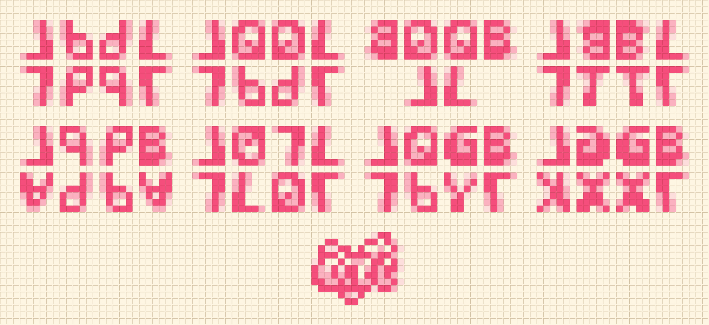
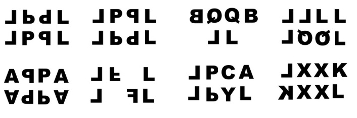
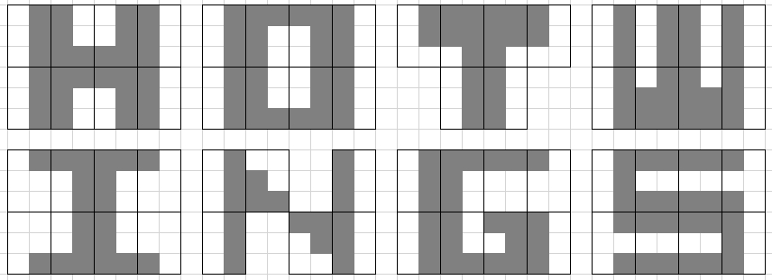

# 目眩神迷

## 题面

啊，好像误入了小七的私人房间! 实在是**没眼**到处乱看，光看着墙上这些由小块瓷砖构成的可爱字母，就幸福得有点发晕哩~

## 答案

`HOT WINGS`

## 解析

图片中字母如下图所示：

将字母写成盲文，得到图片，象形得到答案**HOT WINGS**

## 提示

### 1. 我毫无头绪

既然如此目眩神迷，要不要把所有字母转换成盲文试试呢？注意字母的旋转方向。

### 2. 该如何提取

按照原字母的方向排列整齐，每组字母可以象形得到一个更大的字母。

## 本地附件

- [210d1b320691419094938f9f546ff5b1.webp](../../../assets/archive.cipherpuzzles.com/ccbc15/images/2/210d1b320691419094938f9f546ff5b1.webp)
- [33e3bbfc0cb340f7a56ae649cac62d75.webp](../../../assets/archive.cipherpuzzles.com/ccbc15/images/2/33e3bbfc0cb340f7a56ae649cac62d75.webp)
- [db3186ee80ed440e9755ba44ab719fb3.webp](../../../assets/archive.cipherpuzzles.com/ccbc15/images/2/db3186ee80ed440e9755ba44ab719fb3.webp)

来源：[https://archive.cipherpuzzles.com/ccbc15/problems/2/11.yaml](https://archive.cipherpuzzles.com/ccbc15/problems/2/11.yaml)
