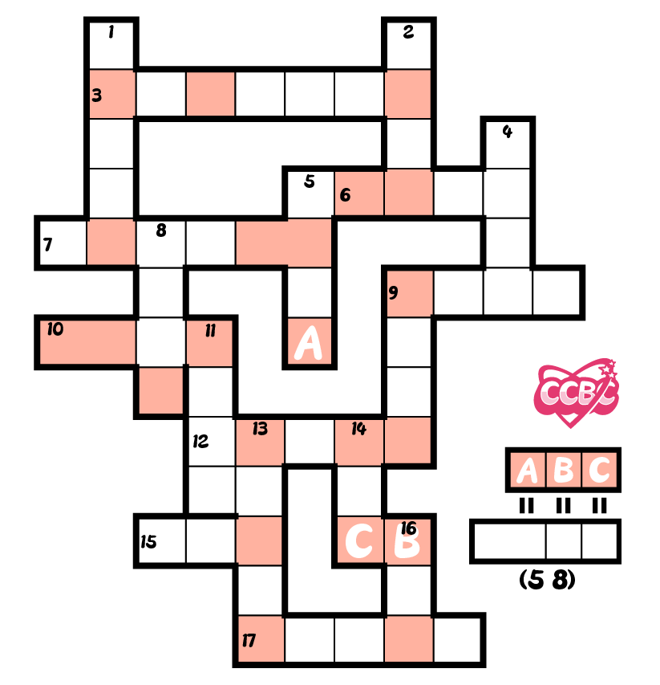
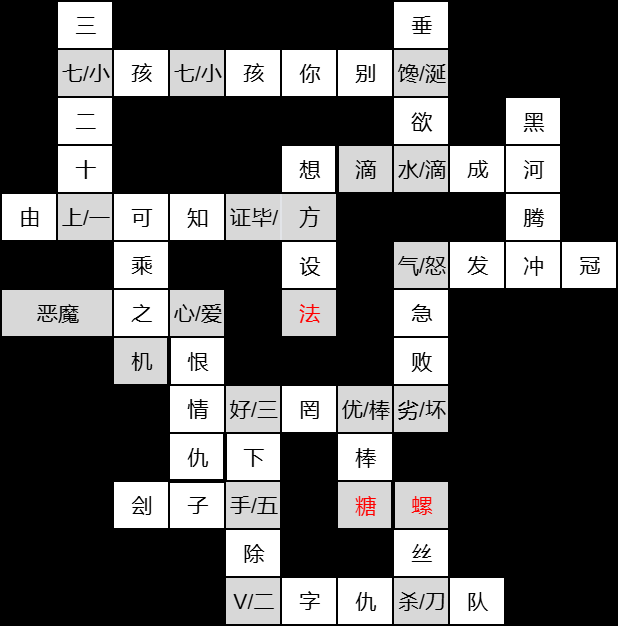
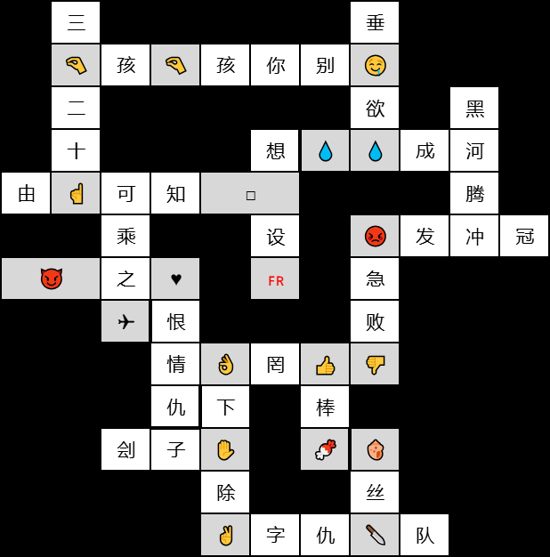

# 共同语言

## 题面

<a href="https://docs.qq.com/sheet/DR0hHdmlRVEVqSVpX?tab=BB08J2">腾讯文档</a>

<table>
    <tr class="header-row">
        <th class="col-number">横</th>
        <th class="col-clue"></th>
        <th class="col-number">纵</th>
        <th class="col-clue"></th>
    </tr>
    <tr>
        <td class="col-number">3</td>
        <td class="col-clue">一首春节歌谣的第一句</td>
        <td class="col-number">1</td>
        <td class="col-clue">一则熟语的一部分，也是一条乘法口诀；它的倒数第二个字是所有单元格中最大的数。</td>
    </tr>
    <tr>
        <td class="col-number">6</td>
        <td class="col-clue">成语，用来比喻积少成多。前两个格填的内容相同。</td>
        <td class="col-number">2</td>
        <td class="col-clue">馋得连口水都要滴下来</td>
    </tr>
    <tr>
        <td class="col-number">7</td>
        <td class="col-clue">一首和数学有关的《西江月》的最后一句</td>
        <td class="col-number">4</td>
        <td class="col-clue">我国的人口地理分界线</td>
    </tr>
    <tr>
        <td class="col-number">9</td>
        <td class="col-clue">一首知名宋词的题目</td>
        <td class="col-number">5</td>
        <td class="col-clue">成语，意为设想各种办法</td>
    </tr>
    <tr>
        <td class="col-number">10</td>
        <td class="col-clue">原版泰拉瑞亚中的道具，可以增加饰品栏</td>
        <td class="col-number">8</td>
        <td class="col-clue">成语，指可以利用的时机</td>
    </tr>
    <tr>
        <td class="col-number">12</td>
        <td class="col-clue">“四人与我游”的下半句</td>
        <td class="col-number">9</td>
        <td class="col-clue">成语，描述呼吸急促，狼狈不堪</td>
    </tr>
    <tr>
        <td class="col-number">15</td>
        <td class="col-clue">对行刑者的称呼</td>
        <td class="col-number">11</td>
        <td class="col-clue">成语，由两对反义词构成，形容复杂的感情纠葛</td>
    </tr>
    <tr>
        <td class="col-number">17</td>
        <td class="col-clue">一部于2005年上映的反乌托邦政治惊悚电影</td>
        <td class="col-number">13</td>
        <td class="col-clue">这个成语包含三个数字，形容做事干脆利索</td>
    </tr>
    <tr>
        <td class="col-number"></td>
        <td class="col-clue"></td>
        <td class="col-number">14</td>
        <td class="col-clue">一种甜味食品，前两个字相同</td>
    </tr>
    <tr>
        <td class="col-number"></td>
        <td class="col-clue"></td>
        <td class="col-number">16</td>
        <td class="col-clue">一种常见的工具，纵-1的后两个字是它的两个种类</td>
    </tr>
</table>

    右下&nbsp;&nbsp;&nbsp;&nbsp;10&nbsp;&nbsp;&nbsp;&nbsp;粉色格里要填的东西（按拼音读）

## 答案

`PARIS BAGUETTE`

## 解析

首先完成填字游戏，发现深色位置填写的并不是全是相同汉字。

根据 10 横 填写【恶魔之心】、8 纵 填写【可乘之机】，我们推断出 10 右下 为【恶魔机】，也即粉色格子中应当填写 emoji。

Emoji 就是这一填字游戏的“共同语言”，它可以让相交的格子有自洽的填法，例如【三下五除二/V字仇杀队】的【二/V】填写【✌】。

完成的填字游戏如下：

  
  

最后提取 ?? ? ? ，三个 emoji 可以读出【巴黎】【贝】【甜】，得到答案**PARIS BAGUETTE**

## 提示

### 1. 好像填不进去？

这是一个特殊规则的 crossword ，正常的填法无法让粉色格子保持一致。解出右下方向的那条 clue 后就可以理解规则了。

### 2. 我卡在最后一步了

三个粉色格会对应到四个汉字，注意这四个汉字都不出现在本crossword中。前两个字是一个5个字母的欧洲城市名。

## 本地附件

- [1baeb627687a4fc4bb07c7f78b344650.webp](../../../assets/archive.cipherpuzzles.com/ccbc15/images/2/1baeb627687a4fc4bb07c7f78b344650.webp)
- [28cfcad91e44406ba25d9722a403672c.webp](../../../assets/archive.cipherpuzzles.com/ccbc15/images/2/28cfcad91e44406ba25d9722a403672c.webp)
- [334e34c67cc54f76aaebf157118aaccd.webp](../../../assets/archive.cipherpuzzles.com/ccbc15/images/2/334e34c67cc54f76aaebf157118aaccd.webp)

来源：[https://archive.cipherpuzzles.com/ccbc15/problems/2/13.yaml](https://archive.cipherpuzzles.com/ccbc15/problems/2/13.yaml)
