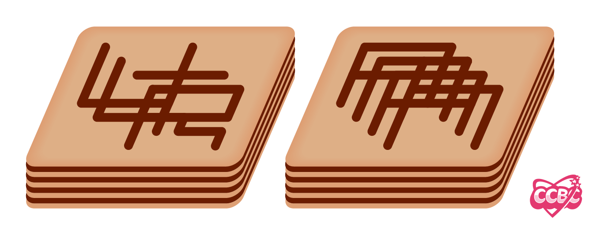

# 幸运饼干

## 题面

小七精心制作的幸运饼干，好想尝一尝！

## 答案

`ULTRAMAN`

## 解析

两块饼干上的图案均由四个大写字母组成，左侧由左上至右下为ULTR，右侧由左上至右下为AMAN，得到答案为**ULTRAMAN**

## 提示

### 1. 我毫无头绪

每块饼干上都有四个字母，它们按照从左上至右下的方向重叠在一起，其中比较明显的是左侧饼干的右下方能看出一个“R”。

## 本地附件

- [f475f5fd493846f4b11caaf9e4ded296.webp](../../../assets/archive.cipherpuzzles.com/ccbc15/images/2/f475f5fd493846f4b11caaf9e4ded296.webp)

来源：[https://archive.cipherpuzzles.com/ccbc15/problems/2/8.yaml](https://archive.cipherpuzzles.com/ccbc15/problems/2/8.yaml)
