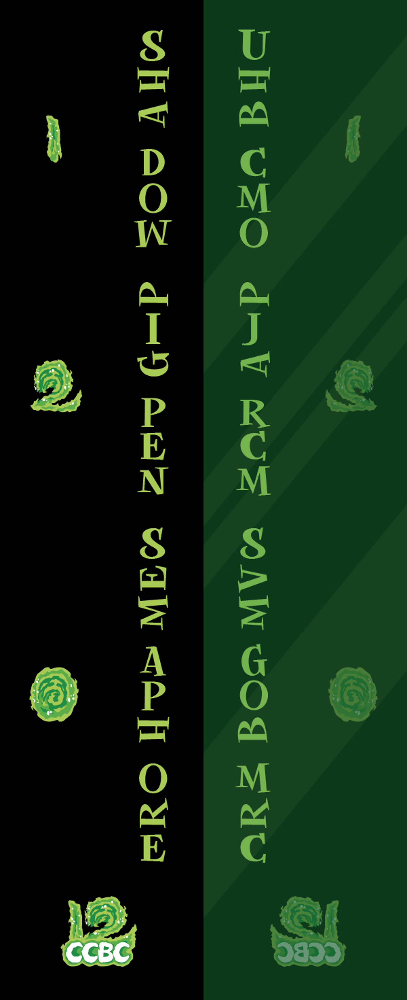
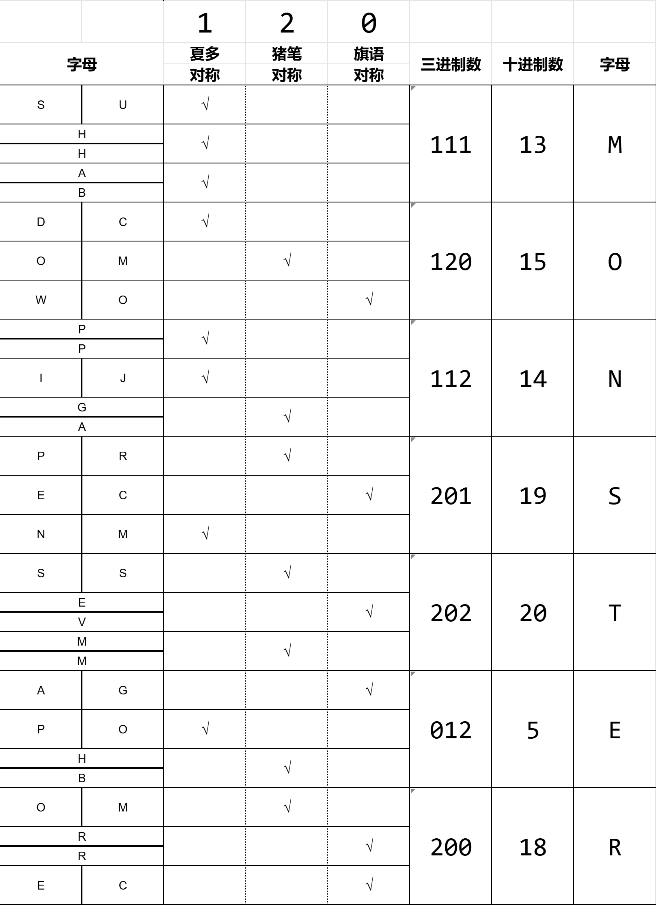

# 镜中何物

## 题面

有些诡异的镜子，仿佛有什么东西随时会从里面爬出来...

## 答案

`MONSTER`

## 解析

通过观察可以发现，左侧字母为：SHADOW、PIGPEN、SEMAPHORE，分别标记了1、2、0。结合镜子的对称特点找出字母对应的三种密码中哪一个是对称的，可得下表：

最终得到答案**MONSTER**

## 提示

### 1. 我毫无头绪

注意镜子外的字母可以组成三个单词，他们都是一种加密方式，其中shadow是夏多密码。

### 2. 下一步做什么

镜子外和镜子内的字母为什么不对称呢？因为要把镜子内外的每对字母，分别转换成某种密码，才会对称。
举例说明——第五行：O和M在猪笔密码中是左右对称的

### 3. 该如何提取

0、1、2已经分别标出，因此可以根据前面得到的结果，计算每三组字母的三进制值，转换成字母。

## 本地附件

- [16fd4d80806c40c098037c10feb98cde.webp](../../../assets/archive.cipherpuzzles.com/ccbc15/images/3/16fd4d80806c40c098037c10feb98cde.webp)
- [54f5ff8dc26049a5a0a56375344d9455.webp](../../../assets/archive.cipherpuzzles.com/ccbc15/images/3/54f5ff8dc26049a5a0a56375344d9455.webp)

来源：[https://archive.cipherpuzzles.com/ccbc15/problems/3/15.yaml](https://archive.cipherpuzzles.com/ccbc15/problems/3/15.yaml)
