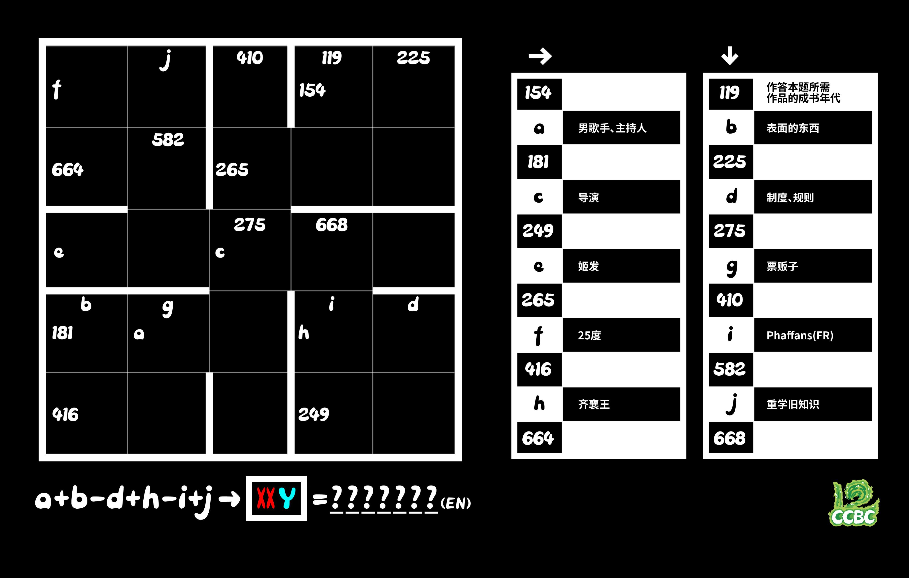
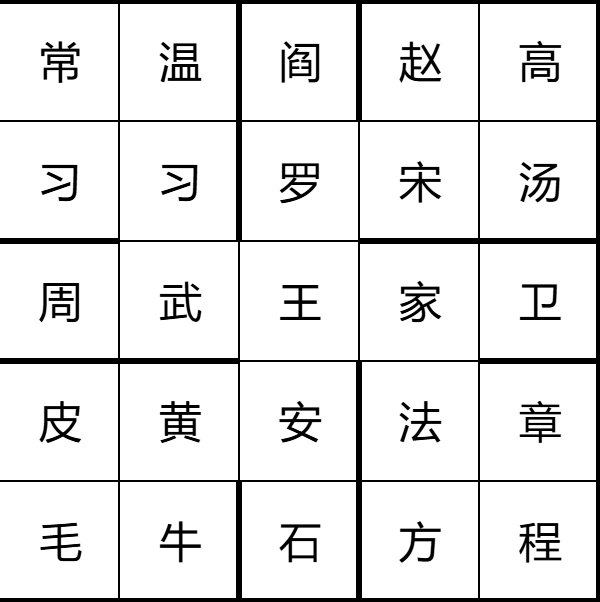
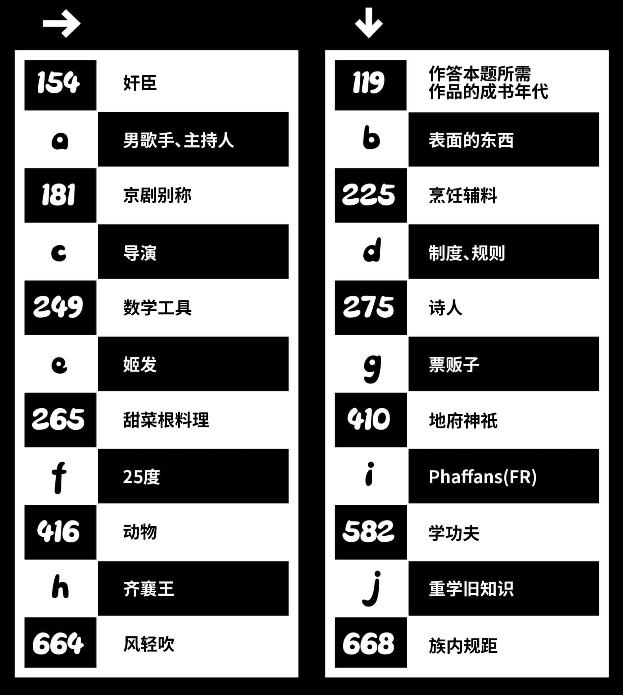

# 田字游戏

## 题面

东方国尚有余田

<a href="https://docs.qq.com/sheet/DR0tWcE93WEtEc2lF?tab=BB08J2" target="_blank">腾讯文档</a>

## 答案

`FEATHER`

## 解析

线索的编号是对应词语每个字在《百家姓》中的编号之和，横竖均按照编号和由大到小排列，填写后得到

同时计算出a~j对应的数字为175，191，227，233，263，401，406，501，517，653。带入式子中计算得到770，可知需要找到编号和为770的一个词语

格子中满足这个条件的有三个组合：【毛习习】（106+332+332）【石武习】（188+250+332）【程武阎】（193+250+327），能构成XXY结构的只有【习习毛】一个，压缩两个习后得到词语【羽毛】，最终答案为**FEATHER**

## 提示

### 1. 我毫无头绪

可以先从比较简单的线索入手，比如票贩子=黄牛，然后思考每个字如何对应一个数字。

### 2. 所需作品是什么？

是《百家姓》。

### 3. 该如何提取

完成所有格子的填写后，确定字母对应的数字，计算出式子的结果，这条线索的对应的中文是XXY形式，前两个字相同，并且X和Y都可以在你填好的格子中找到。然后再用长度为7的英文单词描述它。

### 4. 能让我看到所有的线索吗？

## 本地附件

- [7ab52eb71f234b708e55a437a57eb743.webp](../../../assets/archive.cipherpuzzles.com/ccbc15/images/3/7ab52eb71f234b708e55a437a57eb743.webp)
- [9b85884178cf415b9f6583e8fab9acfe.webp](../../../assets/archive.cipherpuzzles.com/ccbc15/images/3/9b85884178cf415b9f6583e8fab9acfe.webp)
- [e3fa808c78ee4b07b9f387b193447957.webp](../../../assets/archive.cipherpuzzles.com/ccbc15/images/3/e3fa808c78ee4b07b9f387b193447957.webp)

来源：[https://archive.cipherpuzzles.com/ccbc15/problems/3/16.yaml](https://archive.cipherpuzzles.com/ccbc15/problems/3/16.yaml)
