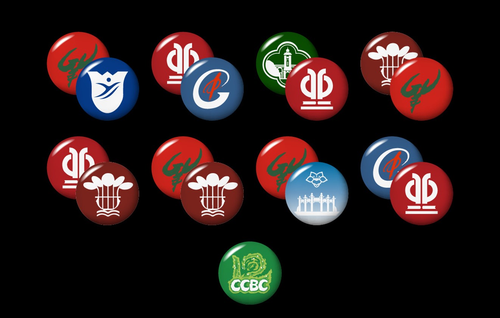
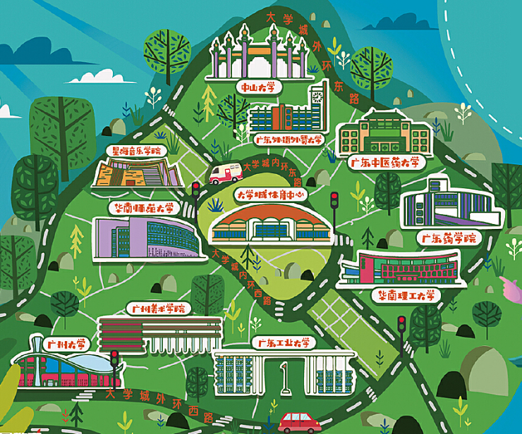

# 吧唧吧唧

## 题面

你来到一个位于岛中央的体育中心内，却感觉周围来来往往的都是一些大学生。中心内没有什么体育器械，却发现几对摆放好的...学生们喜欢叫它吧唧，对吧？

## 答案

`MEDICINE`

## 解析

观察可发现这些徽章的元素都来自广州大学城的大学校徽

根据校徽对应学校方位解双手旗语，得到答案**MEDICINE**

## 提示

### 1. 我毫无头绪

这些吧唧都是国内不同高校校徽的一部分，你需要尝试找出它们对应的高校。

### 2. 我大概知道这些是什么，但有些也太难辨认了吧

上一提示提到的东西，在地理位置上非常接近，希望这能帮助你很快找齐所有信息。

### 3. 该如何提取

根据方位解双手旗语。

## 本地附件

- [3579171c6c9a464b8fd7f2077c3df3d0.webp](../../../assets/archive.cipherpuzzles.com/ccbc15/images/3/3579171c6c9a464b8fd7f2077c3df3d0.webp)
- [f14968955baf46fba5f6d4eb7bbaf796.webp](../../../assets/archive.cipherpuzzles.com/ccbc15/images/3/f14968955baf46fba5f6d4eb7bbaf796.webp)

来源：[https://archive.cipherpuzzles.com/ccbc15/problems/3/17.yaml](https://archive.cipherpuzzles.com/ccbc15/problems/3/17.yaml)
