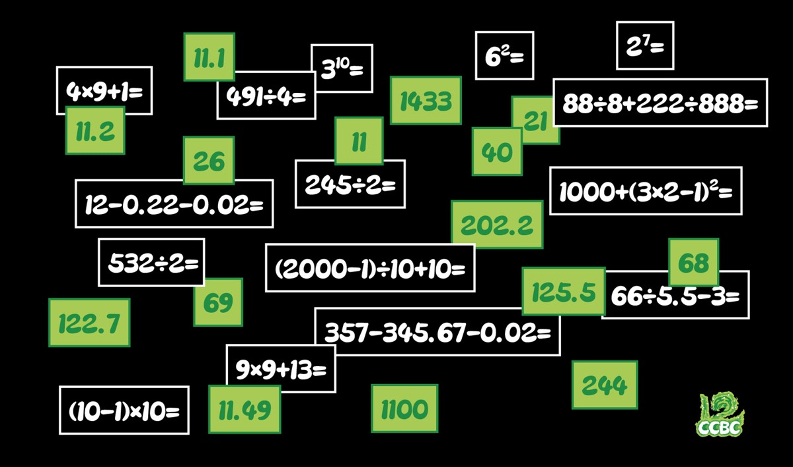

# 算算看吧

## 题面

一些算术练习，要怎样才能算对答案呢？

## 答案

`NOLAN`

## 解析

以下是根据答案特征进行推理的简要过程，求出进制并转为字母后后，根据算式的十进制值排序，可得【DIRECTOR OF TENET】，因此答案是**NOLAN**

| **算式**           | **答案特征（在原进制下）**          | **对应答案** | **进制数** | **转字母** | **十进制值** | **排序** |
|:----------------:|:------------------------:|:--------:|:-------:|:-------:|:--------:|:------:|
| 12-0.22-0.02=    | 11.？，仅当等于11.1时有解         | 11.1     | 4       | D       | 5.25     | 1      |
| 357-345.67-0.02= | 11.？                     | 11.2     | 9       | I       | 10.222   | 2      |
| 88÷8+222÷888=    | 11.？，且进制大于8，仅当等于11.49时有解 | 11.49    | 18      | R       | 19.25    | 3      |
| (10-1)×10=       | 尾数是0                     | 40       | 5       | E       | 20       | 4      |
| (2000-1)÷10+10=  | 三位数，且个位与小数点后一位数字相同       | 202.2    | 3       | C       | 20.667   | 5      |
| 66÷5.5-3=        | 小于20                     | 11       | 20      | T       | 21       | 6      |
| 6^2=             | 偶数，剩余答案26与68中仅26有整数解     | 26       | 15      | O       | 36       | 7      |
| 4×9+1=           | 奇数，剩余答案21与69中仅21有整数解     | 21       | 18      | R       | 37       | 8      |
| 9×9+13=          | 奇数                       | 69       | 15      | O       | 99       | 9      |
| 532÷2=           | 2开头三位数,且第二位不为0           | 244      | 6       | F       | 100      | 10     |
| 2^7=             | 偶数                       | 68       | 20      | T       | 128      | 11     |
| 1000+(3×2-1)^2=  | 大于1000                   | 1100     | 5       | E       | 150      | 12     |
| 245÷2=           | 122.？                    | 122.7    | 14      | N       | 226.5    | 13     |
| 3^10=            | 大于1101                   | 1433     | 5       | E       | 243      | 14     |
| 491÷4=           | 1开头三位数                   | 125.5    | 20      | T       | 445.25   | 15     |

## 提示

### 1. 我毫无头绪

绿色卡片上的是这些算式的答案，但是...

### 2. 要怎样才能算对答案

每个式子和它对应的答案，都只有同时处于某个特定的整数进制下才可以成立，你需要进行简单的推理，判断一下对应关系并求出这十五种正确的进制。

### 3. 该如何提取

根据每个式子的值从小到大进行排序，上一步用到的东西转换成字母。

## 中间答案

| 提交 | 回复 | 附加信息 |
| --- | --- | --- |
| DIRECTOR OF TENET | 没错！那么他是谁呢？答案是5字母 |  |

## 本地附件

- [5c1b10e15f1249f8be40b1e6bd8899e0.webp](../../../assets/archive.cipherpuzzles.com/ccbc15/images/3/5c1b10e15f1249f8be40b1e6bd8899e0.webp)

来源：[https://archive.cipherpuzzles.com/ccbc15/problems/3/21.yaml](https://archive.cipherpuzzles.com/ccbc15/problems/3/21.yaml)
