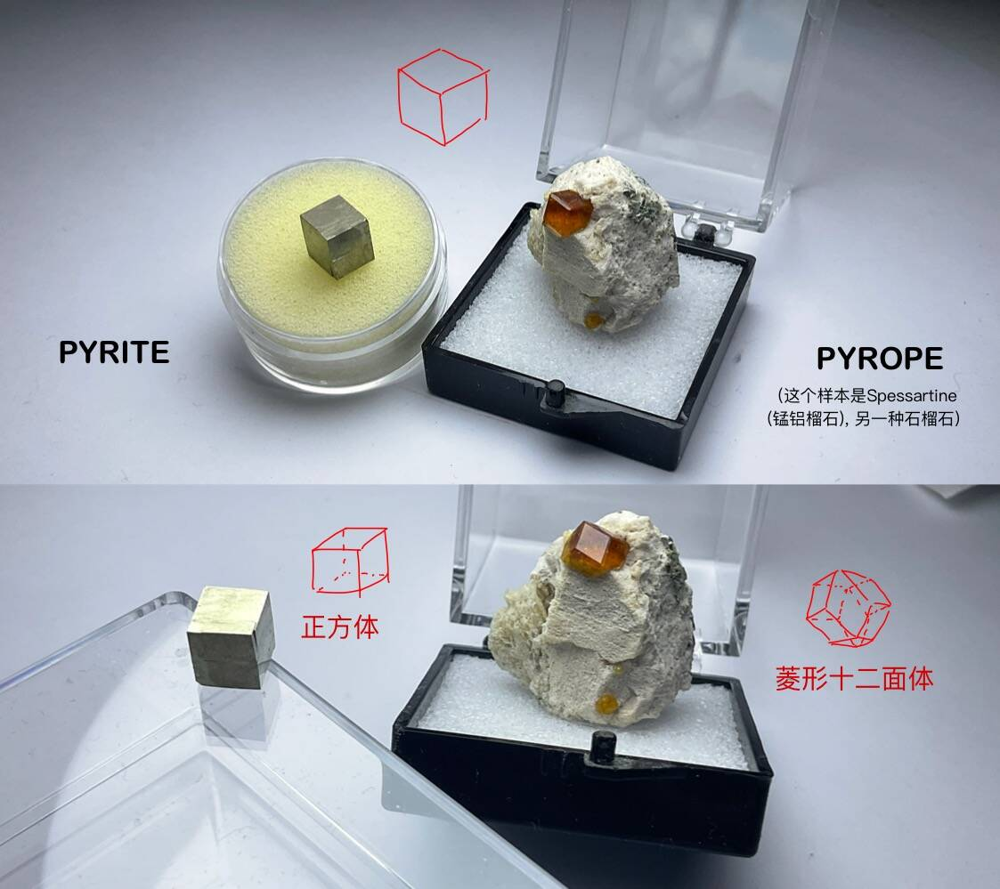

# 火眼金晶

## 题面

一张未填完的资料清单，图上好像是一种呈正方体晶体的矿物。

## 交互源码

### vue_template

```html
<template>
    <div>
        <div v-if="loaded">
            
        </div>
        <div v-else>图像加载中...</div>
        <div style="height: 170px"></div>
    </div>
</template>

<data>
    {
        "part1": "../../../assets/archive.cipherpuzzles.com/ccbc15/images/3/1af987f9f5bd49179d36884b43afc0df.webp",
        "part2": "../../../assets/archive.cipherpuzzles.com/ccbc15/images/3/aa2a39f2f9394fb08233b40eaf9a72bf.webp"
    }
</data>
```

### vue_script

```text
const { ref, inject, onMounted } = Vue;

export default {
    setup() {
        const loaded = ref(false);
        const imgsrc = ref("");
        const backend = inject("backend");

        const processBackend = async () => {
            let data = await backend("c15-c12-8", {});
            imgsrc.value = data.img;
            loaded.value = true;
        }

        onMounted(() => {
            processBackend();
        });

        //所有在页面上使用的对象，都需要这里return出去
        return {
            loaded,
            imgsrc
        }
    }
}
```

### backend_c15-c12-8

```text
const PID = 22;

async function main(ctx, request) {
    let dataStr = await ctx.getPuzzleData(PID);
    let data = JSON.parse(dataStr);

    let img = data.part1;
    if (ctx.getProgress(PID, "part2") == "unlocked") {
        img = data.part2
    }

    return {
        img: img
    }
}

//=======以下是JSON解析与调用脚本，一般不需要修改========
async function _jsonProcessHelper(ctx) {
    let request = JSON.parse(ctx.request);
    let resBody = await main(ctx, request);
    let resString = JSON.stringify(resBody);
    ctx.response(resString);
}

await _jsonProcessHelper(ctx);
```


## 答案

`LATITUDE`

## 解析

根据题目文本的【正方体晶体】、样本照片、和前两个字母 PY，可以查到图片中的矿物为【黄铁矿 / PYRITE】（也被称为愚人金）。

将矿物的性质填入，用 A=1, B=2, ... 作加减法，提取【备注】部分的字母为 **NOT A CUBE**。

这说明题目中的矿物晶体并不是正方体形状的；同时我们还发现清单有一部分刚才被遮住了——【颜色：深红色】。

这一切都提示着，刚才黄铁矿的判定有误。实际上，有另一种多面体也满足图片中的视角要求：[菱形十二面体](https://mathworld.wolfram.com/RhombicDodecahedron.html)。再结合【深红色】【PY】可以找到正确的矿物名称：【镁铝榴石 / PYROPE】，一种经常形成菱形十二面体晶体的深红色石榴石品种。



重新进行提取，这次得到正确答案 **LATITUDE**. 

附两种矿物的性质填写如下：

| 矿物性质 | 答案 #1 | 答案 #2 |
|----------|----------|----------|
| **中文名**    | 黄铁矿 (`PYRITE`)     | 镁铝榴石 (`PYROPE`)     |
| **词源 (pyr-)**    | 希腊语中火 (`FIRE`) 的意思     | 希腊语中火 (`FIRE`) 的意思 |
| **晶系**    | 立方晶系 (`CUBIC`)     | 立方晶系 (`CUBIC`)     |
| **晶体形状**    | 正方体 (`CUBE`)     | 菱形十二面体 (`RHOMBIC DODECAHEDRON`)     |
| **化学式** | FeS₂ | Mg₃Al₂Si₃O₁₂ |
| **化学式中有几个原子** | `3` | `20` |
| **化学式中有几种元素** | `2` | `4` |
| **莫氏硬度** | `6` | `7` |
| **划痕颜色** | 黑色 (`BLACK`) | 白色 (`WHITE`) | 
| **比重** | `5` | `4` |
| **被误认为一种名贵珠宝材料** | 黄金 (`GOLD`) | 红宝石 (`RUBY`) |

实际上，本题标题中的“火眼”指的是镁铝榴石的词源 pyr(火) + ope(眼)，“金晶”指的是“愚人金”黄铁矿。

## 提示

### 1. 我毫无头绪

风味文本提到的“正方体”、矿物图片、首两个字母"PY"共同指向了一种矿物，接下来将该矿物的性质填入清单中。

### 2. 该如何提取

在【备注】中按A=1, B=2, ...对读出的字母（或数字）进行运算，最后按A=1, B=2, ...转回字母。


## 中间答案

| 提交 | 回复 | 附加信息 |
| --- | --- | --- |
| NOT A CUBE | 原来是图片的拍摄角度误导了你——这颗矿物晶体的形状居然不是正方体，而是另一种多面体... 你还发现，清单上有一些内容刚才被纸盖住了。 | set part2 unlocked |
| 重置 | 你将桌面恢复了原来的状态 | clear |

## 本地附件

- [1af987f9f5bd49179d36884b43afc0df.webp](../../../assets/archive.cipherpuzzles.com/ccbc15/images/3/1af987f9f5bd49179d36884b43afc0df.webp)
- [6969a6c81cda4163a035da2bd2b8a4f2.webp](../../../assets/archive.cipherpuzzles.com/ccbc15/images/3/6969a6c81cda4163a035da2bd2b8a4f2.webp)
- [aa2a39f2f9394fb08233b40eaf9a72bf.webp](../../../assets/archive.cipherpuzzles.com/ccbc15/images/3/aa2a39f2f9394fb08233b40eaf9a72bf.webp)

来源：[https://archive.cipherpuzzles.com/ccbc15/problems/3/22.yaml](https://archive.cipherpuzzles.com/ccbc15/problems/3/22.yaml)
