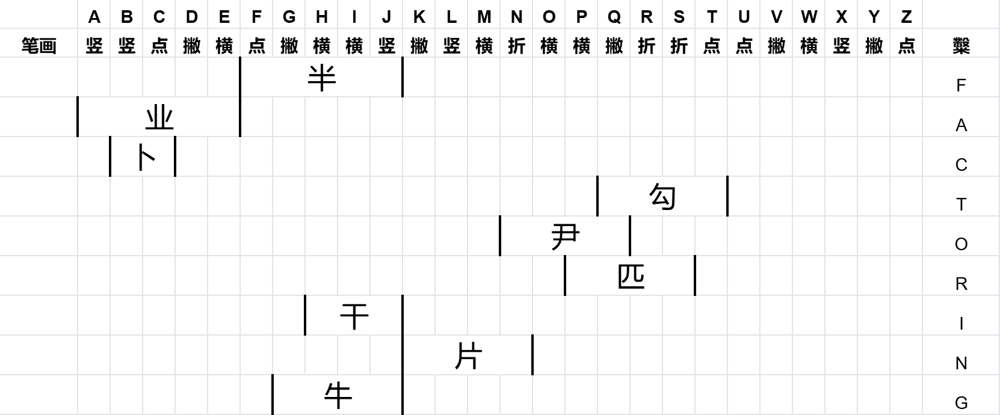

# 这题我糳过

## 题面

你来到了巴黎。城市里一片涂鸦吸引了你的注意，你走上前去发现——

整面墙被写上了一个大大的“糳”，以及其他一些不明所以的文字

## 解题后内容

你要离开之前，获得了一份旅游指南，你注意到其中一句话被圈了出来：“这里的气候大会曾谈论过海平面上升的威胁。”

## 答案

`FACTORING`

## 解析

## 提示

### 1. 我毫无头绪

把每个字的笔画顺序写出来，再和“糳”字的笔画顺序比对一下，会发现他们笔画顺序都包含在“糳”的笔画顺序中并且有唯一的序列。

### 2. 该如何提取

提取加粗笔画在上一步中的顺序，转字母。

## 本地附件

- [cccdac8f27e64e7bb0fd4cd7b34ed49e.webp](../../../assets/archive.cipherpuzzles.com/ccbc15/images/4/cccdac8f27e64e7bb0fd4cd7b34ed49e.webp)
- [d05d61bcf8b444fa80bea14ec400d2f1.webp](../../../assets/archive.cipherpuzzles.com/ccbc15/images/4/d05d61bcf8b444fa80bea14ec400d2f1.webp)

来源：[https://archive.cipherpuzzles.com/ccbc15/problems/4/25.yaml](https://archive.cipherpuzzles.com/ccbc15/problems/4/25.yaml)
