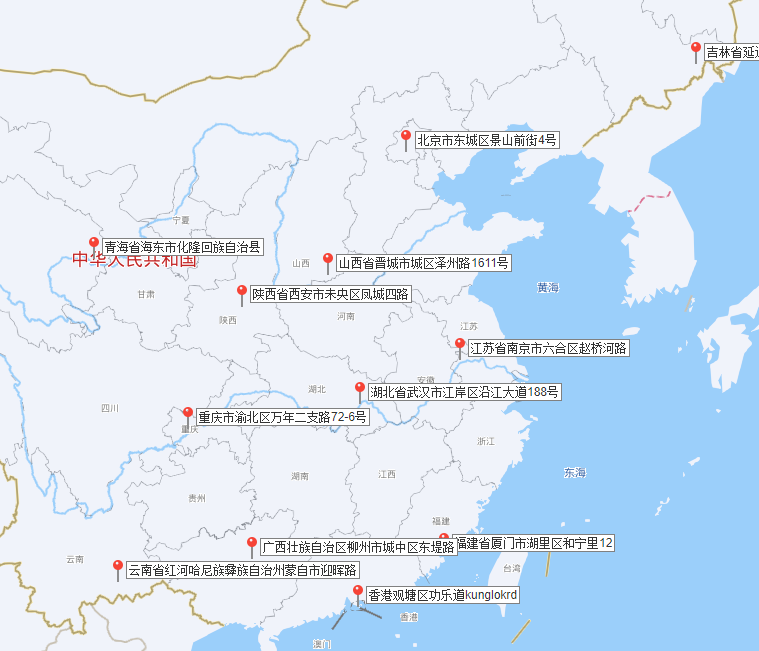

# 布达佩斯的即兴喜剧团

## 题面

你来到了布达佩斯。来都来了，当然不能错过当地的即兴喜剧。

看看这些有趣的喜剧，我想起那位喜剧大师曾说过：喜剧就像是一根线，串联起了人们的生活。

<h2>不苟言笑的脸</h2>
<ul>
<li>15:00</li>
</ul>
<h2>神秘的回族团队</h2>
<ul>
<li>13:00</li>
<li>15:10</li>
<li>17:00</li>
</ul>
<h2>一方水土养一方人，您那儿人清晌都做啥？</h2>
<ul>
<li>13:30</li>
<li>17:10</li>
<li>20:20</li>
</ul>
<h2>汉字为什么这么难学</h2>
<ul>
<li>16:20</li>
<li>17:20</li>
<li>19:00</li>
<li>21:00</li>
<li>21:30</li>
</ul>
<h2>活不下去的鸭子</h2>
<ul>
<li>14:20</li>
<li>15:20</li>
<li>18:10</li>
<li>20:10</li>
</ul>
<h2>高板凳与低板凳</h2>
<ul>
<li>14:10</li>
<li>16:00</li>
<li>18:00</li>
</ul>
<h2>萝卜丁与芝麻酱</h2>
<ul>
<li>16:10</li>
<li>18:20</li>
<li>20:00</li>
<li>21:10</li>
</ul>
<h2>如何给送餐保温？</h2>
<ul>
<li>13:10</li>
<li>14:00</li>
<li>15:30</li>
<li>16:30</li>
</ul>
<h2>超级臭味大爆炸</h2>
<ul>
<li>17:30</li>
<li>19:10</li>
<li>20:30</li>
<li>21:20</li>
</ul>
<h2>煮食格喜剧</h2>
<ul>
<li>13:20</li>
<li>18:30</li>
</ul>
<h2>当马来调料商遇到海鲜</h2>
<ul>
<li>14:30</li>
<li>16:40</li>
<li>19:20</li>
<li>20:40</li>
</ul>

## 解题后内容

你要离开之前，获得了一份旅游指南，你注意到其中一句话被圈了出来：“双子城，两者相互博弈却亦敌亦友。”

## 答案

`UNSETTLED`

## 解析

如果注意到了本体对应的城市布达佩斯，或是从个别标题中推导出和食物的相关性，可能可以猜到题目中指向的喜剧大师是陈佩斯。本题致敬了他的知名小品《吃面条》。每一个喜剧节目的标题都对应了一种面条类食品（包括米线，荞麦面）。特别的，这些面条也对应了一个具体的城市。

| **描述**              | **地区** | **面**       |
|:-------------------:|:------:|:-----------:|
| 不苟言笑的脸              | 延吉     | 冷面          |
| 神秘的回族团队             | 化隆     | 拉面/牛肉面      |
| 一方水土养一方人，您那儿人清晌都做啥？ | 晋城     | 肉丸方便面       |
| 汉字为什么这么难学           | 西安     | biangbiang面 |
| 活不下去的鸭子             | 南京     | 鸭血粉丝汤       |
| 高板凳与低板凳             | 重庆     | 小面          |
| 萝卜丁与芝麻酱             | 武汉     | 热干面         |
| 如何给送餐保温？            | 蒙自     | 过桥米线        |
| 超级臭味大爆炸             | 柳州     | 螺蛳粉         |
| 煮食格喜剧               | 香港     | 车仔面         |
| 当马来调料商遇到海鲜          | 厦门     | 沙茶面         |

将每个小时中演出节目对应城市按照分钟的顺序链接起来，根据象形，可以得到答案**UNSETTLED**

|   |   |     |    |    |    |    |
|---|---|-----|----|----|----|----|
| 1 | U | 化隆  | 蒙自 | 香港 | 晋城 |    |
| 2 | N | 蒙自  | 重庆 | 南京 | 厦门 |    |
| 3 | S | 延吉  | 化隆 | 南京 | 蒙自 |    |
| 4 | E | 重庆  | 武汉 | 西安 | 蒙自 | 厦门 |
| 5 | T | 化隆  | 晋城 | 西安 | 柳州 |    |
| 6 | T | 重庆  | 南京 | 武汉 | 香港 |    |
| 7 | L | 西安  | 柳州 | 厦门 |    |    |
| 8 | E | 武汉  | 南京 | 晋城 | 柳州 | 厦门 |
| 9 | D | 西安  | 武汉 | 柳州 | 西安 |    |

## 提示

### 1. 我毫无头绪

仔细观察喜剧的标题，他们都有一个共同主题，这题大概率和这类主题的物品有关。当然，如果你能意识到这位和布达佩斯有关的喜剧大师是谁，它会帮助你推断到底喜剧为什么“像线”，这道题的主题致敬了他最有名的喜剧作品之一。

### 2. 我知道主题是什么了，也找到了一些答案，但是我还需要知道什么

注意你找到的东西其实都和某个中国城市有密切的关系。

### 3. 该如何提取

每个小时作为一组，按分钟顺序连接你的答案，象形可以得到最终的结果。

## 本地附件

- [c27c49d30d884a88b56da50b5f415d23.webp](../../../assets/archive.cipherpuzzles.com/ccbc15/images/4/c27c49d30d884a88b56da50b5f415d23.webp)

来源：[https://archive.cipherpuzzles.com/ccbc15/problems/4/26.yaml](https://archive.cipherpuzzles.com/ccbc15/problems/4/26.yaml)
