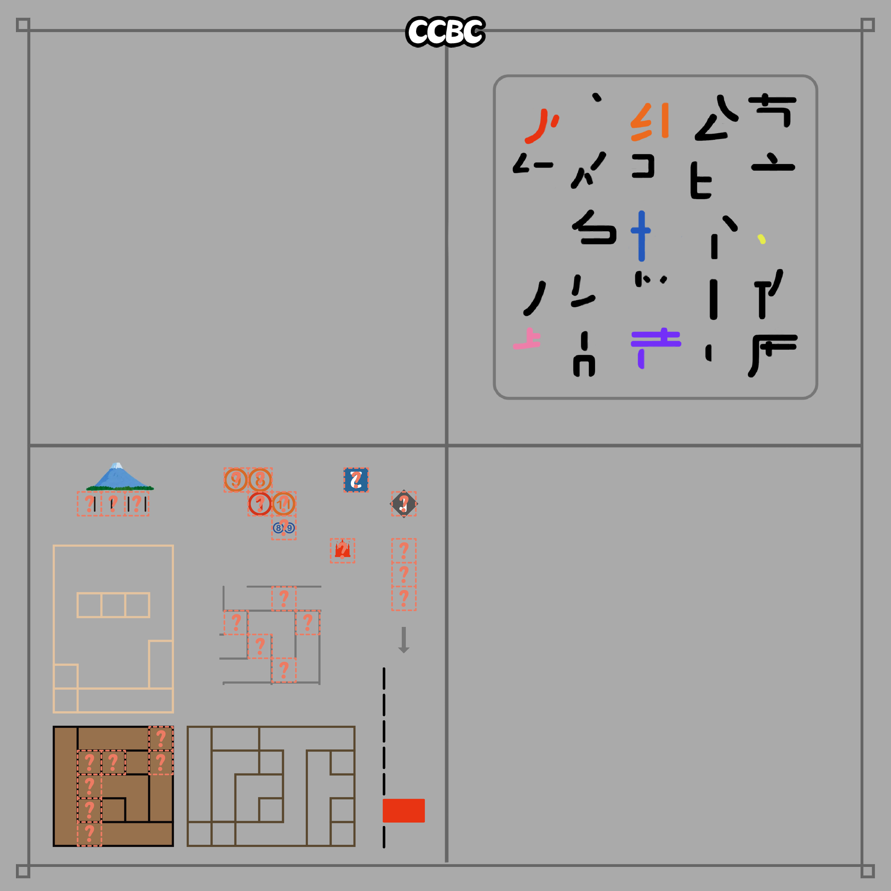
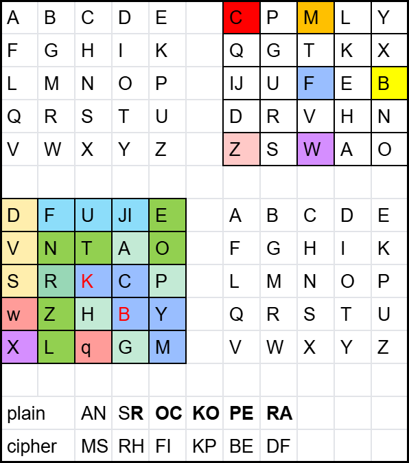

# CCBC 4^2

## 题面

你来到了首尔。

这个美工风格好像很眼熟... 难道是... ______码？

勘误（8.10 10:24 及之前）：

题目文本的最后一个字改成了“码”。 
题目图右上部分，修正了第5行第2列的笔画。 
题目图左下部分，添加了一个遗漏的问号；删除了左下5\*5方格中的一个问号，修改了其右侧5\*7方格的框线；将右上角的“2”倒置。

果然，最后有一段密文： MSRHFIKPBEDF

## 解题后内容

你要离开之前，获得了一份旅游指南，你注意到其中一句话被圈了出来：“首尔大学生物系在进化论研究中取得了显著的成果。”

## 答案

`ROCK OPERA`

## 解析

## 提示

### 1. 密文的加密方式

这种美工风格参考的原作是本网站【往届比赛】列举的活动之一。将它的名字填入下划线中，这提示了密文使用了哪种古典密码。

### 2. 如何解读↙

按原题目的内容（或规则）可以解出7个带有字母的碎片，它们可以拼成5*5方阵（有两个R是正常的，它们要重叠）。

### 3. 如何解读↗

按图片中有/无出现第1-5笔画，二进制按00001=A, ...转字母。

## 中间答案

| 提交 | 回复 | 附加信息 |
| --- | --- | --- |
| ANS ROCK OPERA | 对呀对呀！答案就是 ROCK OPERA ！ |  |

## 本地附件

- [8753f02602ea488f82fdd6c19ebb9916.webp](../../../assets/archive.cipherpuzzles.com/ccbc15/images/4/8753f02602ea488f82fdd6c19ebb9916.webp)
- [deb6506aed5440548552b3c187916af8.webp](../../../assets/archive.cipherpuzzles.com/ccbc15/images/4/deb6506aed5440548552b3c187916af8.webp)

来源：[https://archive.cipherpuzzles.com/ccbc15/problems/4/28.yaml](https://archive.cipherpuzzles.com/ccbc15/problems/4/28.yaml)
