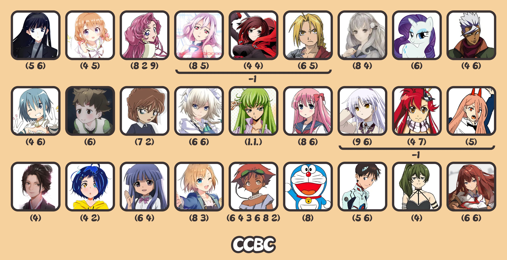

# 老二次元

## 题面

你来到了圣多明各，这里正在举行漫展。认出这些熟悉的角色，你DNA动了！

## 解题后内容

你要离开之前，获得了一份旅游指南，你注意到其中一句话被圈了出来：“在街上，你能看到许多骑自行车的人。”

## 答案

`AMENDMENT`

## 解析

首先检索人物名字

| **顺序** | **人物**              | **人名(罗马音或西文)**                     |
|:------:|:-------------------:|:----------------------------------:|
| 1      | 冬马和纱                | **T**ouma Kazusa                       |
| 2      | 保登心爱                | **H**oto Kokoa                         |
| 3      | 尤菲米娅                | **E**uphemia Li Britannia              |
| 4      | 楪祈                  | **Y**uzuriha Inori                     |
| 5      | Ruby Rose           | **R**uby Rose                          |
| 6      | 爱德华·艾尔利克            | **E**dward Elric                       |
| 7      | 冬坂五百里               | **F**uyusaka Iori                      |
| 8      | 瑞瑞                  | **R**arity                             |
| 9      | 奥尔加·伊兹卡             | **O**rga Itsuka                        |
| 10     | 美树沙耶加               | **M**iki Sayaka                        |
| 11     | 若叶                  | **W**akaba                             |
| 12     | 灰原哀                 | **H**aibara Ai                         |
| 13     | 十六夜咲夜               | **I**zoyai Sakuya                      |
| 14     | C.C.                | **C**.C.                               |
| 15     | 原村和                 | **H**aramura Nodoka                    |
| 16     | 立华奏                 | **T**achibana Kanade                   |
| 17     | 优子                  | **Y**oko Littner                       |
| 18     | 帕瓦                  | **P**ower                              |
| 19     | エマ                  | **E**mma                               |
| 20     | 大户爱                 | **O**oto Ai                            |
| 21     | 古手梨花                | **F**urude Rika                        |
| 22     | 宫森葵                 | **M**iyamori Aoi                       |
| 23     | 爱德华·王·侯·皮皮鲁·提布鲁斯基4世 | **E**dward Wong Hau Pepelu Tivrusky IV |
| 24     | 哆啦A梦                | **D**oraemon                           |
| 25     | 碇真嗣                 | **I**kari Shinji                       |
| 26     | 尤贝尔                 | **Ü**bel                               |
| 27     | 牧濑红莉栖               | **M**akise Kurisu                      |

观察首字母得到：**THEY'RE FROM WHICH TYPE OF MEDIUM**，于是查询人物出自的作品(最早)属于 ACG（Anime / Comic / Game），即动画/漫画/游戏之中的哪一个

| **人物(romaji)**                     | **出自作品**          | **作品是A/C/G ?**         |
|:----------------------------------:|:-----------------:|:----------------------:|
| Touma Kazusa                       | White Album 2     | Game                   |
| Hoto Kokoa                         | 请问您今天要来点兔子吗？      | Comic                  |
| Euphemia Li Britannia              | CODE GEASS 反叛的鲁路修 | Anime |
| Yuzuriha Inori                     | 罪恶王冠              | Anime                  |
| Ruby Rose                          | RWBY              | Anime                  |
| Edward Elric                       | 钢之炼金术师            | Comic                  |
| Fuyusaka Iori                      | 十三机兵防卫圈           | Game                   |
| Rarity                             | 小马宝莉：友谊是魔法        | Anime                  |
| Orga Itsuka                        | 机动战士高达 铁血的奥尔芬斯    | Anime          |
| Miki Sayaka                        | 魔法少女小圆            | Anime                  |
| Wakaba                             | KEMURIKUSA        | Anime                  |
| Haibara Ai                         | 名侦探柯南             | Comic                  |
| Izoyai Sakuya                      | 东方Project         | Game                   |
| C.C.                               | CODE GEASS 反叛的鲁路修 | Anime                  |
| Haramura Nodoka                    | 天才麻将少女            | Comic                  |
| Tachibana Kanade                   | Angel Beats！      | Anime                  |
| Yoko Littner                       | 天元突破红莲螺岩          | Anime                  |
| Power                              | 电锯人               | Comic                  |
| Emma                               | 只狼：影逝二度           | Game                   |
| Ooto Ai                            | 奇蛋物语              | Anime                  |
| Furude Rika                        | 寒蝉鸣泣之时            | Game          |
| Miyamori Aoi                       | 白箱                | Anime                  |
| Edward Wong Hau Pepelu Tivrusky IV | 星际牛仔              | Anime                  |
| Doraemon                           | 哆啦A梦              | Comic                  |
| Ikari Shinji                       | 新世纪福音战士           | Anime                  |
| Übel                               | 葬送的芙莉莲            | Comic                  |
| Makise Kurisu                      | 命运石之门             | Game |

根据FT中提到的【DNA】，将ACG三个一组当作密码子，转换为对应的氨基酸字母，按题面进行 - 1 的移位后，得到答案 **AMENDMENT**. 

| 密码子 | 字母 | 额外的移位 | 字母 |
|:-----:|:-----:|:-----:|:-----:|
| GCA | A |  | **A** |
| AAC | N | -1 | **M** |
| GAA | E |  | **E** |
| AAC | N |  | **N** |
| GAC | D |  | **D** |
| AAC | N | -1 | **M** |
| GAG | E |  | **E** |
| AAC | N |  | **N** |
| ACG | T |  | **T** |

## 提示

### 1. 我毫无头绪

括号中的数字是二次元人物的名字长度，读这些人物的首字母。

### 2. 该如何提取

你提取出的那句话的最后一个词在本题中分为三种情况，它们通常分别用三个字母表示。另外注意图片上的人物是三人一组的——再结合本文的背景描述，这些信息共同提示了要用哪种方式提取。

## 本地附件

- [8cc8fa733d324b13b5d96e0cac2defdb.webp](../../../assets/archive.cipherpuzzles.com/ccbc15/images/4/8cc8fa733d324b13b5d96e0cac2defdb.webp)

来源：[https://archive.cipherpuzzles.com/ccbc15/problems/4/30.yaml](https://archive.cipherpuzzles.com/ccbc15/problems/4/30.yaml)
