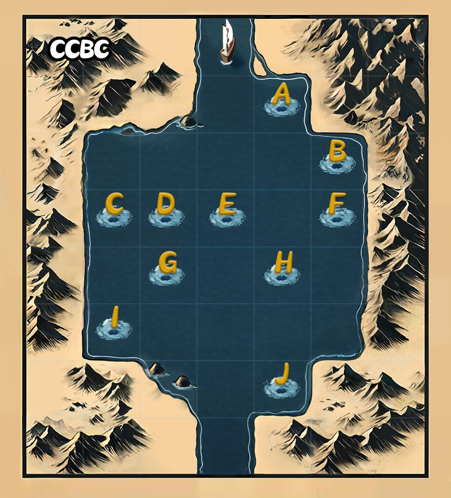

# 海盗们的数学

## 题面

你来到了布宜诺斯艾利斯。你坐在咖啡馆里，边上的老人给你讲了这么一则故事——

传说，Arian、Bob、Clain、David、Eric五名海盗获得了100枚金币。

于是，他们决定根据姓名首字母排序，首先将由Arian提出分配方案，然后5人投票表决，只有当赞成票**超过**半数，方案才会被通过；否则他将被扔入大海喂鲨鱼，并由Bob再提出分配方案，依此类推。

五位海盗都是聪明、理智、贪婪且嗜杀（暂时），他们在确保自己分得更多的金币的前提下，倾向于杀掉更多的人——当然无论发生什么情况（哪怕时空发生了变化），**都一定会把自己的生命摆在第一位**。

但是，正当海盗们准备开始执行以上规则时，意外发生了！海盗船误入了一处漩涡海峡…

 

 

**众所周知，穿越不同的漩涡会分别对时空造成以下影响：**

| <!-- --> | <!-- --> 
|----------|----------
|A|Clain被大家剥夺了投票权，因此总共只计4票
|B|所有海盗都变得良知尚存，只要被分配到总量30%以上的金币，就一定不会投反对票
|C|Bob成为了海盗们的领袖，因此他可以投出2票
|D|David变得知足常乐，他只要被分配到了金币，就一定不会投反对票
|E|Eric变得穷凶极恶，他完全不在乎金币，只想尽可能多地杀掉其他海盗
|F|规则变成了必须全票通过才可以活命
|G|规则变成了由Eric先提出分配方案，然后轮到David，依此类推
|H|海盗们只找到了2枚金币
|I|David变得穷凶极恶，他完全不在乎金币，只想尽可能多地杀掉其他海盗
|J|David变得非常善良，他不想伤害任何人，因此任何情况都不会投反对票

海盗船就这样消失在了峡谷中，没有人知道海盗们最终是如何分配金币的。当人们再次发现这艘海盗船时，海盗和金币都早已不见了踪影，只留下一串扭曲的线条...

## 解题后内容

你要离开之前，获得了一份旅游指南，你注意到其中一句话被圈了出来：“石油，又称黑金子，是这里主要生产的资源。”

## 答案

`LOGARITHM`

## 解析

[解析链接](https://docs.qq.com/sheet/DT3JqY3VMY0ZsbHFD?tab=BB08J2)

## 提示

### 1. 我毫无头绪

本题为经典海盗分金博弈的变种，下方的曲线是海盗船的航线，可以判断每条航线海盗船经历了哪些漩涡，在海盗分金过程中加入漩涡对应的额外条件。

### 2. 该如何提取

根据上一步的结果，分到金的海盗视为1，未分到的视为0，求二进制值并转字母。

## 本地附件

- [3ae5ee3f2bea419d8daba4eef4f8e31a.webp](../../../assets/archive.cipherpuzzles.com/ccbc15/images/4/3ae5ee3f2bea419d8daba4eef4f8e31a.webp)
- [ff56880939044f08bc58d03101d4db50.webp](../../../assets/archive.cipherpuzzles.com/ccbc15/images/4/ff56880939044f08bc58d03101d4db50.webp)

来源：[https://archive.cipherpuzzles.com/ccbc15/problems/4/34.yaml](https://archive.cipherpuzzles.com/ccbc15/problems/4/34.yaml)
