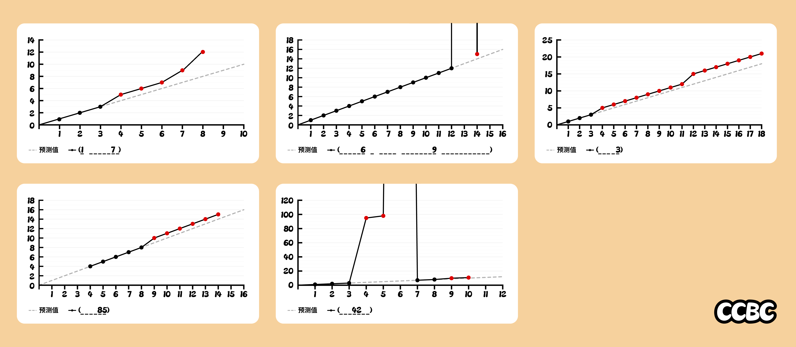

# 外推法

## 题面

你来到了柏林。

正确的预测值都是相似的，不正确的预测值各有千秋。

## 解题后内容

你要离开之前，获得了一份旅游指南，你注意到其中一句话被圈了出来：“可惜战争让许多科学家都去追求他们的美国梦去了。”

## 答案

`BORDERING`

## 解析

根据描述，我们需要根据不正确的预测值猜出每张图代表什么。实际上，每张图都是一个“不正常数数”的序列：

| **图片** | **特征** | **序列** | **答案** |
|:-------:|:-------:|:-------|:-------:|
| 1 | 最大值为 12，中间有值缺失 | 1, 2, 3, 5, 6, 7, 9, 12 | 维生素B（`B VITAMIN`) |
| 2 | 13 和 14 被换成了一个很大的数 | 1, 2, 3, 4, 5, 6, 7, 8, 9, 10, 11, 12, 1314, 15 | CCBC（`CIPHER & CODE BREAKING COMPETITION`）|
| 3 | 跳过了 4, 13, 14 | 1, 2, 3, 5, 6, 7, 8, 9, 10, 11, 12, 15, ... | 楼层（`FLOOR`）|
| 4 | 从 4 开始；跳过了 9 | 4, 5, 6, 7, 8, 10, 11, 12, 13, 14, 15 | 苹果手机（`IPHONE`）|
| 5 | 在 95, 98 后出现了很大的数；跳过了 9 | 1, 2, 3, 95, 98, 2000, 7, 8, 10, 11 | Windows 版本号（`WINDOWS`）|

按数字提取得到答案 **BORDERING**.

## 提示

### 1. 我毫无头绪

每张图的“预测值”是1,2,3,...，而每个折线图代表一种“不正常数数的方式”。例如，第三张图跳过了数字4,13,14，因此是(有时)楼层的数数方式，填写FLOOR.

### 2. 第一个图是？

一种营养物质

### 3. 第二个图是？

不知庐山真面目，只缘身在此山中？

### 4. 第三个图是？

楼层

### 5. 第四个图是？

一个电子产品

### 6. 第五个图是？

一个操作系统

## 本地附件

- [c1fa7668000a44d7a22649f76c95e9ea.webp](../../../assets/archive.cipherpuzzles.com/ccbc15/images/4/c1fa7668000a44d7a22649f76c95e9ea.webp)

来源：[https://archive.cipherpuzzles.com/ccbc15/problems/4/35.yaml](https://archive.cipherpuzzles.com/ccbc15/problems/4/35.yaml)
