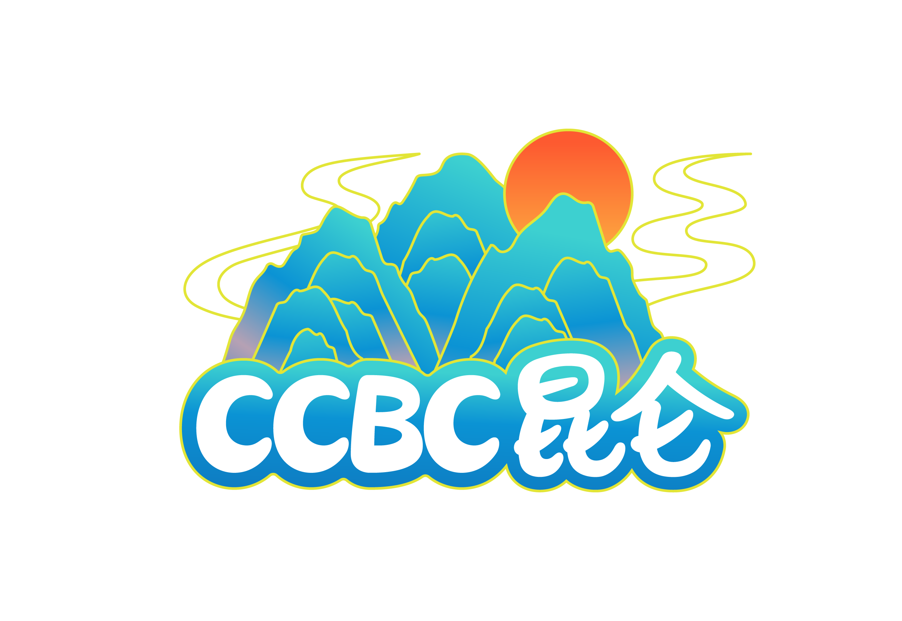

# 飞起玉龙三百万

## 题面

<center></center>

在雪山之巅，闲散解谜眺望着茫茫的昆仑。虽然冷得不行，但是一想到这里可能终于能找到CCBC10的出题人，就十分的激动。

“而今我谓昆仑，不要这高，不要这多雪！……”小白狐兴致上来，吟诗一首。

Fivero及时打断道：“得得得，别忘了我们在三个关键地点搜集到的好帮手！我们需要他们来帮我们找到目标！”

小白狐没有理他，继续念到：“安得倚天抽宝剑，把汝裁为三截？一截遗欧，一截赠美，一截还东国！”

## 指示

将你的答案切割成长度为 2, 3, 4 的三部分，并分别用在其他三个meta中。

完成三个部分以后，请记得回到昆仑山上，进行最后一步！

## 交互源码

### vue_template

```html
<template>
    <div>
        <div v-html="secondPartHtml"></div>
        <div style="height: 170px"></div>
    </div>
</template>

<style>
.top-divider {
    margin-top: 60px;
}
</style>

<data>
<div class="top-divider">&nbsp;</div>

# 喀喇昆仑山脉：阅尽人间春色

<center></center>

有了三个助手，你可以先忘记其他地方的那些答案了。

“一截遗欧，一截赠美，一截还东国。太平世界，**环球同此凉热**！”小白狐念到，“我们的努力一定会被拍成**纪录片**，刻在CCBC历史上的！”

找到C10出题组的最后一步是什么？

（答案为 “4 4 and 4” 但提交 “4 4 4” 也能正确）

<div style="height: 170px"></div>
</data>
```

### vue_script

```text
const { ref, inject, onMounted } = Vue;

export default {
    setup() {
        const secondPartHtml = ref("");
        const backend = inject("backend");
        const markdownToHtml = inject("markdownToHtml");

        const processBackend = async () => {
            let data = await backend("c15-c9meta-getpart2", {});
            secondPartHtml.value = markdownToHtml(data.data);
        }

        onMounted(() => {
            processBackend();
        });

        //所有在页面上使用的对象，都需要这里return出去
        return {
            secondPartHtml
        }
    }
}
```

### backend_c15-c9meta-getpart2

```text
const PID = 38;

function main(ctx, request) {

    if (ctx.getProgress(PID, "part2") == "unlocked") {
        let data = ctx.getPuzzleData(PID);
        return {
            data: data
        }
    } else {
        return {
            data: ""
        }
    }
}

//=======以下是JSON解析与调用脚本，一般不需要修改========
function _jsonProcessHelper(ctx) {
    let request = JSON.parse(ctx.request);
    let resBody = main(ctx, request);
    let resString = JSON.stringify(resBody);
    ctx.response(resString);
}

_jsonProcessHelper(ctx);
```


## 解题后内容

风水和必应！这才是真正充满智慧的找人方法。
（新剧情已解锁）

## 答案

`FENG SHUI AND BING`

## 解析

每个答案答对后都会出现一段旅行指南。这个旅行指南分别对应纪录片《环球同此凉热》的标题之一。这个系列纪录片的一共有12集，每一集标题都由三个词汇组成，所有来自于同一大洲的城市（除了澳大利亚），以“一截遗欧，一截赠美，一截还东国”的顺序，都对应相同的词汇位置。且，注意到他们的国名首字母分别是连续的字母序列，这给我们了一个排序。

注意到纪录片集数与SUBMETA长度相同，以及三个submeta分属一个大洲（“一截遗欧，一截赠美，一截还东国”）。对于每一则旅行感言，根据所属大洲，提取相应meta中集数对应位置的字母。得到答案**FENG SHUI AND BING**

## FIRED GOBLINS

| **城市** | **国家（英文）** | **旅游指南**                | **关键词** | **集数** | **提取** |
|:------:|:----------:|:-----------------------:|:-------:|:------:|:------:|
| 巴黎     | France     | 这里的气候大会曾谈论过海平面上升的威胁。    | 海平面     | 1      | F      |
| 柏林     | Germany    | 可惜战争让许多科学家都去追求他们的美国梦去了。 | 美国梦     | 4      | E      |
| 布达佩斯   | Hungary    | 双子城，两者相互博弈却亦敌亦友。        | 博弈      | 11     | N      |
| 罗马     | Italy      | 没想到这里也加入了新丝路！           | 丝路      | 5      | G      |

## CRUSH ON A GIRL

| **城市**  | **国家（英文）**         | **旅游指南**             | **关键词** | **集数** | **提取** |
|:-------:|:------------------:|:--------------------:|:-------:|:------:|:------:|
| 布宜诺斯艾利斯 | Argentina          | 石油，又称黑金子，是这里主要生产的资源。 | 黑金子     | 4      | S      |
| 巴西利亚    | Brazil             | 雨季常带来强烈的洪水。          | 洪水      | 5      | H      |
| 渥太华     | Canada             | 欢迎你来珍珠街逛一逛！          | 珍珠街     | 3      | U      |
| 圣多明各    | Dominican Republic | 在街上，你能看到许多骑自行车的人。    | 自行车     | 10     | I      |

## BABA IS STRONG

| **城市** | **国家（英文）** | **旅游指南**                | **关键词** | **集数** | **提取** |
|:------:|:----------:|:-----------------------:|:-------:|:------:|:------:|
| 首尔     | Korea*     | 首尔大学生物系在进化论研究中取得了显著的成果。 | 进化论     | 4      | B      |
| 万象     | Laos       | 因为自然灾害，许多灾民都进行了大迁移。     | 大迁移     | 10     | I      |
| 吉隆坡    | Malaysia   | 每个国民都应当有责任感。            | 责任感     | 11     | N      |
| 加德满都   | Nepal      | 这里的建筑就像迷宫一样！            | 迷宫      | 12     | G      |

*这里使用Korea，虽然Republic of Korea和South Korea 也常见。

## 提示

### 1. 我毫无头绪

请注意题目中加粗的内容，你应该找到一个特定的作品，看看旅行感言和这个作品的标题有什么关系吗？

### 2. 该如何提取

有注意到一句词出现了两遍吗? 排序则需要用到词以及这些城市所属国家的首字母。你需要根据正确的旅行感言，从对应位置的META答案中提取正确的内容。

### 3. 我觉得小题答案和meta有点对不上，但是由于我剧情一个字都没有看，因此请告诉我是什么机制导致我有这种感觉

你不看狐宝的剧情，狐宝不开心，所以找你要了6000话费买这条，现在听好了：每个分区都有1个小题的答案没有在本区meta中使用！


## 中间答案

| 提交 | 回复 | 附加信息 |
| --- | --- | --- |
| FENG SHUI BING | 请提交 FENG SHUI AND BING |  |

## 本地附件

- [62bfda4968b24c6b9514736c869ee3b3.webp](../../../assets/archive.cipherpuzzles.com/ccbc15/images/4/62bfda4968b24c6b9514736c869ee3b3.webp)

来源：[https://archive.cipherpuzzles.com/ccbc15/problems/4/38.yaml](https://archive.cipherpuzzles.com/ccbc15/problems/4/38.yaml)
