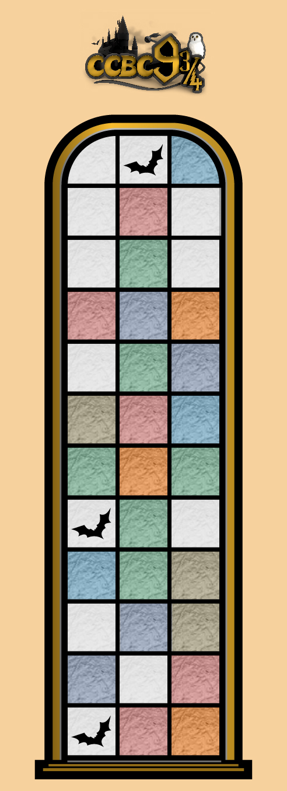

# 魔幻奇妙之旅

## 题面

国王十字街站的 9 号站台与 10 号站台之间，闲散解谜发现了这个图案。听说填满这个图案就能找到他们要的帮手！

1. 所有的出现 3 次及以上的字母都被涂了颜色；
2. 同色格子的字母相同；
3. 蝙蝠格子里的字母只出现了一次。

## 解题后内容

所以，你就找了一群失业的哥布林来帮我们？

## 答案

`FIRED GOBLINS`

## 解析

按照规则填入3-子串即可。可以从回文子串下手，利用子串连续性进行推理。

|   |   |   |
|:---:|:---:|:---:|
| F | U | L |
| I | E | F |
| R | O | C |
| E | N | T |
| D | O | N |
| G | E | L |
| O | T | O |
| B | O | R |
| L | O | G |
| I | N | G |
| N | C | E |
| S | E | T |

念出最左列得到答案**FIRED GOBLINS**

## 提示

### 1. 你能告诉我绿色是什么字母吗

绿色是o。

### 2. 该如何提取

读第一列的字母。

### 3. 我觉得小题答案和meta有点对不上，但是由于我剧情一个字都没有看，因此请告诉我是什么机制导致我有这种感觉

你不看狐宝的剧情，狐宝不开心，所以找你要了6000话费买这条，现在听好了：每个分区都有1个小题的答案没有在本区meta中使用！

## 本地附件

- [f176a8569baf41e29a7f5bf612718f94.webp](../../../assets/archive.cipherpuzzles.com/ccbc15/images/4/f176a8569baf41e29a7f5bf612718f94.webp)

来源：[https://archive.cipherpuzzles.com/ccbc15/problems/4/73.yaml](https://archive.cipherpuzzles.com/ccbc15/problems/4/73.yaml)
