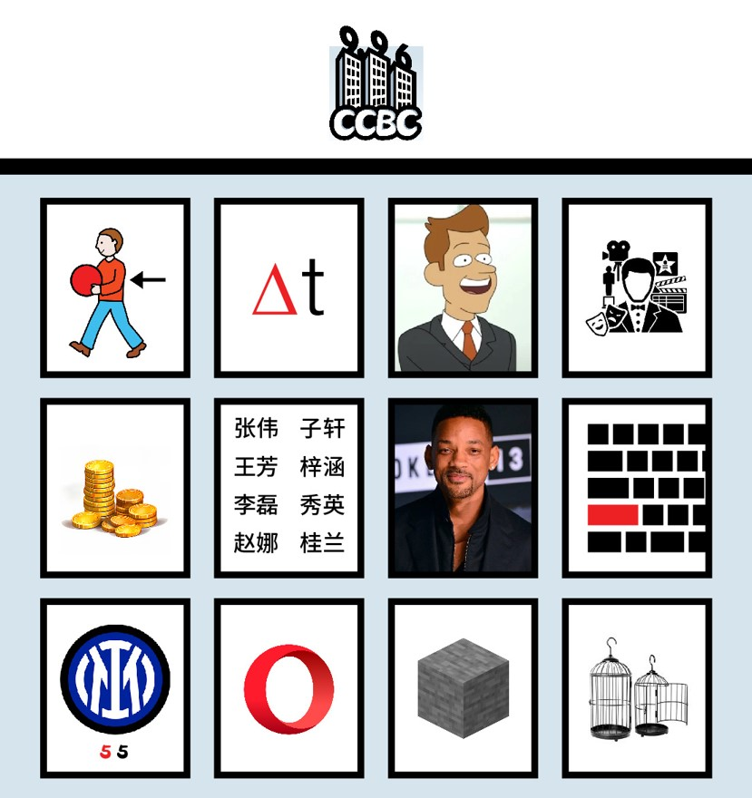

# 断桥是否下过雪

## 题面

一位供职于某橙色互联网公司的员工主动想帮闲散解谜寻回出题组，可他不小心错过了面试，因为他还有班要**加**。他现在该怎么证明自己呢？

## 解题后内容

这种强悍是我们橙色互联网公司员工的一种福报！

## 答案

`BABA IS STRONG`

## 解析

识别每张图上对应的五字词语（可以从几个长度明确的答案中推理出）。每张图上对应的词语都是答案中4-子串加一个字母后重排成为的单词。提取加的字母可以得到答案**BABA IS STRONG**

| **答案**    | **图片内容** | **子串** | **提取** |
|:---------:|:--------:|:------:|:------:|
| BORDERING | BRING    | ring   | B      |
| UNSETTLED | DELTA    | tled   | A      |
| TETRAODON | BRETT    | tetr   | B      |
| FACTORING | ACTOR    | ctor   | A      |
| CONSTANCE | COINS    | cons   | I      |
| AMENDMENT | NAMES    | amen   | S      |
| LOGARITHM | SMITH    | ithm   | S      |
| ANGELFISH | SHIFT    | fish   | T      |
| PLENTIFUL | INTER    | enti   | R      |
| ROCKOPERA | OPERA    | pera   | O      |
| OSTEOTOMY | STONE    | oste   | N      |
| BRIEFCASE | CAGES    | case   | G      |

## 提示

### 1. 我毫无头绪

每个你用到的子串在重新排列后，可以加一个字母构成图片中的内容。找到这个字母和对应的单词。

### 2. 我觉得小题答案和meta有点对不上，但是由于我剧情一个字都没有看，因此请告诉我是什么机制导致我有这种感觉

你不看狐宝的剧情，狐宝不开心，所以找你要了6000话费买这条，现在听好了：每个分区都有1个小题的答案没有在本区meta中使用！

## 本地附件

- [f2f27da0b15241f2872838bc65f39f02.webp](../../../assets/archive.cipherpuzzles.com/ccbc15/images/4/f2f27da0b15241f2872838bc65f39f02.webp)

来源：[https://archive.cipherpuzzles.com/ccbc15/problems/4/74.yaml](https://archive.cipherpuzzles.com/ccbc15/problems/4/74.yaml)
