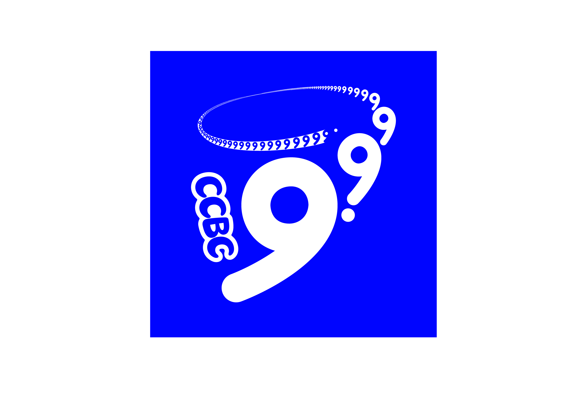

# 千万次的问

## 题面

纽约，联合国所在的地方，每个国家都有自己的代表。闲散解谜要找的三人组人曾在这里供职。可是其中一个人消失了，他到底怎么了？

|旅行顺序|所在城市|
|:-------:|:------:|
|1|渥太华|
|2|首尔|
|3|柏林|
|4|吉隆坡|
|5|堪培拉|
|6|布达佩斯|
|7|圣多明各|
|8|加德满都|
|9|巴西利亚|
|10|布宜诺斯艾利斯|
|11|罗马|
|12|巴黎|
|13|万象|

## 解题后内容

别谈了，他摔他喜欢的女生身上了，把她肋骨压断了，现在还在请假照顾人呢。

## 答案

`CRUSH ON A GIRL`

## 解析

由联合国+3人组，我们可以想到代表国家的三位号码ISO-3标准码。每个答案中拥有一个2-子串，对应该标准码中按顺序出现的两个字母。按照旅行顺序排序（排除澳大利亚），提取少的字母得到答案**CRUSH ON A GIRL**

| **答案**    | **首都**  | **国家** | **ISO-3** | **子串** | **提取字母** |
|:---------:|:-------:|:------:|:---------:|:------:|:--------:|
| ANGELFISH | 渥太华     | 加拿大    | CAN       | AN     | C        |
| ROCKOPERA | 首尔      | 韩国     | KOR       | KO     | R        |
| BORDERING | 柏林      | 德国     | DEU       | DE     | U        |
| OSTEOTOMY | 吉隆坡     | 马来西亚   | MYS       | MY     | S        |
| UNSETTLED | 布达佩斯    | 匈牙利    | HUN       | UN     | H        |
| AMENDMENT | 圣多明各    | 多米尼加   | DOM       | DM     | O        |
| PLENTIFUL | 加德满都    | 尼泊尔    | NPL       | PL     | N        |
| BRIEFCASE | 巴西利亚    | 巴西     | BRA       | BR     | A        |
| LOGARITHM | 布宜诺斯艾利斯 | 阿根廷    | ARG       | AR     | G        |
| CONSTANCE | 罗马      | 意大利    | ITA       | TA     | I        |
| FACTORING | 巴黎      | 法国     | FRA       | FA     | R        |
| TETRAODON | 万象      | 老挝     | LAO       | AO     | L        |

## 提示

### 1. 我毫无头绪

试着找到每个城市所在国家的某种长度为3的代码，看看他们和答案有什么共同点？

### 2. 我觉得小题答案和meta有点对不上，但是由于我剧情一个字都没有看，因此请告诉我是什么机制导致我有这种感觉

你不看狐宝的剧情，狐宝不开心，所以找你要了6000话费买这条，现在听好了：每个分区都有1个小题的答案没有在本区meta中使用！

## 本地附件

- [8ffbba7c59cf42f3b974e61abcef18aa.webp](../../../assets/archive.cipherpuzzles.com/ccbc15/images/4/8ffbba7c59cf42f3b974e61abcef18aa.webp)

来源：[https://archive.cipherpuzzles.com/ccbc15/problems/4/75.yaml](https://archive.cipherpuzzles.com/ccbc15/problems/4/75.yaml)
