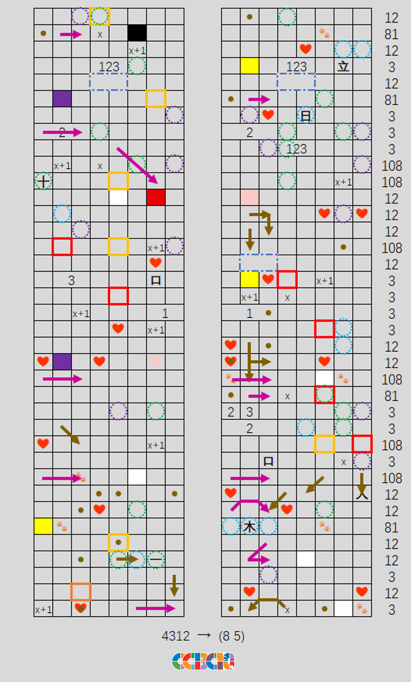
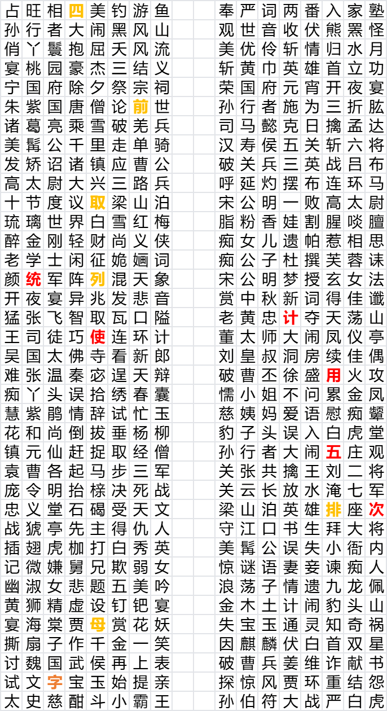

# 3、12、81、108

## 题面

女朋友给我发来这张表格，我能看明白的只有“立、日、十...”这些汉字，这些爱心又是啥意思，求大神帮破解！！！

<a href="https://docs.qq.com/sheet/DR3hHRm1rU3RKbWpX?tab=BB08J2">腾讯文档</a>

## 答案

`AMERICAN IDIOT`

## 解析

表格中已经给出的汉字，可以按顺序拼成“章回体”，结合标题数字联想到章回体小说——四大名著
	
对应关系分别是：3→三国演义；12→金陵十二钗→红楼梦；81→八十一难→西游记；108→一百零八将→水浒传

章回体小说的特点之一就是章回标题，一般上下两句各7-8个字，非常适合填入表格
	
观察表格可以推测，蓝圈为七曜，绿圈为数字，表格右侧的数字对应章回体标题出处，其中倒数第六行可以作为一个突破口

| **元素** | **对应规律**                              |
|:------:|:-------------------------------------:|
| 蓝色虚线圈  | 七曜                                    |
| 绿色虚线圈  | 表述数字的汉字（单、双等不算）                       |
| 紫色虚线圈  | 中国象棋棋子                                |
| 蓝色虚线框  | 中国传统节日                                |
| 红心     | 包含“心”的汉字（粉心是因为有不同版本，一版本为“忙”，另一版本为“莽”） |
| 色块     | 填入对应颜色                                |

将表格填完后，从上往下读取红框中的汉字至橙框，再由橙框开始从下往上读取黄框中的汉字，可得：统计使用五次字，字母排列取前四

统计表格中总计使用了五次的汉字，并按拼音字母排序。排列前四的字分别是：白、痴、国、美

按照4312的顺序重新组合并翻译为（8 5）的英文，可得：**AMERICAN IDIOT**

## 提示

### 1. 我毫无头绪

注意表格中已经给出的汉字，可以按照从上至下的顺序，拼成一个三字词语。

### 2. 还是不知道要做什么

结合题目名称想一想，上一步得到的东西，最著名的有哪些？这个东西最显著的特点（并且适合填入表格的）是什么？

### 3. 表格中的圈圈箭头都是什么意思

每种标记都代表同一类字或者词，除了显而易见的数字和七曜，再给出一些希望对你有所帮助：紫圈代表中国象棋棋子，棕点/箭头代表某种亲属关系，爪印代表（爪印差不多长成这样的）动物，实线框则是你要提取的部分，红色提取方向为从上至下，黄色提取方向为从下至上（注意橙=红+黄，所以需要使用两次！）。

## 中间答案

| 提交 | 回复 | 附加信息 |
| --- | --- | --- |
| 统计使用五次字 | 你解出了红色框的含义！ |  |
| 字母排列取前四 | 你解出了黄色框的含义！ |  |
| 统计使用五次字字母排列取前四 | 你解出了框的含义！ |  |
| 统计使用五次字，字母排列取前四 | 你解出了框的含义！ |  |
| 美国白痴 | 正确，请提交对应的英文！ |  |
| 章回体 | 正确，请继续！ |  |

## 本地附件

- [eac3c8a6e7d046dda80c50184eda22eb.webp](../../../assets/archive.cipherpuzzles.com/ccbc15/images/5/eac3c8a6e7d046dda80c50184eda22eb.webp)
- [f168177264084efd96681ea985a451c8.webp](../../../assets/archive.cipherpuzzles.com/ccbc15/images/5/f168177264084efd96681ea985a451c8.webp)

来源：[https://archive.cipherpuzzles.com/ccbc15/problems/5/39.yaml](https://archive.cipherpuzzles.com/ccbc15/problems/5/39.yaml)
