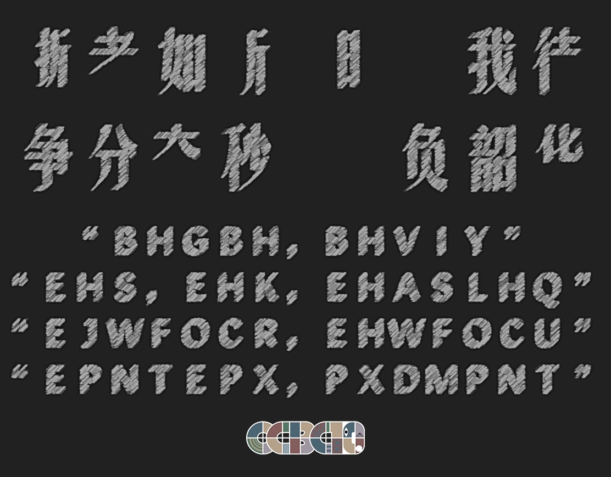
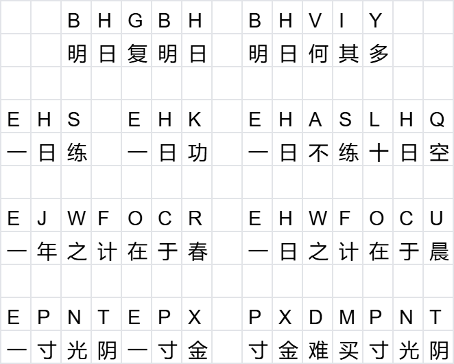

# 黑板报

## 题面

鼓励大家珍惜时间的黑板报，但好像被擦掉了一部分。

## 答案

`WHIP APPEAL`

## 解析

上方的四个成语为：逝者如斯、时不我待、争分夺秒、不负韶华

下方字母是字母对应汉字的单表，每行的句子都是一句关于珍惜时间的谚语

比较容易想到的有：一寸光阴一寸金，寸金难买寸光阴、明日复明日，明日何其多等

上方成语缺少的部分为：之、日、其、寸、不、寸、寸、一、不、十

代入单表对应的字母，可得：**WHIPAPPEAL**

## 提示

### 1. 我毫无头绪

这道题的主题是珍惜时间，黑板报上方写的是有关珍惜时间的成语，下方则是有关珍惜时间的谚语。

### 2. 该如何提取

找到上方缺少的部分，对应上一步得到的东西。

## 本地附件

- [80524e4df5c9435da59b04617dd6ca43.webp](../../../assets/archive.cipherpuzzles.com/ccbc15/images/5/80524e4df5c9435da59b04617dd6ca43.webp)
- [90ada2f78c5242ca805ab61110b4bc3a.webp](../../../assets/archive.cipherpuzzles.com/ccbc15/images/5/90ada2f78c5242ca805ab61110b4bc3a.webp)

来源：[https://archive.cipherpuzzles.com/ccbc15/problems/5/40.yaml](https://archive.cipherpuzzles.com/ccbc15/problems/5/40.yaml)
