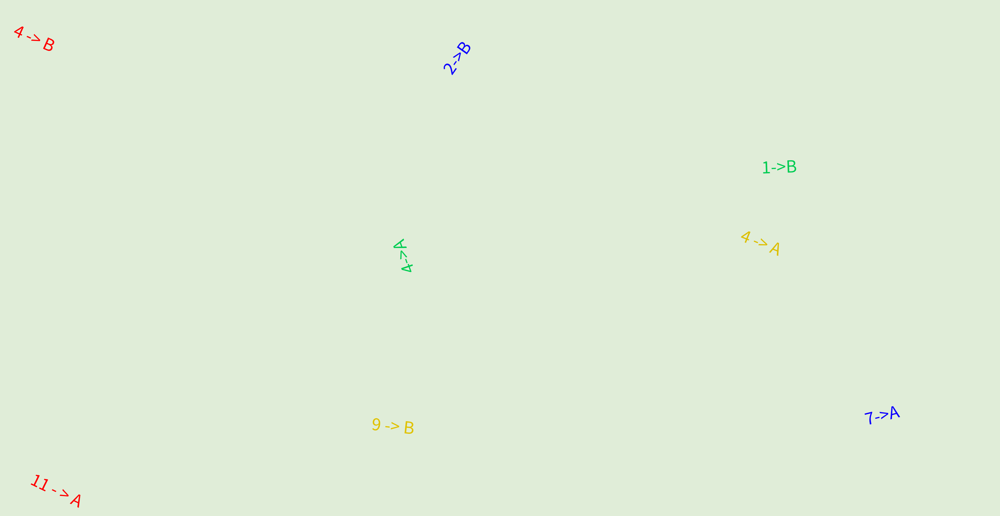
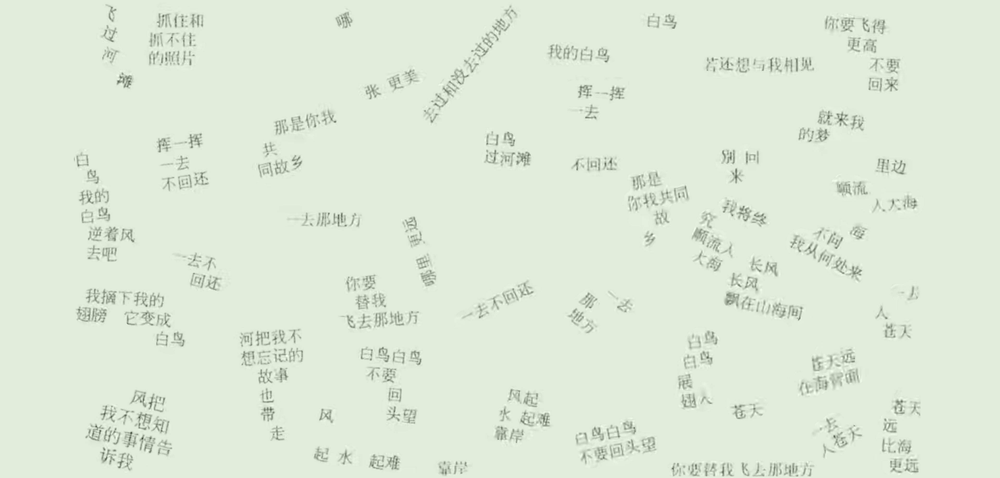

# 河海解谜

## 题面

*艰苦朴素、实事求是、严格要求、勇于探索！*

*在第一届河海解谜中，我们决定将反切作为一种标准提取手法。*

    

## 白鹤滩 

*长江顺流入大海，海不问我从何处来。*

    

    

    

    

  

## 溪洛渡

<table border="0" class="p2-table">
<tr><td>放置废品的地方，用来形容很肮脏的屋子</td><td>（三）</td><td>减少或降低事物的数量或质量</td><td>（三）</td></tr>
<tr><td>老儿北儿京儿口头禅</td><td>（三）</td><td>只利用重力去除水中悬浮物的设备</td><td>（一）</td></tr>
<tr><td>串状水果植株的主干</td><td>（三）</td><td>对于1mol标况氢气来说是-286 kJ	</td><td>（二）</td></tr>
</table>

  

## 小浪底

*美！*

<table border="1">
<tr><td>跑路</td><td>词典</td><td>宵小</td><td>浪花</td></tr>
<tr><td>光明</td><td>苏轼</td><td>心魔</td><td>伟大</td></tr>
<tr><td>沟壑</td><td>白云</td><td>烦恼</td><td>咋舌</td></tr>
<tr><td>颠茄</td><td>回路</td><td>刘氏</td><td>香菇</td></tr>
<tr><td>太阴</td><td>齐平</td><td>强直</td><td>客栈</td></tr>
</table>

- 这个地方在医院里。

- 金庸小说中提到的地点。

- 企业家。

- 湖北的一种白酒。
  

## 乌东德

*云南有自己的**顿涅茨克和莱比锡**！诶，这是怎么提取“滴”的？*

|<!-- -->|<!-- -->
|:-------|:---------
|这部被改编成桌游的谍战剧描绘了南渡后作者孤单无助，思念故国的感情。| 1\|2
|这个国产大语言模型是宝可梦第一世代中出现的神兽			   | 1\|2
|这种用来保鲜的金属制品在春天的时候会被升上天空。                  | 1\|1
|这张璃月的四星水系角色能运用强大的力量清除腐朽的障碍              | 1\|4
|这个韩国的古称之一适合穿圆头，方头鞋。                            | 1\|2
|这位来自四川的少数民族网络红人之中不能传递声音。                  | 1\|1
  
## 龙羊峡

    
?

    

    

    

    
?

    

    
?

    
?

    

    
?

    

    
?

【1】
  

    

    

    
?

    

    

    

    
?

    

    

    

    

    

    

    

    

    
?

    
?

    

    

    

    

    

    

    
?

    

    

    
?

    

    

    
?

    
?

    

【7】的【6/6】
  
春 俄 个 工 号 礼 名 秋 仍 万 未 午 英 曾

  

## 元谜题：额……元谜题的标题是啥？

*对不起！ 我们把元谜题的标题搞丢了！*

*不过河海的同学们应该能猜的出来元谜题的标题是什么，毕竟也只有这里配呀。*

    小浪底:
    
*

    

    

    

    

    

    

    

    

    溪洛渡: 
    

    

    
*

    

    

    乌东德: 
    

    
*

    

    

    

    
*

    

    龙羊峡: 
    
*

    

    

    

    

    

    白鹤滩: 
    
*

    

    

## 答案

`GOD SAVE THE QUEEN`

## 解析

## 白鹤滩
本题的题目风味文本和名称指向了ilem的歌曲《白鸟过河滩》。

在歌曲MV中，歌词会按照顺序出现在屏幕中。提取对应位置的汉字并进行反切。按照红黄蓝绿的顺序，可以得到答案**干将莫邪**。

## 溪洛渡
和“溪洛渡”一样，本题答案都是三个偏旁部首相同的字。六个答案分别为：
- 垃圾堆
- 打折扣
- 哎呦喂
- 沉淀池
- 葡萄藤
- 燃烧焓

提取对应位字结果进行反切（如果只有一个字则直接使用读音）并进行声调改变后得到答案**窦文涛**。

## 乌东德
风味文本中指向了“乌东”和“东德”两个地点。所有线索的前后分别指向了两个词。前者末字与后者首字相同。六对词分别为：
- 风声|声声慢
- 星火|火焰鸟
- 锡纸|纸鸢
- 行秋|秋风扫落叶 
- 新罗|罗马脚
- 丁真|真空

反切前者首字和后者末字得到提示“范晓萱解晓东”，指向了他们的著名歌曲**健康歌**。

## 小浪底
观察字阵中连续的小浪两字，可以发现他们“底”下二字反切正好得到风味文字中的“边”。底下四个线索分别对应“两个字+方位”的三字词语。在字阵中找到方位指向的两个字，对其进行反切后得到答案**一曝十寒**。

## 龙羊峡
每一行指向一个序列，其中*可以填入字谜答案。提取？对应的字分别可以得到“百家姓”（赵钱孙李……）和“孙子兵法”（风林火山阴雷）。提取这两个序列的第一个和第六个可以得到答案**赵雷**。

## 元谜题
河海大学为中国知名的水利工业大学，每个小题的答案也是基于中国水电站名称进行的文字游戏。META是一个“最应该当做meta的地点”，可以猜测是中国最大的水电站：三峡水电站。

通过对应的文字游戏，我们也能确定是三峡：每个小题答案都和一组带“三”的短语相关。其中红色部分是“三”。提取问号对应汉字得到答案“天人右女王”，即“天佑女王”。天佑女王是英国国歌，其官方名称为**GOD SAVE THE QUEEN.**

## 提示

### 1. 我毫无头绪

本题的主题是中文文字游戏。使用反切提取

### 2. “白鹤滩”该怎么做

本小题的主题是“白鸟过河滩”，试着在PV中找到对应位置的台词、取出指定的字并提取答案

### 3. “溪洛渡”该怎么做

本小题的每个答案都是偏旁相同的三字词，取出指定的字，每一行提取一个字连成答案

### 4. “小浪底”该怎么做

本小题的题面其实是一个汉字矩阵，试着找找小浪底

### 5. “乌东德”该怎么做

本小题的答案都是两个顶针的短语缝合在一起，使用首尾两字提取

### 6. “龙羊峡”该怎么做

本小题的主题是汉字序列，将给出的字填入这些序列的问号处，找到红色格子所代表的字

### 7. 元谜题的标题是什么

注意到每个小题的标题都是一个水电站的名字，因此元谜题的标题是国内最著名的水电站“三峡”

### 8. 该如何提取

每小题的答案都有一个和“三”相关的短语或句子，填入空中使得每个星号格子内都是“三”，然后看红格子内的内容。你提交的最终答案应该是四个英文单词

## 中间答案

| 提交 | 回复 | 附加信息 |
| --- | --- | --- |
| 干将莫邪 | 你解开了“白鹤滩”！ |  |
| 窦文涛 | 你解开了“溪洛渡”！ |  |
| 一曝十寒 | 你解开了“小浪底”！ |  |
| 甜蜜蜜 | 翻唱达咩！换一个吧。 |  |
| 健康歌 | 你解开了“乌东德”！ |  |
| 赵雷 | 你解开了“龙羊峡”！ |  |
| 天佑女王 | 你得到了元谜题的正确答案！请提交其英文。 |  |

## 本地附件

- [22e3506e6a414538b63c02ded3a671d3.webp](../../../assets/archive.cipherpuzzles.com/ccbc15/images/5/22e3506e6a414538b63c02ded3a671d3.webp)
- [564c23c8bd6f4efe82d6ed616305e811.webp](../../../assets/archive.cipherpuzzles.com/ccbc15/images/5/564c23c8bd6f4efe82d6ed616305e811.webp)

来源：[https://archive.cipherpuzzles.com/ccbc15/problems/5/41.yaml](https://archive.cipherpuzzles.com/ccbc15/problems/5/41.yaml)
