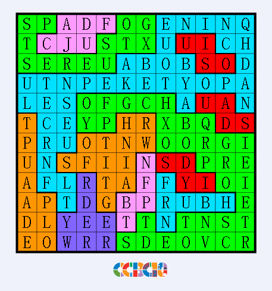
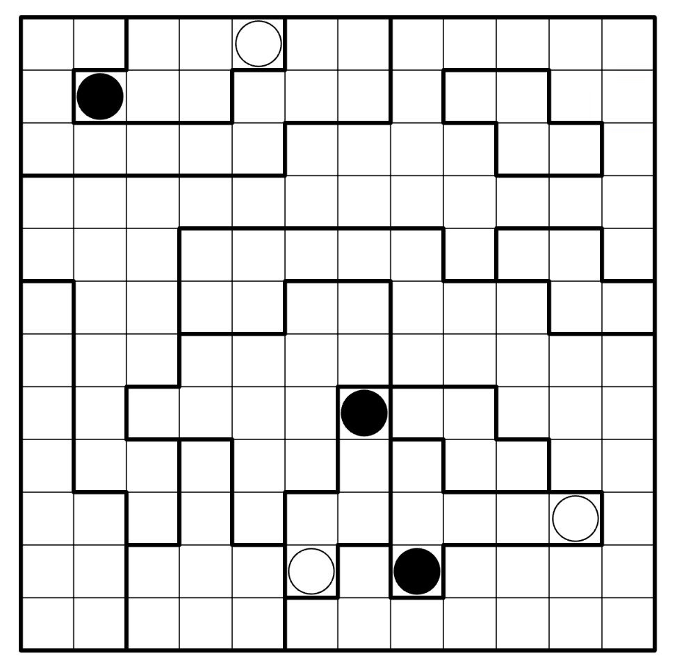
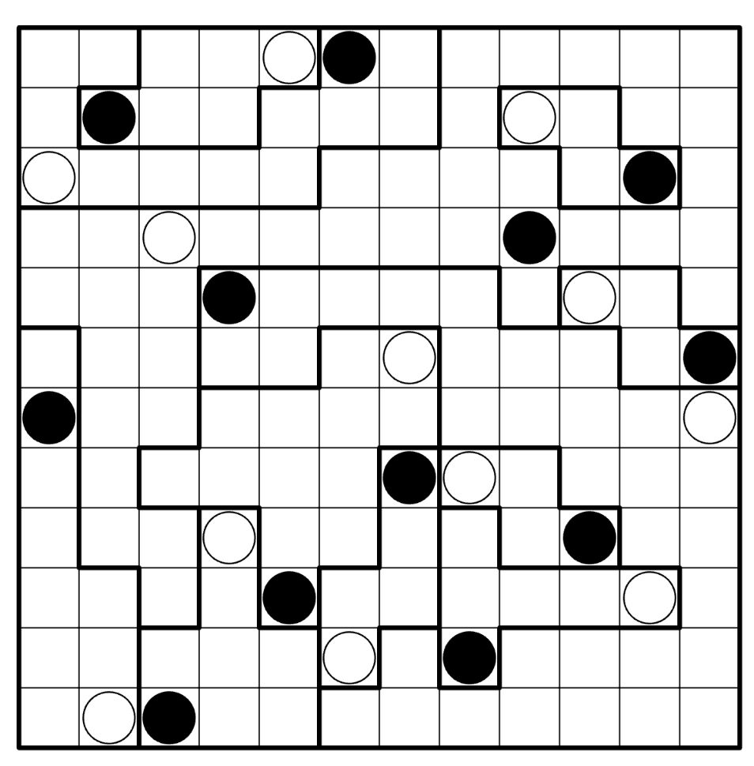

# 蚌埠回旋

## 题面

李毅大帝的回旋，推荐程度：180%。

1. 每个区域放置恰好一个黑点一个白点，区域内部黑点白点不能相邻（包括对角相邻）；
2. 每行每列恰好一个黑点一个白点，黑点互相之间不能相邻，白点互相之间不能相邻（包括对角相邻）；
3. 对于黑点白点，能形成一个Masyu的盘面，并且本题额外要求回路经过每个格子。

**Masyu规则：**

1. 规则：沿格中心画出一条不分叉也不交叉的回路，经过所有点。回路经过白点时不能转向，但前后两格中至少有一格转向。经过黑点时必须转向，但前后两格中都不能转向。

<a href="https://puzz.cipherpuzzles.com/penpa-edit/?m=solve&p=7VZNj9s2EL37VxQ68yCSo89bmmZ72aZNs0UQGMZC63WyRuxVKttNoMXmt+dx+GRbtoue2lMhi3waD2ceqXmkNn/umm5hrAs/X5rUWFxSid6+yPROed0st6tF/YN5sds+tB2AMb9eXZkPzWqzmEzpNZtME5uYxOG2yexbf/1NDX42eep/r5/623o6ezb9HwdYHuDb+gnta22ttu+1vdLWaXsDV9N7bX/SNtU20/ZafV7VT4kDdVfZpHZgU6Uj7NNcMXrggrgALolL4Ir+foRdJREX5QGXIX6Mid5462Ica48w8trIQbEjB4dl3mMsu8uIkdfF+N7h/ThPjJiOMTP4ZPTJwitLIy4Qv2TMMjeSRn/0RmycI3rgOC/0RnzMix44jhWXHnCKsnAxvqQeMZm3LIDJDdiXXMMi1BRxhjUpyFnALSO3gIVrIpiXDD4YK4wpmKMwl2COwvURrFvOsTnG5sNY5DrGwvcr4CbkI3i/OWPmiJnHmK6Cj2Vei7yWPhY+nmvrwdkzr0deP7xf5NpjcLNDPVTAQ/xQM0MtFcDkk2O+OfPmyFtEH/RYQ+ZFjfmSeTPwL8itCP4DRpyCcYJPxjgZ4uSMkyNOwfUvwLki5wpzOcJCXaDHe48xBXU4wp615OEzYNQnnjkWteQiZ62f9KjGMtoz+Of0xyYkrGf0RljPirNhLGr1GAt9oJ09hn7xzLmA56BrYF9xfYKuqV/00ALHQptCnaJHHHJz0NEeh3kNugAHalbzcq8AF/CkD+pfMo5FnY8wax49MNcWNS+seXGIucfhXYS5YJN7p1vdS21F21y3wCLspZPJ1Itu5+dX9r89XDiqcCglm3Z1u9l1H5r5Iqn1MDNqe9yt7xbdyLRq28+r5ePYb/nxse0WF/8KxsX9x0v+d213fxL9S7NajQzxeB6Z5stuvhqbtt1y9Nx0XftlZFk324eR4a7Z4ijfPCw/jyMtHrdjAttmTLH51JxkWx/m/DxJviZ6T334jAgnflX3b0z/cz36KDD9Gxz5v9T923DiT5PEVHpyq5MDfHWA7/T/gF5Go02BXxMDvgeMq3J7HS2/1dP+xiQhz486OsBk3f4FopFHeJ636ztMZZroJKNts7tvP+3oZcMHyYtI9HogGoiQqD8QDTASDegC0fLfJFrNnuPSp//xJ9Y/7kFfKa+2u6gwmC+IDNaLYqL9TE+wnyknJDwXD6wX9APrqYRgOlcRjGdCgu1vtBSinsopsDpVVEh1JqqQ6lhX2KcUfQc=" target="_blank">点击链接以在 Penpa+ 页面上做题（无答案验证）</a>

题目的最后，你会得到3个句子，长度分别是 3, 4, 3 个单词，第二个句子结尾是一个复合词。答案也是三个单词哦~

## 答案

`WHO SHOT YA`

## 解析

暂无，后续会在[密码菌](https://space.bilibili.com/410776729)B站账号更新视频解析。

## 提示

### 1. 我还没有开始做，能先放几个点吗

### 2. 能把全部的点给我吗

### 3. 我解完了这个盘面，但我不知道要看哪里

如果你仔细看黑白点所在的位置，他们会组成一句话，暗示了你实际需要关注盘面的的内容。

### 4. 我得到了一句有意义的话，但我不知道这是什么意思

除了黑白点，你还完成了一个回路。黑白点组成的话要求你关注所有回路中的“回旋”位置，一类特殊的拐弯——两个连续的同向转弯格（即U形转弯），其中两个转弯的格子相邻。是的，它很多，所以可以组成3句话共计10个单词。注意最后一个单词只有一个字母。

答案中第一个词是某个语法词汇；第二个词是句子中的同义词；第三个词只需要知道发音就可以。

## 中间答案

| 提交 | 回复 | 附加信息 |
| --- | --- | --- |
| who | who是答案的第一部分！ |  |
| shot | shot是答案的第二部分！ |  |
| ya | ya是答案的第三部分！ |  |
| FOCUS ON YOUR SPINS RIGHT NOW | “现在关注你的回旋”？什么回旋？ |  |
| INQUIRE ABOUT PEOPLE CHANCE PHOTO OR GUNFIRE FLIPPED LETTER R | 似乎这就是回旋的含义了，不过这该怎么分句？ |  |
| INQUIRE ABOUT PEOPLE | 这是第一个句子！ |  |
| CHANCE PHOTO OR GUNFIRE | 这是第二个句子！ |  |
| FLIPPED LETTER R | 这是第三个句子！ |  |

## 本地附件

- [340c7e00a3754533b426ce07c0737df3.webp](../../../assets/archive.cipherpuzzles.com/ccbc15/images/5/340c7e00a3754533b426ce07c0737df3.webp)
- [8ea2508d28b045de89f32aef12e11fb9.webp](../../../assets/archive.cipherpuzzles.com/ccbc15/images/5/8ea2508d28b045de89f32aef12e11fb9.webp)
- [90b592152c5042ec912f7e8c790c4e60.webp](../../../assets/archive.cipherpuzzles.com/ccbc15/images/5/90b592152c5042ec912f7e8c790c4e60.webp)

来源：[https://archive.cipherpuzzles.com/ccbc15/problems/5/42.yaml](https://archive.cipherpuzzles.com/ccbc15/problems/5/42.yaml)
